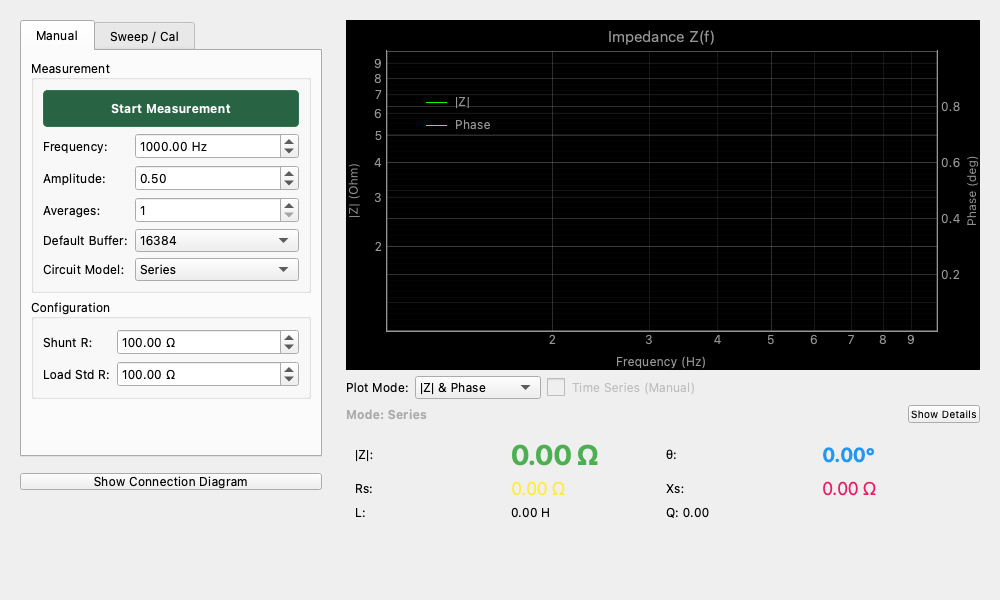
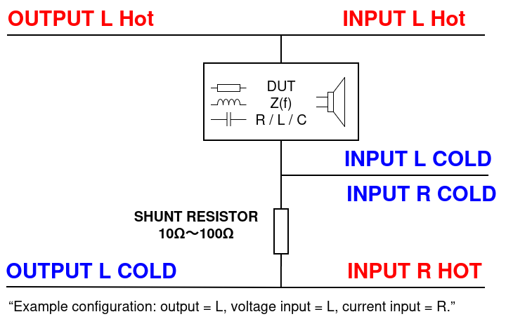

# Impedance Analyzer (LCR Meter)

## Overview

The Impedance Analyzer is a tool for precisely measuring the **"Impedance ($Z$)"** of speakers, electronic components, and more.

It has the same functions as instruments generally called "LCR meters" and can measure the following parameters:

* **Resistance ($R$)**
* **Reactance ($X$)**
* **Inductance ($L$)** - Component of coils
* **Capacitance ($C$)** - Component of capacitors
* **Quality Factor ($Q$)**
* **Dissipation Factor ($D$)**

## Basic Knowledge for Beginners

### What is Impedance?

In DC circuits, "Resistance ($R$)" represents the difficulty of current flow, but in AC circuits, capacitors and coils also obstruct or advance the flow of electricity. Together, these are called **Impedance ($Z$)**.

Impedance includes not only "Magnitude ($|Z|$)" but also "Phase ($\theta$)," which is information about delaying or advancing the electrical waves.

* **Resistance ($R$)**: Does not delay waves ($\theta = 0^\circ$)
* **Coil ($L$)**: Delays waves (current lags behind voltage, $\theta > 0^\circ$)
* **Capacitor ($C$)**: Advances waves (current leads voltage, $\theta < 0^\circ$)

This analyzer precisely separates and measures this "magnitude" and "offset (phase)" using lock-in detection technology.

## Measurement Setup

Impedance measurement requires simple wiring using a separate **"Shunt Resistor (Ref Resistor)."**
This is called the "I-V method (Current-Voltage method)."

### Requirements

* Audio interface (2-in/2-out recommended)
* **Reference Resistor**: A precision resistor of about $10 \Omega$ to $1 k\Omega$ (e.g., $100 \Omega$).
  * Choosing a value close to the impedance of the target you want to measure will increase accuracy. Generally, $100 \Omega$ is versatile.

### Wiring Diagram

1. Send the signal from **Output L** to the device under test (DUT).
2. Connect it so that after passing through the DUT, it passes through the **Ref Resistor** to ground (GND).
3. **Input L (Voltage Ch)**: Connect between the DUT and the resistor (the voltage divider point). This measures the "voltage across the resistor," but since the resistance value is known, the "current" can be calculated.
    * *Note: In the default settings, Input L is for voltage and Input R is for current measurement, but since current is actually calculated from the voltage difference across the shunt resistor, check the settings according to your circuit configuration.*
    * **Standard Settings for this App**:
        * **Voltage Ch (Input L)**: Measures the voltage $V$ across the DUT.
        * **Current Ch (Input R)**: Measures the voltage $V_{shunt}$ across the shunt resistor. The current is $I = V_{shunt} / R_{shunt}$.

## Operation Procedures

### Initial Setup

1. Confirm that the audio device is correctly selected in **Audio Settings**.
2. Open **Measurements** > **Impedance Analyzer**.
3. Configure the **Settings** panel.
    * **Voltage Ch**: `Left (Ch 1)` (upstream of the DUT)
    * **Current Ch**: `Right (Ch 2)` (shunt resistor side)
    * **Ref Resistor**: Enter the value of the resistor being used (e.g., `100.0` $\Omega$). **If this number is incorrect, all calculations will be wrong.**

### Calibration

A process to cancel the resistance and capacitance of the measurement cables and connectors themselves to increase accuracy.

* **Open Cal**: Leave the measurement terminals unconnected (open) and press `Run Open Cal`.
* **Short Cal**: Connect the measurement terminals directly to each other (short circuit) and press `Run Short Cal`.
* **Load Cal** (Optional): Connect an accurate reference resistor and perform `Run Load Cal` (usually can be omitted).

### Manual Measurement

Continuously measures values at a specific frequency.

1. Open the **Manual Control** tab.
2. **Frequency**: Set the frequency you want to measure (e.g., 1000 Hz).
3. Press the `Start Measurement` button.
4. Measurement values are displayed in the **Result** panel on the right.
    * **|Z| (Magnitude)**: Absolute value of impedance.
    * **θ (Phase)**: Phase angle.
    * **Ls / Cs**: Equivalent inductance or capacitance value at that frequency.

### FRA Sweep

Graphs changes in impedance while changing the frequency. Ideal for measuring the $f_0$ (resonant frequency) of speakers, etc.

1. Open the **Frequency Response (FRA)** tab.
2. **Start Freq** / **End Freq**: Determine the measurement range (e.g., 20 Hz to 20,000 Hz).
3. **Sweep Mode**: `Log` (logarithmic) is common.
4. Press `Start Sweep`.
5. A graph is drawn on the **Bode Plot**.
    * At the resonance point of a speaker, a mountain-like peak appears.

## Results and Modes

### Series vs Parallel

LCR meters have two display modes: "Series equivalent circuit" and "Parallel equivalent circuit."
These can be switched via buttons or settings.

* **Series (Ls, Cs, Rs)**:
  * Used when measuring components with **low** impedance (a few ohms or less).
  * Examples: Low-resistance coils, large-capacity capacitors.
* **Parallel (Lp, Cp, Rp)**:
  * Used when measuring components with **high** impedance (tens of kΩ or more).
  * Examples: Small-capacity capacitors, high-resistance.

*Note: If unsure, for intermediate values (hundreds of ohms to several kΩ), either mode will yield almost the same value.*

### Parameter Descriptions

* **Rs (Equiv. Series Resistance)**: The "pure resistance component (loss)" of a capacitor or coil. The smaller this value, the more ideal the component is.
* **Q factor (Quality Factor)**: The sharpness of resonance or the quality of a component.
  * For coils: A higher value means less loss and better performance.
  * For speakers: An index indicating the damping of resonance.
* **D factor (Dissipation Factor)**: The loss tangent ($D = 1/Q$). Often used for evaluating capacitor performance. A smaller value indicates better performance.

## Application Examples

### Speaker Unit Measurement (TS Parameters)

By connecting to the terminals of a single speaker unit and performing a sweep measurement, you can observe a "peak" where the impedance rises sharply at **$f_0$ (lowest resonant frequency)**.
From the height ($Z_{max}$) and width of this peak, parameters necessary for enclosure design can be calculated.

### Cable Capacitance Measurement

Connect between the core wire and shield of an RCA cable or similar to measure.
Looking at **Cs (Capacitance)** at a frequency of about 1 kHz, you can measure cable capacitance, such as `120 pF`. A lower value means the cable has less attenuation in the high-frequency range.
