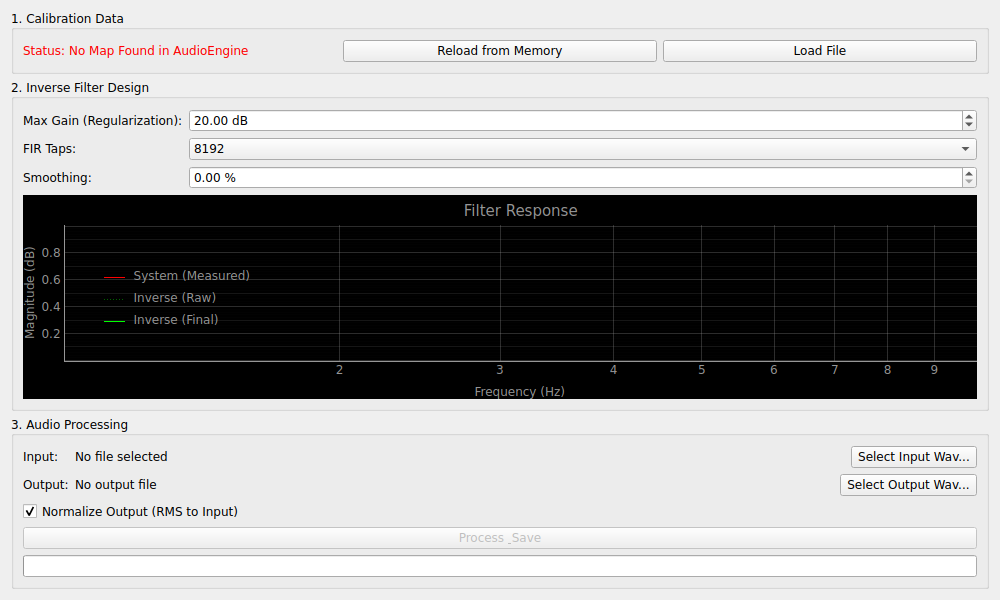

# Inverse Filter (逆特性補正フィルター)

## 概要
測定によって得られたシステムの周波数特性（スピーカーやマイクの癖など）を「打ち消す」ためのフィルターを作成し、音声ファイルに適用するツールです。

例えば、高域が少し弱いスピーカーで録音した音に対し、その逆の特性（高域を強める）を計算して適用することで、理想的なフラットな特性に近い音声を合成することができます。

## 操作方法

### 1. 補正データの読み込み (Calibration Data)
*   **Reload from Memory**: `Network Analyzer` 等で測定し、現在アプリのメモリに保持されている最新のキャリブレーションデータを取り込みます。
*   **Load File**: 以前に保存した `.json` 形式の補正マップを読み込みます。

### 2. フィルターの設計 (Filter Design)
読み込んだデータに基づき、補正フィルターの形状を調整します。
*   **Max Gain (Regularization)**: 補正による過度な増幅を抑える制限値です。例えば「10dB」に設定すると、元が20dB落ち込んでいても最大10dBまでしか持ち上げません。これによりノイズの増大を防ぎます。
*   **FIR Taps**: フィルターの細かさです。値が大きいほど精緻な補正が可能ですが、計算が重くなります。通常は `8192` 程度が推奨されます。
*   **Smoothing**: 特性の凹凸を滑らかにします。

### 3. 音声処理 (Audio Processing)
*   **Input**: 処理したい音声ファイル（WAV形式）を選択します。
*   **Process & Save**: フィルターを適用した新しいファイルを保存します。

## 設定項目
*   **Normalize Output (RMS)**: 補正によって全体の音量が変わってしまうのを防ぐため、元のファイルと同じ音量感になるよう自動調整します。

## 使用例
*   **マイク特性の補正**: マイクの周波数特性が分かっている場合、録音した声に対して逆特性をかけることで、より原音に忠実な音質に補正できます。
*   **ルームアコースティックの簡易補正**: 特定の部屋で再生した時の録音結果をフラットに近づける研究などに使用します。
