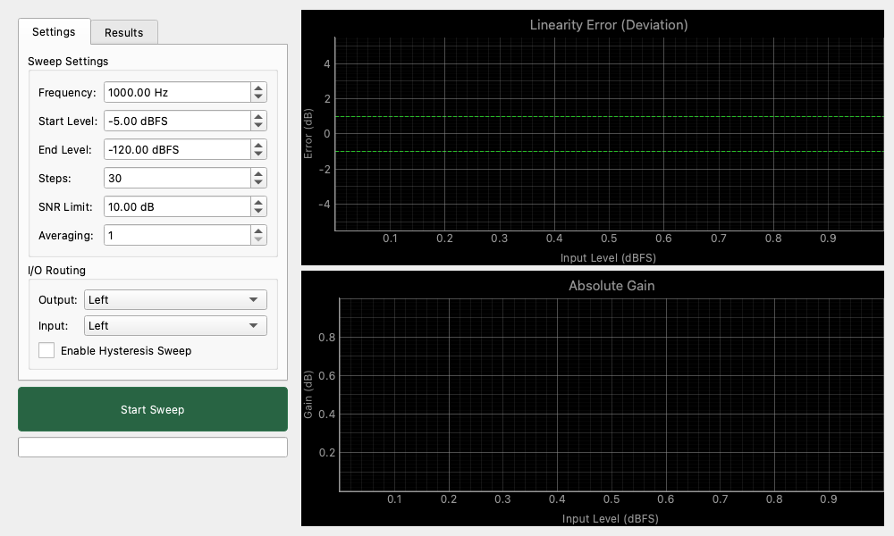

# Linearity Analyzer

## Overview

This tool precisely measures the "proportional relationship (linearity)" between input and output as the signal level changes.
It is used to verify problems specific to digital equipment (DAC/ADC), such as "loud sounds are output correctly, but errors occur with very quiet sounds (bit truncation or buried in noise)," as well as the dynamic range of analog circuits.

## Meaning of Key Indicators

This tool measures the following values:

* **Linearity Error**
    * Represents how much the volume deviates compared to the reference gain (usually at maximum volume).
    * In ideal equipment, if the input is -100dB, the output attenuates by exactly -100dB, and the error is 0dB.
* **Linear Range**
    * The minimum signal level where the error is within a certain range (e.g., ±0.5dB) and is not buried in the noise floor.
    * The lower this value (e.g., -120dBFS), the more capable the equipment is of accurately reproducing minute sounds.
* **Slope**
    * Ideally 0 (flat), but changes if compression or similar effects are present.
* **Hysteresis Width**
    * The difference in measurement values between the forward path (decreasing level) and the reverse path (increasing level). In electronic equipment, a value closer to 0 is better. If there is a significant difference, it may indicate thermal effects or delayed response due to the internal state of the device.

## Operation

### Running a Measurement

1. Determine the measurement conditions in **Sweep Settings**.
2. Press the **Start Sweep** button to begin measurement.
3. The tool automatically sweeps the specified range (e.g., -5dBFS to -120dBFS) and plots the results on the graph.
    * If **Enable Hysteresis Sweep** is enabled, it performs forward (large to small) and reverse (small to large) measurements sequentially.

### Interpreting Results

* **Linearity Error (Deviation) Graph**
    * The horizontal axis is the input level, and the vertical axis is the error (dB).
    * The closer the line sticks to **"0dB" in the center, the better**.
    * The graph will start to fluctuate as it moves to the left (lower level region), which is due to the influence of noise.
* **Noise Floor Region (Gray Area)**
    * Indicates the region where the SNR (Signal-To-Noise Ratio) is poor and the measured values are unreliable.

## Settings

### Sweep Settings

Sets the range and resolution of the measurement.

* **Frequency**: Measurement frequency (usually 1kHz).
* **Start Level**: Start level of the sweep (loud sound). Usually set to around `-5 dBFS` to avoid clipping.
* **End Level**: End level of the sweep (quiet sound). Set to the limit value you want to verify (e.g., `-120 dBFS`).
* **Steps**: Number of measurement points. More steps mean more detail but take longer.
* **SNR Limit**: Threshold for noise floor detection. If the signal is not louder than the noise by at least this value (e.g., 10dB), the data is considered "unreliable."
* **Averaging**: The number of measurements per point. Increasing the count reduces the influence of noise and stabilizes measurements at low levels, but increases the total measurement time.

### I/O Routing

* **Output**: Channel to output the measurement signal.
* **Input**: Channel to receive the measurement signal.
* **Enable Hysteresis Sweep**: When checked, the tool automatically performs a reverse sweep (small to large) after the forward sweep (large to small) to verify the difference between the two directions.

### Display

* **Unit**: Switches the horizontal axis unit of the graph.
    * **dBFS**: Digital Full Scale reference.
    * **dBV**: Voltage reference (valid when calibration settings are active).

### Plot Controls

* **Y-Axis Zoom**: Changes the vertical axis zoom level of the graph (Linearity Error).
    * **Auto**: Automatically adjusts to fit the data.
    * **0.1 dB - 20.0 dB**: Fixes the view to the specified range (±).
    * **Tolerance Lines**: Green dashed lines indicating a tolerance of ±1.0 dB are displayed on the graph.

## Usage Examples

### Checking DAC Low-Level Reproduction Capability

Investigate whether your audio interface or DAC has 16-bit precision (approx. -96dB) or true 24-bit precision (around -144dB) capability.

1. Connect in loopback (connect Output and Input directly with a cable).
2. Set **End Level** to `-140 dBFS` and sweep.
3. Check the graph to see how far it keeps 0dB error.
    * If it fluctuates around -90dB, it is 16-bit class performance.
    * If it holds up to -110dB to -120dB, it is very high performance.
