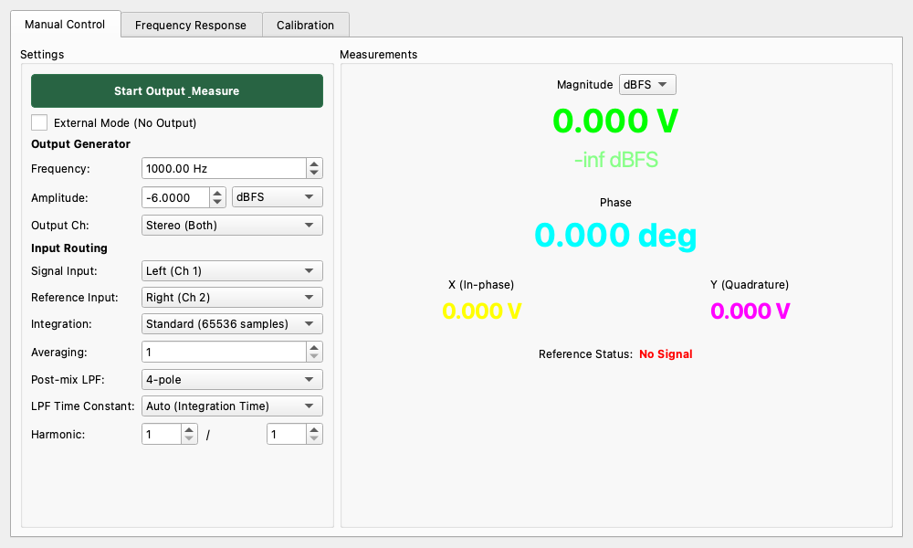

# Lock-in Amplifier

## Overview

The Lock-in Amplifier is a measurement widget that extracts the "Magnitude" and "Phase" of specific frequency components with high precision from weak signals buried in noise.
It is used in physical experiments and electronic measurements to dramatically improve the signal-to-noise (S/N) ratio.

While general spectrum analyzers "see all frequencies," the lock-in amplifier "monitors only one frequency pinpointed," which allows it to demonstrate overwhelming noise rejection performance.

## Principles of Lock-in Measurement

### Phase Sensitive Detection (PSD)

A lock-in amplifier performs measurement by multiplying a reference wave called a "Reference Signal" with the input signal.

* **Input Signal**: A signal buried in noise ($A \sin(2\pi ft + \phi) + \text{Noise}$)
* **Reference Signal**: Clean waves of the frequency $f$ you want to measure ($\sin(2\pi ft)$ and $\cos(2\pi ft)$)

When these are multiplied and passed through a Low-Pass Filter (LPF), only the components with matching frequencies remain as "Direct Current (DC)," and all other noise and different frequency components are cut as AC.
This enables the detection of signals much smaller than the noise floor.

### Dual Phase Detection

This widget is a "dual-phase" type that uses two reference signals (Sine and Cosine) simultaneously.
This makes it possible to accurately capture the signal magnitude regardless of the phase of the input signal.

* **X (In-phase)**: In-phase component
* **Y (Quadrature)**: Quadrature component
* **Magnitude (R)**: Signal amplitude ($\sqrt{X^2 + Y^2}$)
* **Phase ($\theta$)**: Signal phase ($\arctan(Y/X)$)

## Measurement Modes

### Signal Source Mode (Internal / External)

Switch between these via the check boxes in the **Settings** panel or through physical connections.

* **Internal Mode**
    * **Operation**: The widget itself outputs a signal (Sine wave), which is passed through the measurement target, and the returning signal is measured.
    * **Usage**: When you can output the signal yourself, such as for measuring frequency characteristics or impedance of circuits.
    * **Settings**: Start by clicking the `Start Output & Measure` button. Uncheck `External Mode`.

* **External Mode**
    * **Operation**: Input both a "Signal" and a "Reference Clock (Ref)" from an external device. The widget automatically locks to (follows) the frequency of the reference input and measures.
    * **Usage**: Experiments using optical choppers or measurements using other oscillators.
    * **Settings**: Check `External Mode (No Output)`. Input the reference signal into the `Reference Input` channel.

### Operation Mode (Manual / FRA)

Switching between tabs allows you to choose between fixed-point measurement and sweep measurement.

* **Manual Control**
    * Continuously monitors a specific single frequency.
    * Since numerical values change in real-time, it is suitable for adjustment work and observing time-series changes (similar to a trend graph).
    * **Harmonic Measurement**: By changing the `Harmonic` settings (Numerator/Denominator), you can extract frequency components that are fractional or integer multiples of the fundamental wave. For example, setting it to `2 / 1` measures the 2nd harmonic.

* **Frequency Response Analyzer (FRA)**
    * Measures while automatically changing the frequency from `Start` to `End` (frequency sweep).
    * The results are displayed as a **Bode Plot** (Magnitude and Phase characteristics).
    * **Dual Cursors**: Checking `Show Cursors` displays two cursors (C1, C2). The difference ($\Delta$) between them shows the frequency difference, gain difference (dB), and phase difference, which is useful for detailed analysis of bandwidth and resonance points.
    * Ideal for measuring the bandwidth of filter circuits and amplifiers.

## Key Parameter Descriptions

Important setting items for mastering the lock-in amplifier.

### Time Constant and LPF

The performance of a lock-in amplifier is determined by the "strength of the filter."

1. **Integration**:
    * The length of data used for a single measurement.
    * `Fast (2048)`: Fast response, but lower accuracy for low-frequency measurements.
    * `Slow / Very Slow`: Slower response, but higher noise rejection capability.
    * `Very Slow 4x (262144)`: Uses an even longer integration time (approx. several seconds depending on sample rate) for extremely high measurement precision.

2. **Post-mix LPF (Time Constant $\tau$)**:
    * A filter that further smooths the signal after detection. Corresponds to the "Time Constant" of analog lock-in amplifiers.
    * **LPF Time Constant**: Increasing this time (e.g., `1 s` or `3 s`) will stop fluctuations in numerical values and yield extremely stable results, but the response to changes in the signal will be very slow.
    * **Post-mix LPF Order**: The number of filter stages (steepness). Usually, `4-pole` (24 dB/oct) is sufficient, but it can be increased to `8-pole` if you want to remove powerful noise.

### Averaging

* **Count**: Averages and displays the specified number of measurement data points. Effective for reducing random noise.

### Display Unit

Selects the unit for displaying the measurement result (Magnitude).

* **dBFS**: Digital Full Scale relative (0dBFS = Max)
* **dBV**: 1Vrms relative (0dBV = 1V)
* **dBu**: 0.775Vrms relative (0dBu = 0.775V)
* **V / mV**: Linear voltage (Vrms)
* **Vpeak**: Peak voltage display ($Vrms \times \sqrt{2}$)

## Calibration

This widget provides calibration features to improve the absolute accuracy of measurements.

### Absolute Gain Calibration

Adjusts the offset of the displayed Magnitude (voltage) to match an external reference value.

1. Use the calibration section in the **Settings** panel.
2. Input a signal with a known level (e.g., 1.0 Vrms sine wave).
3. Enter the value in `Target` and select the unit (dBFS, dBV, dBu, Vrms).
4. Click the `Calibrate Absolute Gain` button.
5. The difference between the measured value and the target value is calculated and applied as an offset.

### Frequency Response Calibration (Map)

A feature to compensate for the frequency response of the measurement system (attenuation of cables, probes, etc.).

* **Save Map**: Saves the current frequency sweep result (measured in FRA mode) as calibration data.
* **Load Map**: Loads saved calibration data.
* **Apply Calibration**: When checked, the measurement values are corrected in real-time based on the loaded map.

## Quick Start Procedures

### Example: Measuring the Frequency Characteristics of a Filter Circuit (FRA)

1. **Wiring**:
    * Audio interface **Output 1 (Left)** -> Filter circuit input
    * Filter circuit output -> Audio interface **Input 1 (Left)**
2. **Settings**:
    * `Signal Input`: **Left (Ch 1)**
    * `Output Ch`: **Left (Ch 1)** (or Stereo)
    * `External Mode`: **OFF**
    * `Amplitude`: A voltage suitable for the circuit (e.g., -10 dBV)
3. **FRA Tab**:
    * `Start Freq`: **20 Hz**
    * `End Freq`: **20000 Hz**
    * `Steps`: **50** (or 100)
    * `Log Sweep`: **ON** (frequency response is usually viewed on a log scale)
    * `Plot Unit`: **dBV** (or dBFS)
4. **Execution**:
    * Click the **Start Sweep** button.
    * The frequency characteristics (Gain and Phase) will be plotted on the graph.

### Example: Continuous Monitoring of a Minute Signal (Manual)

1. Open the **Manual Control** tab.
2. Set `Frequency` to the frequency you want to measure (e.g., 1 kHz).
3. Click `Start Output & Measure`.
4. The voltage of that frequency component will be displayed in **Magnitude**.
5. If the values fluctuate, stabilize them by increasing the **LPF Time Constant** from `0.1s` to `0.3s` to `1.0s`.
