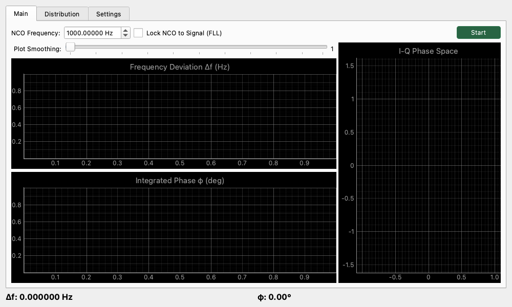

# Lock-in Frequency Counter (精密周波数・位相偏差測定)

## 概要

通常の周波数カウンターが「信号の揺れ」を大まかに捉えるのに対し、Lock-in Frequency Counter は、基準となる信号（NCO: 内部数値制御発振器）と入力信号を比較し、**その「ズレ」を極めて高い分解能で可視化**するツールです。最新の実装では、周波数偏差の推定における窓関数処理と経過時間の扱いが見直され、長時間観測時の表示安定性や位相積分の一貫性がさらに向上しています。

クロック源の長期的な安定性（ドリフト）、テープデッキやレコードプレーヤーのワウ・フラッター、あるいはドップラーシフトのような微小な周波数変化を観察するのに適しています。

## 操作方法

### 測定の準備

1. **NCO Frequency**: 基準となる周波数を設定します（例: 1000 Hz）。

    !!! warning
        NCO周波数はソフトウェアにおける数値発振器の数値であり、これはデバイスの出力するものとは関係がありません。
        NCO周波数をロックするということは、あくまで測定上の基準を追従させているだけであり、オーディオデバイスの使うすべての周波数がこの基準面にロックされるわけではないことに注意してください。
2. **Reference Mode**:
    * **Internal (NCO)**: 内部で生成した理想的なサイン波を基準にします。
    * **Loopback (Ref Out)**: 出力から出した信号を基準にします（このモードではFLLによるロックは無効になります）。物理的なケーブルでのループバック、または内部ループバックを基準として測定する場合に使用します。
    * **Ref Output**: Loopbackモード時に使用する物理的な出力チャンネルを選択します (Ch 1 / Ch 2)。
3. **Input Settings**:
    * **Channel**: 測定対象の入力チャンネルを選択します (Ch 1 / Ch 2)。
    * **Gate Threshold**: これ以下の入力レベル（dB）では測定を停止します。ノイズによる誤動作を防ぐために設定します。
4. **Start** ボタンを押して測定を開始します。

### グラフの見方

* **Frequency Deviation Δf (Hz)**: 基準周波数からの現在のズレを表示します。最新の実装では、新しい音声サンプルが到着した実時間に基づいて更新されるため、表示更新周期のばらつきによる読み取り誤差が起こりにくくなっています。
    * **Smoothing**: スライダーを使ってグラフの描画を平滑化できます。右に動かすほど平均化されます。
* **Integrated Phase φ (deg)**: ズレが蓄積した結果としての「位相の変化量」を表示します。周波数偏差からの積分はサンプルベースの経過時間を使って計算されるため、長時間の観測でもドリフトの見え方がより自然です。
* **I-Q Phase Space (右側)**: 信号の「位相の安定度」をベクトル表示します。点が一点に集まっているほど安定しており、円を描くように動く場合は周波数がわずかにズレていることを示します。位相検出には漏れを抑えた窓処理が使われており、不要な回転成分の混入が起こりにくくなっています。

## 設定項目

### Statistics & Averaging (統計・平均化)

* **Avg Count (KF-Q & Display)**: NCO周波数推定に用いるカルマンフィルタのプロセスノイズ(Q)と、表示の平均化回数を同時に設定します。値を増やすと、より強力な平滑化が行われ（Qが減少）、表示が安定します。
* **Display Uncertainty (σ)**: 現在の周波数推定値の不確かさ（標準偏差）を表示します。カルマンフィルタによって推定された信頼区間を示します。また、この不確かさに応じて、NCO Frequency 設定値の表示桁数が自動的に調整されます（最大小数点以下12桁）。

### PID Control Loop (ロック制御)

FLL (Frequency Locked Loop) の応答特性を調整します。

* **Proportional (Kp)**: 比例ゲイン。現在のズレに対してどれだけ強く反応するかを設定します。
* **Integral (Ki)**: 積分ゲイン。過去のズレの蓄積に対して反応し、定常偏差を解消します。
* **Derivative (Kd)**: 微分ゲイン。ズレの変化速度に対して反応し、オーバーシュートを抑制します。

## 使用例

* **基準信号の発振安定度チェック**: 基準信号を入力し、時間経過とともに $\Delta f$ がどのように変化するか（温度ドリフトなど）を確認します。発振器やクロック源の長時間安定度を見る用途で特に有効です。
* **回転機器のワウ・フラッター観測**: 3kHzなどのテスト信号を再生し、その周波数の揺らぎを時間軸で観察します。
* **微小な周波数差の見極め**: 表示の不確かさ（σ）と併せて観察することで、見えている揺れが実際の変動なのか、推定ノイズに近いのかを判断しやすくなります。
