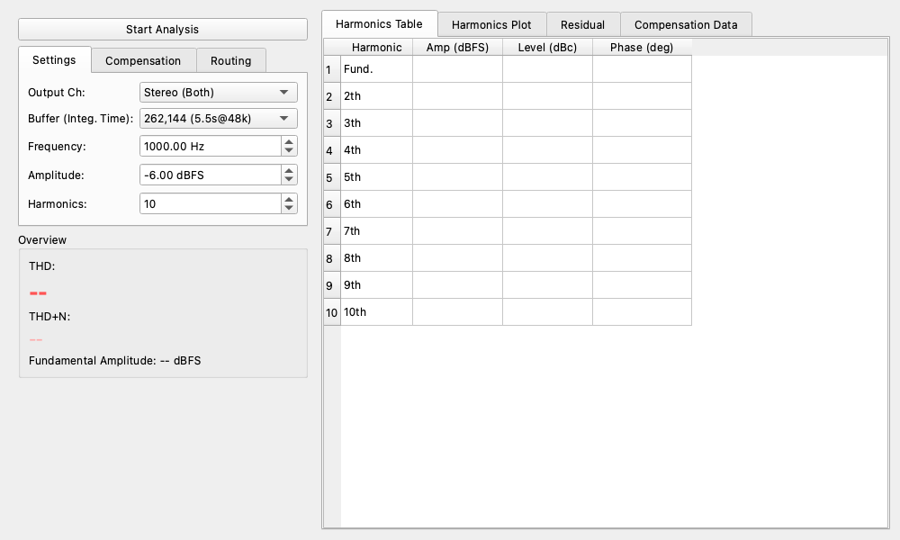

# Lock-in Harmonic Analyzer

The **Lock-in Harmonic Analyzer** is a module that utilizes the principles of a lock-in amplifier to measure Total Harmonic Distortion (THD) and THD+N with extremely low noise and high precision.

Unlike conventional FFT-based distortion measurements that rely on window functions, this widget performs **multi-parallel IQ detection (up to 200th order)** simultaneously for the fundamental wave and its harmonics. By strictly tuning into only the target frequency components, it can accurately extract signals buried in noise, enabling measurements in ultra-low distortion regimes (e.g., below -160 dBc) that exceed the limitations of traditional FFT analysis.

## ☕ Coffee Break: Picking out the "Fingerprints of Sound" one by one with Tweezers

When sound passes through audio equipment, impurities called "overtones (harmonics)" that were not in the original sound are mixed in. This is the true identity of "distortion".
For example, it's like putting in a "C" note, but a faint "C one octave higher" or a "G" note comes out mixed in.

Conventional distortion meters (FFT) were like looking for these with a magnifying glass. However, when dealing with the latest ultra-high-performance equipment, the distortion is so small that it just looks like "noise (static)", reaching the limit of what can be measured.

Enter the "Lock-in Harmonic Analyzer".
Instead of a magnifying glass, it uses dozens of **"magic tweezers with magnets that only attract specific overtones"** simultaneously to directly pluck out specific sound components like the "2nd harmonic" and "3rd harmonic" from the static (IQ detection).
Because it can completely ignore the surrounding static (noise), it can clearly quantify even "extremely small distortions" that were previously invisible to anyone!

## Unique Measurement Principle

The most significant feature of this widget is its **multi-parallel lock-in detection** analysis approach (mathematically implemented as matrix projection).

1. **Precise Cycle Extraction**: The module precisely interpolates the zero-crossing points (rising edges) of the input Reference signal to extract exactly an integer number of signal cycles.
2. **Reference Signal Generation**: Based on the detected fundamental frequency $\omega$, it internally generates reference sine (I) and cosine (Q) waves synchronized with the DC component, the fundamental, and each harmonic component (up to $n\omega$, user-configurable).
3. **Parallel IQ Detection (Lock-in)**: By simultaneously multiplying the incoming measurement signal vector $Y$ by all these generated reference signals and integrating them (solving the system of equations via matrix projection), it directly calculates the amplitude and phase of each harmonic component all at once.
   $$ \text{Coefficients} = (B^T B)^{-1} B^T Y $$
4. **Harmonic and Residual Separation**: By subtracting all extracted harmonic components from the original signal, the pure residual noise component is cleanly separated.

Thanks to the lock-in amplifier's characteristic of acting as an extremely narrow bandpass filter tailored only for the target frequencies, this method fundamentally avoids the spectral leakage caused by window functions. It allows for the accurate separation and extraction of minuscule distortion components from the surrounding background noise floor.

## How to Use

The control panel on the left is organized into tabs, allowing you to switch between different functional groups.

### 1. Settings Tab

Configure basic measurement parameters.

* **Output Ch**: Select the channel to output the test signal (Left / Right / Stereo).
* **Buffer (Integ. Time)**: Select the length of data capture used for analysis. A larger buffer size means a longer integration time, which averages out random noise and improves the Signal-to-Noise Ratio (SNR) of the measurement. Large buffers (e.g., 262,144 or 524,288) are recommended for ultra-low distortion measurements.
* **Frequency**: Specify the fundamental frequency of the output test sine wave in Hz.
* **Amplitude**: Specify the output level of the test sine wave in dBFS. Set an appropriate level (e.g., -6.0 dBFS to -1.0 dBFS) to avoid clipping.
* **Harmonics**: Specify the maximum harmonic order to analyze (up to 200). Note that this limit is dynamically clamped based on the fundamental frequency and sampling rate to stay within the Nyquist frequency.
* **Start Analysis / Stop Analysis**: Toggles the measurement on and off. When started, it will display "Buffering..." until the buffer is filled, after which the analysis results will update.

### 2. Compensation Tab [NEW]

This feature allows you to cancel out the distortion inherent in the measurement system itself (e.g., the output stage of your audio interface).

* **Enable Compensation**: When checked, the module injects anti-phase harmonic components into the output signal based on currently stored compensation data (amplitude and phase) to minimize overall system loop distortion.
* **Comp. Max Harmonic**: Specifies the maximum harmonic order to be compensated.
* **Auto-Calibrate**: Automatically captures and updates the compensation coefficients.
    * **Procedure**: Press this button while in a loopback configuration. It will automatically run the calibration sequence until THD is minimized. This allows you to generate an extremely clean test signal for subsequent measurements of external devices.
* **Clear**: Resets the current compensation table to return to a pure sine wave output.

### 3. Routing Tab

* **Signal Input**: Select the channel where the target signal you want to measure for harmonic distortion is routed.
* **Reference Input**: Select the channel where the reference signal for lock-in analysis is routed. This should be the test signal source itself, either tapped before going through the Device Under Test (DUT) or a very stable, low-distortion signal. The fundamental frequency and phase are extracted with high precision from this reference.

## Viewing Results

### Overview

* **THD**: Displays the measured Total Harmonic Distortion value (in dB and %).
* **THD+N**: Displays the measured total of THD plus residual noise value (in dB and %).
* **Fundamental**: Displays the amplitude level of the measured fundamental wave (1st harmonic) in dBFS.

### Detail Analysis Tabs

The area on the right side allows you to view detailed data by switching between tabs.

* **Harmonics Table**: A tabular view showing the absolute amplitude (Amp dBFS), relative level to the fundamental (Level dBc), and phase (Phase deg) for each harmonic order.
* **Harmonics Plot**: A bar graph visually showing the level of each harmonic component (dBFS).
* **Residual**: Displays the waveform of the "residual components" (noise + other non-harmonic components). This is the original signal minus the calculated fundamental and all harmonic components.
