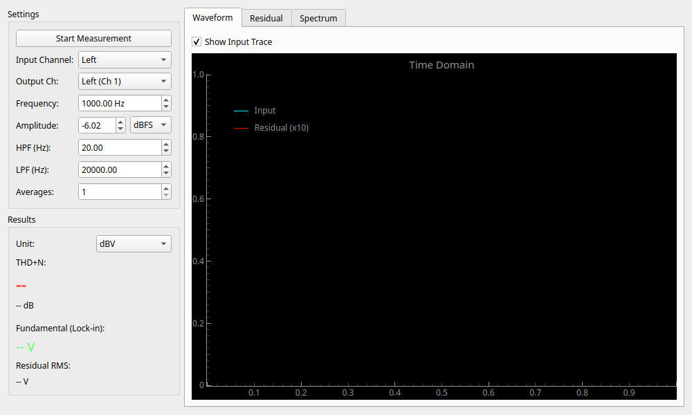

# Lock-in THD+N Analyzer (超低歪みロックイン測定)

!!! warning
    このウィジットは非推奨となりました。現在は **[Lock-in Harmonic Analyzer](lockin_harmonic_analyzer.md)** が上位互換として提供されています。
    Lock-in THD+N Analyzer はデフォルトで非表示になっています。使用するには起動時に `--experimental` フラグを付けてください。

## ☕ コーヒーブレイク：「不純物」だけをきれいに濾し取る

音の歪み（THD）を測るためには、元のキレイな音（基本波）が邪魔になります。カレーの中からスパイスの粒だけを探し出したいときに、カレールーが邪魔になるのと同じです。
このツールは「ロックインアンプ」という魔法の技術を使って、元の音だけをピンポイントで「完全に消し去る」ことができます。
残ったものが「歪み」と「ノイズ」です。元の音が消え去ったことで、これまで見えなかったミクロな不純物がクッキリと見えるようになります！

## 概要

Lock-in THD Analyzer は、特定の周波数の基本波成分だけを極めて高精度に「ロックイン検出」して除去し、残った**「歪み率 (THD+N)」** を測定するためのウィジットです。

通常の FFT アナライザよりも基本波除去性能が高く、アンプや DAC の微小な歪みを正確に評価できます。

## 測定の仕組み

このウィジットは「ロックインアンプ」の技術を応用して、以下のように THD+N を算出しています。

1. **ロックイン検出**: 内部で生成した正弦波（例: 1kHz）と入力を同期検波し、基本波の「振幅」と「位相」を精密に測定します。
2. **除去 (Notch)**: 測定した基本波成分と同じ波形を合成し、元の信号から引き算します。
3. **残留成分 (Residual)**: 引き算で残った信号（高調波歪み＋ノイズ）の量を測ります。
4. **計算**: $\frac{\text{Residual RMS}}{\text{Fundamental RMS}} \times 100 (\%)$ で THD+N を算出します。

## 操作方法

### 基本設定

左側のパネルで測定条件を設定します。

* **Frequency**: 測定周波数。通常は `1000 Hz` です。
* **Amplitude**: 出力レベル。測定対象の定格入力に合わせます。
* **Averages**: 測定精度の安定性を高めるための平均化回数です。

### フィルター設定

THD+N 測定において最も重要な設定の一つです。不要な帯域のノイズをカットして、純粋なオーディオ性能を評価するために使います。

* **HPF (Hz)**: ハイパスフィルタ。
    * **20 Hz**: 直流 (DC) オフセットや超低域のゆらぎを除去します。通常はこれを使います。
* **LPF (Hz)**: ローパスフィルタ。測定帯域の上限を決めます。
    * **20000 Hz**: 可聴域内 (20kHz以下) の歪みだけを測る場合の標準設定 (AES17準拠など)。
    * **80000 Hz以上**: ハイレゾ機器の高周波ノイズも含めて評価する場合。

### 結果の見方

* **THD+N**: 全高調波歪率＋ノイズ。値が小さいほど高性能です。
    * **-60dB (0.1%)**: 一般的なオーディオ機器
    * **-80dB (0.01%)**: 高音質
    * **-100dB (0.001%)**: プロ用・ハイエンド級
* **Fundamental**: ロックイン検出された基本波の電圧。
* **Residual RMS**: 歪みとノイズの合計電圧。

## グラフの説明

* **Waveform**:
    * **Cyan**: 入力波形。
    * **Red**: **残留成分 (Residual)** を10倍に拡大したもの。これが平らな直線に近いほど歪みが少ないことを示します。波打っている場合は高調波歪み、ギザギザしている場合はノイズが支配的です。
* **Residual**: 残留成分レベルの時間変化。
* **Spectrum**: 残留成分の周波数分析。基本波 (1kHz) がきれいに除去され、2次 (2k), 3次 (3k) 歪みが見やすくなっています。
