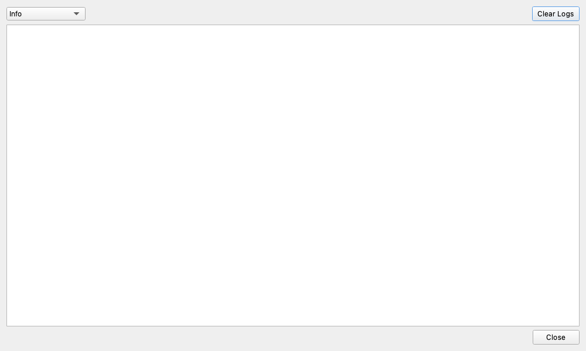

# Log Viewer

## Overview

The Log Viewer is a monitoring window that displays real-time messages about what is happening behind the scenes of the application (events, warnings, errors, etc.).
While you don't normally need to keep it open, it is highly useful for diagnosing issues when something goes wrong or for checking the status of background operations.

## ☕ Coffee Break: Why do programmers love "Logs"?

The text that records the operation of a program is called a "Log." The etymology comes from a ship's "Logbook."

When an app suddenly stops working or behaves strangely, you can't tell "why it happened" just by looking at the screen.
Logs are like the "flight recorder (black box)" of an airplane.
Everything the app is muttering to itself behind the scenes is recorded, such as "At 12:00:01, I tried to open the audio device," and "At 12:00:02, the USB cable was unplugged, so an error occurred."
When trouble occurs, simply reading these "mutterings" allows you to quickly pinpoint the cause!

## Key Features

- **Real-time Display**: Log messages appear immediately as they are generated.
- **Filtering**: You can select the log level (importance of the information) to display, allowing you to focus only on relevant information.
- **Color-Coded Messages**: Messages are color-coded based on their severity (e.g., errors in red, warnings in yellow) so you can quickly identify their importance at a glance.
- **Clear Logs**: You can clear the currently displayed logs to focus only on new messages.

## How to Use

1. Click the "Logs" button located below the gear icon (Settings) in the left menu to open the "Log Viewer."
2. Select the desired log level from the dropdown menu at the top.
    - `All Logs (DEBUG)`: Displays all detailed mutterings (logs). While it's an overwhelming amount of information, it's the most helpful setting for developers when troubleshooting.
    - `Info`: Displays general information and more critical messages (default setting).
    - `Warnings`: Displays only warnings (slightly dangerous situations) and errors.
    - `Errors Only`: Displays only error messages (situations that completely failed).
3. Click the "Clear Logs" button to completely clear the display.
