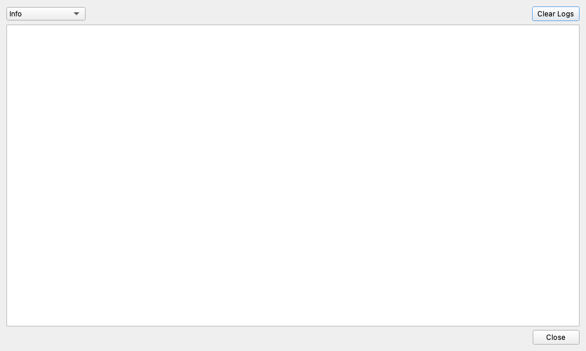

# Log Viewer (ログビューア)

## 概要

ログビューアは、アプリケーションのバックグラウンドで発生しているイベント、警告、エラーなどのメッセージをリアルタイムで表示する監視ウィンドウです。
通常は開いておく必要はありませんが、問題発生時の診断や動作状況の確認に役立ちます。

## 主な機能

* **リアルタイム表示**: ログメッセージが生成されるとすぐに表示されます。
* **フィルタリング**: 表示するログレベル（情報の重要度）を選択し、必要な情報だけを抽出できます。
* **色分け表示**: ログレベルに応じてメッセージが色分けされ（例：エラーは赤色、警告は黄色）、重要度が一目でわかります。
* **ログのクリア**: 表示されているログをクリアし、新しいメッセージだけを確認できます。

## 使い方

1. 左側のメニューから歯車アイコン（Settings）のさらに下にある「Logs」ボタンをクリックして「ログビューア」を開きます。
2. 上部のドロップダウンメニューから、表示したいログのレベルを選択します。
    * `All Logs (DEBUG)`: すべての詳細なログを表示します。情報量は多いですが、開発者がトラブルシューティングを行う際に最も役立ちます。
    * `Info`: 一般的な情報と、それ以上の重要なメッセージを表示します（デフォルト設定）。
    * `Warnings`: 警告とエラーのみを表示します。
    * `Errors Only`: エラーメッセージのみを表示します。
3. ログの表示をまっさらにしたい場合は、「Clear Logs」ボタンをクリックします。
