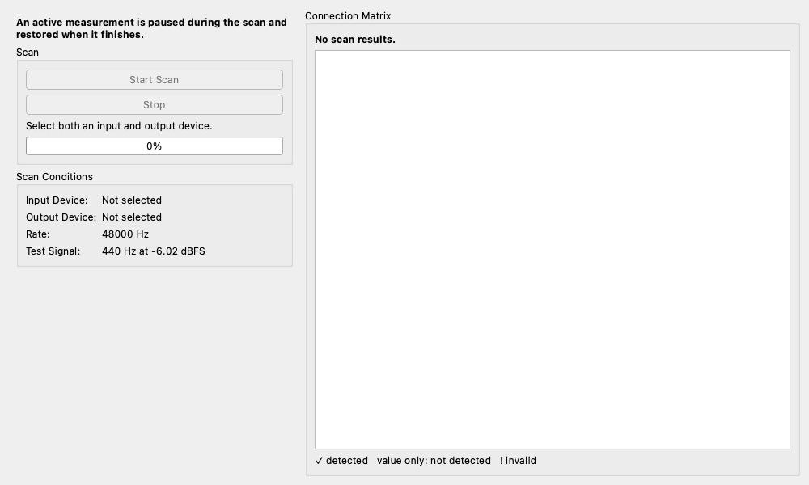

# Loopback Finder (レイテンシー・遅延測定)

## 概要

オーディオインターフェース内で、どの「出力チャンネル」がどの「入力チャンネル」に繋がっているか（ループバックしているか）を自動的に調べるツールです。

多チャンネルのインターフェースを使用している際に、ハードウェア側や OS 側の設定で意図しないループバックが発生していないか、あるいは目的のチャンネルに正しく繋がっているかを素早く確認できます。

## 操作方法

1. **Start Scan** を押します。
2. ソフトウェアが各出力チャンネルから順番にテストトーンを出し、すべての入力チャンネルをスキャンします。
    * **注意**: スキャン中は通常の測定エンジンが一時停止します。また、スピーカー等に繋がっている場合は音が出る可能性があるため注意してください。
3. **Results Table** に検出された経路が表示されます。
    * **Output Channel**: 音を出した出力。
    * **Input Channel**: 音が検出された入力。
    * **Signal Level**: 検出された信号の強さ（dB）。

## 制限事項

* **PipeWire / JACK モード**: 一部の Linux 環境（PipeWire/JACK）で「Resident モード」が有効な場合、このツールは使用できません。設定で一時的に無効にする必要があります。

## 使用例

* **配線の確認**: 「出力3から出した音が入力5に入ってきているはず」という想定が正しいか、ケーブルを抜き差しせずに確認できます。
* **内部リークの発見**: 本来繋がっていないはずのチャンネル間で信号が漏れている（クロストークや内部ループ）のを見つけることができます。
