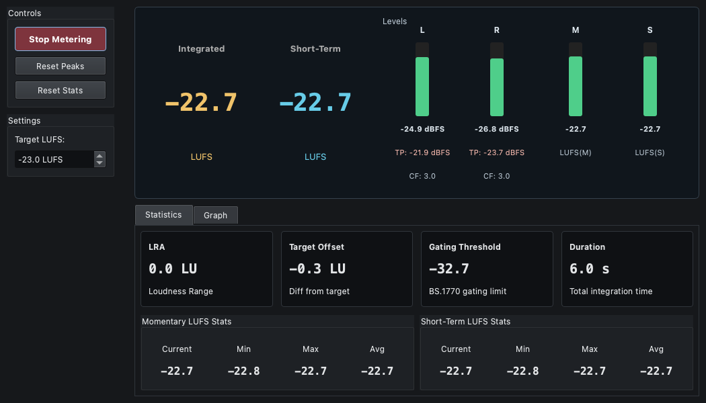

# LUFS Meter (ラウドネスメーター)

## 概要

LUFS Meterは、放送や配信サービス（YouTube, Spotify, Netflixなど）で標準的に使用される「ラウドネス（人が感じる音の大きさ）」を測定するメーターです。国際規格 ITU-R BS.1770-4 に準拠したアルゴリズムを使用しています。同時に通常のピークメーターやRMSメーターも表示します。

## 主な指標の意味

### LUFS

ラウドネス（音量感）の単位です。

*   **Momentary (M)**: 瞬間的なラウドネス（400msの窓）。レベルの激しい変動を確認するのに使います。
*   **Short-term (S)**: 短期間のラウドネス（3秒の窓）。直近の音量感を把握するのに適しています。
*   **Integrated (I)**: 測定開始から現在までの全体の平均ラウドネス。番組や楽曲全体の音量を評価する最も重要な指標です。無音区間などを除外するゲート処理が行われます。

### その他の指標

*   **RMS**: 信号の実効値（電気的な平均レベル）。
*   **Peak (Pk)**: 信号の最大振幅値。
*   **Crest Factor (CF)**: PeakとRMSの差。ダイナミックレンジの広さを表します。

## 操作方法

### Start Metering

測定を開始します。グラフの描画と統計の計算が始まります。

### 各種リセット

*   **Reset Peaks**: レベルメーターのピークホールド表示をリセットします。
*   **Reset Stats**: LUFSの統計データ（Integratedの値やMin/Max履歴など）をすべてリセットしてゼロから再計算します。

### Show SPL

チェックを入れると、RMSレベルメーターの単位を「dB SPL」に切り替えます（事前にSettingsウィジェットでSPL校正が必要です）。LUFS値は常にdBFSベース（LUFS）で表示されます。

## グラフと統計

### Statistics タブ

各指標の現在値（Current）、最小値（Min）、最大値（Max）、平均値（Avg）を表で確認できます。

### Graph タブ

Momentary（水色）とShort-term（黄色）のラウドネス変化を時系列グラフで表示します。

*   **緑色の点線**: 一般的なターゲットレベル（-23 LUFS付近）の目安です。
*   これを目安に、楽曲や音声がターゲット帯域に収まっているかを確認できます。

## 一般的なターゲットレベルの目安

*   **テレビ放送**: -23 LUFS (Integrated) / -24 LKFS
*   **YouTube**: -14 LUFS
*   **Spotify**: -14 LUFS
*   **CD / クラブミュージック**: -9 ~ -6 LUFS（音圧戦争により非常に高い場合があります）
