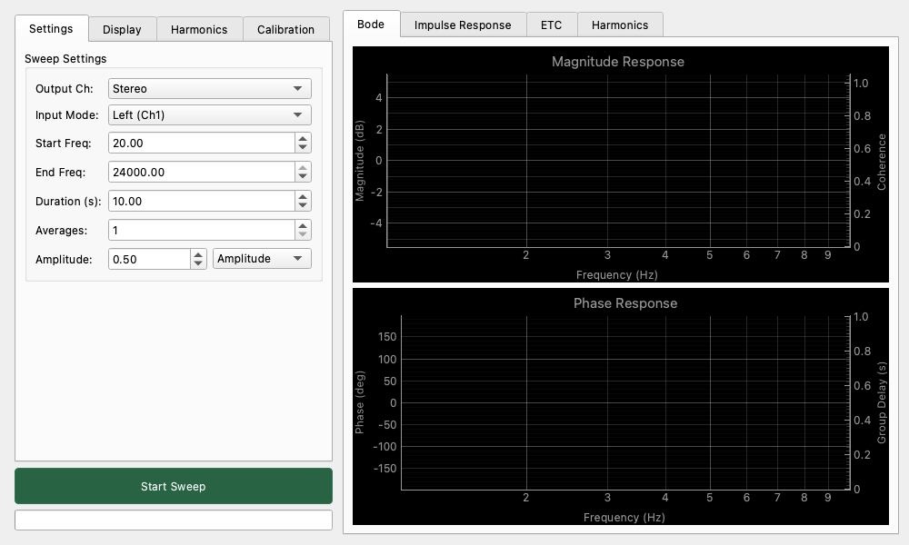

# Network Analyzer (周波数特性測定 / FRA)

## 概要

Network Analyzer（ネットワークアナライザ）は、機器やシステムの周波数特性（振幅特性、位相特性）を測定するためのツールです。正弦波を少しずつ変化させながら測定する「Stepped Sine」方式と、一瞬で全帯域を測定する「Fast Chirp」方式の2つのモードを備えています。

主な用途：

* アンプやフィルタの周波数特性（f特）測定。
* スピーカーやヘッドホンの特性測定。
* 2つの信号間の位相差や遅延の測定。

## 基本操作

### 測定の開始

1. **「Sweep Settings」** タブで測定範囲（Start/End Freq）と振幅（Amplitude）を設定します。
2. **「Start Sweep」** ボタンをクリックすると測定が開始されます。測定中は進行状況がプログレスバーに表示されます。
3. 測定を途中で停止するには、もう一度ボタンをクリックします。

### 測定モードの選択

用途に合わせて2つのモードを選択できます。

* **Stepped Sine (ステップ正弦波方式)**: 周波数を一つずつ階段状に変化させて測定します。時間はかかりますが、S/N比が高く非常に高精度な測定が可能です。
* **Fast Chirp (高速チャープ方式)**: 低域から高域まで高速に変化する信号（チャープ信号）を使用します。わずか数秒で全帯域の測定を完了できるため、調整しながらの測定に便利です。

## ルーティングとXFERモード

### 入出力設定

* **Output Ch**: 測定信号を出すチャンネルを選択します。
* **Input Mode**: 測定対象から戻ってくる信号をどこで受けるかを選択します。
  * **Left (Ch1)** / **Right (Ch2)**: 選択したチャンネルの信号をそのまま測定します（絶対レベル測定）。
  * **XFER (転送関数モード)**: Leftチャンネルを「参照信号（リファレンス）」、Rightチャンネルを「測定信号」として、その比率（H = Meas / Ref）を計算します。これにより、オーディオインターフェース自体の癖をキャンセルした、純粋なデバイスの特性のみを測定できます（相対測定）。

## 表示と解析

**「Display Settings」** タブでグラフの表示方法をカスタマイズできます。

### グラフの種類

* **Magnitude Response (振幅特性)**: 周波数ごとのゲイン（増幅率）を表示します。単位はdBFS, dBV, dBuなどから選択可能です。
* **Phase Response (位相特性)**: 周波数ごとの位相のずれを表示します。
* **Group Delay (群遅延)**: 位相の傾きから計算される、周波数ごとの遅延時間を表示します（「Show Group Delay」にチェック）。

### 表示オプション

* **Smoothing (スムージング)**: グラフの細かいギザギザ（ノイズ）を滑らかにします。Light/Medium/Heavyから選択可能です。
* **Limit Max/Min**: グラフに表示する周波数範囲を制限します。

## キャリブレーション

### Latency (レイテンシ)

「Calibrate Latency」ボタンを押すと、システムの入出力の遅延時間を測定します。正確な位相測定（特に高域）を行うために、ループバック接続をした状態で事前に実行することを推奨します。

### Reference Trace (リファレンストレース)

現在の測定結果を「基準」として保存し、後の測定と比較したり、差し引いたりすることができます。

* **Store Reference**: 現在のグラフをリファレンスとして保存します。
* **Apply Reference**: 保存したリファレンスを現在の測定結果から減算して表示します（フラットな状態からの変化を確認する際に便利です）。
