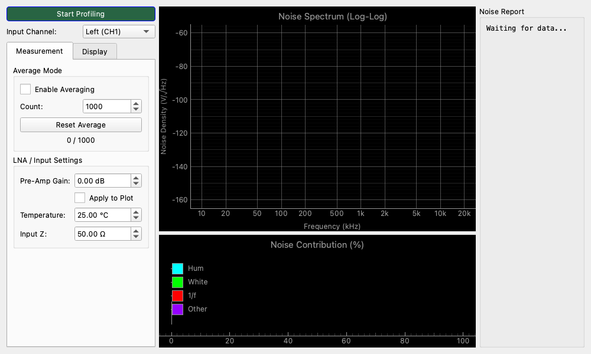

# Noise Profiler

## Overview

This is a tool for detailed analysis and characterization of "noise" components contained in an input signal.
It goes beyond simply displaying the spectrum and quantifies noise by decomposing it into the following elements:

1. **White Noise**: "Hissing" noise distributed evenly across all frequencies.
2. **1/f Noise (Flicker Noise)**: "Fluctuation" noise that becomes stronger at lower frequencies.
3. **Hum Noise**: Power supply-derived "humming" 50Hz/60Hz and its harmonic components.

In addition, based on the temperature and impedance settings, it displays the "Thermal Noise" line, which is the physical limit, allowing comparison with the performance limit of the measurement system.
It is ideal for evaluating the low-noise performance of amplifiers and microphone preamplifiers, and for identifying noise sources in circuits.

## Operation

### Starting and Stopping Measurement

* **Start Profiling / Stop Profiling Button**: Starts and stops noise analysis.

### How to Read the Screen

#### Noise Spectrum (Central Graph)

A graph showing noise density for each frequency. Both the horizontal and vertical axes are displayed on a log scale (logarithmic).

* **Yellow (PSD)**: The noise density spectrum of the actual input signal.
* **Red dashed line (1/f Fit)**: Estimated 1/f noise line calculated from the slope of the low range.
* **Green dotted line (White Floor)**: Estimated white noise level from the flat part of the mid-high range.
* **Light blue dot (Hum)**: Automatically detected peaks of hum noise (power supply noise).
* **Magenta dash-dotted line (Thermal Limit)**: Theoretical thermal noise level at the set temperature and resistance value (physically cannot go below this).

#### Noise Contribution (Bottom Bar Graph)

A bar graph showing which components are dominant in the total noise power.

* **Cyan (Hum)**: Percentage of hum noise
* **Green (White)**: Percentage of white noise
* **Red (1/f)**: Percentage of 1/f noise
* **Purple (Other)**: Others (components that could not be classified)

#### Noise Report (Right Panel)

Displays analysis results in numerical values.

* **Total Noise RMS**: Total noise amount in the audible range (20Hz-20kHz).
* **White Density**: White noise voltage density per 1Hz (e.g., `nV/√Hz`).
* **Corner Freq**: Frequency where 1/f noise and white noise intersect.

## Setting Items (Settings)

Perform detailed settings in the tab on the left side of the screen.

### Measurement

#### Average Mode

Since noise measurement includes random fluctuations, the true value can be seen by averaging.

* **Enable Averaging**: Enables averaging processing.
* **Count**: Number of times to average. The larger the number, the smoother the graph and the easier it is to see minute noise (usually 100 to 1000 times recommended).
* **Reset Average**: Resets averaging and restarts measurement from the beginning.

#### LNA / Input Settings

Sets the criteria for thermal noise or when using an external preamplifier (LNA: Low Noise Amplifier).

* **Pre-Amp Gain**: Enter the gain (dB) of the external preamplifier you are using.
* **Apply to Plot**: If checked, the gain of the preamplifier is subtracted from the graph display (displayed as **Equivalent Input Noise**). This is useful for measuring the performance of the preamplifier itself.
* **Temperature**: Temperature of the measurement environment (°C). Used for thermal noise calculation.
* **Input Z**: Impedance of the signal source (Ω). For example, 150Ω to 600Ω for a microphone, several kΩ for line input, etc. The thermal noise level according to this is calculated.

### Display

#### Units

* **dBV/√Hz**: Decibel display based on 1V.
* **dBu/√Hz**: Decibel display based on 0.775V.
* **dBFS/√Hz**: Display based on digital full scale.

#### Display Options

* **Show as Resistance (Ω)**:
    * Displays the noise level converted to "the equivalent resistance value that generates that noise voltage."
    * Used when evaluating things like "The noise of this amplifier is as quiet as a 50Ω resistor."
* **Show Thermal Limit**: Displays the theoretical limit line of thermal noise.

## Usage Examples

### Self-Noise Measurement of Microphone Preamplifiers

Check how low the noise is for homemade or commercial microphone preamplifiers.

1. Short the input of the preamplifier (or connect a dummy resistor) and input the output to MeasureLab.
2. Enable **Average Mode** and set Count to about `1000`.
3. Wait a while and see the graph stabilize.
4. Enter the gain of the preamplifier in the **Measurement** tab and check **Apply to Plot**.
5. The displayed **White Density** (e.g., 4 nV/√Hz) is the equivalent input noise performance of the preamplifier.

### Evaluation of Power Supply Noise

Check if hum noise is present on the power supply line of the circuit.

1. Look at the **Noise Contribution** bar graph.
2. If the percentage of **Cyan (Hum)** is high, there is a possibility of insufficient ripple removal of the power supply or a ground loop.
3. Look at the light blue dots on the graph to analyze whether the fundamental wave of 50Hz/60Hz is strong or the harmonics (100Hz/120Hz, etc.) are strong.

### Observation of Thermal Noise of Resistors (Experiment)

As a physical experiment, try actually measuring the thermal noise generated from a resistor.

1. Input the noise of the resistor through a high-gain, low-noise amplifier.
2. Enter the resistance value in **Input Z** in the **Measurement** tab.
3. Confirm if the measured value of the graph (yellow) matches the theoretical value, **Thermal Limit** (magenta).
