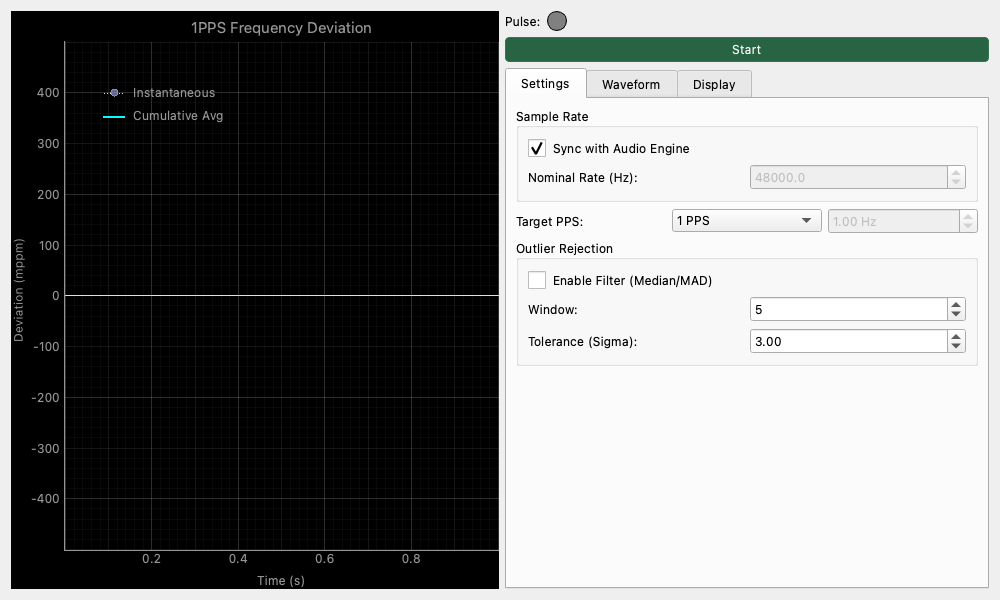

# 1PPS Monitor (1PPS モニター)

## 概要

1PPS (Pulse Per Second) 信号を監視し、サンプリングレートの安定性やクロックの偏差を精密に測定するための実験的なツールです。

GPS受信機や高精度クロックソースから出力される1秒ごとのパルス信号を入力し、オーディオインターフェースのサンプルレートとのズレ（PPM: Parts Per Million）をリアルタイムで解析・表示します。

💡 **1PPSとPPMってなに？**

* **1PPS**: 「1秒に1回、正確にピッという信号（パルス）を出す」機能のことです。GPSなどの非常に正確な時計（原子時計）から出力されます。
* **PPM (Parts Per Million)**: 100万分の1を表す単位です。例えば「10 PPMズレている」というのは、100万秒（約11.5日）経つと10秒ズレる、という非常に小さな誤差のことです。このモニターは、オーディオ機器の内部時計がどれくらい正確かを、GPSの正確な時計を基準にして測るための「超精密なストップウォッチ」のようなものです。

## 機能と特徴

* **サンプルの PPM 偏差測定**: パルスの立ち上がりエッジ間のサンプル数を計測し、公称レートと比較して偏差を表示します。
* **任意周波数対応 (Target PPS)**: 1PPS だけでなく、10PPS や任意の周波数のパルス信号を測定対象に設定できます。
* **トリガー波形表示**: 検出されたパルス前後の波形を可視化し、トリガー状態を視覚的に確認できます。
* **PPM 表示**: 瞬時値 (Instantaneous) と累積平均 (Cumulative Avg) の偏差を PPM 単位でグラフ化します。
* **異常値フィルタ**: ノイズやグリッチによる誤検出を防ぐため、中央値絶対偏差 (MAD) を用いたロバストなフィルタを搭載しています。
* **入力遅延補正**: オーディオインターフェースの入力遅延や手動オフセットを考慮した精密な測定が可能です。
* **統計情報**: 検出数、偏差の平均、標準偏差、最大/最小偏差などの統計情報を表示します。

## 操作方法

### 測定の開始と停止

* **Start / Stop ボタン**: 測定を開始・停止します。
* **Sync with Audio Engine**: チェックを入れると、オーディオエンジンの現在のサンプリングレートを公称レートとして自動設定します。

### タブ構成

コントロールパネルは複数のタブに分かれています。

#### Settings (設定)

* **Sample Rate**: 基準となるサンプリングレートを設定します。
* **Target PPS (Hz)**: 測定対象のパルス信号の周波数を設定します（デフォルトは 1.0Hz）。これにより、10PPS などの信号にも対応します。
* **Outlier Rejection (異常値除去)**: 突発的な測定エラーやノイズを除去するためのフィルタ設定です。
    * **Enable Filter**: フィルタを有効にします。
    * **Window**: フィルタ計算に使用する直近のサンプル数（ウィンドウサイズ）。
    * **Tolerance (Sigma)**: 中央値からどれくらい離れた値を異常値とするかの許容範囲。

#### Waveform (波形)

検出されたパルスの波形をリアルタイムで確認し、トリガー設定を調整できます。

* **Input Waveform (Triggered)**: トリガー（パルス検出）された瞬間の前後（デフォルト ±0.5秒）の波形を表示します。
* **Threshold (FS)**: パルスとみなす信号レベルの閾値。波形グラフ上の緑色の線で示されます。
* **Hysteresis (FS)**: チャタリング防止のためのヒステリシス。波形グラフ上の赤色の点線で示されます。
* **Latency Compensation**: 測定値に対する遅延補正を設定します。
    * **Compensate Input Latency**: オーディオインターフェースが報告する入力遅延を自動的に差し引きます。
    * **Manual Offset (ms)**: 手動で追加の遅延補正（ミリ秒単位）を設定します。

#### Display (表示・統計)

* **Unit**: グラフの単位を `PPM` または `Seconds` に切り替えられます。
* **Show Instantaneous**: 瞬時値の表示/非表示を切り替えます。
* **Calibration**: 測定値から校正係数を算出・保存します。
    * **Stored 1PPS Cal**: 現在保存されている補正値（ppm）。
    * **Calibrate from Current**: 現在の累積平均値をもとに校正を行い、「1PPS Frequency Calibration」スロットに保存します。
        !!! note
            本モニターの校正値をシステム全体に適用するには、**Settings** ウィジェットの **Calibration** タブ内で **Frequency Calibration Source** を `1PPS Monitor` に切り替える必要があります。
* **Statistics**:
    * **Count**: 検出されたパルス数。
    * **Inst / Cumul**: 最新の瞬時値および累積平均値（PPM）。
    * **Rate**: 測定から推定された実効サンプリングレート。
    * **Mean / Std Dev**: 偏差の平均値と標準偏差。
    * **Min / Max**: 測定開始からの最小・最大偏差。

## グラフの見方 ☕

* **Instantaneous (点線・黄色)**: パルスごとの瞬時偏差を表示します。ジッターや短期的な変動の確認に適しています。
* **Cumulative Avg (実線・シアン)**: 測定開始からの累積的な平均偏差を表示します。長期的なクロックドリフト（周波数オフセット）の確認に適しています。

!!! warning
    **校正の注意点**: 「現在値から校正」を実行すると、計算された補正係数が設定に保存されます。この値はオーディオエンジンの周波数設定などで利用されますが、本モニター自体のグラフ表示がリセットされるわけではありません。
