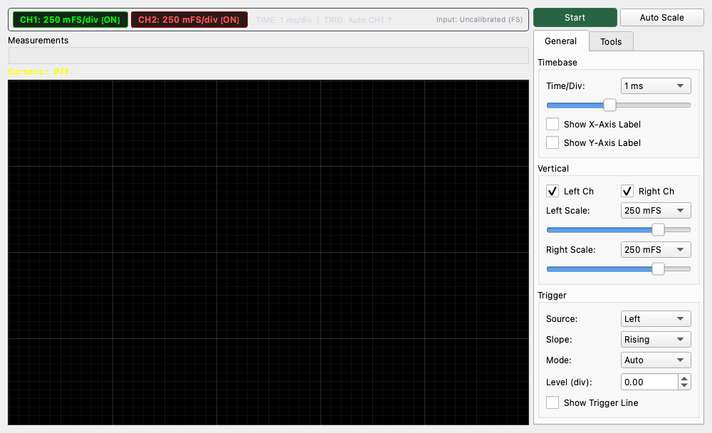

# Oscilloscope

## Overview
The Oscilloscope is a measurement tool that displays the waveform of the input signal on a time axis in real-time. It is used to visually confirm the shape, amplitude, and period of a signal. It also includes trigger functions, automatic measurement capabilities, and arithmetic (math) functions.

## Basic Operation

### Starting and Stopping Measurement
*   **Start/Stop button**: Toggles the measurement start and stop.

### Reading the Screen
*   **Time/Div**: Changes the scale of the time axis (horizontal axis). Larger values display a longer duration, while smaller values zoom in on the waveform.
*   **Scale**: Changes the scale of the voltage axis (vertical axis).
    *   **Left Scale / Right Scale**: Allows you to set the display magnification for each of the left and right channels. "1.0x" is the standard; setting it to a larger value, such as "2.0x", will vertically expand the display of the waveform.
*   **Channels**: Check boxes can be used to toggle the display/hide status of each channel (Left/Right).

## Trigger Settings
A function to stop (stabilize) the waveform for easier observation.

*   **Source**: Selects the signal source for the trigger (Left or Right).
*   **Slope**: Selects the direction in which the signal crosses the trigger level.
    *   **Rising**: Triggers when the voltage increases from low to high (rising edge).
    *   **Falling**: Triggers when the voltage decreases from high to low (falling edge).
*   **Mode**:
    *   **Auto**: Updates the waveform at regular intervals even if the trigger conditions are not met (something is displayed even if no signal is found).
    *   **Normal**: Updates the waveform only when the trigger conditions are met (the screen stays frozen until a signal arrives).
    *   **Single**: Captures the waveform only once when the trigger conditions are met and then automatically stops (useful for observing one-time signals).
*   **Level**: Sets the voltage level at which the trigger occurs.

## Tools and Measurements

### Measurements
The current signal measurement values are displayed in the upper left of the screen.
*   **Vrms**: Root mean square voltage.
*   **Vpp**: Peak-to-Peak voltage (the difference between maximum and minimum values).

When **"Enable Waveform Measurements"** is checked, the following additional measurement values are also displayed (automatically calculated from the waveform shape).
*   **Freq**: Frequency.
*   **Rise/Fall**: Rise/Fall time.

### Cursors
When **"Enable Cursors"** is checked, two cursors (C1, C2) are displayed on the screen. By dragging these cursors with the mouse, you can measure details such as the time difference (dT), frequency (1/dT), and voltage difference (dV) between two points.

### Math Functions
Displays the results of calculations performed on two channels or signals as a "Math" waveform (white dotted line).
*   **Off**: No calculation.
*   **A + B**: Left + Right.
*   **A - B**: Left - Right.
*   **A * B**: Left × Right (product).
*   **Derivative**: Differentiated waveform of the Left channel.
*   **Integral**: Integrated waveform of the Left channel.

### Filter
Applies a simple filter to the input signal for display. Convenient for checking noise, etc.
*   **Type**: LPF (Low Pass), HPF (High Pass), BPF (Band Pass).
*   **Cutoff / Freq**: Sets the cutoff frequency or passband of the filter.
