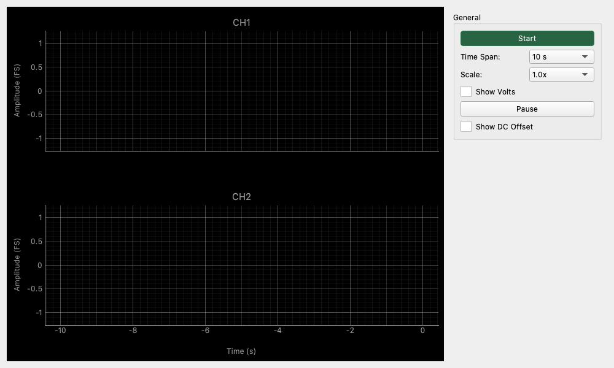

# Raw Time Series

## Overview

A tool that continuously monitors and records signal changes over long periods.
While an oscilloscope captures and displays momentary waveforms, Raw Time Series keeps recording signal transitions over long spans (seconds to minutes), making it suitable for observing slow voltage fluctuations, DC offset drift, and the timing of sporadic noise occurrences. It acts as a digital version of a "chart recorder" (an instrument that continuously records signals on a moving roll of paper), allowing you to scroll back and review past events.

## Operation

### Starting and Stopping Measurements

* **Start / Stop Button**: Located in the **Controls** panel. Stop keeps the last acquired history; Start begins a new history.

### Display and Controls

The display contains the plots, acquisition status, and voltage calibration notice. Start / Stop, Hold Display, and display settings are in the Controls panel. In a two-window split, all operations stay in the control window. Compact mode hides the controls and history summary while keeping acquisition status and voltage calibration information visible.

Turning Show Volts or Show DC Offset on or off preserves the plot area. Show Volts changes the axis units and values together, preserving the waveform's displayed size at the same vertical zoom.

### Reading the Graph

* **X-axis (Time)**: Represents elapsed time. Current time is 0, and the display goes back into the past (e.g., -10s to 0s).
* **Y-axis (Amplitude)**: Represents the signal amplitude.
* **CH1 (Green) / CH2 (Red)**: Displays left and right channels arranged vertically. Time axes are synchronized.

## Settings

### General Settings

* **Time Span**
    * Sets the length of time displayed on the screen.
    * **10s**: Monitors the last 10 seconds of activity. Highly responsive.
    * **60s (1 minute)**: Displays transitions over a one-minute period.
    * **300s (5 minutes)**: Used for long-term trend monitoring.

* **Scale (Vertical Scale)**
    * Changes the display magnification of the waveform.
    * **1.0x**: Standard size (Full Scale or 1V reference).
    * **Larger numbers (e.g., 10.0x)**: Magnifies the signal. Useful for viewing minute noise or offsets.
    * **Smaller numbers (e.g., 0.1x)**: Shrinks the display. Effective for seeing the overall picture of loud signals that might otherwise clip.

* **Show Volts**
    * **OFF (Default)**: Displays relative to digital Full Scale (FS) (-1.0 to +1.0).
    * **ON**: Displays in voltage units (V). Reflects the input sensitivity setting (calibration) of the audio interface.

* **Hold Display / Resume Display**
    * Pauses only the screen updates.
    * **Important**: Data recording continues in the background. When unpaused, the display updates all at once to include data recorded during the pause. This is useful for carefully reading values while viewing the graph.

* **Show DC Offset**
    * **ON**: Displays the DC component (average value) contained in the signal in real-time.
    * Used for monitoring DC leakage in amplifiers or fluctuations in bias voltage.

## Usage Examples

### Monitoring DC Offset Drift

Check the operational stability of a DIY amplifier or circuit.

1. Press the **Start** button to begin measurement.
2. Set **Time Span** to `60s` or `300s`.
3. Turn **Show DC Offset** ON.
4. Power on the circuit and observe how the DC voltage value and graph line change over time (e.g., checking if voltage drifts due to thermal runaway).

### Finding Intermittent Noise

Wait for and monitor noise that occurs sporadically, such as occasional "popping" sounds.

1. Set a long **Time Span** (`60s` or more).
2. Set the **Scale** to a high value (`5.0x` or `10.0x`) to magnify the noise floor during silence.
3. When noise occurs, it will be recorded as a spike on the graph.
4. Quickly press **Hold Display** when you see noise to examine the waveform. This can be used as a "visual trigger" for irregular phenomena that are difficult to capture with standard oscilloscope trigger settings.

### Difference from Oscilloscope Trigger

An oscilloscope trigger captures a snapshot when a specific voltage condition is met, whereas Raw Time Series continuously records a long history, allowing you to review issues later. This is highly effective for discovering noise when the conditions are completely unpredictable.
