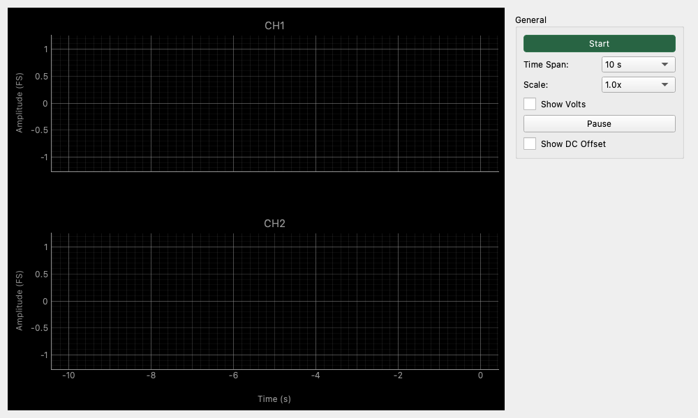

# Raw Time Series (長時間波形記録)

## 概要

長時間にわたる信号の変化を連続的に監視・記録する「チャートレコーダー」のようなツールです。
オシロスコープが一瞬の波形を切り取って表示するのに対し、Raw Time Seriesは信号の推移を長いスパン（数秒〜数分）で記録し続けるため、ゆっくりとした電圧変動やDCオフセットのドリフト、突発的なノイズの発生タイミングなどを観測するのに適しています。

💡 **チャートレコーダーって？**
昔の地震計や嘘発見器のように、長〜い紙がゆっくり送り出されながら、ペンで波線を描き続けていく機械を見たことがありませんか？ Raw Time Seriesはまさにそれのデジタル版です。「さっき何か変な音がした気がする！」という時でも、記録をさかのぼって確認することができます。

## コンパクトモード (Compact Mode)

Detachable Wrapperの分離ウィンドウ時に「Compact」ボタンを押すことで、波形表示のみを最大化するコンパクトモードに対応しています。

## 操作方法

### 測定の開始と停止

- **Start / Stop ボタン**: モニタリングの開始と停止を切り替えます。停止中もバッファクリアはされず、再開すると続きから描画されます。

### グラフの読み方

- **横軸 (Time)**: 時間経過を表します。現在時刻を0とし、過去にさかのぼって表示されます（例: -10s 〜 0s）。
- **縦軸 (Amplitude)**: 信号の振幅を表します。
- **CH1 (緑) / CH2 (赤)**: 左右のチャンネルを上下に並べて表示します。時間軸は同期しています。

## 設定項目

### General (基本設定)

- **Time Span (時間スパン)**
    - 画面に表示する時間の長さを設定します。
    - **10s**: 直近10秒間の動きを見ます。反応が機敏です。
    - **60s (1分)**: 1分間の推移を表示します。
    - **300s (5分)**: 長時間のトレンド監視に使用します。

- **Scale (垂直スケール)**
    - 波形の表示倍率を変更します。
    - **1.0x**: 標準サイズ（Full Scale または 1V基準）。
    - **数字を大きくする (例: 10.0x)**: 信号を拡大表示します。微小なノイズやオフセットを見るときに便利です。
    - **数字を小さくする (例: 0.1x)**: 信号を縮小表示します。クリップするような大音量信号の全体像を見る場合に有効です。

- **Show Volts (電圧表示)**
    - **OFF (デフォルト)**: デジタルフルスケール(FS)基準で表示します（-1.0 〜 +1.0）。
    - **ON**: 電圧値(V)で表示します。オーディオインターフェースの入力感度設定（キャリブレーション）が反映されます。

- **Pause (一時停止)**
    - 画面の更新のみを一時停止します。
    - **重要**: 裏ではデータの記録が続いています。再度Pauseを解除すると、停止していた間のデータも含めて最新の状態に一気に更新されます。グラフを見ながらゆっくり値を読み取りたい場合に便利です。

- **Show DC Offset (DCオフセット表示)**
    - **ON**: 信号に含まれる直流成分（平均値）の数値をリアルタイムで表示します。
    - アンプのDC漏れや、バイアス電圧の変動を監視する際に使用します。

## 使用例

### DCオフセットのドリフト監視

自作アンプや回路の動作安定性をチェックします。

1. **Start** ボタンを押して測定を開始します。
2. **Time Span** を `60s` または `300s` に設定します。
3. **Show DC Offset** をONにします。
4. 回路の電源を投入し、DC電圧の数値やグラフのラインが時間の経過とともにどう変化するか（熱暴走などで電圧がずれていかないか）を観察します。

### ☕ コーヒーブレイク：間欠的なノイズの発見

「時々プチッと音がする」ような、いつ発生するかわからないノイズを待ち構えて監視します。

1. **Time Span** を長め（`60s`以上）に設定します。
2. **Scale** を大きめ（`5.0x` や `10.0x`）にして、無音時のノイズフロアを拡大表示しておきます。
3. ノイズが発生すると、グラフ上に突起（スパイク）として記録されます。
4. ノイズが見えたら素早く **Pause** を押し、波形を確認します。オシロスコープのトリガー設定が難しいような、不定期な現象の「目視トリガー」として使えます。

💡 **オシロスコープのトリガーとの違い**
オシロスコープのトリガーは「特定の電圧条件を満たした瞬間の波形を切り取る」機能ですが、こちらは「長時間の履歴を記録し、後から問題箇所を探す」アプローチです。発生条件が全く予測できないノイズの発見に適しています。
