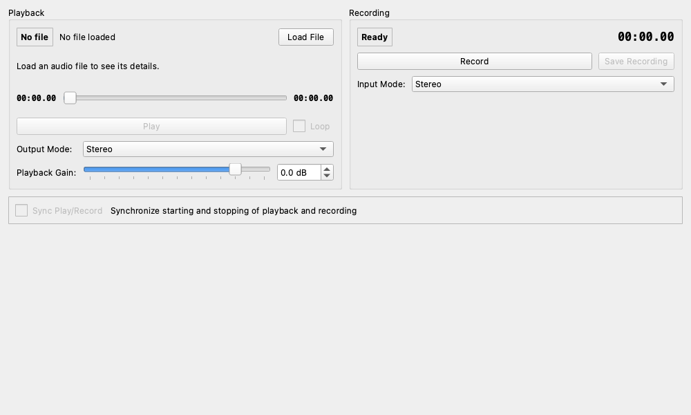

# Recorder & Player (録音・再生)

## 概要

シンプルなオーディオ録音・再生ツールです。
測定用のテスト信号（スイープ音やノイズなど）を再生して回路に入力したり、測定結果としての出力を録音してファイルに保存したりすることができます。
WAV, MP3, FLAC, OGG などの一般的なオーディオファイルの読み込みに対応しています。

## 操作方法

### Playback (再生セクション)

ファイルを読み込んで再生します。

* **Load File**: オーディオファイルを開きます。
  * **サンプリングレート変換**: アプリケーションの動作レートとファイルのレートが異なる場合（例: 44.1kHzのファイルを48kHzの設定で開く場合）、自動的にリサンプリング（変換）を行うか確認されます。通常はそのまま読み込んで問題ありません。
* **Play / Stop**: 再生と停止を行います。
* **Loop**: チェックを入れると、ファイルの最後まで再生した後に先頭に戻って繰り返し再生を続けます。連続したテスト信号を出力し続けたい場合に便利です。
* **Player Progress**: 再生位置を示すバーです。

* **Output Mode (出力モード)**
  * **Stereo**: ファイルのL/Rをそのまま出力します。
  * **Left / Right**: 片方のチャンネルのみを出力します。
  * **Mono**: ファイルがステレオの場合、左右をミックスしてモノラルにし、両方の出力チャンネルから同じ音を出します。

* **Playback Gain**: 再生音量をデジタル処理で調整します（-60dB 〜 +12dB）。

### Recording (録音セクション)

入力された信号をメモリに記録し、ファイルとして書き出します。

* **Record / Stop Recording**: 録音の開始と停止を行います。
* **Save Recording**: 録音したデータをファイルに保存します。録音停止中のみ押すことができます。
* **Input Mode (入力モード)**
  * **Stereo**: L/R両方を録音します。
  * **Left / Right**: 指定した片方のチャンネルのみを録音します。

* **Recorded Info**: 現在録音されている長さ（秒）を表示します。

## 使用例

### 測定信号のソースとして使う

ピンクノイズやサインスイープなどの入ったWAVファイルを用意し、このツールで再生して測定器（スペアナなど）で観測します。

1. **Playback** セクションの **Load File** でテスト信号ファイルを読み込みます。
2. 常に信号を流し続けたい場合は **Loop** にチェックを入れます。
3. **Play** を押して再生を開始します。
4. 別のウィジット（Spectrum Analyzerなど）を開き、入力信号が正しく来ているか確認します。
5. **Output Mode** を切り替えることで、Lchのみに信号を送ってクロストーク（Rchへの漏れ）を測るなどの使い方ができます。

### 異常音のキャプチャ

回路から異音がする場合、その音を録音して証拠として残したり、後で詳細に解析したりします。

1. **Recording** セクションの入力設定を確認します。
2. **Record** ボタンを押し、異音が発生する状況を再現します。
3. 十分に録音できたら **Stop Recording** を押します。
4. **Save Recording** を押し、`evidence.wav` などの名前で保存します。
5. 保存したファイルは、後でこのツールで読み込んで再生したり、波形編集ソフトで開くことができます。
