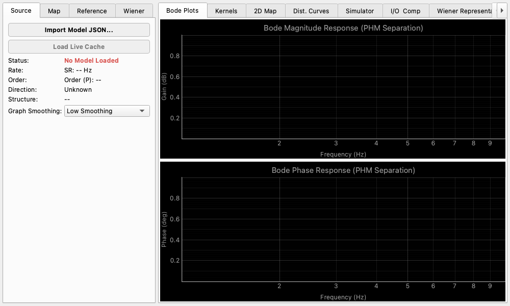

# Response Viewer

## Overview

The Response Viewer is an advanced visualization tool for analyzing linear and harmonic response characteristics (up to the 5th order) extracted by the [Nonlinear Analyzer](nonlinear_analyzer.en.md). It allows you to deeply evaluate the measured Hammerstein model's frequency response and simulate the system's output behavior (e.g., gain compression) at arbitrary frequencies and amplitudes.

## Common Features

This widget supports common features of the Detachable Wrapper. Please refer to the [Detachable Wrapper](detachable_wrapper.en.md) documentation for details.

## Key Features and Operation

### Model Source

* **Load Live Cache**: Directly loads the most recent model measured and extracted by the Nonlinear Analyzer.
* **Import Model JSON...**: Loads a previously saved Hammerstein model from a JSON file.

### 2D Map

* **Map Type**: Selects the type of map to display.
    * **THD Map**: Map of Total Harmonic Distortion relative to the fundamental.
    * **Distortion Map (nth)**: Individual maps for the 2nd to 5th harmonic components.
* **Harmonic Unit**: Selects whether to display levels in relative (dBr) or absolute (dBFS) units.
* **Resolution**: Adjusts the calculation resolution of the map (Overview, Standard, Detail).
* **Min/Max Level**: Sets the display range for the input amplitude (Y-axis).
* **Color Map**: Changes the color palette of the map.
* **Show Contours**: Draws contour lines on the map.
* **Enable Noise Floor**: Factors in either the measured noise floor or a manually set noise floor into the plots.

### Dist. Curves (Distortion Curves)

* **Reference Tone Settings**: Sets the "Input Frequency" and "Input Amplitude" as the reference point for evaluation.
* The upper plot displays the distortion characteristics across a frequency sweep at the reference amplitude, while the lower plot shows the distortion across an amplitude sweep at the reference frequency.

### Simulator

* Simulates and displays the predicted output spectrum as a bar graph, assuming a pure sine wave is input at the set reference frequency and amplitude.
* A detailed list of the predicted amplitude and phase for each harmonic is also provided.

### I/O & Comp (Input/Output & Compression)

* **Input-Output Transfer Curve**: Visualizes the transfer characteristics (ideal linear output vs actual output) at the reference frequency and estimates the system's 1dB compression point (P1dB).
* **Gain Compression**: Plots the deviation (compression error) from the ideal linear gain.

### Wiener Settings

* **Equivalent Gaussian RMS Level (σ)**: Configures the equivalent RMS level ($\sigma$) in dBFS of an input Gaussian noise signal. By default, it is synchronized with the Reference Amplitude.

### Wiener Representation

Converts the measured Hammerstein kernels into Wiener kernels ($w_1 \sim w_5$) in both the frequency and time domains using Hermite orthogonalization relative to the input RMS level ($\sigma$). This allows you to evaluate the orthogonalized distortion profile at specific operational levels.

* **Wiener Kernel Magnitude Response**: Plots the gain frequency response of each Wiener kernel (dB vs Hz, logarithmic X-axis).
* **Wiener Kernel Phase Response**: Plots the phase frequency response of each Wiener kernel (deg vs Hz, logarithmic X-axis).
* **Wiener Kernel Energy Fraction**: Renders the time-domain energy fraction (%) of each Wiener kernel as a bar graph, visualizing the contribution of distortion energy for each order.
