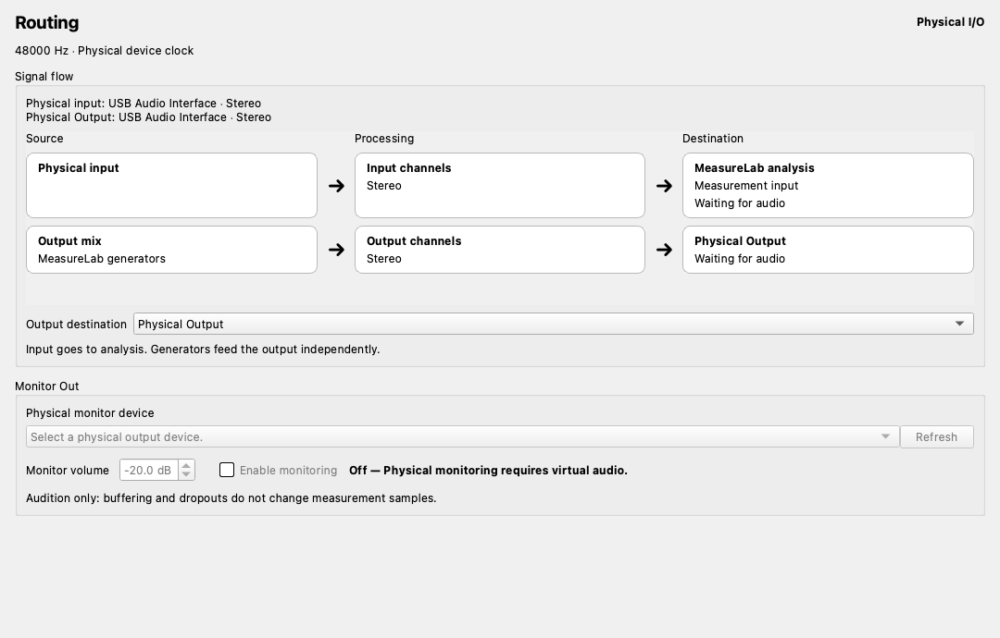

# Routing and physical monitoring

Open **Routing** in the sidebar to inspect MeasureLab's connections and audition virtual measurements through a physical output.
Routing is an infrastructure page. Closing it or switching to an instrument does not stop an enabled monitor.

## Audition a DUT

1. Enable **Virtual Audio** in Settings and load a [VST3 DUT](../vst_dut.md) if needed.
2. Open Routing and check the measurement input L/R assignments in the signal flow.
3. Explicitly select a physical output device.
4. Check the monitor volume and select **Enable monitoring**. The initial volume is −20 dB.
5. Start a generator or measurement. Enabling the monitor alone does not start audio processing.

Routing owns channel mapping and monitor controls. The VST launcher's Routing button opens this page.
The VST3 plugin button in Routing opens plugin loading, unloading, bypass and native editor management.

Monitor Out always auditions the routed measurement input L/R. There is no source selector.
For example, if measurement L is wet and R is a dry reference, those same signals are heard on the left and right.
A channel assigned to silence remains silent. Without a loaded DUT, the virtual loopback input can still be monitored.

Monitor volume ranges from −60 to 0 dB. Volume, float32 conversion and clipping affect only the monitor copy.
A stereo device receives its first two channels; a mono device receives their average.
The monitor adds no further output-channel mapping or dithering; it copies the configured measurement input.

## Inspect connections

The page shows the backend, clock, sample rate and devices or remote endpoint.
**Signal flow** reads left to right: Source → Processing → Destination.
Virtual Audio shows generators → VST3 → MeasureLab analysis. A dry reference branches from the same generator signal and appears on a separate row that skips the plugin.
The diagram includes measurement input L/R assignments. Physical and remote inputs feed analysis; generators feed their outputs independently.
VST3 currently processes only the generator signal in Virtual Audio.

A single **↓ Monitor Out** marker identifies the combined measurement input L/R tap, with its state on the analysis destination card.
The matching **↳ Monitor Out** section selects its physical device, volume and enable state.
Off, waiting for audio, playing and faults are distinguished; waiting and disabled-control explanations appear alongside the controls.

Click **Edit channel routing…** in the diagram to edit mono/stereo DUT inputs and measurement return L/R channels.
Stop measurements before changing the mapping. Changes disable monitoring; switching to mono replaces DUT output 2 assignments with output 1.
Plugin management no longer duplicates these controls.

In physical and remote client modes, the output destination selector controls the same setting as the bottom-right menu.
Remote input-only connections show output as unavailable. Provider routes distinguish waiting, sharing and muted playback.
Device setup remains in Settings; connection management remains in Remote Audio I/O.

This screenshot uses an example configuration for display verification, rather than a live device or plugin test.

## Timing, state and limits

- Enabled and playing are separate states. An enabled monitor waits until measurement audio is available.
- Dropout indication remains until the monitor is re-enabled. Its tooltip reports dropped, missing and buffered frames.
- This is an audition path. The buffer targets approximately 100 ms, with at least two measurement blocks, plus the physical device latency.
- The virtual timer and device clocks may drift. Missing audio is zero-filled; excessive buffering discards old audio. The measurement producer never waits for playback.
- The device must accept the measurement sample rate. An unsupported rate fails only the monitor, without changing measurement settings. No application resampling is performed.
- Turn the monitor off before changing the device. Volume and ON/OFF can change during measurement without restarting the DUT or measurement stream.
- Stopping measurement discards queued monitor audio. An enabled monitor follows a subsequent start with the same settings.
- Backend, format, DUT load/unload, routing and bypass changes turn the monitor off.
- A failed or disconnected monitor does not stop measurement. There is no fallback device or automatic error recovery. Resolve the problem and toggle OFF→ON to retry.
- DUT errors silence measurement inputs and stop monitoring. Reload the plugin before enabling the monitor again.
- Preferences last only for this application session. Restarting restores OFF, −20 dB and no selected device.

The additional physical monitor is available only in virtual mode. Simultaneous remote sends, multiple monitor devices, free-form patching and low-latency instrument performance are outside this version's scope.
