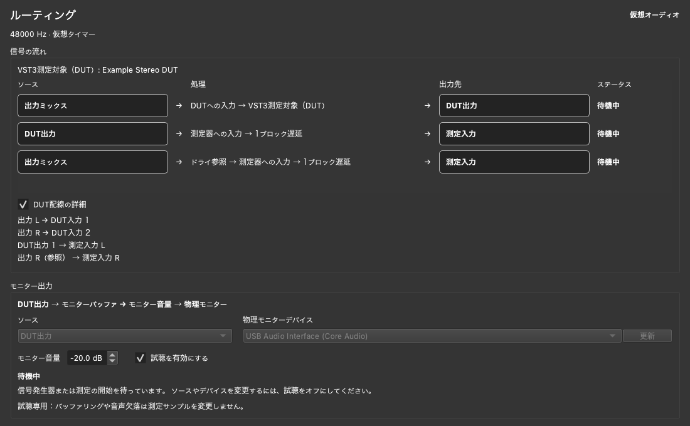

# Routing：信号経路と物理モニター

Routingは、MeasureLab内の現在の信号経路を確認し、仮想測定の音を物理出力で試聴するための基盤ページです。
サイドバーの「Routing」から開きます。ページを閉じたり測定器へ移動したりしても、モニター設定は維持されます。

## DUTの音を聴く

1. 設定で「仮想オーディオ」を有効にし、必要なら[VST3 DUT](../vst_dut.md)をロードします。
2. Routingを開き、「モニター出力」のSourceを選びます。
3. 物理出力デバイスを明示的に選択します。
4. 音量を確認し、「試聴を有効にする」をONにします。初期音量は−20 dBです。
5. 信号発生器や測定器を開始します。モニターのONだけでは信号生成や測定は開始しません。

VST画面の「モニター出力」も同じ設定を操作します。出力デバイスが未選択の場合はRoutingへ移動します。
VST画面の「Routing」ボタンからも設定ページを開けます。

| Source | 聴こえる信号 |
| --- | --- |
| DUT出力（初期選択） | 測定戻り配線を適用する前のDUT出力。モノDUTは左右に複製します |
| 測定戻り信号 | 次ブロックの測定入力へ渡す左右の信号。Dry参照も含みます |
| 出力ミックス | DUT処理・ディザ適用前のモジュール出力のミックス。DUTなしでも使用できます |

例えば測定入力L＝Wet、R＝Dry参照でも、Sourceを「DUT出力」にすればDUT自体のステレオ出力を聴けます。
モニター音量は−60～0 dBです。音量調整、float32変換、振幅制限はモニター分岐にだけ適用し、測定値を変更しません。
物理デバイスがステレオの場合は先頭2チャンネル、モノの場合は左右の平均を出力します。
既存の測定出力チャンネル選択やディザは、このモニターには適用しません。

## 接続表示

上部にはバックエンド、クロック、サンプルレート、デバイス／接続先を表示します。
「信号の流れ」では、ソース → 処理 → 出力先を左から右へ追えます。測定経路の分岐は別の行に表示し、各行の右端に実際の状態を示します。
試聴経路は「モニター出力」に分け、ソース・デバイス・音量・有効化の操作をまとめています。待機理由や操作できない理由もこの欄で確認できます。
「DUT配線の詳細」を開くと、DUT入力と測定戻りの左右の対応を確認できます。

画面は表示確認用の構成例です。実デバイスや実プラグインでの動作検証結果を示すものではありません。

物理／Remoteモードでは、従来の出力先選択も操作できます。右下メニューと同じ設定であり、双方の変更が同期します。
RemoteのInput only接続では出力が利用不可と表示され、Providerでは待機・共有・出力停止の状態を表示します。
デバイスの詳細設定は設定画面、Remoteの接続操作はRemote Audio I/O画面で行います。

## 状態と制限

- OFFと再生中を区別します。ONでも音声が開始していなければ待機になります。
- 音声欠落はモニター再有効化まで表示に残ります。状態のツールチップに破棄・不足・バッファ中のフレーム数を表示します。
- 試聴用の機能です。バッファは約100 ms（最低2測定ブロック）を目標とし、これに物理デバイスの遅延が加わります。
- 仮想タイマーとデバイスのクロック差で、音が途切れる場合があります。不足分は無音で補い、過剰時は古い音を破棄します。測定は待機させません。
- 物理デバイスには測定と同じサンプルレートを要求します。非対応の場合はモニターだけがエラーになり、測定レートは変わりません。アプリ側のリサンプリングは行いません。
- Source・デバイス変更はモニターOFF時に行います。ON/OFFと音量は測定中も変更でき、測定ストリームやDUTを再起動しません。
- 測定停止時は残存音声を破棄し、同じ設定で測定を再開始するとONのモニターも追従します。
- 音声バックエンド・フォーマット、DUTロード／アンロード／配線／バイパスを変更するとモニターはOFFになります。
- モニターデバイスの故障・切断は測定を停止しません。別デバイスへの自動切替やエラー後の自動再開は行いません。問題を解消してOFF→ONで再開します。
- DUTエラー時は既存どおり測定戻りを無音化し、DUT由来のモニターも停止します。DUT前の出力ミックスは引き続き試聴できます。
- 設定はセッション内のみ保持し、アプリ再起動後はOFF・−20 dB・デバイス未選択に戻ります。

追加の物理モニターは仮想モード専用です。Remoteへの同時分岐、複数モニターデバイス、自由配線、低遅延演奏用途には対応していません。
