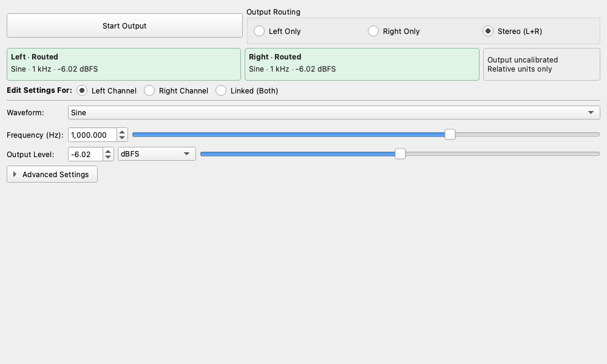

# Signal Generator

## Overview

The Signal Generator is a tool that generates various test signals required for audio measurements, such as sine waves, square waves, noise, and sweep signals. It allows independent control of the left and right channels (L/R) or linked operation for synchronized control.

Main features:

* **Diverse Waveforms**: In addition to basic waveforms, it can generate multitone, MLS, Golay, and burst signals.
* **Flexible Output Control**: Supports independent L/R output, phase inversion, and delay settings.
* **Advanced Modulation**: Supports sweep (frequency sweep), AM (amplitude modulation), FM (frequency modulation), and ΦM (phase modulation).

## ☕ Coffee Break: Why test with a "beep" instead of music?

When testing audio equipment, we often use a monotonous "beep" sound (a sine wave). You might think, "Wouldn't playing music give a better idea of actual performance?"

To use an analogy, it's like testing a car's suspension. Driving on a bumpy mountain road (= complex music) to say "this is a comfortable ride" is important, but it makes it very difficult to accurately quantify "which spring is bad and in what way."
So, first, we try driving on a "perfectly flat road (= a pure beep sound)." If the car rattles while driving on a perfectly flat road, you know immediately, "Ah, this car itself is creating extra vibrations (= distortion or noise)!"
The Signal Generator is a tool for creating these perfect test courses, such as "absolutely flat roads" or "regular, artificial bumpy roads."

## Basic Operation

### Starting and Stopping Output

Clicking the **"Start Output"** button at the top of the screen begins the signal generation. Clicking it again stops the generation.

### Output Routing

Selects which channel(s) will output the signal.

* **Left Only**: Outputs signal only from the left channel.
* **Right Only**: Outputs signal only from the right channel.
* **Stereo (L+R)**: Outputs signal from both channels (commonly used).

### Edit Settings For

Selects the target channel for parameter changes.

* **Left Channel**: Modifies only the left channel settings.
* **Right Channel**: Modifies only the right channel settings.
* **Linked (Both)**: Links the left and right channels to apply the same settings. Selecting this copies the current left channel settings to the right channel.

## Waveforms and Parameters

Configure signal details in the **"Signal Parameters"** section.

### Waveform

You can choose from the following waveforms:

* **Sine**: Sine wave. The most basic test signal.
* **Square**: Square wave.
* **Triangle**: Triangle wave.
* **Sawtooth**: Sawtooth wave. You can choose "Rising" or "Falling".
* **Pulse**: Pulse wave. The pulse width (Duty cycle) can be adjusted.
* **Impulse**: Impulse wave. The impulse length (in samples) can be adjusted.
* **Tone + Noise**: A signal with noise superimposed on a sine wave. Used for S/N ratio testing, etc. Noise amplitude can be adjusted.
* **Noise**: Noise signal. You can choose the color (frequency characteristic) such as "White", "Pink", or "Brown".
* **Multitone**: A signal synthesized from multiple sine waves.
* **MLS (Maximum Length Sequence)**: A pseudo-random signal used for measuring room acoustics, etc. Order can be selected in the range of 10-18. Frequencies can be set down to 1Hz and up to the Nyquist frequency.
* **Golay**: A Golay complementary sequence used for impulse-response and transfer-function measurements. Select **Pair** `A` or `B`, and set **Order (N)** to control the sequence length (`2^N` samples). Because this is a precomputed binary sequence, the normal **Frequency** parameter does not apply.
* **Burst**: Tone burst signal. You can specify the number of On/Off cycles. Selecting "Windowed" applies a Hanning window to reduce click noise.
* **PRBS (Pseudo-Random Binary Sequence)**: A pseudo-random binary sequence. Order (7-23) and Seed can be configured.

### Basic Parameters

Available parameters vary depending on the waveform.

!!! note
    Changes to parameters (including buffered waveforms such as Noise and Multitone) are applied immediately in real-time without restarting the output.

* **Frequency (Hz)**: The frequency of the signal. Can be changed via slider or numeric input. This parameter is not used for sequence-based waveforms such as **MLS**, **Golay**, and **PRBS**.
* **Snap to Bin Center**: When checked, automatically snaps the frequency to the nearest FFT bin center based on the current FFT Size to prevent spectral leakage. Useful for accurate distortion measurements.
* **Phase Offset (deg)**: The initial phase of the signal. Used when you want to create a phase difference between the left and right channels.
* **Delay (ms)**: The delay time of the signal. Useful for adjusting timing in burst signals, etc.
* **Amplitude**: The amplitude (volume) of the signal. You can select from the following units:
    * **Linear (0-1)**: Linear scale from 0.0 to 1.0.
    * **dBFS**: Decibel value relative to digital full scale. The maximum value is 0 dBFS.
    * **dBV, dBu, Vrms, Vpeak**: Voltage units (*requires output calibration for accurate display).
* **Frequency Calibration**:
    * **Apply Frequency Calibration**: When checked, applies the frequency calibration factor sets in Settings. While active, the calibrated frequency is displayed to the right of the input field.
    * **Manual Adjustment (Fine Tune)**: Allows manual fine-tuning (in ppm) to the calibration factor. Useful if a tiny discrepancy remains in a physical loopback test.

## Modulation and Sweep Functions

Advanced signal generation features can be configured in the tabs at the bottom of the screen.

### Sweep

Continuously changes the frequency of a sine wave. Used for measuring frequency response.

* **Start / End Freq**: The starting and ending frequencies.
* **Duration**: The time taken for the sweep (in seconds).
* **Logarithmic Sweep**: When checked, the sweep becomes logarithmic (constant rate of change per octave). When unchecked, it becomes a linear sweep.

### AM (Amplitude Modulation)

Periodically changes the amplitude of the signal.

* **Mod Freq**: The frequency of the modulation signal.
* **Depth**: The depth of modulation (%).

### FM (Frequency Modulation) / ΦM (Phase Modulation)

Periodically changes the frequency or phase of the signal.

* **Mod Freq**: The frequency of the modulation signal.
* **Deviation**: The maximum width of change (Hz or deg).

### Filters (LPF / HPF)

Applies Low-Pass (LPF) and/or High-Pass (HPF) filters to the generated signal.

* **Low Pass / High Pass tabs**: Can be configured independently.
* **Enable**: Activates the filter.
* **Freq**: Sets the cutoff frequency. Filter frequencies are clamped below the Nyquist frequency.
* **Order**: Selects the filter order (steepness) from 2-pole to 8-pole.

## Measurement Tips

* **To measure frequency response**: Enable the "Sweep" tab and run a logarithmic sweep from 20 Hz to 20 kHz. You can record and analyze the signal using the **Recorder** widget.
* **To measure Total Harmonic Distortion (THD)**: Select the "Sine" waveform, output a pure sine wave, and measure it with the **Distortion Analyzer**.
* **To measure impulse response**: Use "MLS", "Golay", or "Log Sweep".
