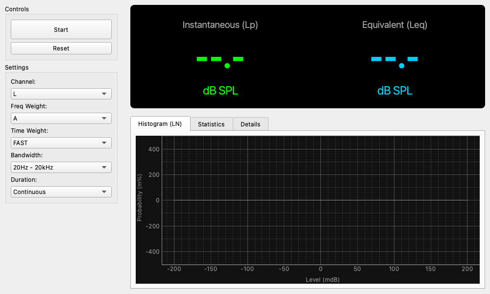

# Sound Level Meter

## Overview

The Sound Level Meter is a precision tool for measuring environmental noise and the sound pressure level (SPL) of audio equipment. It features weighting filters and time response characteristics compliant with common sound level meter standards (such as IEC 61672).

## Basic Operation

### Starting Measurement

* **Start Button**: Begins the measurement.
* **Reset Button**: Resets measurement values (such as Leq and Lmax) and recalculates from zero.

### Main Display

The large numbers displayed at the top of the screen.

* **Instantaneous (Lp)**: The current instantaneous sound pressure level.
* **Equivalent (Leq)**: Equivalent continuous sound level. Shows the "average" energy level from the start of measurement to the present. Often used for evaluating fluctuating noise.

### Detail Tabs

* **Histogram (LN)**: Displays the distribution of sound pressure levels in a bar graph.
* **Statistics**: Displays statistical indicators.
    * **L50**: Median value (level exceeded 50% of the time).
    * **L5 / L95**: Represent levels close to the noise peaks and background noise (ambient noise), respectively.
* **Details**: Displays detailed data such as Lmax (maximum value), Lmin (minimum value), Lpeak (peak value of the waveform), and LE (sound exposure level for single events).

## Settings

### Channel

Select the input channel (L or R) to be used for measurement.

### Freq Weight (Frequency Weighting)

Select filters to match human hearing characteristics.

* **A-Weighting**: Characteristics close to the sensitivity of the human ear. Most commonly used for general noise measurement (environmental sounds, noise regulation, etc.).
* **C-Weighting**: Characteristics that do not cut low frequencies as much as A-weighting. Used for measuring loud sounds or mechanical noise.
* **Z-Weighting**: No correction (flat) characteristics. Used for measuring physical sound pressure itself.

### Time Weight (Time Weighting)

Select the follow-up speed for level fluctuations.

* **FAST (125ms)**: For general-purpose measurement. Captures fluctuating sounds.
* **SLOW (1s)**: Suitable for observing the average level of slow fluctuations.
* **IMPULSE**: A special mode for measuring impact sounds (hitting sounds, etc.) (very fast rise, slow decay).
* **10ms**: Unique setting for capturing extremely fast fluctuations.

### Bandwidth

Limits the frequency bandwidth to be measured.

* **20Hz - 20kHz (Wide)**: Entire audible range.
* **20Hz - 12.5kHz** / **8kHz**: Used when matching specific sound level meter standards, etc.

### Duration

Sets the time to automatically end measurement (e.g., 1 minute, 10 minutes, etc.). Setting it to "Continuous" continues measurement until manually stopped.

## About Calibration

To display accurate "dB SPL" values, please calibrate the "SPL Offset" in the "Calibration" tab of the **Settings widget** beforehand. If not calibrated, the values displayed are relative to the digital full scale (dBFS).
