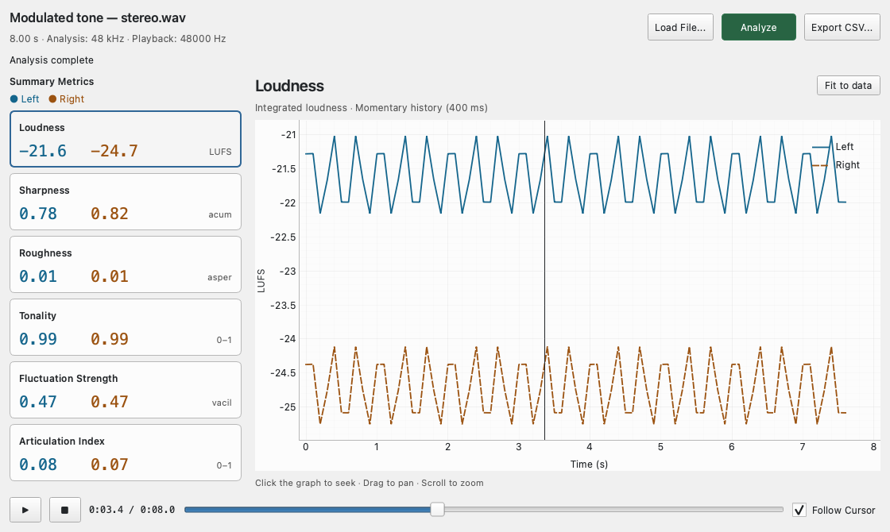

# Sound Quality Analyzer (Sound Quality Evaluation & Psychoacoustic Analysis)

## Overview

This tool is used to quantify how sound is perceived by the human ear ("subjective quantity"). Instead of simply measuring voltage or sound pressure, it uses metrics based on psychoacoustics to objectively evaluate the pleasantness or unpleasantness of a sound.

This tool is for **offline analysis only**. It analyzes pre-recorded audio files.

## Metric Descriptions

- **Integrated Loudness**: An average value of "sound volume" that takes into account the sensitivity characteristics of the human ear (BS.1770 K-weighting). The unit is `LUFS`.
- **Sharpness**: Represents the "sharpness" or "metallic" quality of a sound. Higher values indicate more high-frequency components (typically above 15.8 Bark). The unit is `acum`.
- **Roughness**: Represents the "graininess" or "roughness" of a sound. It evaluates unpleasant modulations (around 70 Hz, for example) that cause a sensation of "roughness." The unit is `asper`.
- **Tonality**: Represents the extent to which the sound contains "sine-wave-like components" (Spectral Flatness). Sounds like white noise have low tonality, while sounds like a whistle or a pure sine wave approach 1.0. The unit is `0-1` (normalized value).
- **Fluctuation Strength**: Similar to roughness, it represents the "modulation" or "fluctuation" of a sound, but for slower changes (typically below 20 Hz, peaking around 4 Hz). The unit is `vacil`.
- **Articulation Index (AI)**: A metric representing "speech intelligibility" in the presence of noise. It ranges from 0.0 to 1.0, where 1.0 means perfect intelligibility.

## Operation

1. Click **Load File** to select an audio file.
    - Supported formats: WAV, FLAC, AIFF
    - There is a file size limit of 500 million total samples (approx. 1 hour 26 mins for 48kHz Stereo).
2. Press the **Analyze** button to start the analysis.
    - Internally, the audio is resampled to 48kHz for analysis (to optimize psychoacoustic filters).
    - Long files may take some time to process.
3. Once the analysis is complete, the **Summary Metrics** will display the average values for each channel (Loudness, Sharpness, Roughness, Tonality, Fluctuation Strength, AI) in a table format.
4. Click the **Export CSV** button to save the analysis results (including average metrics and time-series data) as a CSV file.
5. The graphs below show how each of these metrics "changed over time." Use the tabs to switch between metrics.

### Playback and Verification

- **Playback Button (▶)**: Plays the analyzed audio file (follows the GUI audio engine settings).
- **Follow Cursor**: When checked, the yellow cursor on the graph moves in synchronization with the playback. You can listen to the sound at specific "high value (or discontinuous) locations."
- **Graph Interaction**: Click on the graph to move the playback cursor to that position.

## Use Cases

- **Analysis of Unpleasant Noise**: Quantifies "why" fan or motor noise is annoying using metrics like roughness and sharpness.
- **Sound Design Evaluation**: Verifies if product operation sounds or notification sounds match the intended image (e.g., gentle, sharp, powerful).
- **Detection of Abnormal Sounds**: Detects sudden changes in tonality (e.g., occurrence of a beep) within stationary noise.
