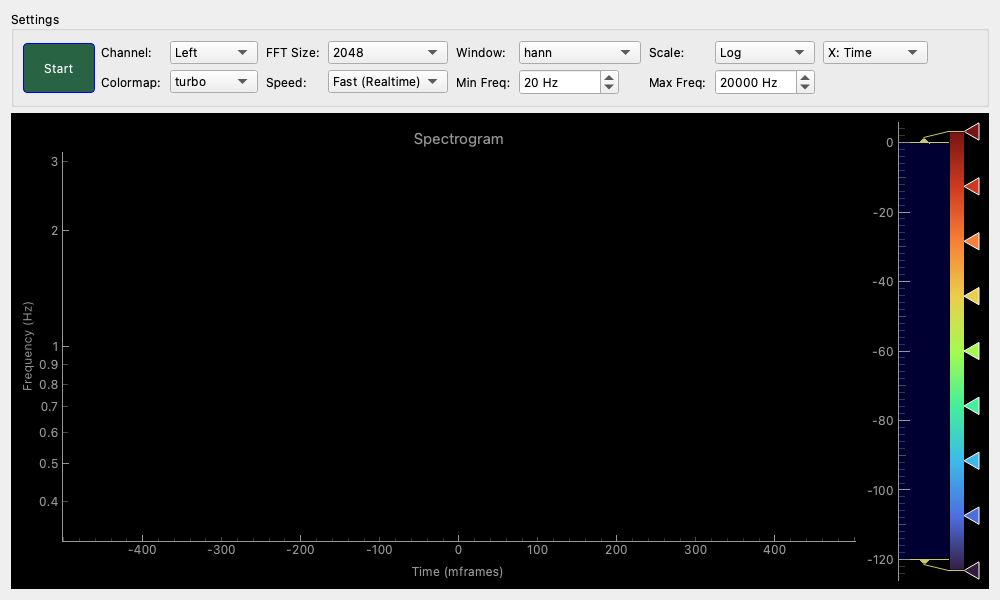

# Spectrogram

## Overview

A tool that displays sound components in three dimensions: "Time (horizontal axis)," "Frequency (vertical axis)," and "Strength (color)".
While a spectrum analyzer displays the "frequency distribution at the current moment," a spectrogram visualizes the ever-changing "audio signature (voiceprint)".
It is ideal for observing the "transitions" of sound, such as voice intonation analysis, time-based changes in instrument overtones, bird call analysis, and discovering intermittent noise.

## Compact Mode

When detached using the Detachable Wrapper, pressing the "Compact" button switches the widget to Compact Mode, maximizing only the heatmap display.

## ☕ Coffee Break: What is a "Voiceprint", the Fingerprint of Sound?

Different pronunciations, like "Ah" and "Ee", resonate at different frequency bands. When viewed on a spectrogram, this appears as specific "colored striped patterns (formants)", allowing you to visually confirm differences in voice quality.

## Operation

### Starting and Stopping Measurements

- **Start / Stop Button**: Toggles the measurement on and off.
    - When started, new data appears from the right edge of the graph, and old data flows to the left (waterfall display).

### Understanding the Graph

- **Horizontal Axis (Time)**: Represents the passage of time. The current time is at the right edge, and going left represents past sounds.
- **Vertical Axis (Frequency)**: Represents frequency (pitch). Higher up means higher frequency.
- **Color**: Represents the "strength" of the sound at that moment and frequency.
    - **Bright colors (yellow, red, etc.)**: Strong sounds
    - **Dark colors (blue, purple, black, etc.)**: Weak sounds or silence

### Understanding the Distribution Map (Color Bar) on the Right

This vertical bar on the right side of the graph is a **"correspondence table between color and volume (dB)"** and also acts as a controller to adjust the brightness of the display.

- **Meaning of Colors**: The top of the bar shows colors corresponding to strong sounds (near 0dB), and the bottom shows colors for weak sounds (near -120dB). Use it as a legend to understand "this color on the graph is roughly this volume."
- **Adjusting the Display Range (Contrast Adjustment)**:
    - **Drag the white handles (triangle marks)**: You can adjust the range of colors displayed.
    - **Changing the Overall Brightness**: Drag the entire bar up or down, or scroll with the mouse wheel.
    - **Changing the Contrast (Sharpness)**: Widen or narrow the width between the handles. Narrowing the width causes colors to change rapidly with small volume differences, making subtle changes easier to see.

## Settings

### Settings (Basic Settings)

- **Channel**
    - **Left / Right / Average**: Select the audio channel to analyze.

- **FFT Size (Frequency Resolution)**
    - Configures the granularity of the analysis.
    - **4096 / 8192 etc.**: Finer frequency resolution, but time-domain response becomes slightly blurred.
    - **512 / 1024 etc.**: Sharper time response (for rhythms, etc.), but frequency resolution becomes coarse.
    - `2048` is generally recommended for a good balance.
    - *Note: When a faster "Speed" is selected, the maximum available FFT size is automatically limited to maintain real-time performance.*

- **Window (Window Function)**
    - `hann` (standard) or `blackman` are suitable for noise analysis.

- **Scale**
    - Switches the display scale of the vertical axis (frequency).
    - **Linear**: Evenly spaced markings like a ruler. Suitable for observing high-frequency harmonics in detail.
    - **Log**: Logarithmic scale. Like a piano keyboard, the lower frequency range is displayed wider. Ideal when you want to see musical pitches.
    - **Mel**: Mel scale. A slightly magical scale where intervals that the human ear perceives as "twice as high" are evenly spaced. Often used for voice analysis.

- **Colormap**
    - Changes the color scheme of the graph.
    - **viridis / plasma / inferno / magma / cividis**: Scientifically common color schemes where changes in brightness are uniform and easy to see.
    - **turbo**: A colorful rainbow-like scheme suitable for distinguishing fine level differences.

- **Speed (Flow Rate)**
    - Adjusts the speed at which the graph scrolls.
    - **Fast (Realtime)**: Flows in real-time. Suitable for viewing short-term changes.
    - **Medium / Slow / Meteor**: Flows slowly. Used for monitoring environmental sounds or observing changes over a long period (displaying several to 10 minutes of history on one screen). Note that these slow modes use a "Max Hold" mechanism to capture transient peaks within the time interval.

- **Min Freq / Max Freq**
    - Narrows down the display range of the vertical axis (frequency).
    - For example, if you want to see low frequencies in detail, set Max Freq to `1000 Hz`.

## Usage Examples

### Visualizing "Voice" (Voice Analysis)

Try analyzing your own voice or speech.

1. Press the **Start** button.
2. Talk into the microphone saying "ah" or "ee".
3. You can see the positions of color bands (formants) change depending on the vowel.
4. If you whistle, a very clear single line (close to a pure tone) appears.

### Identifying the Source of Unusual Noises (Noise Identification)

Identify annoying sound components such as "whine" (high-frequency noise) or "hum" (low-frequency power line noise).

1. Set **FFT Size** to a large value (`4096` to `8192`).
2. Set **Speed** to about `Medium`.
3. Observe the screen while the noise is occurring.
4. **A line extending horizontally**: Constant noise such as a fan, motor, or power hum. You can identify the frequency by looking at the vertical axis.
5. **A line running vertically**: Impact sounds or click noise.
6. **Hazy fog**: Wind noise from air conditioning (white noise), etc.

### Checking High-Res Audio Sources (High-Res Audio Check)

Confirm whether the music file being played is truly high-res (containing components up to high frequencies) or if it has simply been upsampled.

1. Play music.
2. Expand **Max Freq** to `48000 Hz` (for 96kHz sampling), etc.
3. Look at the region above **20kHz (20000Hz)**.
4. If color is clearly present even above 20kHz, it contains high-res components. If it is cut off sharply at 20kHz and becomes pitch black, it is likely originally CD quality.
