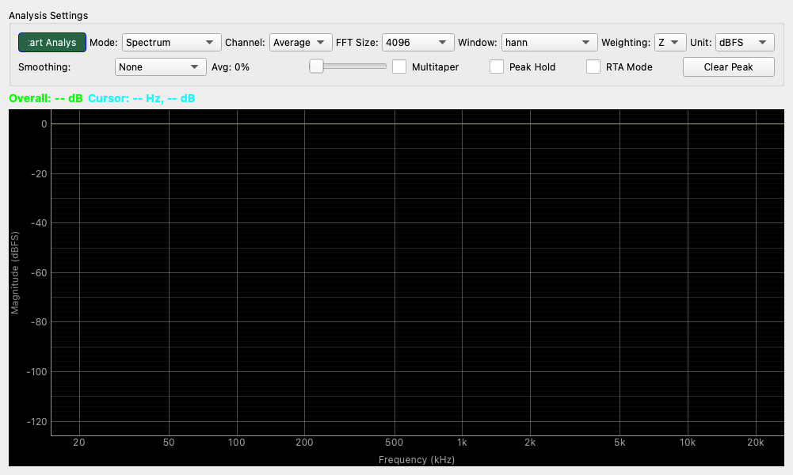

# Spectrum Analyzer

## Overview

This tool analyzes and displays the frequency components of audio signals in real-time.  
You can visually confirm the magnitude of each frequency band for sounds input via microphone or line-in.  
In addition to general FFT (Fast Fourier Transformation) analysis, it also features advanced measurement functions such as PSD (Power Spectral Density) display useful for noise analysis, and weighting (A-weighting/C-weighting) that takes hearing sensitivity into account.

## Operation

### Starting and Stopping Measurement

* **Start Analysis / Stop Analysis button**: Toggles the measurement start and stop.

### Reading the Graph

* **Horizontal Axis (Frequency)**: Represents frequency (the pitch of the sound). Moving to the right indicates higher pitch. It is displayed on a logarithmic (Log) scale.
* **Vertical Axis (Magnitude)**: Represents the size (strength) of the signal. Moving upwards indicates a stronger signal. The unit for the scale depends on the settings (Unit).
* **Cursor**: When you hover the mouse cursor over the graph, the exact frequency and level at that point are displayed in "Cursor: ..." at the top of the screen.
* **Overall**: Displays the total signal level (root mean square) across the entire frequency range.

## Settings

### Basic Settings (Analysis Settings)

* **Mode**
    * **Spectrum**: The most common mode. Displays the peak levels for each frequency. Suitable for measuring signal levels such as sine waves.
    * **PSD (Power Spectral Density)**: Displays the power spectral density. Use this when you want to evaluate the noise distribution uniformly. The unit is $/√Hz$.
    * **Cross Spectrum**: Displays the correlation components between the L and R channels (advanced setting).

* **Channel**
    * **Left / Right**: Displays only the specified channel.
    * **Average**: Displays the average of the left and right channels.
    * **Dual**: Displays both left and right channels simultaneously on the graph (Left=Green, Right=Red).

* **FFT Size (Frequency Resolution)**
    * Specifies the number of samples used for analysis.
    * **Higher numbers (e.g., 131072, 1M)**: Frequency resolution becomes finer, making it easier to distinguish fine peaks, but the response time becomes slower.
    * **Lower numbers (e.g., 1024, 4096)**: Response time is faster and moves briskly, but the frequency resolution becomes coarser.
    * Usually, a value between `4096` and `16384` is recommended for a good balance.

* **Window (Window Function)**
    * A process to suppress errors (spectral leakage) that occur during FFT analysis.
    * **hanning**: The most versatile and common window function. Choose this if you are unsure.
    * **rect (Rectangular)**: No window function is applied. Errors will be large for any signals other than transient signals or signals whose cycles match perfectly.
    * **Multitaper**: When the Multitaper feature (described below) is turned ON, a dedicated window function is automatically applied.

* **Weighting**
    * **Z**: No weighting (flat). Use this for measuring physical, accurate values.
    * **A**: **A-weighting**. A filter that matches the sensitivity characteristics of the human ear. Common for noise level measurements (low and very high frequencies are evaluated with lower sensitivity).
    * **C**: **C-weighting**. Closer to flat than A-weighting, but with very low and very high frequencies cut.

* **Unit**
    * **dBFS**: A relative value with 0 dB as the digital full scale. It is the level relative to the input limit of the audio interface.
    * **dBV**: Voltage level with 1 V as 0 dB (requires calibration settings).
    * **dB SPL**: Sound pressure level (requires calibration settings such as microphone sensitivity correction).

### Advanced Controls

* **Smoothing**
    * Smooths out the jaggedness of the graph to make it easier to read.
    * **1/3 Octave**, etc., are common display formats used in audio analysis.

* **Avg (Averaging)**
    * Specifies the strength of the averaging process in the time direction.
    * Moving the slider to the right makes the graph move more slowly, suppressing fluctuations in noise components for easier viewing.

* **Multitaper**
    * When turned ON, it uses multiple window functions to reduce the variance (scatter) of the spectrum estimation. This can result in smoother and more reliable results in noise analysis. When ON, the Window setting is disabled.

* **Peak Hold**
    * Continues to hold the maximum level from the past with a red dotted line.
    * Convenient for checking loud sounds that occur only momentarily.
    * **Clear Peak button**: Resets the held peak display.

## Usage Examples

Below are a few specific usage scenarios for the Spectrum Analyzer.

### Basic Input Check

Basic usage to confirm that the microphone is picking up sound correctly.

1. Press the **Start Analysis** button to begin measurement.
2. Select `Spectrum` for **Mode** and `Average` or `Left` for **Channel**.
3. Speak into the microphone or clap your hands.
4. If the graph reacts and changes shape, the input is functioning normally.
5. By turning ON **Peak Hold** and clapping, the frequency components of the momentary impact (the spectrum of the pulse sound) will remain as a red line, making it easier to observe.

### Noise Floor Measurement

Checks the noise level (noise floor) when there is no sound. This is useful for improving the S/N ratio or finding power supply noise.

1. Connect the input device (microphone or line input) and ensure no sound is being produced.
2. Change **Mode** to `PSD`. PSD is suitable for viewing the distribution of noise.
3. Increase the **Avg (Averaging)** slider to about `50%` to `90%`. The jumpiness of the waveform will subside, and the average noise line will become visible.
4. If there is a sharp peak at a specific frequency (e.g., 50 Hz or 60 Hz), there may be power supply hum noise mixed in.
5. Setting **Smoothing** to `1/3 Octave` makes it easier to grasp the overall noise trend (whether it's closer to white noise or pink noise, etc.).

### Speaker Frequency Response

By playing a test signal (such as pink noise) and picking up the speaker's output with a microphone, you can perform a simple check of the frequency response.

1. Prepare and play a **Pink Noise** source separately.
2. Place a measurement microphone in front of the speaker.
3. Set **Mode** to `Spectrum` and **FFT Size** to around `16384`.
4. Set **Avg** to a high value (`90%` or more).
5. Set **Weighting** to `Z` (flat).
6. As the graph approaches flatness, the speaker's characteristic is flat. If the low or high frequencies are drooping, that is the limit of the speaker's reproduction range.
    * *Note: This is not a rigorous measurement as it also picks up room reflections, but it is effective for knowing trends.*
