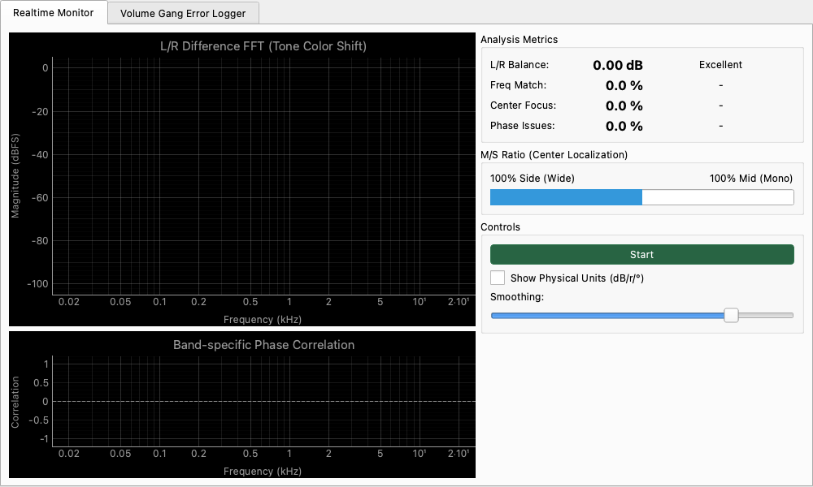

# Stereo Alignment Monitor

## Overview

A comprehensive tool for analyzing the alignment and consistency between L/R channels.  
It monitors L/R balance, frequency response match, center focus, and phase issues in real-time, providing both quantitative and visual evaluations. Extremely useful for verifying speaker setups and measuring channel imbalances in audio equipment.

## ☕ Coffee Break: What are "Phase" and "Alignment" in Stereo?

Let's imagine stereo speakers as a "carriage pulled by two horses."
If the right horse (R) and the left horse (L) pull with exactly the same strength, at the exact same timing, and in the exact same direction, the carriage will move straight and smoothly. This is a state where "alignment" is maintained.

* **Volume Balance Issues**: If only the right horse is stronger, the carriage will turn to the left. (The sound feels like it's pulling to the right).
* **Phase (Timing) Issues**: If the left horse starts running slightly later than the right horse, the carriage will shake and rattle. (The sound becomes blurry or unnatural).
* **Phase Inversion**: What if one horse starts running "backwards"? The carriage won't move forward, and their forces will cancel each other out! (A phenomenon where the sound becomes thin and seems to disappear).

The Stereo Alignment Monitor is like a coach monitoring whether "the two horses are breathing in perfect sync." You can check at a glance if your left and right speakers are cooperating perfectly!

## Operation

### Start and Stop Analysis

* **Start/Stop Button**: Toggles the analysis on and off.

### Parameter Settings

* **Show Physical Units (dB/r/°)**: When checked, displays detailed numerical values in physical units (dB, correlation coefficient r, degrees °, etc.) in addition to the analysis metrics (percentages and qualitative judgments like "Good/Poor"). This is useful when you need strict, exact data.
* **Smoothing**: Adjusts the amount of temporal smoothing applied to the plots and analysis metrics. Higher values result in slower, more stable readings, making it easier to evaluate consistent trends.

## Reading the Plots

### L/R Difference FFT (Tone Color Shift)

Displays the spectra of both L and R channels and highlights the "difference" between them.

* **Green line**: Left channel spectrum.
* **Yellow line**: Right channel spectrum.
* **Shaded area**: Indicates the level difference (tonal variance) between channels. When both channels match perfectly, the shaded area disappears.

### Band-specific Phase Correlation

Displays the phase correlation coefficient (-1.0 to 1.0) across the frequency range.

* **1.0**: Perfectly in-phase (monaural signal).
* **0**: Uncorrelated (fully independent channels).
* **-1.0**: Perfectly out-of-phase (phase inversion).
Allows you to visually identify which frequency bands are experiencing phase alignment issues.

## Analysis Metrics and Judgments

The panel on the right provides judgments based on four key metrics:

| Metric | Description | Judgment Thresholds |
| :--- | :--- | :--- |
| **L/R Balance** | Displays the difference in total energy between L and R in dB. | < ±0.5dB: Excellent / < ±3.0dB: Good |
| **Freq Match** | Displays the correlation of frequency responses between L and R as a percentage. | > 95%: Professional / > 80%: Good |
| **Center Focus** | Displays the "center localization (M/S ratio)" of the overall signal. | > 85%: Mono / > 50%: Wide |
| **Phase Issues** | Displays the percentage of energy with negative correlation (out-of-phase components). | < 1%: Safe / < 10%: Minor |

## M/S Ratio Bar

A visual bar representing the ratio between center localization (Mid) and spatial components (Side).

* **Towards 100% Mid (Mono)**: The signal is concentrated in the center.
* **Towards 100% Side (Wide)**: The signal is spread widely across the stereo field.
* **Around Center**: Indicates a natural stereo image.
