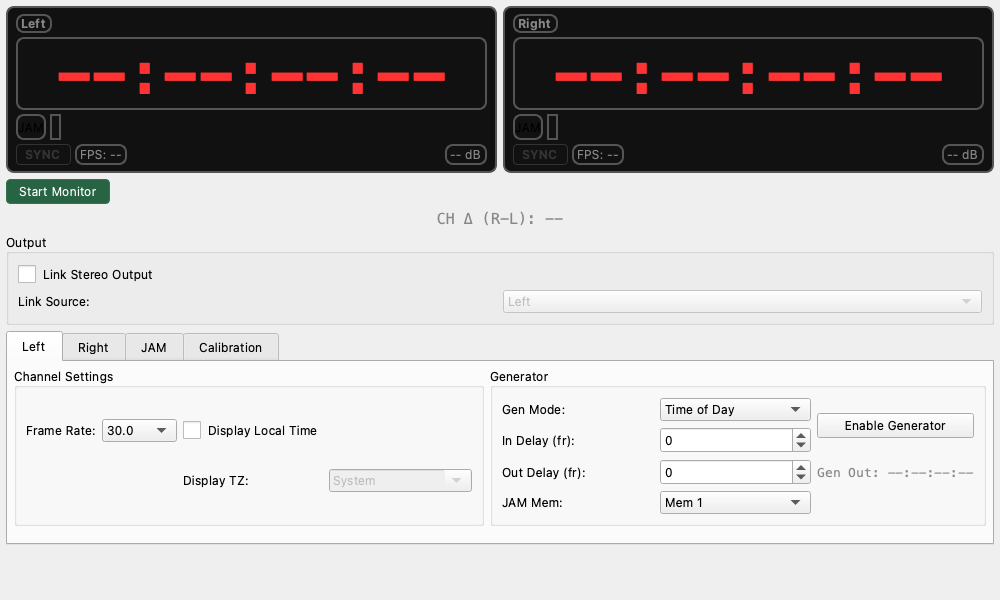

# Timecode Monitor

## 概要
オーディオ信号として記録されたタイムコード (LTC: Linear Timecode) を読み取り、表示するツールです。
映像と音声の同期確認や、タイムコードの生成（ジェネレーター）としても使用できます。

左右独立したチャンネル (L / R) でタイムコードを監視できるため、異なる機器間のタイムコードのズレを確認するのにも適しています。

## 操作方法

### 測定の開始と停止
* **Start Monitor / Stop Monitor ボタン**: タイムコードの監視（読み取り）を開始・停止します。

### 画面の見方

#### メイン表示 (Left / Right)
画面上部には、左右のチャンネルそれぞれのタイムコード情報が大きく表示されます。

* **Timecode (00:00:00:00)**:
    現在読み取っているタイムコードの時間です（時:分:秒:フレーム）。
* **SYNC ランプ**:
    タイムコード信号を正しくロック（同期）できている時に緑色に点灯します。信号が途切れたりノイズが多いと消灯します。
* **FPS**:
    入力信号から推定されたフレームレートです。
* **dB (Level)**:
    入力信号の音量レベルです。タイムコード信号は通常、高めのレベル (-10dB 〜 -20dB程度) で入力されるのが理想的です。
* **JAM ボタン**:
    現在の入力タイムコードを「ジャム（同期コピー）」します。
    これを押すと、その瞬間のタイムコード値を内部メモリに保存し、即座にジェネレーター（出力）をその値に同期させて走り出させることができます（「JAM機能」参照）。

#### チャンネル間ズレ表示 (CH Δ)
* **CH Δ (R-L)**:
    右チャンネルと左チャンネルのタイムコードのズレを表示します。
    * 完全に同期していれば `0 fr (0.0 ms)` と表示されます。
    * マルチカメラ収録などで、カメラ間のタイムコードがズレていないか確認するのに便利です。

## Settings (設定項目)

各チャンネルのタブ (Left / Right) 内で詳細な設定が可能です。

### Channel Settings
* **Frame Rate**:
    タイムコードのフレームレートを手動で設定します（例: `24.00`, `29.97`, `30.00` など）。
    * 通常は自動検出されますが、正しくロックしない場合は手動で設定してください。

* **Display Local Time**:
    タイムコード（時:分:秒）を現在時刻として解釈し、指定したタイムゾーンの時間に変換して表示します。
    * **Display TZ**: 変換先のタイムゾーンを選びます（日本時間なら `Asia/Tokyo`）。
    * 例：タイムコードが「UTC時間」で記録されている場合に、それを「日本時間」に直して表示したい時に使います。

### Generator (ジェネレーター機能)
MeasureLabからタイムコード信号を出力する機能です。このタブで設定を行い、`Enable Generator` を押すと音声出力からタイムコード音が流れます。

* **Gen Mode (生成モード)**:
    * **Time of Day (TOD)**: コンピュータの現在時刻をそのままタイムコードとして出力します。
    * **Free Run**: `00:00:00:00` または指定した時間からカウントアップを開始します。
    * **JAM**: JAMボタンで取り込んだ外部タイムコードに同期して出力します。

* **Link Stereo Output**:
    メイン画面の中央にあるチェックボックスです。
    これを有効にすると、片方のチャンネル（Source）のジェネレーター設定が、もう片方にもコピーされ、左右から全く同じタイムコードが出力されます。

## 使用例 (Usage Examples)

### タイムコードの確認
カメラやレコーダーから出力されたLTC信号をオーディオインターフェースに入力し、正しくタイムコードが記録されているか、時間は合っているかを確認します。

### マルチカメラの同期チェック
2台のカメラのタイムコード出力を、それぞれLチャンネルとRチャンネルに入力します。
**CH Δ (R-L)** の表示を見ることで、2台のカメラがフレーム単位でピタリと合っているか（同期しているか）を一目で確認できます。

### スレート（カチンコ）代わりのタイムコード再生
動画撮影時に、このツールを「Time of Day」モードでジェネレータとして動かし、その音声をカメラの音声入力に送ることで、編集時に映像と音声を自動同期させやすくする「オーディオタイムコード」として利用できます。
