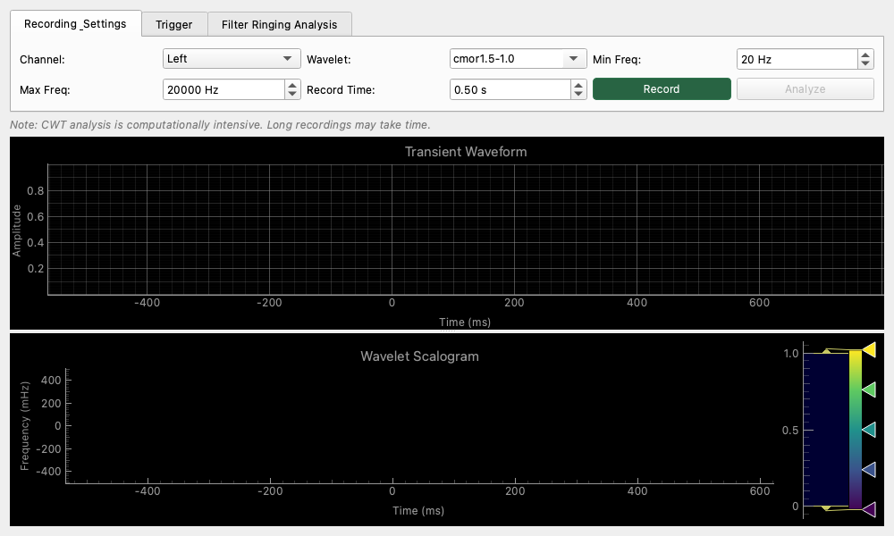

# Transient Analyzer (過渡再応答・ウェーブレット分析)

## 概要
一瞬の衝撃音や、時々刻々と周波数が変化する「過渡的な音」を詳しく分析するためのツールです。
通常の FFT 分析では捉えきれない「いつ、どの高さの音が鳴ったか」という時間的な解像度を維持したまま、**ウェーブレット変換 (CWT)** を用いて可視化します。

## 操作方法

### 録音 (Recording)
*   **Record**: ボタンを押すと録音が始まります。設定した **Record Time** 分のデータを取得すると自動で停止します。
*   **Trigger**: オシロスコープのように、一定以上の音量（Level）が入ってきた瞬間に録音を開始することができます。

### 解析 (Analyze)
*   録音完了後、**Analyze** ボタンを押すとウェーブレット変換を実行します。
    *   **注意**: この処理は計算負荷が高いため、結果が出るまで数秒かかる場合があります。

### 表の見方
*   **Transient Waveform (上側)**: 録音した音の波形（時間軸）です。
*   **Wavelet Scalogram (下側)**: 
    *   **横軸**: 時間
    *   **縦軸**: 周波数（対数表示）
    *   **色**: その瞬間の強さ。
    *   スペクトログラムに似ていますが、低い音は時間方向にゆったり、高い音は時間方向に鋭く解析されるため、一瞬のクリック音（時間情報）と低い唸り（周波数情報）を同時にバランスよく表示できます。

## 設定項目
*   **Wavelet**: 解析に使う波形（母関数）の種類を選びます。通常は `cmor` (Complex Morlet) が適しています。
*   **Min / Max Freq**: 解析する周波数の範囲を指定します。

## 使用例
*   **衝撃音の分析**: スピーカーにパルスを入力した際の応答（インパルス応答）や、何かがぶつかった時の音の成分変化を調べます。
*   **楽器の立ち上がり評価**: 音が鳴り始めた瞬間の倍音の付き方を詳細に観察します。
