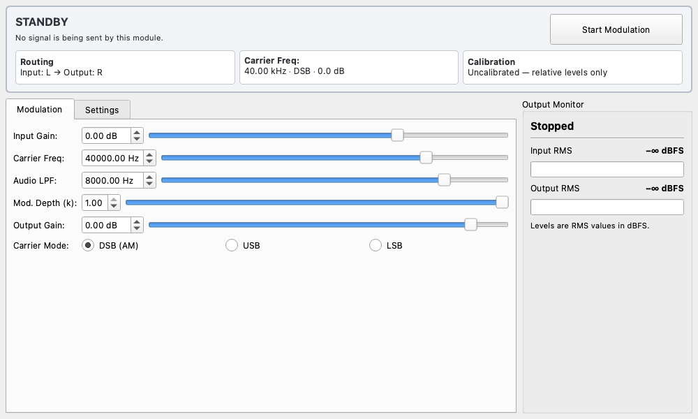

# Ultrasound Modulator (超音波モジュレーター)

## 概要

Ultrasound Modulator（超音波モジュレーター）は、可聴域のオーディオ信号を振幅変調（AM）し、超音波リファレンススピーカー（40kHz中心）などで再生可能な信号に変換するためのウィジェットです。

パラメトリックスピーカーの実験や、超音波帯域での音響計測に使用されます。

主な特徴：

* **リアルタイムAM変調**: 入力信号を用いて搬送波（デフォルト40kHz）を振幅変調します。
* **安全機能**: 出力ゲインに応じた安全ステータスを表示し、危険なレベルに達した場合に警告します。
* **柔軟なルーティング**: 入出力チャンネル（L/R/Stereo）を自由に選択可能です。
* **プレディストーション**: 変調による歪みを低減するための平方根処理をサポートしています。

## 基本操作

### 変調の開始と停止

画面下部の **「Start Modulation」** ボタンをクリックすると変調処理が開始されます。

> [!WARNING]
> 超音波は可聴域外ですが、高出力で再生すると聴覚やペットに影響を与える可能性があります。必ず低いゲインから開始し、適切な保護具を使用してください。開始時に安全確認のダイアログが表示されます。

### パラメータ設定

**「Modulation」** タブで信号処理のパラメータを設定します。

* **Input Gain**: 入力信号のゲインを調整します。入力レベルメーターを見ながら、クリップしない範囲で適切なレベルに設定してください。
* **Carrier Freq**: 搬送波の周波数です。通常は使用する超音波トランスデューサの共振周波数（例: 40000Hz）に合わせます。
* **Audio LPF**: 変調前のオーディオ信号に適用するローパスフィルタのカットオフ周波数です。側波帯が帯域制限を超えないように調整します。
* **Mod. Depth (k)**: 変調度（0.0 〜 1.0）。1.0で100%変調となります。
* **Output Gain**: 変調後の出力ゲインです。**安全のため、慎重に操作してください。**
* **Carrier Mode**: 変調方式を選択します。
    * **DSB (AM)**: 通常の振幅変調（両側波帯）です。
    * **USB**: 上側波帯（Upper Sideband）のみを変調します。
    * **LSB**: 下側波帯（Lower Sideband）のみを変調します。

### ルーティングと設定

**「Settings」** タブで入出力の設定を行います。

#### Input/Output Channel

入力ソースと出力先を選択します。

* **L / R**: モノラルとして処理します。
* **Stereo**: ステレオ信号として処理します（キャリアは左右同位相です）。

#### Advanced Options

* **Enable √ Pre-distortion**: 振幅変調の復調時に生じる歪みを補正するため、信号にあらかじめ平方根処理（$\sqrt{1+km(t)}$）を適用します。パラメトリックスピーカー等で、自己復調時の歪みを低減したい場合に有効です。

* **Bypass Modulation**: 変調を行わず、入力信号をそのまま出力します（ゲインは適用されます）。設定確認やスルー出力に使用します。

## シグナルメーター

画面下部に、入力レベル（Input Level）と出力レベル（Output Level）が表示されます。信号が適切に入力されているか、出力がサチュレーションしていないかを確認できます。

* **Input Level**: 変調前のオーディオ信号レベル。
* **Output Level**: 変調後の超音波信号レベル。
