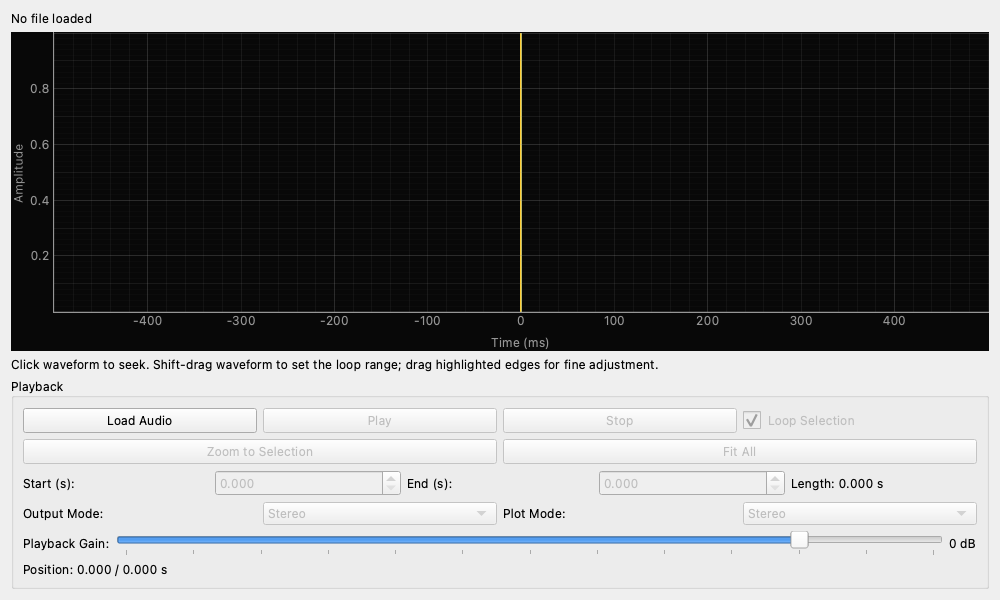

# Waveform Loop Player (波形ループプレイヤー)

## 概要

オーディオファイルを読み込み、波形を確認しながら任意の区間を選択してループ再生できるツールです。
特定の音声信号や過渡的な波形を繰り返し再生し、オシロスコープやスペクトラムアナライザなどで詳細に観測したい場合に便利です。

## 操作方法

### 波形表示・選択領域 (Waveform & Region)

波形がグラフ上に表示されます。
マウス操作で再生位置の変更やループ区間の設定が可能です。

* **シーク操作**: 波形上の任意の場所をクリックすると、その位置へ再生カーソル（黄色の縦線）が移動します。
* **ループ区間の設定**: 波形上のハイライトされた領域（青帯）の左右の端をドラッグすることで、ループ再生する区間を直感的に設定できます。

### Playback (再生コントロール)

* **Load Audio**: オーディオファイル（WAV, MP3, FLAC, OGGなど）を開きます。エンジンとサンプリングレートが異なる場合はリサンプリングが提案されます。
* **Play / Pause**: 再生を開始・一時停止します。
* **Stop**: 再生を停止し、カーソル位置をループ区間の先頭に戻します。
* **Loop Selection**: チェックを入れると、選択した区間を繰り返し再生します。チェックを外すと、区間の終端で再生が停止します。
* **Zoom to Selection**: 波形表示を、現在選択しているループ区間にズームインして全画面表示します。
* **Fit All**: 波形表示のズームをリセットし、ファイル全体を表示します。

### 設定項目

* **Start (s) / End (s)**: ループ区間の開始位置と終了位置を秒単位で直接数値入力します。波形上のドラッグ操作と連動します。
* **Output Mode (出力モード)**:
    * **Stereo**: ファイルのL/Rをそのまま出力します。
    * **Left**: 左チャンネルのみ出力します。
    * **Right**: 右チャンネルのみ出力します。
    * **Mono**: ファイルがステレオの場合、左右をミックスしてモノラル出力します。
* **Playback Gain**: 再生音量をデジタル処理で調整します（-60dB 〜 +12dB）。

## 使用例

### 過渡応答の繰り返し観測

アタックの強いキックドラムのような単発の打撃音を含むオーディオファイルを読み込み、その打撃音の直前・直後のみを選択してループ再生します。
これにより、他の測定器ウィジェットでトリガーをかけながら、過渡応答（トランジェント）の様子を繰り返し安定して観測できます。

### 特定フレーズの解析

楽曲内の特定の部分（例えば、特定のコードが鳴っている瞬間やノイズが混入している箇所）だけを範囲選択し、スペクトラムアナライザなどを併用して周波数成分を詳細に分析します。
