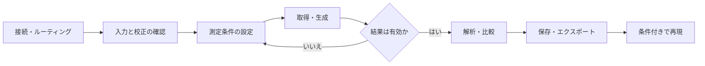

# MeasureLab GUI Design Guideline v2.1

> [!IMPORTANT]
> 本文書は、MeasureLab の GUI を新規実装、改修、レビューする際の規範文書である。
> 一般的なデスクトップアプリの作法よりも、測定の完全性、安全性、再現性を優先する。

| 項目 | 内容 |
| --- | --- |
| 文書名 | MeasureLab GUI Design Guideline v2.1 |
| ステータス | Normative |
| 適用対象 | MeasureLab のメインウィンドウ、測定ウィジェット、共通 UI、プロット、ダイアログ |
| 基準日 | 2026-08-27 |
| 主な入力資料 | [MeasureLab DeepWiki](../.github/deepwiki/README.md) と [`guide/` の調査資料](#参考資料) |

## 1. このガイドラインの使い方

### 1.1 目的

MeasureLab は、汎用オーディオインターフェースを用いて、信号生成、リアルタイム解析、スイープ測定、精密計数、音響評価、比較、エクスポートを行う高機能デスクトップ計測環境である。GUI は単なる操作面ではなく、ユーザーが測定値を信頼できるか、現在の出力が安全か、取得結果を再現できるかを判断するための一部である。

本ガイドラインの目的は次のとおりである。

- 測定値の誤読と、無効な結果の正常値らしい表示を防ぐ。
- 実際のハードウェア・DSP 状態と GUI 表示を一致させる。
- 初めて使うユーザーの安全な開始点と、熟練者の高速・精密な操作を両立する。
- 多数のモジュールに一貫性を持たせつつ、用途に合わない共通機能を強制しない。
- 多言語、複数テーマ、複数 OS、低解像度環境でも破綻しない UI を作る。
- 視覚要件を自動テスト可能な受け入れ条件へ変換する。

本書は DSP アルゴリズムの正しさや個別規格への適合を単独で保証するものではない。個別測定の数式、規格、許容差は、そのモジュールの仕様とテストで別途定義する。

### 1.2 規範レベル

本文では次の語を用いる。

| 表記 | 意味 |
| --- | --- |
| **必須** | 原則として例外を認めない。例外には理由、リスク評価、代替策、テストが必要 |
| **推奨** | 通常は採用する。採用しない場合は PR で判断理由を説明 |
| **任意** | タスク、ユーザー、モジュール特性に合う場合に採用 |
| **禁止** | 測定の完全性、安全性、一貫性を損なうため採用しない |

既存 UI との互換性より本書の必須要件が優先される。ただし、安全な移行が必要な場合は段階的な改修を認める。コード上の能力宣言、リポジトリの `AGENTS.md`、個別測定仕様が本書より厳しい場合は、厳しい方を適用する。

### 1.3 判断の優先順位

設計判断が競合した場合は、次の順序で優先する。

1. 人、DUT、オーディオ機器を危険な出力から守る。
2. 無効、不確実、飽和、欠落したデータを誤って信頼させない。
3. 取得条件、校正、単位、データの来歴を保つ。
4. 実際のシステム状態を予測可能に示す。
5. 現在の測定目的へ集中できる情報構造にする。
6. 頻出操作を速く、精密に、繰り返し実行できるようにする。
7. アクセシビリティ、長時間利用、多言語、複数環境へ対応する。
8. 視覚的一貫性、カスタマイズ性、装飾性を整える。

見栄えや省スペース化を理由に、上位の要件を犠牲にしてはならない。

### 1.4 設計判断の基本手順

新しい表示やコントロールを追加する前に、次を順に確認する。

1. ユーザーはこの画面で何を判断し、何を操作するのか。
2. 見落とすと危険、誤測定、結果無効化につながる状態は何か。
3. その状態の正本は GUI、モデル、ワーカー、AudioEngine のどこか。
4. 同時に見る必要がある情報と、必要時に参照できればよい情報は何か。
5. 取得結果と一緒に保存すべき条件は何か。
6. 失敗、キャンセル、停止、タブ移動、ウィンドウ分離時に状態はどうなるか。
7. その状態を新たに検出する必要が本当にあるか。既存の共通状態、ユーザーが確認できる表示、測定固有の演算で代替できないか。
8. 検出を追加する場合、どの層で一度だけ行い、リアルタイム処理へどれだけの負荷を加えるか。
9. その挙動をどの自動テストと性能測定で固定するか。

「空いている場所へ情報を置く」「他のモジュールにもあるから追加する」は、単独では設計理由にならない。

### 1.5 理想的な測定器と実装要件の境界

本書は理想的な測定器が備える完全性、安全性、再現性を示すが、列挙した状態や保護機能をすべての測定モジュールへ個別実装するよう要求するものではない。状態を表示する要件と、その状態を新たなリアルタイム処理で検出する要件を分けて判断する。

- **必須:** 新しい監視、品質判定、自動停止を実装する前に、見逃した場合の影響、ユーザーが取れる行動、既存の検出経路、実行頻度、CPU・メモリ負荷を確認する。
- **禁止:** 本書に例示されているという理由だけで、クリップ監視、入力状態判定、I/O 異常判定などの同種処理を各モジュールへ重複実装する。
- **禁止:** 測定値や表示の改善より先に、ハードウェア測定器を模したインターロックや安全機構を、具体的な危険と受け入れ条件なしに追加する。
- **推奨:** 複数機能に必要な状態は AudioEngine など最も狭い共通レイヤーで一度だけ取得し、モジュールは軽量な snapshot または event を参照する。
- **推奨:** クリップにより値が不正確になっても機器破損や不可逆な操作につながらず、波形や値からユーザーが原因を判断できる場合は、説明、可視化、手動確認を自動判定より優先候補とする。

共通化にもコストがある。現在の利用者がなく、将来必要になりそうだという理由だけで AudioEngine の常時監視を増やしてはならない。共通監視は、複数の実利用先、明確な結果への影響、許容できる性能予算が確認できた時点で導入する。

## 2. MeasureLab の製品・利用モデル

### 2.1 アーキテクチャを前提に設計する

MeasureLab は、中央のコアと独立した測定モジュールから成る。

| 層 | 主な責務 | GUI 設計への意味 |
| --- | --- | --- |
| AudioEngine | 入出力、ルーティング、コールバック、ミキシング、I/O 状態 | モジュールは要求状態ではなく実際の動作状態を表示する |
| ConfigManager / Session | アプリ設定とセッション状態 | 一時表示、ユーザー設定、測定条件を混同しない |
| CalibrationManager | dBFS と物理単位の対応、校正プロファイル | 絶対単位の可否と適用校正を明示する |
| MainWindow | サイドバー、アクティブモジュール、グローバル状態 | 全モジュールに関係する状態だけを共通領域へ置く |
| Measurement Module | 個別の測定・生成・解析 | タスク固有の状態と操作はモジュール内で完結させる |
| Detachable Wrapper | 分離、分割、撮影、ログ、比較送信 | 共通機能を再実装せず、能力宣言へ従う |
| Comparison / Export | 測定スナップショットの比較と保存 | データと軸、単位、校正、取得条件を一体で渡す |

メインウィンドウはサイドバーと単一のアクティブコンテンツを基本とし、必要なモジュールだけを独立ウィンドウへ分離できる。すべてのモジュールを一画面へ同時表示するダッシュボードを前提にしてはならない。

### 2.2 主な利用コンテキスト

初心者／熟練者という一軸だけで UI を分けず、次の作業コンテキストを考える。

| コンテキスト | ユーザーの目的 | UI の重点 |
| --- | --- | --- |
| 対話的探索 | 信号を見ながら条件を調整し、原因を探る | 即時反映、直接操作、ライブ表示 |
| 定型測定 | 既知の手順でスイープや取得を再実行する | 事前確認、進捗、キャンセル、再現性 |
| 長時間監視 | レベル、周波数、イベント、安定度を監視する | 大きな読み出し、警告履歴、通知疲れの防止 |
| 比較・レビュー | 複数の取得結果を重ね、差分を調べる | 不変スナップショット、軸整合、来歴 |
| オフライン処理 | ファイルやモデルを変換・解析する | 入力、処理条件、進捗、出力先、失敗回復 |

簡易表示は機能を隠すだけの「初心者モード」にしない。基本操作と重要状態を最初から理解できる形にし、詳細設定を段階的に開示する。熟練者には直接入力、キーボード、プリセット、再利用可能な設定を提供する。

### 2.3 標準測定フロー

GUI は次の流れを中断させず、各段階の完了と失敗を判断できるようにする。



自動化はこの流れを隠すものではない。自動スケール、ウィザード、プリセット、手順実行は、安全な初期値と明確な結果を提供し、ユーザーが必要なら手動で確認・修正できるようにする。

## 3. 計測器の伝統をソフトウェアへ翻訳する

物理計測器の外観を模倣するのではなく、長年維持されてきた認知上の利点を継承する。

| 物理計測器の作法 | MeasureLab で継承する原則 | そのまま模倣しないもの |
| --- | --- | --- |
| 1 機能 1 ノブ | 頻出パラメータへ直接到達できる専用コントロール | 装飾的な疑似ノブの乱用 |
| Graticule と 1-2-5 刻み | 読みやすい主目盛と予測可能な数値ステップ | 固定された 10×8 分割 |
| Run / Stop / Single | 取得状態と表示保持を明確に区別 | 一つのボタンへ異なる意味を詰め込むこと |
| Auto Set | 未知信号に対する安全な開始点 | ユーザーの設定を説明なく変更すること |
| Marker / Cursor | データ上の直接操作と差分読み出し | マウスでしか操作できない細いターゲット |
| Memory Trace | 取得条件付きの不変スナップショット | ライブデータと同じ見た目の参照線 |
| Preset / Save / Recall | 安全な初期化と再現可能な状態保存 | 各ウィジェットへの重複した保存 UI |
| Softkey | 文脈に合う近接操作 | 深い階層と現在位置の不明なメニュー |

PC GUI では触覚フィードバックが失われる。その代替として、直接入力、ホイールやキーによる段階調整、押下状態、フォーカス、即時の数値更新、操作対象の強調を組み合わせる。

## 4. 非交渉の設計原則

### 4.1 測定の完全性を最優先する

- **必須:** 信頼できない値を正常値と同じ外観で表示しない。
- **必須:** クリッピング、I/O バッファエラー、処理失敗、校正不成立、条件不整合を検出または受領できる場合は、その影響を受ける結果と関連付ける。
- **必須:** 警告を出した後も同じ無効値を主要結果として更新し続けない。値を隠す、無効表示にする、または明確に暫定値と示す。
- **禁止:** 例外時に `0`、前回値、`NaN` の文字列を、説明なく測定結果として表示する。

この節は、各モジュールへ独立した検出器を追加する根拠ではない。値の有効性を左右する状態が既存レイヤーから提供されない場合は、1.5 節の導入判断を先に行う。

### 4.2 GUI は実状態を表示する

- **必須:** Start ボタン、出力中表示、進捗、アクティビティ表示は、要求を送った事実ではなく実際の状態を表す。
- **必須:** 開始失敗、ワーカー例外、ストリーム停止時は、GUI を成功状態へ残さない。
- **必須:** 状態の正本を一か所に定め、複数のウィジェットが独自に推測しない。
- **推奨:** 状態変更はモデルからの signal/event を通じて UI へ反映する。

### 4.3 結果を主役にする

「結果が主役」とは、常に中央へ大きなグラフを置くことではない。現在の目的に最も適した波形、スペクトル、数値、表、画像、進捗を最も明瞭に示すことである。

- 数値計器では主要値を大きくする。
- 比較作業ではプロットとトレース識別を優先する。
- 手順実行では現在段階、残り、部分結果、失敗箇所を優先する。
- 設定を変更して結果を観察する作業では、設定と結果の視線距離を短くする。

### 4.4 必要な情報だけを常時見せる

常時表示するのは、見落とすと安全性、現在の操作、結果の有効性を誤判断する情報である。サンプリングレート、FFT サイズ、窓関数、平均化方式などは重要だが、すべてを全画面へ重複表示する必要はない。対応するコントロール、軸、設定タブ、取得メタデータから確認できればよい場合がある。

### 4.5 操作と結果の因果を保つ

- **必須:** 設定変更がどのデータへ適用されたか分かるようにする。
- **必須:** 変更が次回取得から有効になる場合は、その境界を明示する。
- **推奨:** ライブ調整は同じ視野内の結果へ速やかに反映する。
- **禁止:** バックグラウンドで条件を変更し、既存結果の意味を黙って変える。

### 4.6 データと条件を分離しない

画面表示を再現性の唯一の根拠にしない。確定したデータ、参照トレース、比較データ、エクスポートには、解釈に必要な取得条件と校正状態を関連付ける。

### 4.7 一貫性は共通契約で作る

各モジュールに同じボタンを手作業で追加するのではなく、共通ラッパー、能力宣言、共有コントロール、テーマ、翻訳基盤を用いる。一方、コンパクト、2 窓分割、比較送信は、用途に合うモジュールだけが明示的に宣言する。

### 4.8 完了条件を検証可能にする

「見やすい」「直感的」「十分速い」をそのまま受け入れ条件にしない。状態遷移、表示条件、サイズ上限、警告ラッチ、単位選択、フォーカス順、保存メタデータなど、観測可能な条件へ分解する。

### 4.9 測定性能を機能要件として守る

- **必須:** 状態監視を含む補助処理によって、取得、生成、解析の期限を損なわない。
- **必須:** AudioEngine callback 内へ走査、集計、割り当て、ロックを追加する場合、既存演算との重複を確認し、対象ブロックサイズ・サンプルレート・低性能環境でコストを測る。
- **禁止:** 複数のアクティブモジュールが同じ入力ブロックを個別に走査し、同じクリップ状態や I/O 状態を求める構成を標準パターンにする。
- **推奨:** 補助監視より、測定本体と表示の安定性を優先する。監視を省略・間引きできる場合は、その結果の意味とユーザーへの伝え方を定義する。

## 5. 情報構造とレイアウト

### 5.1 状態を置く場所

状態は影響範囲に応じて配置する。

| 状態の種類 | 配置 | 例 |
| --- | --- | --- |
| アプリ全体 | MainWindow の共通領域 | AudioEngine 状態、共通取得した I/O バッファエラー、グローバル出力先 |
| モジュール全体で持続 | タブに隠れないモジュール領域 | 出力中、取得中、共通または測定固有の根拠がある品質状態、手順失敗 |
| 特定タブ・表示だけ | 対応するタブまたはプロット近傍 | 窓関数、表示レンジ、カーソル値 |
| 取得後に必要 | データのメタデータと詳細表示 | サンプルレート、校正値、取得時刻、解析条件 |
| 診断用 | ログとエラー詳細 | 例外、バックエンドの詳細、スタック情報 |

コントロールの値、押下状態、有効／無効、軸ラベル、単位が状態を一意に示すなら、説明用ラベルを重複させない。反対に、ボタンだけでは「押すと開始」なのか「現在実行中」なのか曖昧な場合は、状態ラベルや表示切替を追加する。

### 5.2 モジュールの基本構造

モジュールは原則として次の順序で構成する。

1. 共通ヘッダー: タイトルと能力宣言に基づく共通操作。
2. 重要状態: 安全性と結果有効性に関わる、見失ってはならない情報。
3. 主表示: 波形、プロット、数値、表、処理状況。
4. 基本操作: 測定中に繰り返し使う設定と Start / Stop。
5. 詳細設定: 目的別タブ、折りたたみ領域、浅いドロワー。
6. 補助情報: 説明、ログへの導線、低頻度の診断値。

これは固定された上下配置を意味しない。主表示と基本操作を横並びにした方が視線移動を減らせる場合は横並びにする。見出し、枠線、`QGroupBox` は、情報のまとまりを新たに伝える場合だけ使用する。

### 5.3 タブとプログレッシブ・ディスクロージャ

- **推奨:** 一つのタブは一つの明確な作業目的に対応させる。
- **推奨:** タブ名だけで中身と役割を予測できるようにする。
- **必須:** タブを離れても継続する取得、出力、警告は隠さない。
- **禁止:** 同じ目的の操作と結果を細かなタブへ分断する。
- **禁止:** 深いタブの入れ子、ダイアログの多重スタック、戻り先が不明な遷移。
- **推奨:** 詳細を隠した状態でも、現在値とその存在を把握できる要約を残す。

モーダルダイアログは、処理を続けるために必ず回答が必要な場合、不可逆または危険な操作の確認、ファイル選択などに限定する。測定結果を見ながら調整する設定は、原則としてモードレスまたはインラインにする。

### 5.4 サイズと伸縮

リポジトリの UI サイズ上限を必須要件とする。

| 対象 | `minimumSizeHint` の上限 |
| --- | --- |
| MainWindow | 1400×740 px |
| 各モジュールコンテンツ | 1180×690 px |

- **必須:** Qt の各プラットフォーム既定フォントで、全言語を検証する。
- **必須:** 固定幅へ依存せず、長い翻訳、テーマ、無効状態、DPI 差を考慮する。
- **必須:** 選択中タブの基本操作と重要状態を上限内で操作できるようにする。
- **禁止:** サイズチェックを通すためだけにウィンドウを固定し、主要 UI を外側スクロールへ押し込む。
- **推奨:** `QScrollArea` は小画面の安全策、長いリスト、低頻度の詳細に用いる。標準サイズでは主要タスクをスクロールなしで完了できるようにする。
- **推奨:** 横幅がある場合は関連項目を横に組み、狭い場合は意味のある単位で折り返す。単純な全体縮小は行わない。

レイアウト変更時は `scripts/check_ui_size_limits.py --quick` で短い確認を行い、完了前に引数なしで全言語を検証する。

### 5.5 ウィンドウ分離、分割、コンパクト

共通ラッパーの状態を次のように扱う。

| 状態 | 意味 |
| --- | --- |
| State A | メインウィンドウ内の通常表示 |
| State B | ウィジェット全体を独立ウィンドウへ分離 |
| State C | 表示部と操作部を二つの独立ウィンドウへ分割 |

- State B は共通ラッパーが提供し、モジュール側で再実装しない。
- State C は、表示と操作を分けても状態所有、寿命、フォーカス、安全操作が破綻しない場合だけ宣言する。
- コンパクト表示は「何を監視する表示か」を一文で定義でき、重要状態を残せる場合だけ宣言する。
- 比較送信は、現在の比較基盤が扱える 1D / XY トレースと必要メタデータを提供できる場合だけ宣言する。
- プロットが存在するという理由だけで、分割、コンパクト、比較送信を必須にしない。
- 再接続時は通常表示へ安全に戻し、分離中の表示状態がメイン UI を不正な状態へ残さないようにする。

能力の正本は `src/gui/module_registry.py` の宣言とし、`hasattr()` による暗黙の機能判定を追加しない。

## 6. 状態、フィードバック、安全性

### 6.1 状態モデル

全モジュールへ同じ状態名を強制しないが、次の意味を区別する。

| 意味 | GUI が答えるべき質問 |
| --- | --- |
| Unavailable | なぜ開始できないか。何を直せばよいか |
| Ready / Idle | 入出力は停止中か。開始条件は整っているか |
| Starting / Preparing | 要求は受理されたか。まだ出力・取得は始まっていないか |
| Running | 実際に何が取得・出力・処理されているか |
| Hold | 取得停止か、表示更新だけの停止か |
| Procedure | 何段階目か。残りはどれくらいか。安全にキャンセルできるか |
| Invalid / Warning | どの結果が、なぜ、いつから信頼できないか |
| Failed | 何が失敗し、出力とワーカーは安全に停止したか |

これらをすべて文字ラベルで並べる必要はない。見た目と操作可能状態から一意に理解できることが要件である。

### 6.2 Start、Stop、Hold、Cancel

- **必須:** Start / Stop は出力、取得、表示のどれを制御するか明確にする。
- **必須:** Hold が表示だけを止める場合、取得継続中であることを示す。
- **必須:** Stop 後に残る値は、最終値、保持値、無効値のどれか分かるようにする。
- **必須:** 長い処理には Cancel を設け、停止処理中と完了を区別する。
- **必須:** Cancel 後の部分結果を保存できるか、破棄するか、無効として残すかを定義する。
- **推奨:** 開始・停止の主要操作は浅い位置から一度の操作で到達できるようにする。

### 6.3 応答性とリアルタイム処理

- **必須:** 押下、選択、フォーカス、入力検証などの視覚フィードバックは、同じ UI イベント処理で返す。
- **必須:** 重い DSP、ファイル I/O、デバイス再初期化、モデル計算を GUI スレッドで実行しない。
- **必須:** AudioEngine のリアルタイムコールバックから GUI を直接更新しない。
- **推奨:** プロット更新を間引き・集約しても、取得と解析に使う元データは保持する。
- **推奨:** 描画フレームの欠落と、オーディオバッファの欠落を別の状態として扱う。
- **禁止:** 見た目を滑らかにするために、警告や測定値の更新を不定時間遅らせる。
- **禁止:** GUI に状態を一つ増やすためだけに、各モジュールの callback で同じ入力ピーク、有限性、I/O status を繰り返し走査・判定する。

全モジュールへ同じ FPS を要求しない。メーター、時間波形、スペクトログラム、スイープ結果は必要な時間分解能が異なる。目標更新率と許容遅延は、モジュールの用途と `Processor Benchmark` を踏まえて個別に定義する。

### 6.4 警告の段階

| レベル | 例 | 表示と挙動 |
| --- | --- | --- |
| 情報 | 保存完了、設定適用 | 非ブロッキング。自動消去可 |
| 注意 | 推奨範囲外、精度低下の可能性 | 対象近傍へ説明。結果は利用可能 |
| 無効 | クリッピング、条件不整合、校正なしの絶対単位 | 結果と結び付け、正常表示から明確に分離 |
| 致命的 | I/O 失敗、非有限出力、ワーカー例外 | 安全停止し、原因と復帰方法を表示 |

- 色だけでレベルを伝えず、テキスト、アイコン、形、配置を併用する。
- 検出することが決まった瞬間的なクリッピングや I/O バッファエラーは、その試行の履歴としてラッチする。ラッチ要件は新しい検出器を各モジュールへ追加する根拠にはしない。
- ラッチ警告はユーザーが認識できるまで残し、クリア条件を定義する。
- 同じ原因のトーストを繰り返して通知疲れを起こさない。回数を集約し、詳細はログへ導く。
- エラー文は「何が起きたか」「結果や出力への影響」「次にできること」を含める。

### 6.5 無効な組み合わせを防ぐ

- **必須:** UI の無効化とモデル側の検証を両方実装する。
- **必須:** サンプルレートに依存する周波数上限はナイキスト周波数へ追従させる。
- **必須:** 依存ライブラリやデバイス機能がない場合、該当操作を無効化し理由を説明する。
- **必須:** 設定のロード後にも互換性を再検証する。
- **禁止:** 翻訳後の表示文字列をロジック分岐、保存値、単位 ID、波形 ID に使う。

自動補正する場合は、変更前後と理由をユーザーへ伝える。入力値を黙って丸めたり、別モードへ切り替えたりしてはならない。

### 6.6 Undo、Reset、Preset、Save / Recall

「計測器には Undo がない」を絶対規則にしない。対象の副作用で使い分ける。

| 操作 | 回復モデル |
| --- | --- |
| ズーム、パン、カーソル、列幅 | Reset View または必要に応じ Undo |
| オフライン編集、注釈、手順編集 | Undo / Redo を推奨 |
| ライブ出力、リレー相当、取得開始・停止 | Undo で再実行しない。明示的な新しい操作とする |
| 複雑な測定設定 | Preset、Save / Recall、設定スナップショット |
| アプリ共通設定 | Config / Session の保存と安全な既定値 |

Preset と Save / Recall はシステム全体の能力であり、各ウィジェットへ重複したボタンを必須にしない。既定値へ戻す操作は影響範囲を示し、出力中に危険な変更を行わない。

## 7. 測定値、単位、校正、来歴

### 7.1 値の有効性

測定値は少なくとも次の状態を表現できるようにする。

| 状態 | 表示 |
| --- | --- |
| 有効 | 通常の値と単位 |
| 暫定 | 収束前、平均化中、推定中であることを併記 |
| 保持・古い値 | Hold または最終更新時刻を示し、ライブ値と区別 |
| 範囲外 | `>`、`<`、Overload など意味のある表現 |
| 無効 | `—` と理由。正常値の色・桁で表示しない |

ゼロは有効な測定値であり、「値なし」の代用にしない。

### 7.2 単位と校正

- **必須:** 値と単位を同じ視覚グループに置く。
- **必須:** dB の基準を明示する。dBFS、dBV、dBu、dBr、dB SPL を単なる `dB` と表示しない。
- **必須:** 未校正でも成立する相対単位と、校正が必要な絶対単位を区別する。
- **必須:** dBV、dBu、V、SPL などを選べるのは、必要な校正が有効な場合だけとする。
- **必須:** 校正が失効した場合、安全な相対単位へ戻し、内部信号値を意図せず変更しない。
- **必須:** 保存データへ校正済みか、どのプロファイル・値を適用したかを記録する。
- **推奨:** 校正警告は絶対単位の選択部または主要値の近傍に置く。全画面へ重複させない。

波形ごとに RMS と Peak の関係が異なる場合、クレストファクターを反映し、単位名に `RMS` または `Peak` を含める。

### 7.3 精度、不確かさ、桁数

- 表示桁数はアルゴリズム、校正、ノイズ、更新安定性が支持する範囲にする。
- 数値の揺れを隠すためだけに過度な平滑化をしない。平滑化・平均化の有無と時間特性を確認できるようにする。
- しきい値付近では丸め前の値を判定に用い、表示値と判定の不一致を避ける。
- 仕様限界、測定範囲、ノイズフロア、推定信頼度が結果解釈に必要なら、値の近傍または詳細へ示す。
- 測定系が DUT へ与える負荷やループバック構成が結果へ影響する場合、その前提を手順とメタデータへ含める。

### 7.4 取得スナップショット

確定、比較、保存、エクスポートするデータには、解釈に必要な条件を取得時点で固定する。必要項目は測定ごとに決めるが、次を検討する。

| 分類 | 代表項目 |
| --- | --- |
| 識別 | トレース名、元モジュール、取得日時、アプリバージョン |
| 軸 | 物理量、表示単位、線形／対数、X / Y / Y2 の意味 |
| 入出力 | デバイス、チャンネル、ルーティング、サンプルレート |
| 取得 | 長さ、トリガ、平均化、ゲート、スイープ条件 |
| 解析 | FFT サイズ、窓、重み付け、フィルター、正規化 |
| 校正 | 有効性、プロファイル、感度、オフセット、基準 |
| 品質 | クリッピング、I/O エラー、欠損、暫定／無効フラグ |

すべてを GUI へ常時列挙する必要はないが、データから失ってはならない。

### 7.5 ライブ、参照、比較

- ライブトレースと取得済み参照トレースを、名称、線種、状態で区別する。
- 参照トレースは、明示的に置換するまで不変とする。
- 正規化、オフセット、時間シフト、単位変換は元データを破壊せず、適用中の変換として記録する。
- 異なる物理量、単位、基準、校正状態を重ねる場合は、変換可能性を検証する。
- 比較不能なデータは黙って描画せず、理由を示して除外する。

現在の `ComparisonTrace` が保持する軸・校正情報を最低線とし、個別測定の再現に必要な追加条件を失わない設計にする。

### 7.6 スクリーンショットとエクスポート

スクリーンショットは、共有、説明、視覚的記録には有用だが、標準の再現可能データ形式ではない。

- 正式な測定記録には、数値データと条件メタデータを用いる。
- スクリーンショットを証跡に使う機能では、条件サマリー付き画像、同名 sidecar、またはレポートを提供する。
- CSV のようにメタデータ表現が限られる形式では、ヘッダー、別ファイル、または JSON との組み合わせを定義する。
- エクスポート後も単位、軸、校正、無効フラグを解釈できるようにする。
- ファイル名だけに重要な条件を埋め込まない。

## 8. コントロールと操作

### 8.1 コントロールの選択

| 意図 | 推奨コントロール |
| --- | --- |
| 独立したオン／オフ | チェックボックスまたは状態が明確なトグル |
| 排他的な少数選択 | ラジオボタン、セグメント、明示ラベル付きボタン |
| 排他的な多数選択 | コンボボックス |
| 正確な数値 | 単位付きスピンボックスまたは数値入力 |
| 範囲を見ながら粗調整 | スライダーと同期する数値入力 |
| 実行 | 動詞で始まるボタン |
| 危険な出力 | 状態と影響範囲が明確な専用操作 |

疑似アナログノブは、円運動そのものがタスク理解に役立つ場合だけ使用する。精密な値設定をノブだけに依存させない。

### 8.2 数値入力

- **必須:** 直接入力とキーボード操作を提供する。
- **必須:** 値域、単位、丸め、精度を一貫して扱う。
- **推奨:** 周波数、時間軸、感度など計測器的な倍率変更には 1-2-5 系列を用いる。
- **推奨:** 細かな調整と大きな変更の操作を分け、修飾キーや桁選択を一貫させる。
- **必須:** スライダーと数値入力を併用する場合、双方向同期し、同じ内部値を正本とする。
- **必須:** 入力中の一時的な不完全文字列と、確定した無効値を区別する。
- **禁止:** 範囲外入力を説明なく最小・最大値へ吸着させる。

急速に変化する読み出しには tabular digits または等幅表示を用い、桁の変化でレイアウトが揺れないようにする。ただしコンテナ全体を固定幅にして翻訳を切らない。

### 8.3 Auto Scale と Auto Set

二つを明確に区別する。

- **Auto Scale:** 表示軸だけをデータへ合わせる。取得条件や出力を変更しない。
- **Auto Set:** ゲイン、時間軸、トリガなど測定条件を安全な開始点へ変更する。

Auto Set は変更項目を予測可能にし、実行後に現在値を確認・微調整できるようにする。ライブ表示の軸がデータごとに跳ね続けると形状比較ができないため、自動追従にはヒステリシス、余白、固定切替を設ける。

### 8.4 直接操作

- プロット上のカーソル、マーカー、トリガ位置、選択範囲は直接ドラッグできるようにする。
- ドラッグ中も正確な値を表示し、必要ならデータ点や 1-2-5 刻みへスナップする。
- 直接操作と数値入力は同じ値を更新し、結果を即時に同期する。
- 操作対象を hover、focus、選択状態で示す。
- 細い線だけをヒット領域にせず、視覚線より広い操作領域を持たせる。

### 8.5 キーボードとフォーカス

- **必須:** 基本操作をキーボードだけで完了できるようにする。
- **必須:** フォーカス順を視覚順と作業順に合わせる。
- **必須:** フォーカスリングをテーマで消さない。
- **推奨:** 頻出操作へプラットフォーム慣習に沿うショートカットを割り当てる。
- **推奨:** メニューとツールチップへショートカットを併記する。
- **禁止:** テキスト入力中に単一キーのグローバルショートカットを発火させる。
- **推奨:** Escape は一時操作、選択、ダイアログ、ドラッグを安全にキャンセルする。

ショートカットは機能発見の唯一の手段にしない。

### 8.6 ラベル、アイコン、ヘルプ

- 主要操作と危険な操作は、アイコンだけに依存しない。
- 技術用語は物理的意味が正確で、対象ユーザーに通じる語を使う。
- `Level`、`Gain`、`Reference Level`、`Center`、`Span` などは、実際の処理と一致する場合に使う。伝統的用語を機械的に当てはめない。
- 略語は初出、ツールチップ、ヘルプのいずれかで展開する。
- ツールチップは「何であるか」と「結果へどう影響するか」を短く説明する。重要状態をツールチップだけへ隠さない。
- エラー文、空状態、無効理由は、ユーザーが次に取れる行動を示す。

### 8.7 多言語

- GUI 表示文字列はすべて `tr()` で管理する。
- 文字列の連結で文を作らず、プレースホルダーを含む一つの翻訳単位にする。
- 単位、数式、内部 ID は翻訳対象と表示名を分ける。
- 翻訳文字列をロジックへ使わない。
- 英語だけに合う固定幅、手動改行、省略形を避ける。
- 追加、変更、削除したキーは全言語で整合を取り、`scripts/check_trn_keys.py` で検証する。

## 9. プロットとデータ可視化

### 9.1 すべてのプロットに共通する契約

プロットは次を明確にする。

1. 何を表示しているか。
2. X、Y、必要なら Y2 の物理量と単位。
3. 線形、対数、dB 基準などのスケール。
4. チャンネル、トレース、ライブ／参照の識別。
5. 表示範囲が Auto か Fixed か。
6. 取得中、Hold、停止、処理中のどれか。
7. 取得済みの品質情報がある場合、そのクリッピング、欠損、無効、暫定状態。
8. カーソル値が実点、補間、ビン中心のどれか。
9. 表示用の正規化、オフセット、平滑化、間引きが適用されているか。

軸ラベルのないプロット、基準不明の `dB`、同じ色だけで区別する複数トレースは禁止する。

### 9.2 標準インタラクション

モジュール間で可能な限り次を揃える。

| 操作 | 標準挙動 |
| --- | --- |
| ホイール／ピンチ | ポインターまたはジェスチャ中心のズーム |
| ドラッグ | パン、または選択中ツールの直接操作 |
| 範囲選択 | 明示した Box Zoom / Region ツール |
| Reset View | 初期または意味のある全体表示へ戻す |
| Auto Range | 現在データへ表示範囲を合わせる |
| 軸上の操作 | その軸だけをズームまたはパン |
| カーソル／マーカー | ドラッグとキー操作の両方 |
| 複数関連プロット | 必要な場合だけリンクした X 軸操作 |

ドラッグがパンか選択か分からない状態を避け、現在ツールをカーソル形状、ボタン状態、短いラベルで示す。キーボードまたはボタンによる代替操作を提供する。

### 9.3 軸、目盛、グリッド

- 単位を軸名と一緒に示す。例: `Frequency [Hz]`、`Level [dBFS]`。
- 周波数軸の線形／対数、振幅の線形／dB を明示する。
- 主目盛は読みやすい 1-2-5 系列を基本とする。
- グリッドはデータより目立たせず、主目盛を中心にする。
- 固定レンジ外へデータが出た場合は、軸端または状態表示で知らせる。
- Auto Range は外れ値、ノイズ、瞬間ピークで継続的に跳ねないようにする。
- 複数プロットを比較する場合は、同じ量に同じレンジを選べるようにする。

### 9.4 トレース、凡例、参照

- 一系列だけで名称が自明なら凡例を省略できる。
- 複数系列は色に加え、線種、マーカー、直接ラベルのいずれかを併用する。
- 表示をオフにした系列も、再表示可能な場所へ残す。
- 凡例はデータを恒常的に覆わない。系列が多い場合は外側、スクロール、フィルターを使う。
- 過剰なオーバーレイで形状を読めない場合、small multiples、選択強調、差分表示へ切り替える。
- 参照トレースは名称、取得時刻、線種、校正状態を確認できるようにする。
- 二つの Y 軸を使う場合、各トレースと軸の対応を明示する。関係を誤読しやすい場合は上下分割を優先する。

### 9.5 プロット種別ごとの必須事項

| 種別 | 必須事項 | 主な誤読防止 |
| --- | --- | --- |
| 時系列 | 時間単位、振幅単位、欠損、トリガ／時間原点 | 欠損を線で接続しない。多系列は同期を示す |
| FFT / Spectrum | 周波数、振幅基準、窓、分解能または FFT 条件 | dBFS / dBV / PSD を区別し、窓補正を一貫させる |
| Spectrogram | 時間、周波数、カラーバー、強度単位 | 虹色を既定にせず、レンジ飽和を示す |
| XY / Goniometer | X / Y 信号名と単位、必要なら 1:1 aspect | 時間軸でないことと進行方向を必要に応じ示す |
| Bode | 共通周波数軸、Magnitude、Phase、基準線 | 位相 wrap / unwrap を明示し、二重 Y 軸を安易に使わない |
| Histogram | ビン定義、度数／密度、ゼロ基線 | ビン幅変更による見え方の差を説明する |
| Meter | 値、単位、重み付け、積分時間、Hold | 大きな値だけで測定条件を隠さない |
| Heatmap / 2D map | X / Y、カラーバー、補間方法 | 色だけで閾値やカテゴリを伝えない |

Spectrogram の既定カラーマップは明度が単調に変化する知覚均等系を用いる。Bode の Magnitude と Phase は共通の周波数カーソルを持たせる。XY で同じ物理単位を比較する場合は、形状を歪めない aspect を選ぶ。

### 9.6 カーソル、マーカー、読み出し

- 二本カーソルでは絶対値と差分を同時に示す。
- カーソルがどの系列、軸、チャンネルを対象にするか明示する。
- スナップ中はスナップ先を示し、補間値なら補間であることを示す。
- 読み出し値へ単位を付け、過剰な桁数と更新フリッカーを避ける。
- マーカーは保存・エクスポート対象か一時表示かを定義する。
- キーボードでカーソルを微調整できるようにする。

### 9.7 リアルタイム描画

- 解析用データと表示用データを分離する。
- 表示の間引きには、単純な一定間隔抽出より、ピークを保つ min/max envelope などを優先する。
- 間引き、平滑化、補間で存在しない特徴を作らない。
- UI 更新要求を coalesce し、古いフレームを処理し続けない。
- 非表示タブ、最小化、バックグラウンド状態では、必要に応じ描画頻度を下げる。
- 描画負荷が高くても AudioEngine のコールバックを阻害しない。
- GPU や追加依存を導入する場合、未対応環境で安全なフォールバックを持たせる。

## 10. 視覚言語、アクセシビリティ、長時間利用

### 10.1 色とテーマ

色はテーママネージャーと意味トークンを通じて使い、ウィジェットへ任意の RGB 値を散在させない。

| 意味 | 使用方針 |
| --- | --- |
| 通常 | 背景と十分なコントラスト。強調しすぎない |
| アクティブ | 選択・実行中を色以外の状態変化と併用 |
| 注意 | 推奨範囲外。結果は利用可能 |
| 無効／エラー | 結果の信頼性または処理失敗を明示 |
| 危険／過負荷 | 即時注意が必要。ラッチと説明を併用 |

- 通常テキストは可能な限り 4.5:1、主要なグラフィカル要素と大きな文字は 3:1 以上のコントラストを目標とする。
- Light、Dark、High Contrast の全テーマで意味を維持する。
- 赤／緑の組み合わせだけで合否や左右を区別しない。
- トレースは色に加えて線種、マーカー、ラベルで識別できるようにする。
- 警告色を通常の装飾や主要アクション色として消費しない。

### 10.2 タイポグラフィ

- OS と Qt の既定フォントを基準とし、固定ピクセルフォントを全体へ強制しない。
- 見出し、主要値、ラベル、補助説明の階層を、サイズ、太さ、余白で一貫して示す。
- 主要測定値は視線距離に応じて読みやすくし、単位と状態を近接させる。
- 長文を中央揃えにしない。設定説明は短い文と明確なラベルにする。
- 大文字だけの長いラベルを避ける。技術略語と短い状態表示に限定する。
- 数値列とライブ読み出しは桁を比較しやすく整列する。

### 10.3 アイコンと形

- 共通操作は共通アイコンを使用する。
- アイコンだけのボタンには accessible name とツールチップを付ける。
- Start、Stop、Record、危険な出力は、色と三角・四角・円だけに依存せずラベルまたは状態説明を持たせる。
- 無効状態を単なる低コントラスト化だけで示さず、フォーカス時に理由を確認できるようにする。

### 10.4 支援技術とキーボード

- Qt の accessible name / description を主要コントロールと読み出しへ設定し、role が正しく認識される標準コントロールを優先する。
- ラベルと入力を関連付ける。
- カスタム描画だけで値を表現する場合、同等のテキスト情報を提供する。
- 状態変化の読み上げは重要度を選び、ライブ値を連続通知しない。
- 高コントラスト、フォント拡大、キーボード操作で情報や操作が失われないようにする。

### 10.5 長時間利用

- 頻繁な視線移動を減らし、関連する操作と結果を近付ける。
- 変化しないラベルや装飾を強く点滅させない。
- ライブ値の桁幅、凡例、軸を不必要に動かさない。
- 通知は重要度で集約し、繰り返し警告の回数と最新時刻を示す。
- バックグラウンド処理中も別作業を続けられるようにし、完了と失敗を非ブロッキングで通知する。
- Compact と分離表示は監視負荷を下げるために使い、重要状態を削らない。

## 11. モジュール種別ごとの設計ブループリント

| 種別 | 主表示 | 常時必要な状態 | 基本操作 | 特別な要件 |
| --- | --- | --- | --- | --- |
| Signal Generator / Active Output | チャンネルごとの出力条件 | 実出力、出力先、レベル、波形、校正、過負荷 | Start / Stop、周波数、レベル、ルーティング | 最終段監視、非有限値防止、危険出力の安全停止 |
| Live Analyzer | ライブ波形・スペクトル・指標 | 取得状態、チャンネル、利用可能で必要性が確認された品質状態、Hold | Run / Stop、レンジ、トリガ、主要解析条件 | 描画と取得の分離、参照スナップショット |
| Meter / Monitor | 大きな主要値と傾向 | 単位、重み付け、積分状態、警告履歴 | Reset、Hold、レンジ | Compact 適性が高い。値の古さを明示 |
| Sweep / Procedure | 進捗中の曲線と完了結果 | 現在段階、残り、出力、失敗、部分結果 | Preflight、Start、Cancel、再試行 | 条件固定、キャンセル境界、部分結果の有効性 |
| Comparison / Review | 複数の不変トレース | 選択、単位、校正、適用変換 | 表示切替、正規化、カーソル、Export | 元データ非破壊、比較可能性検証 |
| Offline Processor / Modeler | 入力、モデル、プレビュー、出力 | ファイル、処理条件、進捗、保存状態 | Load、Process、Cancel、Save | Undo 適用可否、原本保護、再実行可能な条件 |

### 11.1 Bench と Procedure を混同しない

対話的な Bench 作業は、連続表示と即時調整を中心とする。スイープやモデル同定の Procedure は、開始前に条件を固定し、進捗とキャンセルを管理する。将来の Sequence 機能は複数 Procedure の編成・判定・レポートを担うシステムレベルの機能として設計し、各ウィジェットへ独自の簡易シーケンサーを増殖させない。

### 11.2 能力宣言の判断

| 能力 | 宣言する条件 |
| --- | --- |
| Compact | 最小表示の目的、主要値、警告、単位を明確に定義できる |
| Split Window | 表示と操作を分けても同一状態を安全に共有できる |
| Comparison | 比較価値のある 1D / XY データと完全な軸情報を生成できる |
| Screenshot | 共通ラッパーを使用し、State C では表示側を正しく撮影できる |
| Logs | 共通ログビューアへの導線を使う |

対象外は欠陥ではない。理由を能力宣言と実装マトリクスへ記録し、機能数ではなくタスク適合性で判断する。

## 12. 実装アーキテクチャのルール

### 12.1 状態所有

- モデルまたはコアを状態の正本とし、GUI 部品を正本にしない。
- 複数コントロールは一つの型付き内部値へ結び付ける。
- 保存値、表示値、処理値に変換がある場合、境界と丸めを定義する。
- UI 再構築、言語変更、テーマ変更、分離・再接続後も状態を再評価する。

### 12.2 スレッドと寿命

- AudioEngine callback ではメモリ確保、ファイル I/O、ダイアログ、重いログ、GUI 操作を行わない。
- GUI とワーカーの間は queue、signal、thread-safe snapshot を使う。
- ワーカーには開始、キャンセル、完了、失敗、破棄の寿命を定義する。
- モジュール切替、ウィンドウ close、アプリ終了時に callback、timer、thread を確実に解除する。
- 遅れて届いた古いワーカー結果が新しい測定を上書きしないよう、run ID または世代を管理する。

### 12.3 共通機能

- 分離、撮影、ログ、比較送信を共通ラッパー外で重複実装しない。
- capability と interface の契約を一致させる。
- テーマ、翻訳、単位変換、優先数列、エラー表示は共有実装を優先する。
- I/O status、callback 例外など AudioEngine が既に集約する状態をモジュールで再判定しない。
- 入力ピーク、クリッピング、欠損など複数モジュールで必要な監視は、利用先と性能予算を確認してから共通 snapshot／event として設計する。
- 共通監視を導入する場合も一回の入力走査で必要な情報を生成し、購読モジュール数に比例して callback 負荷が増えないようにする。
- 共通化によってモジュール固有の安全条件が失われる場合、共通 API を拡張して明示的に表現する。

測定固有の演算途中で追加コストなく得られる品質指標は、モジュールが所有してよい。共通の I/O 異常と測定アルゴリズム固有の収束失敗を一つの汎用フラグへ無理に統合しない。

### 12.4 永続化の層

| 層 | 内容 | 例 |
| --- | --- | --- |
| Config | アプリ全体のユーザー設定 | 言語、テーマ、デバイス |
| Workspace / Session | 作業環境 | 選択モジュール、表示設定 |
| Setup / Preset | 再利用する測定条件 | 周波数、窓、スイープ条件 |
| Acquisition Snapshot | 一回の結果に固定した条件 | 軸、校正、品質フラグ |
| Comparison Project | 複数スナップショットと表示変換 | `.mlcomp` |

異なる層を一つの JSON 辞書へ無秩序に混在させない。バージョン、既定値、移行、破損時の安全なフォールバックを定義する。

## 13. 検証と Definition of Done

### 13.1 自動検証

PR 前に、変更範囲にかかわらず CI 相当の基本検証を行う。

```bash
./.venv/bin/ruff check .
./.venv/bin/mypy src main_gui.py
./.venv/bin/python scripts/check_trn_keys.py
./.venv/bin/python scripts/check_ui_size_limits.py
npx markdownlint-cli2 "**/*.md" "#node_modules"
./.venv/bin/pytest
```

能力宣言または共通機能を変更した場合は、実装マトリクスの生成チェックと能力契約テストも実行する。

### 13.2 GUI 変更で必要なテスト観点

- Start 成功、開始失敗、Stop、Cancel、再開。
- 要求状態と実状態の同期。
- タブ移動、分離、分割、再接続、close 時の寿命。
- 仕様で必要性を確認したクリッピング、I/O エラー、非有限値、警告ラッチとクリア。共通状態は共通経路を一度検証し、全モジュールへ同じ検出テストを複製しない。
- 無効な設定組み合わせとモデル側拒否。
- 校正あり／なし、絶対／相対単位、校正失効。
- ライブ、Hold、参照、古い値、無効値の区別。
- 設定ロード後の互換性と安全な既定値。
- キーボード操作、フォーカス順、ショートカット競合。
- 全言語、Light / Dark / High Contrast、Qt 既定フォント。
- サイズ上限と、標準サイズでの主要タスク完了。
- プロット軸、単位、スケール、カーソル、間引き、比較メタデータ。

### 13.3 手動確認が必要な範囲

自動テストだけでは確認しにくい次を、変更時に対象を絞って確認する。

- 実機オーディオデバイスでの開始・停止・ルーティング・過負荷。
- Windows、macOS、Linux のフォントメトリクスとネイティブ操作感。
- 高 DPI、フォント拡大、狭い画面、複数モニター。
- ウィンドウマネージャーによる State B / C の移動、最小化、close。
- 長時間動作時の通知頻度、値の揺れ、メモリ・CPU 負荷。
- 色覚シミュレーションと High Contrast でのトレース識別。

### 13.4 完了条件

GUI 変更は、次を満たして初めて完了とする。

- [ ] 主なユーザー、タスク、失敗リスクが説明されている。
- [ ] 重要状態の正本と表示場所が決まっている。
- [ ] 要求状態ではなく実状態が表示される。
- [ ] 無効値と有効値を誤認しない。
- [ ] 単位、基準、校正、表示桁が正しい。
- [ ] ライブデータと取得スナップショットが区別される。
- [ ] 取得条件と品質フラグがデータへ保存される。
- [ ] 基本操作が浅い位置にあり、詳細設定が目的別に整理される。
- [ ] キーボード、フォーカス、全テーマ、多言語で操作できる。
- [ ] サイズ上限内で主要タスクを完了できる。
- [ ] callback、worker、timer、window の寿命が安全である。
- [ ] 新しい状態監視が必要な理由、既存の共通経路、性能コストを確認し、同種の判定を重複実装していない。
- [ ] 自動テストと必要な手動確認の結果が PR に記録される。

## 14. PR レビュー用チェックリスト

### 測定の完全性

- [ ] 仕様上必要で取得可能なクリッピング、欠損、暫定、保持、無効を区別しているか。
- [ ] 失敗時に前回値やゼロを正常値として残していないか。
- [ ] 単位、dB 基準、校正条件、桁数は物理的に正しいか。
- [ ] 表示用変換が解析用データを破壊していないか。

### 状態と安全性

- [ ] Start / Stop / Hold / Cancel の対象は明確か。
- [ ] 実際の出力先、出力レベル、取得状態を誤認しないか。
- [ ] 無効な組み合わせを UI とモデルの両方で防いでいるか。
- [ ] 一時的な異常履歴がユーザー確認前に消えないか。

### 情報構造

- [ ] 現在の目的に必要な結果が主役か。
- [ ] 常時表示と詳細表示の境界はリスクに基づいているか。
- [ ] 同じ情報をラベル、ボタン、条件バーへ重複していないか。
- [ ] タブを離れても継続する状態を見失わないか。

### 操作と可視化

- [ ] 精密入力と素早い調整の両方が可能か。
- [ ] プロットの軸、単位、スケール、トレース識別は明確か。
- [ ] Auto Scale と Auto Set を混同していないか。
- [ ] 色だけに依存せず、キーボードでも操作できるか。

### 実装と検証

- [ ] `tr()`、内部 ID、テーマ、能力宣言の既存基盤を使っているか。
- [ ] GUI スレッドと AudioEngine callback をブロックしないか。
- [ ] 状態監視は具体的な危険または測定判断に必要か。理想的な測定器の模倣だけを理由にしていないか。
- [ ] AudioEngine や他の共通レイヤーに同じ状態の正本がないか。入力ブロックをモジュールごとに重複走査していないか。
- [ ] callback に監視処理を追加した場合、低性能環境を含む性能予算と測定結果を記録したか。
- [ ] 分離、分割、再接続、終了でリソースを解放するか。
- [ ] サイズ、翻訳、状態遷移、エラー経路を自動検証しているか。

## 付録 A: GUI 設計メモのテンプレート

新規モジュールまたは大きな GUI 改修では、PR 説明または設計文書へ次を記載する。

```markdown
### Task
- Primary user:
- Measurement goal:
- Frequent operations:

### Integrity and safety
- Dangerous outputs:
- Invalid-result conditions:
- Latched warnings:
- Monitoring necessity and user action:
- Existing shared status / duplicate scan check:
- Real-time performance budget:

### State
- Source of truth:
- Start / Stop / Hold / Cancel semantics:
- Behavior on failure and close:

### Information architecture
- Primary result:
- Persistent critical state:
- Progressive disclosure:

### Data contract
- Units and calibration:
- Acquisition metadata:
- Comparison / export:

### Capabilities
- Compact:
- Split:
- Comparison:

### Verification
- Automated:
- Manual:
```

## 付録 B: 用語

| 用語 | 本書での意味 |
| --- | --- |
| Acquisition | 入力から測定対象データを取得する行為 |
| Analysis | 取得データへ演算を適用する行為 |
| Display Update | GUI の再描画。Acquisition とは別 |
| Hold | 値または表示更新を保持した状態。取得継続の有無を別途示す |
| Live Trace | 現在の取得で更新されるトレース |
| Snapshot / Memory Trace | 取得条件とともに固定された不変データ |
| Preset | 検証済みの設定集合。安全な既定値を含む |
| Workspace | ウィンドウや表示の作業環境。測定結果そのものではない |
| Calibration | デジタル値と物理量の対応を決める補正 |
| Reference Level | 振幅表示または測定の基準。単位と文脈を伴う |
| Invalid | 数値が計算できても、測定結果として信頼できない状態 |

## 付録 C: v0.8.5 以降の実装監査

この付録は 2026-08-27 時点の移行メモであり、新機能の実装指示ではない。`v0.8.5..HEAD` の非マージ変更を、状態監視の重複とリアルタイム負荷の観点で確認した。

| 対象 | 確認結果 | 判断 |
| --- | --- | --- |
| Goniometer | module callback 内で L/R peak、clip、非有限値、入力 overflow／underflow を判定し、品質フラグと無効期間を保持する | I/O 異常は AudioEngine の既存集約・ラッチと重複するため再整理候補。peak／clip は相関無効化に使われているため、削除・共通化の前に有用性と callback コストを測る。類似実装を他モジュールへ展開しない |
| Event Detector | 高速計数のため集計と GUI 更新を最適化している。clip や data gap はイベント記録の完全性に直接関係する | 測定固有の要件として維持候補。汎用監視へ機械的に移さず、既存ベンチマークで負荷を継続確認する |
| Spectrogram | 表示更新の割り当てと転置を削減し、レンダリングを最適化している | 本原則と整合する。追加の clip 監視を要求しない |
| その他の v0.8.5 後の変更 | 共通プロット、コンパクト表示、計測コンソール、軸、ゴニオメーター表示の変更が中心 | 新たな汎用入力監視の重複は確認できない |

現時点では、共通 clip 監視を直ちに AudioEngine へ追加する根拠は確認できていない。先に Goniometer の監視あり／なしで callback 時間、xrun、結果の理解可能性を測り、複数モジュールに実利用先がある場合だけ共通化を別タスクとして設計する。

## 参考資料

本文書は次のリポジトリ内資料を統合し、MeasureLab 固有の規範へ再構成した。

- [MeasureLab DeepWiki](../.github/deepwiki/README.md)
    - [MeasureLab Overview](../.github/deepwiki/1-measurelab-overview.md)
    - [Module Registry and UI Layout](../.github/deepwiki/1.2-module-registry-and-ui-layout.md)
    - [Core Architecture](../.github/deepwiki/2-core-architecture.md)
    - [Configuration and Calibration](../.github/deepwiki/2.2-configuration-and-calibration.md)
    - [Localization and Theming](../.github/deepwiki/2.4-localization-and-theming.md)
    - [Data Export and Comparison](../.github/deepwiki/4-data-export-and-comparison.md)
    - [Testing and Quality Assurance](../.github/deepwiki/6-testing-and-quality-assurance.md)
- 調査資料
    - [音響測定 GUI の総合調査](basic.md)
    - [物理計測器と PC GUI の比較](measure_app.md)
    - [長時間利用するデスクトップアプリ](desktop_app.md)
    - [科学技術アプリの UI パターン](sci_app.md)
    - [信号解析プロットの設計](plot.md)
- MeasureLab の現行制約と実装資料
    - [Agent Guide](../AGENTS.md)
    - [ウィジェット共通機能 実装状況マトリクス](https://youtube-at-vach.github.io/MeasureLab/widget_feature_implementation_matrix/)
    - [Detachable Wrapper](https://youtube-at-vach.github.io/MeasureLab/widgets/detachable_wrapper/)

調査資料に含まれる製品例や一般論は設計探索の入力であり、個々の製品説明を MeasureLab の仕様として採用したものではない。外部規格への適合を主張する場合は、対象規格の一次資料と実測・自動テストを別途確認する。
