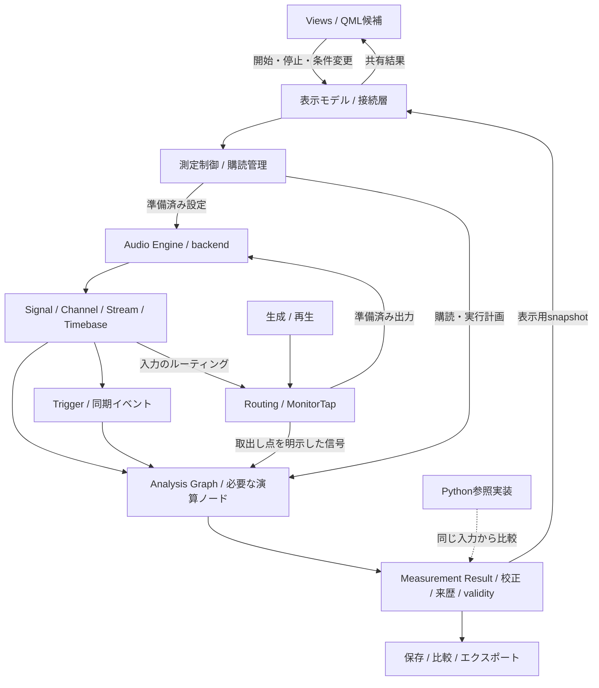

# 次期コアアーキテクチャ検証・Rust/QML評価計画案

作成日: 2026-09-28 / 改訂日: 2026-10-01 / 状態: 方向性案 v0.2（実装着手・技術採用の確定ではない）

2026-09-29にMIG-001へ着手。以後の実施状況と再開手順は
[検証作業の進捗](../migration/status.md)を正本とする。本書の「今回」は計画作成時を指す。

調査基準: `main` の `68cbdabc3ecd542d9d73fa0aa86bf9159f44d811`、MeasureLab 0.9.0。
行数・機能数はこの時点のローカルコードから集計した。外部技術の情報は作成日に公式資料を確認した。

## 1. 提案する方向性

**MeasureLabの次期コアアーキテクチャを検証し、その有力な実装候補としてRust + Qt Quick/QMLを評価する。**
Channel/Streamを中心に、時刻・トリガー・ルーティングを共通化し、必要な解析と複数の表示を分離できる構造を検証する。
現行Python版を動く参照実装・比較対象として維持し、別worktreeで小さな測定フローを完成させる。

Rust/QMLによる実装は技術的に検討可能と判断するが、採用は未決定である。
全機能の同等性、対応機器、配布、開発時の反復速度を比較し、MIG-008後に本格移行の可否を判断する。
**現行Python + NumPy + PyQtの方が総合的に適していれば、移行せず、得られた設計改善だけを取り込む。**
進捗は、同じ条件で同じ測定が成立する範囲と、次期コアの要件を検証できた範囲で測る。

| 項目 | 初期方針 |
| --- | --- |
| アプリの中核 | GUI・実装言語から独立したChannel/Stream、Timebase、Analysis Graph、測定状態、校正、保存の契約を先に定める |
| 実装候補 | Rustを第一候補として検証する。現行Pythonを継続する選択肢も同じ判断点で評価 |
| GUI | Qt Quick/QML を第一候補にする。コアの契約に沿った薄い接続層を試作 |
| C/C++ | Qt 連携、描画、既存ネイティブライブラリに必要な小さな境界に限定して許容 |
| Python | 現行版、参照計算、テストデータ生成に活用。通常実行経路から外すかは採用判断に従う |
| チャンネル | 内部設計はN-channel。P2の製品試作・実機確認はまず2ch、仮想4/8chで設計を検証 |
| 開発場所 | 同一リポジトリの別 worktree と検証用ブランチ。採用後は移行の統合先として継続利用 |
| 最初の到達点 | 信号生成 → 取得・時刻管理 → 共有解析 → 複数表示 → 校正情報付き保存 |
| 採用判断 | 正しさ、拡張性、実行性能、AI開発時の反復速度、配布・保守負担を比較 |
| 完全移行 | Rust/QMLの本格移行を選んだ場合に、機能・演算の両台帳、実機、配布、設定互換性から判定 |

NumPy/SciPy の処理には既にネイティブ実装が使われているため、言語変更だけで全体が高速化するとは見込まない。
期待する効果は、処理時間の予測可能性、データ所有権の明確化、GUI と測定処理の分離、長期的な変更のしやすさである。
CPU、メモリ、起動時間、描画遅延に加え、編集から検証結果を得るまでの時間を現行版と比較する。
コアを整理する価値と、その実装言語を変更する価値は個別に評価する。

## 2. 現行コードから分かったこと

| 対象 | 確認できた状態 | 計画への影響 |
| --- | --- | --- |
| 規模 | `src/` の Python は115ファイル・78,850行。コア15,274行、GUI63,547行。空行・コメントを含む | ファイル単位の逐語的変換では作業量も完了条件も管理しにくい |
| 機能 | `ALL_MODULE_KEYS` と `MODULE_REGISTRY` に41モジュール | サブ機能も含む移行台帳が必要。41画面できれば完了とはしない |
| コード分離 | `SpectrumAnalyzer` などの測定クラスも `src/gui/widgets/` に置かれている | GUIディレクトリを一括で捨てると計算仕様も失う |
| 共通インターフェース | `MeasurementModule` は `name`、`description`、`get_widget()` が中心 | 次期コアの測定ライフサイクル、購読とデータ受け渡しを別途定義する |
| 音声 | `AudioEngine` に音声入出力、ミックス、仮想ループバック、排他利用、異常状態、ネットワーク接続が集約 | 音が出るだけの試作では互換性を判断できない |
| チャンネル・時刻 | AudioEngineの論理I/Oに1/2ch前提があり、ネットワークv2は最大2ch。RingBufferは任意チャンネル数とサンプル位置・欠落情報を持つ | バッファの汎用性を活用しつつ、識別子、時刻、マッピングをエンジン全体の契約へ広げる |
| 数値処理 | NumPy、SciPy、pyFFTW、PyWavelets、netCDF4 を使用 | FFT以外にもフィルタ設計、補間、統計、最適化、ウェーブレット等の棚卸しが必要 |
| 描画 | pyqtgraph と QWidget を広く使用 | QMLの画面とグラフ操作は再実装する。既存部品の直接移植を前提にしない |
| 校正・保存 | `CalibrationManager`、`ConfigManager`、`ExportTrace` と CSV/JSON exporter が存在 | 単位、校正有無、軸、来歴を新版の互換契約の出発点にできる |
| 外部連携 | Remote Audio I/O、別プロセスの VST3 DUT ホストが存在 | 41モジュールとは別に移行対象へ登録する |
| テスト | `tests/` に230個の Python ファイル・45,185行 | 数値・状態の参照資産にできる。Qt依存のGUIテストは作り直す |
| 多言語・配布 | 9言語。Windows、macOS Apple Silicon／Intel、Linux AppImage のビルド経路 | 初期から各配布対象で成立性を確認する |

主な根拠:
[依存関係](../pyproject.toml)、[モジュール一覧](../src/core/module_constants.py)、
[能力宣言](../src/gui/module_registry.py)、[測定基底クラス](../src/measurement_modules/base.py)、
[AudioEngine](../src/core/audio_engine.py)、[FFT管理](../src/core/fft_manager.py)、
[設定](../src/core/config_manager.py)、[校正](../src/core/calibration.py)、
[保存トレース](../src/core/export/trace.py)、[VSTホスト](../src/core/vst_dut.py)、
[RingBuffer](../src/core/ring_buffer.py)、[ネットワークプロトコル](../src/core/network_audio/protocol.py)。

[現行の製品方針](CURRENT_DIRECTION.md)にある測定精度、解析、エクスポート、UI品質の改善を引き継ぐ。
[設計ガイドライン](MEASUREMENT_INSTRUMENT_DESIGN_GUIDELINES.md)の判断優先順位と1.5節の実装範囲も継承する。
移行を理由に、根拠のない監視機能や全画面のデザイン変更を同時に増やさない。

## 3. 言語と GUI の選択

### 3.1 第一候補: Rust + Qt Quick/QML

この候補ではRustが DSP、入出力の制御、解析グラフ、測定手順、状態、永続化を担当し、QMLが表示とユーザー操作を担当する。
QML内の JavaScript に測定式や大きな配列処理を移さない。
Qtは引き続きネイティブライブラリとして必要で、Rustのみで完結するビルドにはならない。

Rust と Qt の接続は、次の二候補で同じ小さな試作を行う。

| 接続方式 | 確認できた特徴 | MeasureLabでの判断 |
| --- | --- | --- |
| CXX-Qt | RustとQt/C++をつなぎ、QObjectやQMLへの公開、Cargo/CMakeによる構築を支援 | 最初の基準実装。独自描画やQt側拡張が必要な範囲を確認する |
| Qt Bridge for Rust | Qt公式の取り組み。2026-09-23公開の0.3もベータ。CXX-Qtの型・ビルド基盤の利用を拡大 | 同時に評価するが、公式であることだけで採用を確定しない |

根拠: [CXX-Qt公式資料](https://kdab.github.io/cxx-qt/book/)、
[Qt Bridge for Rust 0.3の公式発表](https://www.qt.io/blog/qt-bridge-for-rust-0.3-cxx-qt-compatibility-and-soundness)。
両者は完全に独立した基盤ではないため、二候補を持つだけで共通の不具合を回避できるわけではない。

選定試作では、プロパティ更新、ワーカーからGUIへの通知、リストモデル、ウィンドウ再生成、終了時の破棄、
独自グラフとの接続を確認する。特にmacOS ARMを含む実際の配布対象でビルドと実行を確認する。
CXX-Qtの資料に記載されたCI対象だけから、MeasureLabの全配布対象での動作を推定しない。

採用時はRust、Qt、連携ライブラリ、C++コンパイラの組み合わせを固定し、更新は専用タスクにする。
GUIとの橋渡しを一つの薄い層へ集め、接続方式の変更をDSPや保存形式へ波及させない。

### 3.2 代替候補

以下の適性評価は、公式資料と現行要件からの設計上の判断であり、比較ベンチマークの結果ではない。

| 候補 | 位置付け | 採用前に確かめること |
| --- | --- | --- |
| [Slint](https://slint.dev/) + Rust | 宣言的UIを維持する第二候補。QMLとは別の言語・ツールになる | 高密度グラフ、複数ウィンドウ、キーボード、IME、アクセシビリティ、配布条件 |
| [egui](https://github.com/emilk/egui) + Rust | Rust内で完結させたい場合や、技術検証用の画面に候補 | 既存の計測操作、多言語入力、長期運用するデスクトップUIの再現コスト |
| [Iced](https://github.com/iced-rs/iced) + Rust | Rustによる宣言的構築の候補 | 必要な部品、グラフ、複数ウィンドウ、UIテストを揃える工数 |
| [Tauri](https://v2.tauri.app/start/) + Rust | Web UIを積極的に選ぶ場合の候補 | Web側とのデータ転送、描画、各OSのWebView差、追加する技術体系 |
| 現行PyQt + Rust拡張 | コアの一部に採用効果がある場合の選択肢 | 混在ビルドの反復速度、Python配布の負担、将来のGUI変更への影響 |
| 現行Python + NumPy + PyQtを継続 | 移行しない正式な選択肢 | コアの契約・責務分離を現行版へ取り込む効果とコスト |

最初から全候補を本格実装しない。Qt Quickの初期試作に明確な障害が出たとき、Slintを同じ評価条件で比較する。
RustコアをGUIから独立させれば、GUI選定の変更後も数値処理の成果を再利用できる。

### 3.3 音声・演算・描画の方針

| 領域 | 初期案 | 決定に必要な証拠 |
| --- | --- | --- |
| 音声I/O | RustからPortAudioを使う経路を互換性の基準にし、CPALを比較候補にする | N-channelの表現、入出力数の非対称性、明示的なチャンネル・マッピング、同期、レート、時刻、遅延、XRUN、排他設定、再接続 |
| FFT | RustFFT系を第一候補。必要なら既存ネイティブFFTの利用も比較 | f32/f64、正規化、非2冪サイズ、大規模FFT、プラン作成と実行の性能 |
| フィルタ・統計等 | 必要な演算を個別に選定・実装する | SciPyのデフォルト値、端点処理、初期状態を含む一致 |
| 波形・スペクトル | Qt Quickの描画部品を評価し、不足する部分を共通プロット部品として作る | 線形／対数軸、複数トレース、カーソル、ズーム、画像保存、性能 |
| ヒートマップ | スペクトログラム等を別の描画試験にする | テクスチャ更新、配色、軸とデータの対応、長時間のメモリ使用 |
| Pythonとの比較 | 入出力ファイルを介する参照ランナーを初期の標準とする | Python GUIを起動せずに、固定入力から結果を生成できること |

現行の[sounddeviceはPortAudioのバインディング](https://python-sounddevice.readthedocs.io/en/latest/)であり、
PortAudioを残す案でもアプリの中核はRustへ移せる。
[PortAudio API](https://portaudio.com/docs/v19-doxydocs/api_overview.html)と
[CPAL公式資料](https://github.com/RustAudio/cpal)を比較し、クレート名や対応OS一覧だけでは判断しない。
Rustバインディングの保守状況と不足するホスト固有APIも初期検証に含める。

[RustFFTは出力を自動正規化しない](https://docs.rs/rustfft/latest/rustfft/)。
現行の振幅・パワー・PSD・窓補正の定義を明文化してから実装する。
高速化のために解析精度を一律f32へ下げない。I/O形式、内部解析、表示用データを区別する。

[Qt Quick Scene Graph](https://doc.qt.io/qt-6/qtquick-visualcanvas-scenegraph.html)の独自描画は候補になるが、
レンダースレッドとGUIスレッドの制約がある。必要なら小さなC++描画部品を許容する。
大量の数値を毎フレームQMLのオブジェクト配列へ変換する構成は避け、描画用データをまとめて渡す。

採用ライブラリの配布条件も選定時に確認する。
現行プロジェクトのUnlicenseが依存ライブラリの条件まで置き換えるわけではない。
特に[Qt GraphsはQtのGPL対象モジュール一覧に含まれる](https://doc.qt.io/qt-6/licensing.html)ため、
Qt Quick本体と同じ配布条件と仮定しない。性能・機能と配布方針が合わなければ別の描画方式を選ぶ。

## 4. 次期コアの概念とデータの流れ

### 4.1 Channel/Streamを中心にした構造

次の責務分離を先に定め、その有力な実装をRustで試す。
測定器は必要な信号・解析結果を購読し、表示は測定器の結果を参照する。
既存の41モジュールは利用者から見た機能を確認する単位とし、コアのクラスや演算ノードと一対一に対応させない。



図は責務の分離であり、全箱を別プロセスや別クレートにする要求ではない。図中のビューから制御へ戻る線は操作の流れである。
解析グラフとQt Quickの描画用Scene Graphは別の仕組みとして扱う。
最初は少数の演算ノードと固定した接続で検証し、汎用のグラフ編集GUIや動的プラグイン基盤は要求しない。

### 4.2 P0で先に決めるコア契約

以下は新設計の概念案であり、型名や実装を確定したものではない。
GUIや個別測定器を作る前に、識別・位置・時刻・有効性の意味と受け渡し条件を定める。

| 概念 | 契約に含める内容 |
| --- | --- |
| `ChannelId` | 論理チャンネルの識別子。物理ポート番号、左右という表示名、配列内の順番を分離する |
| `StreamId` / `SignalBlock` | 取得・生成・派生信号の識別、チャンネル集合、形式、フレーム数。再開・レート変更等を区別する世代も保持 |
| `sample position` / `Timebase` | ストリーム世代内の絶対サンプル位置、レート、時刻原点、クロック領域。別レート・別機器との変換可否、遅延・不確かさ |
| `TriggerEvent` | 発生元、対象Timebase、イベントのサンプル位置、種別、有効性。通知を受け取った時刻と発生位置を区別 |
| `Routing` | 入出力のChannelId対応、選択・複製・ミックス、ゲイン、出力先、設定の世代と切替位置 |
| `MonitorTap` | 入力、処理前後、ミックス後、ミュート／量子化前後など、信号を取り出す位置と適用条件 |
| `validity` | 欠落、未同期、無効校正等の既知の状態と影響範囲。元データから派生結果へ伝える規則 |
| `MeasurementResult` | 元Stream/Channel、対象サンプル区間、Timebase、トリガー、演算条件、校正・単位・validityを持つ不変の結果 |

外部トリガーの実機アダプター、複数機器のクロック同期、マルチレート解析の全実装は後段でもよい。
P0では未対応を表現する方法と拡張点を定め、P1/P2で仮想データによる最小経路を通す。
共通の時刻型を持つだけで、独立した機器のサンプルが同期したとは扱わない。
リサンプリング時は元Timebaseとの対応、フィルタ遅延、validityの伝播を保持する。

同じトリガーを購読する複数ウィジェットは、表示開始時刻ではなく同じサンプル区間を参照する。
履歴バッファは購読者ごとの読取り位置を持つ方式等を検討し、一つの表示による読取りが別の表示のデータを消費しないようにする。
保持できる過去区間、トリガー前後の必要量、遅い購読者への欠落通知を明示する。

MonitorTapは結果に取出し点を記録する。例えばミュート前の信号を観察できても、物理出力が出ている証拠にはしない。
現行ループバックが量子化前を取る意味も契約へ移し、取出し点の変更で測定条件が黙って変わらないようにする。

### 4.3 N-channelを前提にした最小検証

チャンネル数は実行時の構成値とし、入出力が同数であることや固定長2の配列をコアの前提にしない。
バッファ配置、チャンネル順、選択・複製・ミックスを明示し、範囲外の対応や暗黙の切捨てを検出する。
各測定器が受け取れるチャンネル構成も宣言する。ステレオ専用の測定器があることと、コアが2chに固定されることを分ける。

- **P0:** ChannelId、入力数・出力数、対応表、校正のチャンネル対応、欠落時の扱いを契約にする。
- **P1:** 仮想4/8chでチャンネルごとに異なる既知信号を流し、順序入替え、選択、ミックス、非対称な入出力数を検証する。
- **P2:** 製品試作と実機確認はまず2chとする。同じコアに仮想4/8chを通す回帰検証を残す。
- **後続:** 4/8/16ch等の実機対応は機器・backendの能力と利用用途に応じて別途決定する。P2の終了条件にはしない。

ネットワーク音声v2の最大2chは互換アダプターの制限として扱い、N-channelコアを2chへ縮める理由にしない。
多チャンネル転送はプロトコル拡張を別途設計し、旧版へ未対応データを送らない。

### 4.4 Analysis Graphと演算の共有

FFT、Lock-in、Counter等の測定器はChannel/Streamを購読し、必要なプリミティブから結果を組み立てる。
共有の単位は画面名ではなく、入力と演算条件が一致するノードとする。
例えばSpectrum AnalyzerとSpectrogramは、入力、Timebase、対象フレーム、FFT長、hop、窓、前処理・精度等が一致するとき同じFFT nodeを利用できる。
平均化、履歴表示、表示単位等の異なる処理は分岐後に置き、条件が異なるFFTを無理に共有しない。
校正やルーティングが演算入力を変える場合はその世代も共有条件に含める。

購読されている結果と、その生成に必要な依存ノードだけを実行する。
画面を閉じても録音・測定セッションの購読が残れば処理を継続し、表示の有無と測定の寿命を同一視しない。
購読追加・解除、設定変更、平均化状態のリセット、キャッシュの寿命を制御層で管理する。
既に確定した結果へ後の設定変更を反映しない。

最初の解析経路は循環のない固定グラフで試す。生成・Routing/Monitorの信号経路と接続する際も、
意図しない出力フィードバックを許さず、必要な遅延・ループバックは明示した契約にする。
グラフ構築、共有判定、メモリ確保は制御側で行い、リアルタイムコールバック中にグラフを作り替えない。

### 4.5 実行責務とリアルタイム境界

- **Signal/Timebase:** Channel/Streamの識別、位置、同期、トリガー、履歴参照の共通意味を保持する。
- **DSPプリミティブ:** バッファを受け取る演算と連続状態。GUIを呼び出さない。
- **Analysis Graph:** 演算の依存関係、共有、購読、必要な処理の実行と結果の伝播を扱う。
- **Audio Engine / Routing:** デバイス、N-channel形式、入出力、対応表、MonitorTap、共通I/O状態を扱う。
- **測定制御:** 実行手順、トリガー条件、ワーカー、キャンセル、結果の確定。要求と実状態を区別する。
- **表示接続層 / QML:** 入力、表示、通知、更新頻度、レイアウト。測定結果の購読者として既存の能力宣言に従う。

音声コールバックでは、バッファを事前確保し、処理時間に上限を持つ操作だけを行う。
ファイルI/O、ネットワーク待機、GUI呼出し、同期IPC、FFTプラン作成、待ち時間が読めないロックは入れない。
Rustのメモリ安全性だけではリアルタイム性は保証されない。解放処理やデストラクタを含めて経路を確認する。

取得データは容量を制限したキューで解析へ渡す。溢れた場合はサンプル位置・欠落数・影響範囲を記録する。
表示更新の省略と、測定データの欠落を別に扱う。保存用の元データと画面用の間引きデータも分ける。
遅いGUIに合わせて取得を待たせず、表示は最新のsnapshotへ追いつける方式にする。

### 4.6 機能台帳と演算プリミティブ台帳

P0で、利用者向けの41モジュール・共通機能の台帳とは別に、演算プリミティブ台帳を作る。
ここでのプリミティブは数値演算だけでなく、測定器が共有する取得・同期・履歴・手順の能力も含む。
各項目に入出力、単位、Timebase、状態・初期化、validity、精度、共有条件、参照テスト、利用機能を記録する。

| 共通能力の例 | 記録する主な契約 | 利用する機能の例 |
| --- | --- | --- |
| windowing / FFT | 窓補正、正規化、フレームとhop、共有条件 | Spectrum Analyzer、Spectrogram、歪み解析 |
| RMS / integration / weighting | 積分区間、ゲート、初期状態、レート | Sound Level Meter、LUFS Meter、レベル表示 |
| phase / Lock-in / Counter | 参照信号、位相基準、時間窓、周波数の定義 | Lock-in系、Frequency Counter、精密計数 |
| resampling / filtering | レート比、遅延、端点・初期状態、位置とvalidityの変換 | マルチレート解析、音質解析、生成器 |
| trigger / history buffer | 発生位置、保持区間、購読者別の位置、欠落 | Oscilloscope、Event Detector、複数表示の同期 |
| routing / monitor tap | ChannelIdの対応、ミックス、取出し点、ミュートとの関係 | 生成器、Loopback Finder、監視・再生 |
| sweep / delay estimation | 同期取得、区間、遅延補償、停止・失敗状態 | Network Analyzer、Impedance Analyzer、歪み測定 |
| calibration / unit conversion | チャンネル・周波数ごとの校正、有効性、適用位置 | 全測定結果、単位表示、エクスポート |

機能台帳から利用プリミティブへ、プリミティブ台帳から利用機能へ追跡できる対応表を持つ。
既に検証済みの演算を組み合わせて機能を成立させ、機能固有の差だけを追加することをP4の基本にする。
演算単体の合格に加え、組合せによる精度、タイミング、状態、保存の検証を行う。

## 5. main・ブランチ・worktree の運用

今回想定している用途には **Git worktree** が適している。
同じリポジトリの履歴を共有しながら、別ディレクトリで別ブランチをチェックアウトできる。
Git subtreeは主に別プロジェクトをサブディレクトリへ取り込む方式であり、今回の並行開発には不要である。
参照: [Git worktree公式資料](https://git-scm.com/docs/git-worktree)。

```text
既存の作業場所                       main
  現行Python版の保守・リリース

別の管理されたworktree              codex/next-core-evaluation
  現行ソースを残した状態で native/ を追加
  次期コア候補の検証・比較・プレビュー

必要な作業用worktree                codex/migration-<task>
  検証用ブランチから分岐した小さな変更
  PRの取り込み先は codex/next-core-evaluation
```

実際に着手するときは、既存worktreeと未完了作業を確認し、適切なものがなければ管理されたworktreeを作る。
名前は案であり、今回はブランチ・worktreeを作成していない。
mainをリセットしたり、現行ソースを先に削除・改名したりする必要はない。

検証用ブランチ内の初期配置案（本格移行を選んだ場合も継続利用）:

```text
src/                       現行Python実装（比較とmain追従のため維持）
tests/                     現行テスト
native/
  Cargo.toml               Rust workspace
  Cargo.lock               アプリの依存バージョン固定
  rust-toolchain.toml       Rustツールチェーン固定
  crates/                  コア、音声、アプリ、必要なQt連携
  qml/                     新版GUI
  tests/                   RustとQMLの検証
migration/
  inventory.md             利用者向け機能・互換性・進捗台帳
  primitives.md            演算プリミティブと利用機能の対応台帳
  status.md                現状、次のタスク、障害、最終検証
  decisions/               採用理由と変更履歴
  contracts/               N-channel、時刻、同期、数値、形式、性能の契約
  benchmarks/              実行性能と開発反復速度の比較条件・結果
  fixtures/                小さな共通入力・期待値・生成条件
```

`migration/`とMIG番号は初稿から継続する管理名であり、言語移行を決定したことは意味しない。
採用判断までは検証用ブランチとして扱い、本格移行を選んだ場合に統合ブランチとして使い続ける。
現行版の継続を選んだ場合は、検証結果と決定を保存し、有効な設計改善だけを小さなPRでmainへ取り込む。

運用ルールは次のとおりとする。

1. 現行版の不具合は原則mainで直す。移行側でも同じ不具合があれば対応するタスクを台帳に記録する。
2. mainの変更を移行ブランチへ定期的にマージする。目安は週1回と各段階の終了時。担当者を一人に定める。
3. 同期のたびに、修正内容、参照データ、追加・変更された機能を照合する。ファイル競合の解消だけで同期完了としない。
4. 共有する長期ブランチは頻繁にrebaseしない。大きな機能変更は小さなPRとして統合する。
5. 新版への機能追加を自動的に現行版にも実装する運用にはしない。共通仕様への影響だけを確認する。
6. 本格移行を選び完了条件を満たした場合は、最新mainとの統合後に切替用PRを作る。旧版のリリースタグと保守ブランチを残す。

CIでは移行ブランチを実行対象へ加え、Python側とRust/QML側のジョブを分ける。
main由来の既存テストを維持し、移行用PRの比較先・必須チェック・配布先を明示する。
プレビューは別名・別チャンネルとし、安定版の自動更新経路へ流さない。

## 6. 旧版と新版の共存・互換性

並行開発と、同じオーディオデバイスを両アプリで同時に開くことは別である。
最初の比較は同じ録音ファイル／生成信号で行い、実機比較では一方ずつ測定する。
排他モードや出力の混合によって比較条件が変わることを避ける。

新版は設定・校正・キャッシュの保存先を旧版から分ける。worktreeが別でもユーザーデータの保存先は自動では分かれない。
初回移行は旧ファイルの読み取りとコピーを基本とし、旧版のファイルを上書きしない。
設定にはスキーマバージョンを付け、移行失敗時は元のファイルで旧版へ戻せるようにする。

| 対象 | 互換性の方針 |
| --- | --- |
| 校正 | V/FS、SPL、周波数補正、位相補正、校正済みフラグを保持。未校正を校正済みへ変換しない |
| デバイス設定 | OS・backendごとの識別子を再確認し、存在しない機器を黙って別機器へ割り当てない |
| 測定結果 | 単位、軸、取得条件、校正情報、欠落・無効状態を含めて比較。ChannelId、Timebase、トリガー、MonitorTap等の追加情報は形式を版管理し、既存CSV/JSONの用途も維持 |
| UI設定 | ウィンドウ形状、dock状態などQWidget固有の値は変換可否を個別に決める。再配置が必要なら明示 |
| 翻訳 | 既存9言語のJSONとキーを当初の正本として再利用。QML側の翻訳関数を介して表示する |
| FFTキャッシュ | 実装固有の最適化キャッシュは移植対象にせず新版で再生成 |
| ネットワーク音声 | 現行プロトコルv2の2ch互換を検証する。時刻、順序、欠落、再送、切断を扱い、多チャンネル化は別の拡張契約にする |
| VST3 DUT | プラグインのホスト機能、別プロセス分離、エディター、reset、タイムアウトを一つの移行単位にする |

Pythonを一時的に新版から呼ぶ必要がある場合は、オフライン解析用の別プロセスを優先する。
入出力、バージョン、キャンセル、終了時の回収、削除予定の段階を契約に含める。
VST等で一時継続する補助プロセスも、物理I/Oのリアルタイムコールバックから同期呼出ししない。
低遅延が必要な経路は別途設計・検証する。

[PyO3](https://pyo3.rs/)によるRust拡張は、現行版へRust処理を先に導入する場合の選択肢とする。
現行GUIへRustを組み込む作業と新QML GUIの全面開発を、理由なく二重に進めない。
Rust/QMLへの本格移行を選んだ場合は、通常版のPythonランタイム依存解消を目指す。
Pythonは参照計算や開発ツールとして残してよい。段階導入・現行版継続の場合は、その選択に合う依存関係を維持する。

## 7. 検証工程・採用判断と、その後の移行

**P0〜P2（MIG-008まで）を技術・設計検証の範囲とする。P3以降は採用判断後の計画である。**
コア契約を先に置き、GUI・backendの試作結果から契約を修正する。実装言語が決まる前に不可逆な切替を進めない。

| 段階 | 作るもの | 次へ進む条件 |
| --- | --- | --- |
| P0: コア契約と両台帳 | 機能台帳・プリミティブ台帳、N-channel、Timebase、TriggerEvent、Routing、MonitorTap、validity、数値・開発反復速度の基準 | 言語に依存しない契約と、最初の測定フロー・仮想4/8ch・共有解析の終了条件を第三者が判定できる |
| P1: 技術・設計検証 | Rust/Qt連携、音声backend、N-channelの対応表、最小解析グラフ、仮想同期・トリガー／レート変換、描画・配布、開発反復速度の試験 | 仮想4/8ch、条件が一致するFFTの共有、チャンネル・位置・validity伝播を確認。各ビルド経路の時間を記録し、重大な未解決点を把握 |
| P2: 最初の完成形 | 2chの生成・実機入力、波形・FFT共有による最小の複数表示、基本校正、CSV/JSON、開始・停止・失敗表示 | 同じコアの仮想4/8ch回帰、参照比較、2ch実機ループバック、配布バイナリ、共有区間・トリガー・購読解除を検証し、採用判断の材料が揃う |
| P3: 共通基盤の展開 | 購読・同期・Routing/Monitorの実用化、設定、校正、比較、切替、分離／分割、翻訳、テーマ、ログ | 複数の測定器・表示が共通契約を使い、タブ移動・終了・キャンセルでも状態が一致する |
| P4: 機能群の成立 | 検証済みプリミティブの組合せで下表の機能を成立させ、固有演算・UI・保存・外部連携を追加 | 利用機能とプリミティブの対応を追跡でき、組合せ後も各機能の受け入れ条件を満たす |
| P5: 同等性と配布 | 全機能の互換性、実機・長時間動作、各OSパッケージ、更新、設定移行、文書 | 完全移行条件を満たし、旧版へ戻す手順も検証済み |
| P6: 主系統の切替 | mainへの統合、正式配布、旧版保守範囲と終了条件 | 新版を既定として利用でき、残る旧版依存を明示できる |

P1では既存の重いケースも小さく試す。現行FFTサイズには24,000・48,000のような非2冪と、
4,194,304の大きなサイズが含まれる。小さなFFTの成功だけで全体の成立を判断しない。
VSTエディターやネットワーク音声も高リスクな接続部分を先に試し、本実装はP4で進める。
外部トリガーの実機入力や全マルチレート構成の実装をP1で揃える必要はない。
仮想イベントと最小のレート変換で契約を検証し、未実装のアダプターを両台帳へ残す。

P1終了時に、Qt連携が成立しなければSlintを比較し、描画だけが問題なら描画方式を変更する。
音声backendだけが不足する場合は、Rustコアを維持してPortAudio等の境界を調整する。
根本要件や開発反復速度に問題がある場合は、段階導入と現行Python版の継続も評価する。
早期に十分な判断材料が得られた場合はMIG-008完了まで作り続ける必要はなく、理由と未検証点を残して判断できる。
未解決の基盤問題を抱えたまま機能群へ展開しない。

### MIG-008後の正式な選択肢

| 選択 | 選ぶ条件 | 次の行動 |
| --- | --- | --- |
| Rust + Qt Quick/QMLを本格展開 | コアの要件を満たし、実行性能・開発反復速度・保守負担を含む総合的な利点がある | P3以降を具体化し、機能群へ展開 |
| 接続・描画方式を変更 | 次期コアに価値があり、問題がGUI接続・描画等に局在 | 該当部分だけ再試作し、同じ基準で再判定 |
| Rustコアの段階導入 | 限定した処理のRust化に効果があり、混在時の反復速度も許容できる | 現行GUIを維持し、対象と再評価条件を限定して導入 |
| 移行せず現行Python版を継続 | 現行方式が総合的に適している、または移行の利益が費用・不確実性を上回らない | 今回得たコア契約・責務分離・テスト等の設計改善だけを選んで取り込む |

判断表には正しさ、N-channel・共有解析・同期の成立、実機、描画、配布、開発反復速度、残る保守負担を並べる。
現行版で不足する能力は「未対応」と記録し、言語の効果とアーキテクチャ変更の効果を混同しない。
数値・状態の不正を性能で相殺せず、各案の利点・費用・未確認事項を明示する。
現行版を継続する判断も、この検証計画の有効な完了結果とする。

### 機能群の移行順序案

次の区分は41モジュールを漏れなく一度ずつ割り当てた、利用者向け機能の確認順序案である。
旧クラスを41個作り直す設計単位にはしない。各群をプリミティブ台帳に対応付け、共有済みの能力を再利用する。
P2で作る最小機能と、そのモジュールの全サブ機能の移行完了は区別する。

| 順序 | 対象 | 主な依存・検証 |
| --- | --- | --- |
| 基盤と並行（1） | Processor Benchmark | 新旧比較の計測基盤。既存の利用者向け機能も台帳に残す |
| A: 基本取得・生成（8） | Signal Generator、Spectrum Analyzer、Oscilloscope、Raw Time Series、Frequency Counter、Loopback Finder、Recorder / Player、Waveform Loop Player | 先行したChannel/Timebase、共有バッファ・FFT、Trigger、Routing/Monitorの契約を利用。ファイル、周波数・振幅も検証 |
| B: 連続監視（9） | Sound Level Meter、LUFS Meter、Goniometer、Stereo Alignment Monitor、Spectrogram、Event Detector、Noise Profiler、BNIM Meter、Boxcar Averager | 重み付け、積分時間、ゲート、True Peak、履歴、画像描画、欠落時の扱い |
| C: 同期・精密計測（7） | Lock-in Amplifier、Lock-in Harmonic Analyzer、Lock-in Frequency Counter、Lock-in Spectrum Finder、Arbitrary Harmonic Generator、Timecode Monitor & Generator、1PPS Monitor | P0/P1で定めたTimebase・Trigger・共有位置を利用し、位相、校正、精密なクロック推定と長時間安定性を追加検証 |
| D: 手順測定・比較（6） | Network Analyzer、Impedance Analyzer、Distortion Analyzer、Advanced Distortion Meter、Linearity Analyzer、Response Viewer | 同期play/record、スイープ、遅延補償、キャンセル、複素数、保存と比較 |
| E: 高度解析・特殊処理（10） | Transient Analyzer、Sound Quality Analyzer、HRTF Player、Spatial Binaural Mixer、Ultrasound AM Modulator、Transmission Analyzer、Nonlinear Analyzer、Lock-in Modeler、Feedforward Compensator、Nonlinear Response Analyzer | PyWavelets、SOFA/netCDF、心理音響、補間、畳み込み、非線形モデル等 |
| 共通・外部連携（41外） | Remote Audio I/O、VST3 DUT、Settings、Welcome、Measurement Console、更新・ログ・スクリーンショット等 | 各モジュールの成立に必要な部分から着手。共通UIの能力宣言も引き継ぐ |

AからEへの順序は優先順位であり、全機能が一本道に依存するという意味ではない。
共通契約が固まれば独立した演算は並行して進められる。
利用頻度や重要な測定用途が分かった時点で順序を変更し、依存関係も台帳へ記録する。

## 8. 正しさと性能の検証

### 8.1 数値・状態の互換性

現行版は有用な参照実装だが、常に正解とは限らない。
旧版との比較に加え、正弦波の振幅、既知フィルタの応答、既知遅延など、独立した理論値を使う。
一致しない場合は、新版の不具合、旧版の不具合、演算方式の差を切り分け、期待値だけを自動更新しない。

| 検証層 | 比較する内容 |
| --- | --- |
| 純粋演算 | FFT正規化、窓補正、RMS、単位変換、フィルタ係数と初期状態、補間 |
| 連続解析 | 同じデータを異なるブロック分割で渡したときの結果、ウォームアップ、平均化、境界 |
| N-channel / Routing | 仮想4/8chの識別信号、順序入替え、選択、明示的な複製・ミックス、非対称な入出力数、誤対応の検出 |
| 共有解析 | 同条件のFFTが一度だけ実行され複数購読者へ届くこと、条件が異なる場合の分離、購読追加・解除、設定変更時の状態 |
| Timebase / Trigger | 仮想イベントの発生位置、複数表示の同一区間、独立した読取り位置、レート変換後の位置・遅延・validity、ストリーム再開時の世代 |
| MonitorTap | 処理前後・ミュート／量子化前後の取得値とメタデータ。物理出力状態と監視値の区別 |
| 測定手順 | 開始失敗、停止、キャンセル、再実行、欠落、飽和、無効校正、レート変更 |
| 保存 | CSV/JSONの値、列・軸・単位、校正、取得条件、無効値の扱い、読み戻し |
| 実機 | 振幅、位相、周波数、往復遅延、ドリフト、XRUN、切断・復帰 |

比較データには入力のハッシュ、参照コミット、依存バージョン、dtype、レート、ブロック長、窓、校正条件を保存する。
ChannelIdの対応、Stream/Timebaseの世代、サンプル区間、トリガー位置、Routing/MonitorTap、グラフ構成も比較条件に含める。
現行版に同等のN-channel・共有解析の経路がない場合は、Pythonで作る独立した参照計算と理論値を使い、現行アプリとの同等性確認とは分けて記録する。
振幅は必要に応じて線形値で `abs(actual - expected) <= atol + rtol * abs(expected)` を評価し、
dB表示の差は有効なレベル範囲を定めて別評価する。無音付近や位相未定義点を相対誤差だけで判定しない。
許容差はモジュールの用途と既存テストを踏まえてP0で定義し、全測定に一つの値を流用しない。
状態遷移、単位、校正フラグは原則として厳密一致を求める。

### 8.2 性能・実機・UI

P0で同一機材・同一入力・同一設定の現行値を記録する。
コールバック処理時間の分布、期限超過数、CPU、ピークメモリ、表示遅延、起動時間を測る。
期限はブロック長とサンプルレートから決まる。例えば256 frames / 48 kHzは約5.33 msだが、
これを処理だけで使い切れる予算とはしない。余裕幅と許容値を実測後に契約へ落とす。

描画は線グラフとヒートマップ、複数ウィンドウ、大きなFFT、拡大・縮小を組み合わせる。
まず30 Hz表示更新を試作の目安とし、測定更新周期と分離して評価する。最終値は用途と測定結果で決める。
短時間のCIとは別に、連続運転、スリープ復帰、機器抜き差し、長時間計数を実機で確認する。

実機表には少なくともWindows WASAPI／現在提供するASIO経路、macOS CoreAudio、
Linuxの対象ALSA／JACK／PipeWire構成を登録する。実際の対応範囲をP0で確定し、
CI上でビルドできたことを実機測定の合格に置き換えない。

QMLのテストには[Qt Quick Test](https://doc.qt.io/qt-6/qtquicktest-index.html)と
[qmllint](https://doc.qt.io/qt-6/qtqml-tooling-qmllint.html)を使う案とする。
Rustには `cargo test`、`cargo fmt --check`、`cargo clippy` を導入し、橋渡し部分は破棄順・所有権も確認する。
Qtの型検査・QMLモジュール生成を含めた検証コマンドをリポジトリへ固定する。

UIサイズは[AGENTS.mdの上限](../AGENTS.md#uiサイズの上限)と
[検証コードの定数](../scripts/check_ui_size_limits.py)を正本とする。
2026-09-28時点で両者とも **メイン1400×740 px、モジュール1180×690 px** で一致している。
Git履歴では2026-08-15の `8772aa4d`（Allow translated layout width variance）で、
幅が1320→1400 px、1100→1180 pxへ変更されている。AGENTS.mdにはOS間のフォント差と長い翻訳に備えた約80pxの余裕と明記されている。
したがって現行上限と9言語の確認を継承する。1320／1100px幅でも高密度な計測UIが使いやすいかを補助的に評価するが、現行の必須上限と混同しない。
QMLにはQWidgetの `minimumSizeHint` をそのまま適用できないため、`implicitWidth/Height`、
レイアウトの最小値、実際のウィンドウを指定サイズにしたときの欠け・スクロール・操作到達性を検証する。
文字入力、フォーカス、キーボード操作、High DPI、テーマ、複数画面も確認する。

### 8.3 AI開発時の反復速度

P0で現行Python版の代表的な編集・実行・検証の時間と、許容できる待ち時間・低下幅を記録する。
P1ではRust/QML候補で以下を測り、P2の統合物でも再測定してMIG-008の採用判断へ渡す。
新規性のあるN-channel処理は、現行版と同じ能力の作業とは分けて比較する。

| 測定経路 | 記録する時間・条件 |
| --- | --- |
| clean build | ビルド成果物のない状態から実行可能になるまで。依存取得の通信時間は分け、ローカルキャッシュの有無も記録 |
| incremental build | 変更なしの再ビルドと、固定した小変更後の増分ビルド。コンパイル・リンク・生成処理を区別 |
| core 1ファイル変更後 | 同じDSP処理の小変更から、対象テストと参照比較の結果が得られるまで。GUI再ビルドの波及も記録 |
| QMLだけ変更後 | レイアウト・表示式の変更から表示確認と対象UIテストまで。リロード、リソース再生成、再リンクの有無も記録 |
| package生成 | 配布パッケージの生成からクリーン環境での起動確認まで。署名等の外部待ちは分ける |

同じ開発機・CPU並列数・変更内容・対象テストで測り、OS、ツールチェーン、debug/release、キャッシュ条件を残す。
一度だけの最良値ではなく、同条件で複数回測った代表値とばらつきを記録する。
Python側にコンパイル工程がなくても、起動・import・テスト等を含む「編集から結果確認まで」の時間で比較する。
AIが典型的な修正を繰り返したときの、コンパイラエラーからの修正回数、必須検証を含む待ち時間も観察する。

クレート境界、Qt連携コード生成の範囲、コアテストのGUI非依存化、QML更新経路を改善して再測定できるようにする。
速く見せるために必要な比較・検証を省いた経路を採用基準にはしない。
例えば「実行性能が20%改善しても開発ループが5倍遅くなる」場合は、採用判断を変え得る。
これは判断例であり、実測値や一律の足切り基準ではない。P0で定めた予算と用途に照らして判断する。
RustとPythonの混在案も、この反復速度の比較対象に含める。

## 9. 長期間のAIエージェント作業を成立させる方法

長期の検証・移行は可能だが、単一のチャットがすべての前提を覚えて走り続ける運用には依存させない。
仕様、進捗、判断理由、検証結果をリポジトリとIssueへ残し、別の実行でも再開できる単位に分ける。
自動化を続ける場合も、実機・UIの評価と採用方針の判断を担当する人を定める。

### 9.1 タスクの分割

階層は「次期コア検証 → P0〜P2 → 採用判断 → 選択に応じた後続工程」とする。
各段階をコア契約・プリミティブ・利用者向け機能の小タスクへ分け、本格移行を選んだ場合にP3〜P6へ展開する。
一つのタスクは、一つの測定契約または独立した利用フローを完了させるサイズにする。
「Network Analyzerを全部Rust化」では大きすぎるため、取得セッション、伝達関数、スイープ制御、表示・保存などへ分割する。

タスクに最低限含める情報:

| 項目 | 記録する内容 |
| --- | --- |
| 目的 | 利用者が何をできるようになるか |
| 基準 | 参照コミット、対象機能・ソース、前提となる決定記録 |
| 依存 | 先行タスク、利用する型・API・プリミティブ、購読・共有条件、変更可能な境界 |
| 完了条件 | 数値許容差、チャンネル・Timebase・同期、状態、保存、UI、実行性能・開発反復速度のうち対象になる条件 |
| 検証 | 入力データ、再実行コマンド、実機が必要な項目 |
| 範囲 | 今回含むサブ機能、次へ残すサブ機能 |
| 引き継ぎ | 作業ブランチ、コミット、合否、未確認事項、次の一手 |

機能台帳の状態は「未着手／契約作成済み／実装中／比較合格／実機・UI待ち／移行完了」とする。
プリミティブ台帳では「契約作成／単体比較／グラフ統合／利用機能での検証」を区別し、共有先への影響も追跡する。
コードが書けた段階と、利用者が置き換えられる段階を分ける。
進捗の主指標は、受け入れ条件を満たした測定フロー、コア契約の検証結果と残る障害であり、Rustの行数やPR数にしない。

### 9.2 同期とレビュー

当初は統合担当一人の流れで開始する。並行する場合も、共通APIが固まってから独立した機能へ広げる。
複数エージェントを使う運用では別ブランチ・別worktreeを割り当て、Audio Engineや保存形式を同時に変更しない。
統合担当は参照基準の更新、API変更、CI、mainとの同期を管理する。

実装とレビューでは、旧版との差分、単位、校正、停止・例外経路、データ欠落を重点的に確認する。
生成したテストと生成した実装だけが同じ誤解に一致することを避け、既存テストと独立した理論値も使う。
実機未検証のタスクは、その状態のまま引き継ぐ。

共通APIや許容差を変更した場合は決定記録、両台帳と影響タスクを更新する。
停止・再開時には `status.md` を読み、最後に通った検証と実際のブランチ状態を確認してから進める。
長時間の自動実行やスケジュールの設定自体は、この計画の次に決める運用事項とする。

## 10. 工程の見積もり方と主なリスク

本格移行を選ぶ前に全面移行の完了日を固定しない。選んだ場合は約7.9万行、41モジュール、複数OS・実機対応を考えると、
**数か月から1年以上の取り組みとして扱う**のが妥当という見立てである。
これは生産性の実測に基づく見積もりではなく、初期の予算・運用を考えるための幅である。
AIのコード生成速度だけで期間を算出すると、実機確認、統合、配布、レビューの待ち時間を見落とす。

P0〜P2を最初の独立した検証計画にし、最初の2〜3タスク完了時とP2終了時に見積もりを更新する。
現行版の継続を選んだ場合は、全面移行の工数を引き継がず、取り込む設計改善の範囲だけを見積もる。
単純な機能、連続状態を持つ機能、高度な外部依存を持つ機能で、設計・実装・検証の工数を分けて記録する。
残りのタスク数だけでなく、プリミティブの共有範囲、実測した開発反復速度、実機利用頻度、レビュー時間、mainの変更量から再計算する。

| リスク | 初期に確認する兆候 | 対応 |
| --- | --- | --- |
| 連携ライブラリの変化 | API変更、所有権・破棄の問題、対象OSでのビルド失敗 | バージョン固定、薄い境界、CXX-Qt／公式Bridgeの比較 |
| 描画の作り込み過多 | 線が描けても軸・カーソル・画像表示・保存が成立しない | P1で操作まで試し、共通プロットへ集約 |
| 数値の不一致 | FFT・フィルタ・端点処理で差が増える | 契約と理論値を先に用意し、機能単位で原因を確認 |
| 音声backendの機能不足 | レート、同期、時刻、ホスト固有設定が再現できない | PortAudio経路を比較し、backendを局所的に交換 |
| 2ch前提の再導入 | バッファが汎用でもRouting・校正・表示接続で固定長になる | P1/P2の仮想4/8ch、非対称I/O、識別信号による対応表検証 |
| 演算共有による不整合 | 異なる窓・時刻・状態の結果を共有する、一つの購読解除で他も停止する | 共有条件・寿命・Timebaseを契約化し、単独／複数購読を比較 |
| グラフ基盤の作り込み過多 | 汎用編集機能が先行し最小測定フローが完成しない | P1/P2は少数ノード・固定接続で検証し、実利用に合わせて拡張 |
| 開発反復速度の悪化 | 小変更でも全体再ビルド、Qt連携・リンク・package待ちが長い | P1で測定、境界を改善して再比較、段階導入・現行Python版継続も選ぶ |
| 高度な依存の代替不足 | Wavelet、SOFA、VST等の必要機能が揃わない | 高リスク部分の先行試作、一時的な補助プロセス、完了条件を明示 |
| 旧版との乖離 | mainの変更や新機能が新版台帳へ反映されない | 定期同期、機能差分の照合、参照基準の版管理 |
| AI作業の継続性 | 前提の再発明、巨大PR、合否が不明 | 小タスク、決定記録、再現コマンド、統合担当 |
| 配布での失敗 | 開発機では動くがQML・Qt・音声ライブラリが不足 | P1からクリーン環境への配布を試す |

## 11. 検証計画の完了と、完全移行の定義

検証計画は、P0〜P2の契約・比較結果・未確認事項を保存し、MIG-008後の四つの選択肢から理由付きで方針を決めることで完了する。
第7章の早期判断を行う場合も、得られた証拠と残る未検証項目を同じ形式で記録する。
現行Python版を継続する場合も、得た設計改善と取り込む範囲を明示できれば完了とする。
判断に必要な項目が未検証なら、その項目を残したまま採用決定済みとはしない。

以下は **Rust/QMLへの本格移行を選んだ場合** に適用する。
段階的なプレビューと旧版を置き換える正式版を分け、移行完了には次を満たす必要がある。

1. 41モジュールと共通・外部連携の台帳がすべて評価済みで、必要なサブ機能が移行完了している。プリミティブとの対応と組合せ検証も追跡できる。
2. 数値、校正、単位、欠落時の扱い、保存形式が契約を満たす。
3. 対象OSと対応機器の実機確認、長時間動作、配布済みバイナリの確認が終わっている。
4. 全言語の操作性、ウィンドウサイズ、分離・分割、キャンセル・終了が検証済みである。
5. 旧版データの移行と、旧版への復帰が可能である。
6. 通常の測定・表示・保存がPythonランタイムなしで動作する。
7. 再現可能なビルド、依存関係、配布、開発手順と既知の制限が文書化され、採用時に合意した開発反復速度の条件を満たす。
8. N-channel、共有解析、Timebase・Trigger・Routing/Monitorの契約を満たす。仮想4/8ch検証を維持し、実機・外部同期の提供範囲を明示する。

旧版機能を意図的に廃止する場合は、利用上の影響と代替を示して製品判断として決定する。
難しい機能を未完了のまま除外して「全移行完了」と扱わない。
旧版の保守終了は新版の切替と別に判断し、利用実績と重大な不具合の状況から決める。

## 12. 次に着手する具体的なタスク

検証実装へ進む場合は、まず以下を小さな成果物として作る。MIG-008までは技術・設計の評価である。
今回はこれらのIssue作成、worktree作成、実装には進んでいない。
MIG番号は作業群の識別子とし、各行を一つの巨大PRにまとめない。例えばMIG-006は演算比較、共有・購読、
時刻・トリガー、最小レート変換の契約ごとに子タスクへ分け、最後に同じ小さなグラフへ統合する。

| 仮ID | タスク | 依存 | 完了時に確認できるもの |
| --- | --- | --- | --- |
| MIG-001 | 検証用worktreeとブランチを用意し、再開手順を記録 | なし | 現行版を起動できる独立した作業場所、mainとの同期方針 |
| MIG-002 | 機能・プリミティブの両台帳とコア契約を作る | MIG-001 | 41機能と共通能力の対応、N-channel、ChannelId、Timebase、TriggerEvent、Routing/MonitorTap、validity、共有条件、許容差、開発反復速度の比較基準 |
| MIG-003 | 固定信号の参照ランナーと仮想4/8chの入力を作る | MIG-002 | ハッシュ・条件付き入力、チャンネル識別・対応表・仮想トリガー・レート変換の期待値、理論値との照合、再現コマンド |
| MIG-004 | コア契約に沿ってCXX-Qt／Qt Bridgeの最小QML画面を比較 | MIG-002 | 開始・停止・通知・破棄が動く実行物、clean/incremental build・QML変更・package生成の時間、配布記録 |
| MIG-005 | N-channel音声経路とPortAudio／CPALを比較 | MIG-003 | 仮想4/8chの選択・並替え・ミックス・非対称I/O、2ch実機、Timebase、MonitorTap、XRUN、再接続の結果表 |
| MIG-006 | FFT等のプリミティブと最小Analysis Graphを参照比較 | MIG-003 | FFT共有・分岐条件、購読解除、仮想トリガー・履歴の共有位置、最小レート変換のvalidity・遅延、代表フィルタ・FFT比較、コア1ファイル変更後の検証時間 |
| MIG-007 | 同じ解析結果を複数表示し、線とヒートマップを評価 | MIG-004、MIG-006 | 同一区間・Timebase、軸、カーソル、ズーム、画像保存、描画性能、QML変更から確認までの時間 |
| MIG-007-C | Plot Renderer Feasibility Spike（採用判断ではない） | MIG-004、MIG-007-Aの既存表示境界 | 現在の簡易plotterと1〜2候補の最小試験。Spectrum 10万〜100万点の連続更新、Spectrogramのrolling image更新、操作、QML統合・寿命、CPU/GPU負荷・コピー回数の確認記録。個別widgetの本実装は含めない |
| MIG-008 | 2chの最小測定フローを統合し、採用判断を記録 | MIG-004〜007 | 生成→Signal/Timebase→共有解析→複数表示→保存、停止・失敗、仮想4/8ch回帰、実行性能・開発反復速度・保守負担を含む四案の判断表 |

MIG-008の結果から「Rust + Qt Quickを本格展開する」「接続・描画方式を変更する」
「Rustコアの段階導入を先行する」「移行せず現行Python版を継続し、設計改善だけを取り込む」のいずれかを選ぶ。
検証用コードが増えたことを採用理由にせず、動作する成果物、比較結果と開発を続けやすいかどうかで判断する。

### 12.1 MIG-007-C: Plot Renderer Feasibility Spike（採用判断ではない）

2026-10-01追加。同日のIntel最小試験結果は[進捗](../migration/status-history-2026-10-03.md#mig-007-c-plot-renderer-feasibility-spikeの成果と検証)へ記録した。
現在の[簡易plotter](../native/qml/SpectrumView.qml)と
[MIG-007-Aの表示境界](../native/display-candidate.md)を基準に、rsplot / wgpu系などから1〜2候補を最小構成で試験する。
合成データまたは保存入力を使い、MIG-007-A全体の完了や実音声接続を待たずに実施できる簡易タスクとする。

| 確認対象 | 最小試験と記録 |
| --- | --- |
| Spectrum | 10万〜100万点程度（少なくとも10万点・100万点）を同じ入力・更新周期で連続更新し、実際の表示更新率・遅延を記録 |
| Spectrogram | rolling image更新を試し、画像寸法・保持行数・更新周期と、画像/テクスチャの更新方法を記録 |
| Zoom/Pan・座標変換・カーソル | 最小操作、データ座標と画面座標の相互変換、カーソルから元データを参照する方法を試し、実装可能な範囲と追加作業を記録 |
| QML統合・ライフサイクル | 最小QML画面への接続方法、GUI/描画スレッドとデータの所有権、表示の生成・破棄・再生成、更新中の終了とGPU資源の回収を確認 |
| CPU/GPU負荷・コピー回数 | 同じ条件の基準plotterと候補を比較し、CPU/GPU負荷、データ生成から描画までのコピー回数・転送量を記録。計測値・コードからの推定・未確認を区別 |

完了成果物は、基準plotterと1〜2候補の最小試験コード、再実行コマンド、比較表、制約と未確認点とする。
OS/GPU、入力サイズ・dtype、表示サイズ、更新周期、試験時間を揃え、候補ごとの依存版とともに記録する。
成立しない項目も原因と追加検証の必要性を残す。MIG-007-Bの統合性能検証とは別の記録にする。

**rendererの採用判断、製品への組込み、Spectrum/Spectrogram等の個別widgetの本実装は行わない。**
結果は後続の描画検証とMIG-008の判断材料として残す。
