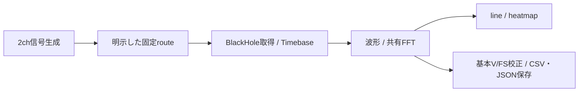

# 次期コア評価計画 — MIG-008へ集中

更新: 2026-10-04。MIG-008の最小測定フロー・短い比較・四案の判断を完了。
[判断0037](../migration/decisions/0037-mig008-integrated-evaluation.md)により、
Rust/QMLの一括展開を見送り、Rust core段階導入を次の評価方針とする。
製品切替は未実施。現状と再開の入口は[進捗](../migration/status.md)。
方針決定後、Qt/QML・rendererの並列試作と専用runner/CIを削除した。
以下のMIG-008フローと比較条件は実施時の記録。次の作業は現行GUIとRust coreの接続評価に限定する。

## 評価範囲

現在のmacOS Intel環境で、既存のRust core・Qt画面・音声境界を統合する。
WindowsとARM（macOS Apple Siliconを含む）の検証はMIG-008完了後へ延期する。
Linux x86_64の既存結果は利用するが、別環境の準備やremote CI待ちをMIG-008の前提にしない。
長時間試験は行わない。延期項目は未確認として判断に添え、完了を妨げる条件にはしない。

MIG-008の対象作業は[008-A〜C](#mig-008の実施順)だけとし、現在の対象範囲で完了した。
MIG-004〜007の未実装項目をすべて埋めてから統合する進め方は終了する。
追加作業は、対象フローを動かせない問題、数値・チャンネル・時刻・保存の誤り、
開始・停止・終了の不具合、判断に必要な比較へ限定する。

## 最小測定フロー

| 項目 | MIG-008で使う範囲 |
| --- | --- |
| 環境 | macOS Intel、BlackHole 2ch。物理機器の追加試験は不要 |
| 入力 | 2ch、f32、48 kHz、256 frames。ChannelIdとportを明示 |
| backend | 既存CPALを主経路にする。PortAudioは既存比較を利用し、同じ試験の全backend反復を追加しない |
| Qt接続 | CXX-Qtを統合の主経路にする。Qt Bridgeの既存結果を比較へ利用。これは採用の確定ではない |
| 解析・表示 | 同一区間の波形、共有FFT、line/heatmap。boxcar/Hann、peak/RMS/PSD、既存の手動Trigger/hold/release |
| 校正・保存 | 既存のID対応V/FS校正と不変snapshot。通常/TriggerのCSV・JSONを保存し再読込で値・来歴を照合 |
| filter | 必要なら検証済みの明示f32→f64、因果3-tap `[0.25,0.5,0.25]`、48→24 kHzを利用。追加構成は作らない |
| N-channel | 同じ統合coreへ保存4/8chを各1条件通す。長時間・全条件の直積へ広げない |

GUIや保存形式から独立したcore、容量制限付きqueue、結果の不変性を維持する。
同条件のFFTだけを共有し、表示更新の省略と取得gapを区別する。
チャンネル、区間、Timebase、世代、校正revision、validityを表示・保存まで保持する。
暗黙の精度変換や未校正値の絶対値化はしない。

[コア契約](../migration/contracts/core.md)、[数値基準](../migration/contracts/numerics.md)、
固定fixtureは既存の意味と許容差を維持する。
[AC一覧](../migration/contracts/acceptance.md)の全項目・全構成の実装をMIG-008の必須条件にしない。

## MIG-008の実施順

| 順序 | 作業 | 完了条件 |
| --- | --- | --- |
| 008-A | 既存部品を一つの2chフローへ接続 | 生成→固定route→取得→共有解析→複数表示→校正付き保存が動く。開始/停止/再開、開始または保存の失敗、購読解除/終了、Trigger保持を短く確認。保存4/8chでID・区間・共有結果の回帰を確認 |
| 008-B | 代表条件で現行Pythonと比較 | 同じ2ch入力と設定で各30秒・1回の実行比較、core編集と表示編集を各1回。CPU/RSS、表示更新・応答、gap、編集から確認までの時間、制約を記録。詳細は[比較条件](../migration/benchmarks/protocol.md) |
| 008-C | 四案の判断を記録 | A/Bの結果、既存証拠、重大な問題、延期事項を一つの判断表へまとめ、方針・理由・次の範囲を決める |

Aは代表2ch実入力と保存4/8ch、Bは各30秒・1回とcore/表示編集各1回、Cは0037の判断表で確認した。
最終reportと関連失敗の所在は[進捗](../migration/status.md#mig-008の今回の結果)を参照。

新しい独立probeや比較候補を増やさず、008-Aで確認した障害だけを修正する。
実行中のcrashや数値不正が残る場合は成功とせず、方式変更・段階導入・現行版継続の判断材料にする。
MIG-008の完了は評価と判断の完了であり、全41機能の移行や製品切替の完了とは分ける。

## MIG-008後へ延期するもの

- Windows・ARMのbuild、実行、音声、配布、UI検証。他OS/clean環境の配布保証。
- 全MonitorTap、動的route ackのgraph/GUI統合、製品backend選択UI、永続profile、import結果のplot統合。
- f32 filter演算、chain/SOS gap回復、全rate、親Trigger adapter、外部Trigger実機、全校正map/SPL。
- renderer候補の追加比較、10万〜100万点の追加試験、GPU texture共有、個別widgetの本実装。
- VST/ネットワーク音声の先行試作、全機器・物理遅延・排他・USB/スリープ復帰の網羅試験。
- 全41機能の展開順、正式配布、設定移行、旧版保守終了などの詳細計画。

長時間連続運転・耐久試験、10分×3回の性能試験、全条件の反復検証は現在の計画から削除する。
必要になった場合はMIG-008後の作業として改めて目的を決める。

## 検証と記録の運用

変更した挙動の対象テストと、統合の代表条件だけを実行する。
通った検証は、関連コード・条件の変更や新たな失敗がなければ繰り返さない。
再開時の全fixture verify、全backend×全Qt×全言語×全chの反復、
source/binary/artifactの二重三重の保存・再hash監査を作業ごとの必須手順から外す。
固定fixtureのhash検査、既存codecの入力検査など実行上の整合性確認は維持する。

Ruff lint/formatは作業終了時、Markdown lintはMarkdown変更時に実行する。
全言語UIサイズはレイアウト・翻訳を変更した場合に確認し、無関係な工程へ繰り返し追加しない。
Native CIは明示依頼でのみ実行する。維持するsuiteは`core`と`audio-backend`。
Windows・ARMの検証は手動でもMIG-008後まで実行しない。

記録は[進捗](../migration/status.md)、既存runnerのreport、008-Cの判断に集約する。
各小変更で手順書・決定記録・AC進捗の同じ説明を新規作成しない。
必要な記録はcommit/差分、コマンド・条件、結果・失敗・未確認点とreportの所在。
完了済み作業票と重複する残工程表は削除し、本書を工程の正本にする。
[検証結果の要点](../migration/status.md#再利用する証拠)と必要な決定記録だけを残す。
旧詳細履歴・重複手順・決定記録は削除し、元文書はGit履歴から参照できる。
最終reportは`.migration-local/evidence/`へ圧縮して保持し、古い中間物・複製は削除する。

現在のworktreeと`codex/migration-filter-qt`を再利用し、統合先は`codex/next-core-evaluation`。
main同期は対象フローに影響する変更があるときに行い、週次の全台帳監査をMIG-008の前提にしない。
PRを依頼された場合は[共通手順](../AGENTS.md#pull-request)に従う。

## MIG-008の判断

| 方針 | 判断すること |
| --- | --- |
| Rust + Qt Quick/QMLを本格展開 | 最小フローの正しさ、性能・反復速度、保守負担に進める価値があるか |
| 接続・描画方式を変更 | 問題がQt adapter/rendererへ局在し、coreを再利用できるか |
| Rust coreを段階導入 | 利益のある処理に限定して現行GUIへ導入できるか |
| 現行Pythonを継続 | 移行利益が費用を上回らず、設計改善だけを取り込むのが適切か |

Windows・ARMや長時間安定性は未確認と明示し、現在の対象範囲で判断する。
性能改善で数値・時刻・保存の誤りを相殺しない。
延期項目の実施は採用判断後に必要性と順序を決める。
