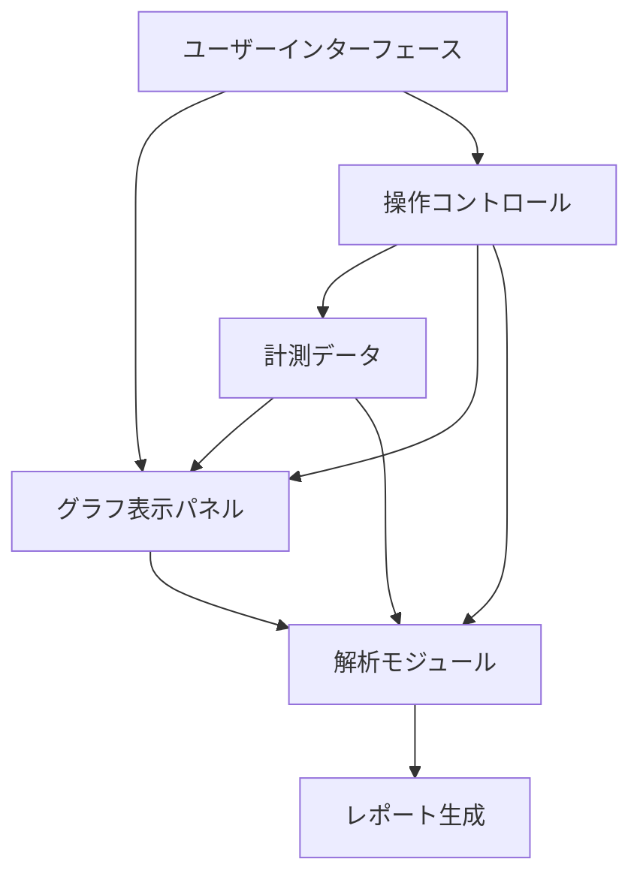

# エグゼクティブサマリー

本レポートでは、プロ向け音響測定アプリ／計測器のGUI設計ベストプラクティスを体系的に検証した。主要な計測器メーカー（Keysight/Agilent、Rohde & Schwarz、Brüel & Kjær、NTi Audioなど）や代表的な音響測定ソフト（REW、ARTA、Smaart、Diracなど）の公式GUI事例を調査し、周波数スペクトラム・スペクトログラム・ウォーターフォール・伝達関数・レベルメーター等の可視化パターンと操作モデルを整理した。さらに、精度・レイテンシ・可読性・発見性・エラー防止・ワークフロー効率・アクセシビリティ・学習容易性・設定柔軟性などのユーザビリティ評価基準を定義。レイアウト、配色、タイポグラフィ、アイコン、操作パネル、プリセット、測定・校正ワークフロー、多画面・タッチ操作・キーボードショートカット・API自動化といった要素についても分析し、リアルタイム性能・サンプリング周波数・画面サイズ・ローカライゼーション・規格遵守などのトレードオフと制約条件を議論した。以上を踏まえ、具体的な設計ガイドライン案およびチェックリストを提示し、製品比較表と測定フロー図・UIコンポーネント相互関係図を示す。主要な情報には公式資料や学術文献を参照・引用し、優先度付き推奨事項で締めくくる。

## 主要計測器メーカーのGUI例

**Keysight (旧Agilent/HP)：** 高精度音響アナライザU8903A/Bなどでは、4～8チャンネルの測定を同時表示できるカラーLCD画面を備え、スペクトラムやFFTプロットなど各種グラフが表示可能である。例えばU8903Aでは画面に4ch分の波形/周波数スペクトルを描画し、ワンボタンで測定モードを切替えられる。新機種U8903Bでも8ch同時計測が可能（図は製品画面例）で、2百万ポイントのFFT解析やPESQ/POLQA・MOS計測など高度な表示を提供する。GUIはモダンなウィンドウ型で、ナビゲーションバーやアイコンにより主要操作が直感的に行える。

図1. Keysight U8903B 音響アナライザの前面LCD表示例（複数チャネルのスペクトラム波形などを同時表示）

**NTi Audio：** ポータブル音響アナライザ＆サウンドレベルメータ「XL2」では、タブ式またはアイコン式メニューで多機能な測定モードを切替えられる。画面上には現在のL（レベル）値、1/3オクターブRTAスペクトラム、統計値（L_min, L_max等）などが並び、色付きの棒グラフで視認性高くレベルを示す。周波数加重・時間重み付け・可聴補正などの設定はメニューまたはファンクションキーで選択でき、キャリブレーションやメモ付加も支援される。XL2のGUIは「直感的操作でマニュアル無しでも使える」設計と謳われており、機能切換えやステータス表示に優れている。

図2. NTi Audio XL2音響アナライザ（左手）とそのLCD表示（実測例。右図は1/3オクターブRTA表示画面）

**Shimadzu（島津製作所）：** 分析計測ソフトウェアで統一GUIを採用し、すべての製品に共通の操作性・表示を確保している。画面左上に装置状態を色分け表示し、色覚特性を考慮した配色で一目で状況がわかるようにするなど、ユーザビリティを高めている。アイコンも大きく実体に近い色で描き、「何を示すか直感的に想像できる」設計になっている。分析計測機器のGUI設計に参考になる例といえる。

**その他：** 旧Rohde & Schwarz（R&S）の音響アナライザは現行では生産終了だが、UPVシリーズ等でアナログ・デジタル音声信号の精密測定を行い、Windowsアプリ（RSCommander等）から操作可能であった。Brüel & Kjær（現HBK）のポータブルアナライザ（Type 2250/2270等）も、カラー液晶画面でレベル・スペクトラム・RT60等をリアルタイム表示し、タッチ・ジョグで操作する機種がある。高機能機器ほどメニュー階層が深くなりがちだが、レベルメータのような単機能機器ではボタンと小型ディスプレイで簡潔な操作系が求められる。Audio Precisionや他の音響測定機器メーカーも類似した多画面・多チャネルグラフ構成のGUIを採用している。

## 音響測定アプリのUIパターン

プロ向け音響測定ソフトにも共通したUIパターンが存在する。多くは**スペクトラムアナライザ**（FFT）や**リアルタイムアナライザ（RTA）**、**スペクトログラム／ウォーターフォールプロット**、**インパルス応答**、**伝達関数・群遅延**、**位相プロット**、**歪み率/インタモジュレーション解析**などを主要な可視化要素として備える。例えばRoom EQ Wizard（REW）はフリーソフトながらスペクトラム、ウォーターフォール、スペクトログラム、RT60測定、クロマティックスペクトラム等を網羅し、複数トレースのオーバーレイ機能を持つ。ARTAもFFT解析、積分SPLメータ、歪み解析、水平方向・垂直方向のワーターフォールプロット（累積スペクトラルデケイ、バーストデケイ等）をサポートする。SmaartはリアルタイムFFT分析を基盤に、**リアルタイムモード**（スペクトラム、スペクトログラフ、伝達関数）と**インパルス応答モード**（時間波形、エネルギータイム曲線、群遅延、明瞭度・残響時間等）を持つ。リアルタイムモードではツイードカーブ、スペクトログラムや伝達関数（双方向FFT）を同時表示し、解析マーカーやデータ取得時間なども表示できる。Dirac Liveは部屋補正ソフトで、スピーカーの周波数特性や位相応答を測定して補正フィルタを生成するGUIを提供する。

これらアプリは一般的に**マルチトレース**（複数測定の重ね書き）と**オーバーレイ**を重視し、チャンネルや測定条件を切り替えながら同一グラフに比較表示できる。ズーム、パン、カーソル測定、スケール（対数・線形切替）、カラースキーム変更といった操作はツールバーやコンテキストメニューで提供される。例えばREWのグラフパネルにはカーソル表示・色変更・グラフ制御ボタン等が備わり、ALT+Cキーで画像保存できるなど充実した操作性を持つ。Smaartも多くのホットキーやマクロ設定が可能で、リアルタイム測定を素早く行えるよう設計されている。これら実例から、測定アプリUIでは**高いカスタマイズ性**（トレースの表示/非表示、FFTサイズ、平均回数、窓関数など）と**ダイナミックなインタラクション**（軸の拡大縮小、モード切替等）が重要であることが分かる。

図3. Smaart（Real-Timeモード）のGUI例。複数トレースのスペクトル・伝達関数・インパルス応答グラフを同時に表示し、ホットキー/アイコンで測定モード切替やズームが可能

## ユーザビリティ評価基準

音響測定UIの評価には以下のような基準が考慮される。**正確性・信頼性**：計測結果の精度が最重要であり、GUIも誤解やエラーを招く表示になっていないこと（ラベル、単位、目盛りの明示など）。**レイテンシ**：リアルタイム性が求められる場面では表示・操作遅延が結果に影響しないこと（高いサンプリングレートや高速演算）。**視認性**：文字やグラフ線は太さ・コントラストを十分確保し、長時間見ても疲れにくい配色とする。**発見性（Discoverability）**：機能や操作方法が直感的に分かること。例えばShimadzu製GUIでは、状態表示を画面左上に配置し色分けして「ひと目で分かる」ようにしている。**エラー防止**：無効操作を極力許さず、誤操作時には警告や復帰可能なUIを用意する（例：校正ステータス警告）。**ワークフロー効率**：頻繁に使う操作にはホットキー・ショートカットを提供し、画面遷移は最小限に抑える。**アクセシビリティ**：色覚多様性への配慮やフォント拡大機能、高コントラストモードなどを検討する。**習熟性・学習容易性**：同一メーカーであればUIの一貫性を保ち、ヘルプやチュートリアルを充実させる（NTi XL2でも「マニュアル不要で使える直感的UI」をうたっている）。**設定柔軟性**：画面レイアウトや各種パラメータをユーザが調整・保存できる機能も重要である。

## レイアウト・色・タイポグラフィ・アイコン・操作要素

GUI設計では**レイアウト**と視認設計が鍵となる。一般に左上にステータスや測定条件、中央部に大きなグラフ領域、左右または下部に設定パネルを配置するパターンが多い。Shimadzuの統一GUIでは装置状態を左上に置き、重要情報を常時表示している。**配色**はコントラストと視認性を重視し、背景色は暗色（黒・濃紺）か明色（白）いずれでもよいが、グラフ線色は各チャネルで明瞭に区別する。色覚多様者への配慮として、重要ステータス（正常/警告/エラーなど）には色分けする場合、高輝度・高彩度で色弱者でも判別しやすいパターンを選ぶ。**タイポグラフィ**では可読性重視でサンセリフ体などを使用し、文字サイズはモニタ解像度に応じて柔軟に拡大できることが望ましい。**アイコン**は実体に近い色や形で描き、大きめにして機能を直感的に示す。アプリによってはグラフ部分に直接ドラッグ操作可能なコントロール（ズームハンドルなど）を配置し、階層メニューを減らしている例もある。

**操作パネル・プリセット:** 入力信号や加重フィルタ、測定モードなど各種設定は直観的なスライダー・ドロップダウン・チェックボックスで実施し、**プリセット保存機能**を備えておくと複雑な測定条件の再利用が容易になる。キャリブレーションフローではマイク校正やレベル校正をガイドするダイアログを実装し、測定前の正確な設定を支援する。**マルチモニタ・タッチ:** 専用計測器やPCソフトでは複数モニタ対応が可能な設計が望ましい。例えばメイン画面をグラフ、サブ画面をログや解析レポート表示に利用できる。タッチ操作対応は主にハンドヘルド機器やタブレットアプリで考慮し、ボタンやスライダーをタッチしやすい大きさにする。**キーボードショートカット:** プロ用途ではショートカットキーが重宝されるため、主要機能にはキー割当を行いマニュアルに掲載する。**自動化・API:** 高機能ツールでは外部制御用にSCPIコマンドや専用API/ソフトウェアドライバを用意し、スクリプトやプログラムから測定/解析が自動化できるようにする。Rohde&SchwarzやKeysightなどではVISA/SCPIライブラリで計測器をPC制御できるほか、SmaartでもAPIやマクロ機能を用意している。

## トレードオフと制約条件

音響測定GUIには、**リアルタイム性能と精度**の両立など技術的制約がある。例えば高速FFTや広帯域測定（HDDAでは1.5MHz幅FFT）は演算負荷が高い一方、画面更新頻度とのバランスを考慮しなければならない。**サンプリング周波数・量子化ビット数**も性能に影響し、多チャンネル同時計測では帯域とメモリ消費を勘案したUI設計が必要である。**画面サイズ**による制約では、携帯機器の小型LCDではグラフ表示領域が限られるため、グラフ間の切替えUIやシンプルなバー表示を活用する。一方、PCやタブレットでは自由度が高いが、高DPIモニタ対応（スケーリング）にも配慮すべきである。**ローカライゼーション:** 多言語環境では文字列長が変わるためUIスペースやレイアウトに余裕を持たせ、異なる数値書式（小数点/コンマ）にも対応する。**規格・業界標準:** サウンドレベルメータではJIS C1509 やIEC 61672などの規格遵守が要求される。NTi XL2ではJIS C1509-1:2005等に適合し、IEC61260（1/3オクターブ Class0）等の帯域解析準拠が示されている。また、音響指標（STIPA、RT60など）では対応する国際規格に従う必要がある。**製品設計方針:** GUIの一貫性と信頼性を確保するため、Shimadzuのように「スタイル原則」「設計原則」をプロジェクトで定義・遵守すると良い。

## 設計ガイドラインとチェックリスト

以上の知見をもとに、音響測定アプリのUI設計指針案を以下にまとめる：

- **状態表示:** 測定ステータス（例えば「校正済」/「不安定」）は常に画面上部に表示する。色分けやインジケータで視覚的に明示する。
- **図表ラベリング:** グラフ軸や凡例には単位・符号を明確表示し、フォントは可読性の高い書体を使う。スライダやノブには現在値を数値で併記する。
- **配色:** 主要情報は高コントラストとし、重要な変化点（許容値超過など）は警告色で知らせる。背景を反転して暗色モード/明色モードを提供してもよい。
- **アイコン・操作:** アイコンは大きめに、実物に近いデザインで配置し、ツールチップやラベルで機能を説明する。重要操作（スタート/ストップ、校正開始など）はワンアクションで実行できるようにする。
- **ワークフロー:** 測定前にはキャリブレーションモードに誘導し、測定後は結果保存やレポート生成手順をガイドする（例：MTXでレポートボタンを強調表示）。
- **ショートカット:** 頻出機能にはキーボードショートカットを設定し、メニューやヘルプで一覧提供する。Smaartのようにすべてのモードで統一したGUI・ホットキー設計を目指すと習熟が早い。
- **設定の柔軟性:** 測定パラメータやグラフレイアウトはプリセットとして保存可能にし、ワンクリックで復元できる機能を提供する。
- **エラー防止:** 無効なパラメータ組み合わせは選択できないように制限し、ユーザが取り消しや再試行できるガイド付きUI（確認ダイアログ、アンドゥなど）を用意する。
- **アクセシビリティ:** 色覚異常配慮のカラーパレットを含め、文字サイズ・UI要素の拡大縮小機能を設ける。スクリーンリーダ対応は一般に要求されないが、例えば産業用機器ではJIS Z 8061などアクセシビリティ規格にも留意する。

これらは**チェックリスト**としてまとめると便利である。たとえば「主要操作が3クリック以内で可能か」「画面遷移やダイアログ数が最小化されているか」「フォント・色でアクセシビリティを確保しているか」といった項目を検証時に確認する。

図4. 典型的な音響測定ワークフロー例（キャリブレーション→設定→測定→処理/可視化→レポート）

図5. UIコンポーネントの関係図（グラフ表示、操作コントロール、データ、解析モジュール、レポート生成などの連携）

## 製品比較表

下表は各製品／ソフトの主な属性を比較したものである。

| ベンダー・製品       | 対象ユーザー              | 主な可視化機能                                        | 設定柔軟性                           | リアルタイム性                   | プラットフォーム               | 価格モデル                   |
| :------------------- | :------------------------ | :---------------------------------------------------- | :----------------------------------- | :------------------------------- | :----------------------------- | :--------------------------- |
| Keysight U8903B      | 研究開発エンジニア        | 多チャネルFFT、スペクトラム、THD、PESQ/MOS            | 豊富（オプションモジュール）         | 高速ワイドバンドFFT              | 専用筐体＋Windowsソフト        | 高額ハードウェア＋ライセンス |
| NTi Audio XL2        | 環境・職場騒音技術者      | 1/3オクターブRTA、SPLレベル、統計値                   | 中（測定モード切替式）               | リアルタイムOct/RTA              | ハンドヘルド(モバイル)         | 比較的安価 (計測器)          |
| REW (Room EQ Wizard) | 音響エンジニア/愛好家     | スイープ・FFT・RTA・ウォーターフォール・RT60等        | 非常に高（すべてのパラメータ調整可） | ソフトウェア上でリアルタイム計測 | Windows/Mac/Linux (Java)       | 無償                         |
| ARTA                 | 音響研究者・技術者        | FFT、積分SPL、CSD/ワーターフォール                    | 高（多数プラグイン・信号選択）       | リアルタイムスペクトラム         | Windows (スタンドアロン)       | フリーウェア                 |
| Smaart (Suite)       | ライブ音響エンジニア      | RTA、スペクトログラフ、伝達関数、位相、インパルス応答 | 高（複数チャンネル・マクロ可）       | 本格的リアルタイム測定           | Windows/Mac                    | 有償（永続/年額ライセンス）  |
| Dirac Live           | オーディオ愛好家/AV設置者 | 周波数応答、位相特性、インパルス応答補正              | 中（補正フィルタ生成機能）           | リアルタイムではない             | Windows/macOS (スタンドアロン) | 有償 ($99–349)               |

(_可視化機能は一部例示、価格は執筆時点の目安。_)

## 優先度付き推奨事項とガイドライン構成案

以上の分析を踏まえ、優先度の高い推奨事項とガイドラインの構成案を以下に示す。

- **一貫性の徹底（★★★★★）** – 同一製品群ではGUIの操作体系を統一し、アイコン・配色・ショートカットを共有する。例えばSmaartでは全エディションで共通GUI/ホットキーを採用しており、利用者は複数モードを瞬時に使い分けられる。
- **見やすさと情報優先度の確保（★★★★★）** – 計測値やグラフは大きく明瞭に表示し、重要度の高い情報（校正状態、現在レベルなど）を優先して見せる。Shimadzu例のようにステータスは左上、グラフは中心、設定パネルは隅に配置するとよい。
- **操作の直感性・学習容易性（★★★★☆）** – 多機能なほど学習コストが増すため、操作手順を論理的に整理する。アイコンは機能を連想しやすいデザインとし、ホットキーやプリセットで熟練者の作業効率も確保する。新規ユーザ向けにツールチップや導線ヘルプも検討する。
- **設定の柔軟性と自動化（★★★★☆）** – プリセット機能やスクリプト制御（API/SCPI）を充実させ、複数回測定・長時間測定の効率性を高める。例えばNTi XL2ではSDカードにデータを保存し、専用ソフトで一括解析できるようにしている。
- **リアルタイム性と性能（★★★☆☆）** – 高速FFTや連続測定が必要な場合、UI更新による遅延が生じないよう最適化する。サンプリング周波数やFFTサイズの上限を設計し、画面フレーム更新レートとバランスさせる。
- **多様性対応（★★★☆☆）** – カラーユニバーサルデザインや多言語UIを考慮し、幅広いユーザに対応する。アクセシビリティ（拡大表示、音声フィードバック等）は規格や用途に応じて検討する。

提案ガイドラインの構成例：序章で対象と目的を明示し、GUIデザイン原則や用語解説を行う。その後、画面構成・配色・アイコン設計・操作フロー・データ可視化要素ごとに章立てし、各章末にチェックリスト項目を示す。最後に優先度付きの推奨事項をまとめる形式が考えられる。

**参考資料:** Keysight・NTi・Shimadzu等の公式サイトや技術資料、REW・Smaart・ARTAのマニュアル・機能概要を基に作成した。各引用にあるように、プロ機器では「直感的」「分かりやすい」GUIを標榜し、アイコン・配色・レイアウト原則を重視していることが窺える。本報告での提言はそれらを一般化・拡張したものである。
