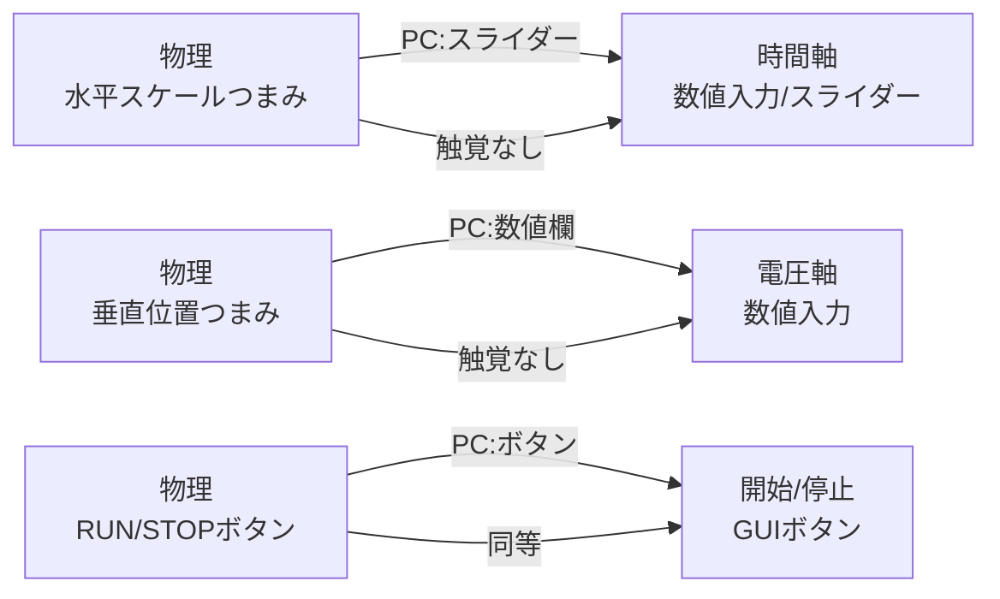

# エグゼクティブサマリ

本レポートでは、キーサイト、テクトロニクス、ローデ・シュワルツ、NI、Pico Technology、Digilent、Audio Precision、MathWorksなど各メーカーの計測機器の物理フロントパネル（ノブやボタン、ディスプレイなど）と、それを制御するPCソフトウェア（GUI）との対応関係を比較・分析する。各製品の公式ドキュメントから典型的な操作フローやUI要素を整理し、物理装置の操作部品（例：回転ノブ、ボタン、表示器）とPC上のウィジェット（例：数値入力欄、スライダー、グラフ表示）のマッピングを示す。それぞれのマッピングが「原来の操作感を保持した形態（preserved）か代替された形態（replaced）か拡張された形態（extended）」かを分類し、その背景やユーザビリティへの含意を考察する。最後にこれらを製品横断的に比較した表を示し、設計上の繰り返し現れる原則やトレードオフ（直接操作の再現 vs. モダリティの変更、触覚フィードバックの喪失、精度 vs. 発見性 など）を整理する。

## Keysight PathWave BenchVue

マルチインストゥルメント対応のキーサイトBenchVueソフトウェアは、電源やオシロスコープ、マルチメータなどの物理装置をPC上で制御できるアプリ群を提供する。例えば電源装置向けの「Power Control & Analysis Software (PW9252A)」では、「電源装置の高度なソーシングと測定機能に簡単にアクセスできる」と謳われ、対応機種が列挙されている。BenchVueアプリでは、電源装置前面パネルの**電圧調整ノブ**や**電流調整ノブ**はPC上では数値入力欄やスライダー、さらにはマウスホイールによる微調整操作に置き換わる（物理ノブ → GUIスライダー／ダイアル）。**ディスプレイ表示**はPC画面上のグラフや数値ウィジェットで再現される。原来的な触覚的クリック感や連続回転の感覚は失われるが、PCでは大量のデータログや自動テストシーケンス機能が拡張提供されており、物理操作以上に高度な自動化や多点測定が可能になる。一方、細かな連続値設定はマウス操作では難しいため、数値入力による直接設定やスライダーのスクロールで補う設計になっている。これにより**精度**よりも**効率**や**視認性**が優先され、操作感は「置換された」が、**拡張された機能性**も同時に実現されていると言える。

## Keysight PathWave VSA

KeysightのPathWave 89600 VSA (Vector Signal Analysis)ソフトウェアは、RF信号解析を行うツールであり、対象となる物理機器（スペクトラムアナライザなど）のGUIを模した操作画面を提供する。物理機器の周波数つまみやゲインダイヤルはPC上で**ドロップダウンメニュー**や**数値入力フィールド**で代替される場合が多い。信号スペクトルの表示もオシロスコープと似た波形表示領域で再現される。公式資料では「複数のRF信号をPC上で解析し、高度な視覚化・復調・解析が可能」と紹介されているが、具体的なUI要素対応情報は見つからなかった。一般に、物理機器の**周波数シフトノブ**はGUIのスライダや入力欄に置換され、「直接操作感」は代替されるが、PC側ではズーム機能やFFT解析など追加機能で**拡張されている**。

## Tektronix TekScope

TektronixのTekScope PC Analysisソフトウェアは、オシロスコープの波形解析機能をPC上で実現するツールで、Scopeと同様の操作体験が特徴だ。「TekScope PCはオシロスコープへのリモートアクセスをシームレスに提供し、物理的に装置の前にいなくてもその機能をフル活用できる」と明記されている。TekScopeのGUIには、チャネル選択、垂直・水平移動ノブ、トリガーレベル設定、カーソル移動などの機能がオシロスコープと似たレイアウトで再現されている。例えば**水平スケールつまみ**（Time/Divノブ）はPC上でスライダまたは数値入力ボックスに置き換え、**垂直位置ノブ**も同様にGUIの数値欄や矢印ボタンで操作可能となる。**RUN/STOPボタン**はソフトウェアの開始停止ボタンに対応する。物理的ノブの連続回転操作は消失するが、代わりに**マウスホイールでの微調整**や**キーボードショートカット**（例：カーソルキー）で正確な設定が可能になっている。図に示すように、TekScopeはオシロスコープ画面と同等の波形表示をPC上に示し、カーソルや測定結果を同じ直感的な配置で扱える。設計上、直接操作感は「代替」だが、PC上では複数Scopeの同時表示やデータ保存機能、波形共有など**拡張機能**が加わっており、利便性が増している。

## Rohde & Schwarz PCソフトウェア

ローデ・シュワルツ社では、HMExplorerなどのリモート制御ソフトウェアを提供するが、これらは主にコマンドベースやモジュール型で、物理フロントパネルのUIを忠実に再現するものではない。例えばR&S HMExplorerでは、複数のインストゥルメントを管理・操作するタブ式インタフェースが中心で、**個々の物理ノブやボタンが直接現れるわけではない**。その結果、物理装置とソフトウェアとのUI対応は明示的に記載されておらず、**置換・拡張**というよりは「遠隔コントロール用の独自GUI」という形態になる。したがって、物理的な触覚操作感は基本的に失われ、PC上のメニュー・ダイアログ・スクリプトコマンドで機能にアクセスする方式が取られている。

## NI LabVIEW

NIのLabVIEWはプログラミング環境であり、特定機器のUIを再現する製品ではない。LabVIEW自体はGUIフロントパネルで計測・制御用のVI（仮想器具）を構築するものであり、物理機器のパネルとは直接の関係は薄い。そのため本分析対象からは外れるが、一般にLabVIEWでは**仮想メータ、スライダ、数値制御ボックス**などのウィジェットを組み合わせ、各種測定機器の機能を実装する形態となっている。

## PicoScope

Pico TechnologyのPicoScopeシリーズでは、USB接続オシロスコープをPC上で操作する。PicoScope 7（最新ソフト）は全機種共通のソフトウェアで、すべての現行および過去モデルをサポートし、無料で利用できることが明記されている。PicoScopeにはハードウェアのダイヤルやボタンは存在せず、**すべてPC GUIで実現**される。横軸スケールや垂直ゲインなどはソフト上のドロップダウンリストやスライダーで設定し、波形表示域はPC画面上のグラフで直接ドラッグしてズームできる。従って「物理ノブに相当する操作」はすべて**数値入力欄**や**ドラッグ操作**に置き換わる（原操作は「保持」せずGUI化される）。図にあるPicoScope 7の例では、トリガレベルや軸レンジの入力欄、波形ブラウザなど標準的GUIコンポーネントが並び、**GUI拡張**として複数波形の重ね書き、FFT表示、データロギング機能などが容易に使える。一方、マウス操作中心となるため**触覚フィードバックは皆無**で、直感的なつまみ操作感は失われている。

## Digilent WaveForms

DigilentのWaveFormsは、Analog DiscoveryなどのUSB計測器用ソフトで、複数の仮想器具（Scope, WaveGen, Logic, Pattern等）をタブまたはウィンドウ形式で提供する。WaveFormsには物理的操作パネルが存在せず、すべてGUI上のウィジェットで制御する。たとえばオシロスコープ機能では、**時間軸ノブ**や**電圧軸ノブ**はスライダーと数値入力欄、**チャネルのOn/Offボタン**はチェックボックスやトグルボタンに対応する。デジタルパターンジェネレータやロジックアナライザ機能も同様に各種アイコンやメニューから設定する。一方で、WaveFormsは多機能性を優先するあまり、インタフェースが複雑になりがちとの指摘もある。UI設計は拡張性重視で、多数のコントロールがコンパクトに並ぶが、**視認性・発見性**とのトレードオフが見られる（例：項目が隠れたりアイコン化で直感性が低下する）。操作の「直接性」は失われるものの、**複数計測モジュールの並列動作や柔軟なウィンドウ配置**などPCソフトならではのメリットが享受できる点が特徴である。

## REWとARTA

REW (Room EQ Wizard)やARTAは主にPCオーディオ分析用のソフトウェアで、物理的な計測器は伴わない。またGUIは標準的なウィンドウベース（グラフ、ボタン、メニューなど）で設計されており、**機器パネル操作との対応付けはない**。これらではPC画面上の操作が唯一のインタラクション手段であり、パネルUIからの移行という観点は適用されない。

## Audio Precision APx

Audio PrecisionのAPxシリーズは高精度オーディオアナライザで、専用ソフト(APx500)により制御される。ProSoundWebの記事では、バージョン8.0では測定アルゴリズムの高速化によりテスト時間を大幅短縮できると報じられている。APx機器本体にも物理パネル（ボタンやエンコーダなど）は存在するが、ユーザのほとんどはPCソフトを通じて操作する。APx500ソフトの画面例を見ると、測定条件やグラフ表示が豊富なUIウィジェットで構成され、**波形表示**・**スペクトル表示**などはPCディスプレイ上に忠実に描画される。物理機器の**ノブ**（例：レベル調整用）や**クリックホイール**での操作は、PC上では**数値入力フィールド**や**スライダー**、あるいは**ダイヤル式コントローラ**ウィジェットに置換される。APx500ではシーケンスプログラミングによる自動化が豊富に備わっている点が強みであり、これにより「物理操作感」の保持よりも**自動測定・レポート生成**などが重視されている。触覚的な操作フィードバックは失われるが、PC上での豊富な可視化機能や高度解析機能の拡張がメリットとなっている。

## MATLAB計測ツールボックス

MathWorksの計測器制御ツールボックス類は、あくまでプログラミング環境の一部であり、GUIアプリケーション自体を提供するものではない。そのため物理UI要素との対応付けは存在しない。MATLABでは数値入力やグラフ表示用の標準的なGUIコンポーネント（uicontrolやGUIDE/APP Designer）を駆使して任意の計測アプリを作成できるが、**固定的なデバイスUIの再現性**はライブラリ提供されていない。

## 製品横断的比較表

下表は各製品における典型的なUI要素の対応関係の概略である。各要素について「物理装置側の要素（コントロール種類、触覚的特徴）」と「PC側のGUIウィジェット（代表的操作方法）」、そして操作感の保持状況をまとめた。

| UI要素                     | 例（物理機器）                       | PC GUI要素/操作                                              | 保持・置換・拡張 | 製品例・注釈                                                     |
| -------------------------- | ------------------------------------ | ------------------------------------------------------------ | ---------------- | ---------------------------------------------------------------- |
| **回転ノブ**               | スケール調整ノブ（Scope, PSUなど）   | スライダー、数値入力欄、ダイアルウィジェット、マウスホイール | 置換             | TekScope (ノブ→数値入力)、BenchVue電源（ノブ→入力欄/スライダー） |
| **ボタン**                 | ON/OFFボタン、モード切替ボタン       | GUIボタン、チェックボックス                                  | 保持/置換        | BenchVueやAPx (ON/OFFはGUIボタン、トリガ設定もメニュー)          |
| **ディスプレイ表示**       | 5桁DMMディスプレイ、スペクトラム表示 | 画面上グラフ、数値パネル                                     | 拡張             | BenchVue全般、APx (グラフに統合、ログも可能)                     |
| **ダイヤル（微調整）**     | マルチファンクションダイヤル         | スクロールホイール、ドラッグ操作                             | 拡張             | TekScope（カーソルドラッグ）、WaveForms（ズームツール）          |
| **ハードウェアプリセット** | プリセット切替スイッチ、ツマミ       | プリセットメニュー、ドロップダウン                           | 拡張             | WaveForms、APx (複数設定の呼び出しをPC上メニューで提供)          |
| **複数チャンネル切替**     | チャンネルセレクトボタン/ダイヤル    | タブ切替、チェックボックス                                   | 置換             | WaveForms、PicoScope (タブ選択でチャネル表示)                    |

## 設計原則とトレードオフ

上記の比較から、計測器UIをPC GUIに移植する際の繰り返し現れる設計パターンが見えてくる。一つは「**直接操作感の維持 vs. 置換**」のトレードオフである。物理ノブは直感的かつ同時操作に適するがPCではマウス操作に置き換えられるため、連続調整の手触りが失われる。その代わりに数値入力やホイール操作が導入され、**精度操作と発見性**とのバランスが変化する。特にオシロスコープのカーソル調整などは、マウスドラッグで柔軟かつ正確にできる一方で、リアルノブのような迅速な粗調整感は減少する。

また「**モダリティ変換**」も共通テーマである。計測器は往々にしてモードスイッチを持つ（例：測定レンジ切替）が、PCではすべてGUI内のメニューやトグルで一元管理され、モード間の遷移が明示的になる。その結果、モードミスなどによる誤操作は減るものの、画面遷移の手間や階層の深さが増えることもある。

さらに、**触覚フィードバックの喪失**による影響も重要である。物理ノブはステップ感があり、操作結果が手元で感じられる。一方、GUI操作ではフィードバックは視覚的（値の変化）に限定され、操作ミス時の気付きが遅れる場合がある。これを補うために、ソフトウェア側ではズーム機能や拡大表示、カラーハイライトといった視覚的強調が工夫されている例が多い。

最後に「**拡張性**」が明確に現れる。PCでは複数の計測器を同時に扱ったり、取得データをそのままログや解析に回したりと、物理パネルだけでは不可能なワークフローが実現できる。例えばBenchVueではシーケンス機能、PicoScopeでは高度なFFT解析機能がGUI上で統合されている。これらは元の物理UIにはない機能であり、**拡張された価値**としてユーザビリティに寄与している。

上図はオシロスコープの物理UI要素とそれに相当するPC GUI要素の例を示す。左右の矢印が「物理→PC GUI」であり、ノブはスライダーや数値入力欄に、ボタンは同等のソフトウェアボタンに置換されている。また、ノブ操作の**触覚フィードバック**が失われる点も注記した。

以上、各製品の実機UIとPC GUIを比較した結果、**直接操作性**よりも**柔軟性・自動化**を重視する設計思想が共通して見受けられた。一方で、高精度な調整を必要とする場合にはキーボードショートカットや数値入力が備えられ、**精度確保**と**発見性**（インタフェースのわかりやすさ）のバランスが図られている。これらのトレードオフは、今後も計測器のPC統合におけるデザインに影響を与え続けるであろう。

**参考資料:** 各製品の公式マニュアルおよび技術資料などを参照し、実機とソフトウェアのUI対応について整理した。
