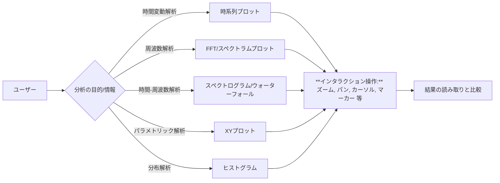

# 時系列・信号解析可視化のインタラクティブデザインガイドライン

## エグゼクティブサマリー

時系列データや信号解析では、**時間軸・周波数軸**上での複数チャネル・多次元データの可視化が重要です。各プロット（時系列、FFT/スペクトラム、スペクトログラム、XY、Bode、ヒストグラム、ウォーターフォール、マルチチャネル）には固有の目的や注意点があり、誤解を避けるため適切な設計が必要です。**インタラクション機能**（ズーム、パン、スケール、自動・手動スケーリング、カーソル/マーカー、ツールチップ、軸ラベル、単位、グリッド、凡例、トレース選択・表示、参照トレース、ライブ/ホールド、トリガー、測定読み出し）もユーザ体験に大きく影響します。本報告では、各プロットタイプと各機能ごとに「目的」「誤解防止」「知覚・UX原理」「推奨設定」「多重比較対応」「アクセシビリティ」「リアルタイム性能」「実装上の留意点」を分析し、**具体的UIパターン**や**ジェスチャー例**、**計測器/ソフトウェア事例**を交えて解説します。さらにプロットタイプ間比較表や設計チェックリストを示し、設計ルールをまとめます。

ユーザは主に信号解析ツール（オシロスコープ、スペクトラムアナライザ、計測ソフト）を操作するエンジニア・研究者を想定し、ミリ秒～秒オーダーのリアルタイム性能が求められるケースを想定します。

## プロットタイプ別ガイドライン

### 時系列プロット

**目的:** 信号振幅の時間変化を直感的に把握し、トレンドや変化点・周期性を視認する。典型的には横軸に時刻 (秒、ミリ秒など)、縦軸に振幅（ボルト、音圧レベルなど）を取る。

**誤解防止:** データ点を線で結ぶことで連続性を暗示するが、実際のサンプリング間隔や欠損データを示さない場合がある。値の急変や欠損を明示するか、離散点表示を併用するとよい。

**知覚/UX:** 線グラフは少数系列での傾向把握に優れる一方、多数系列では重なりが生じやすい。5系列以上では**スモールマルチプル**（小チャート集合）への分割が推奨され、認知負荷を軽減できる。色覚バリアフリーの観点では、色覚異常者に配慮したパレット（赤緑を避け、青系・橙系を使うなど）を採用する。グリッド線は淡い灰色にし、必要最小限に留めてデータ強調を優先する。軸には単位付きのラベルを必ず明示し、時間軸は等間隔かつわかりやすく。

**推奨設定:** デフォルトでは時間軸は線形で周期性の理解に適す。Y軸は適度な余裕を持つ自動スケーリングとしつつ、ユーザが固定スケールに切替可能にしておく。凡例や軸ラベルには日本語説明または国際単位を併記し、フォントはアクセシビリティに配慮し大きめにする（小文字で4.5:1以上のコントラスト推奨）。

**比較用工夫:** 複数チャネルを同一グラフに重ねるときは色と線種を変える。または時系列を縦方向にオフセットして並べる手法（オシロスコープの多重トレース表示）も効果的。オーバーレイ比較では正規化や差分を表示して動的変化を強調できる。複数期間や条件を比較する場合は、小チャート群やスライサーで絞り込み、横並びに比較する。

**アクセシビリティ:** 色覚多様性対応色を用い、凡例やラベルをキーで操作可能にする。文字サイズは 12pt 相当以上を確保し、色と文字で重要情報を区別する。

**リアルタイム性能:** 大量データでは表示を遅延させないため**ダウンサンプリング**や集計が必須。例えば時間ウィンドウごとに最大・最小値を残す手法（LTTBアルゴリズムなど）でピークを維持する方法が有効。1秒間に数千点以上の更新ではGPU描画やマルチスレッドレンダリングを検討する。

**実装注意:** サンプリング定理（Nyquist）に注意し、高周波成分はエイリアシングしないよう適切なサンプリングやアンチエイリアス処理を行う。大域更新時は滑らかな軸遷移（アニメーション）でズレを感じさせない。

### FFT/スペクトラムプロット

**目的:** 信号の周波数成分分布を表現する。横軸に周波数 (Hz)、縦軸に振幅またはパワーを取る。FFTプロットは計算スペクトルで、スペクトラムプロットはスペアナ表示等を含む広義とする。

**誤解防止:** Y軸がデシベル (dB) なのか線形振幅なのか明示しないと大幅誤解を招く。対数スケールで表示する場合は単位も添える。ピークが見えていても窓関数効果やFFT解像度で振幅が下がる場合があり、窓の影響を注記する。周波数軸を対数軸にすると音響的・制御的な読みやすさが増すが、ゲイン低減を識別しにくくなる場合がある。

**知覚/UX:** スペクトラムでは複数系列の比較が課題。複数トレースは色分けで重ね描くか、小多重チャートで並べる。トレース選択や表示/非表示トグルを凡例やチェックボックスで提供すると比較が容易になる。縦軸は通常dB（対数）表示にし、ゼロゲイン (0dB) や基準レベルを明示する。不要なグリッドは消し、必要時は目盛線を薄く表示する。

**推奨設定:** デフォルトは周波数軸を線形（低域重視）または対数（広帯域表示）から選択可能とし、縦軸はdB表示を用意する。FFT幅・窓関数は用途に合わせ可変で、デフォルトはハニング窓など標準窓とする。

**比較用工夫:** 正規化振幅表示や基準トレース（参照線）を同時表示し、対象信号と比較可能にする。ピークトレースや制限線（リミットライン）を用い、合否判定を視覚化できる。

**アクセシビリティ:** 対数/線形表示の切替や目盛の増減はツールチップやコンテキストメニューで提供し、軸ラベルで単位(Hz, dB)を明確に示す。色覚配慮では高コントラストな色または縞模様で複数線を区別する。

**リアルタイム性能:** 高速FFTでは一定時間幅を固定長バッファとして更新し、過去スペクトルは移動（ウォーターフォール）表示で蓄積することが多い。複数FFTトレースはサンプリングレートとFFTポイント数で計算量が増えるため、常にサブサンプリングで負荷を下げるか、ハードウェアアクセラレーションを使う。

**実装注意:** 実周波数範囲を逸脱しないようバンドパスフィルタ前処理を行い、基準ゲインとの差をゼロに合わせる。スペクトル密度の場合、窓関数と正規化を考慮して振幅をスケーリングする。

### スペクトログラム（ウォーターフォール）

**目的:** 時間変化する周波数成分を**時間-周波数平面**で可視化する。水平軸に時間、垂直軸に周波数を取り、強度は色（熱マップ）または3D高低で表す。ウォーターフォール表示は、いわば3D表示版のスペクトログラムである。

**誤解防止:** カラースケールがデータ値（パワー）と対応するよう凡例付きのカラーバーを必ず表示する。通常、強度は対数(dB)で表現するため、デフォルトレンジや閾値設定を明示しておく。カラーマップには**虹色（HSV）**を避け、視覚グラフで効果的な**等間隔色相**（例：グレイ→ブルー→グリーン→レッド等）を選ぶ。色盲配慮のため、色相より明度変化で強度を表現するパレット（Viridis, Plasma系）も有効。

**知覚/UX:** コントラスト（ゲイン）とレンジの調整が重要。例えばAudacityでは「Gain」「レンジ」設定で白→黒の色分割を調整する。UIとしてはピンチでタイム・ズーム、上下スワイプで周波数レンジ調整、スライダでコントラスト調整といった操作系が使われる。画面上に時間経過線（ビーカー）や任意の周波数ラインをマーカー表示すると解析が進む。

**推奨設定:** デフォルトカラーマップは、帯域の影響が少なく視認性の高いもの（例：ウルビスや黄緑-黒の等間隔グラデーション）とし、データレンジに合わせゲイン値を設定して高輝度飽和を防ぐ。時間軸・周波数軸は必要に応じ対数スケールも選択肢とし、ラベルで線形/対数を明示する。

**比較用工夫:** 同一チャート上で複数トレースのスペクトログラムを重ねるのは難しいため、スモールマルチプル（並列チャート）で並べる。あるいは、ある時間を固定して（静止画）トレース間比較する機能をサポートする。

**アクセシビリティ:** カラーバーには数値目盛りと単位(例：dB)を大きめフォントで示し、キーボードで注目バンドを上下に移動できるようにする。色覚障害者には色とパターンの併用（色付きマーカー＋斜線など）も選択肢とする。

**リアルタイム性能:** スペクトログラムは重い処理を伴うため、リアルタイム性では以下対策が必要。短時間FFTを高速に繰返し実行し、部分表示に限定してメモリ負荷を抑える。時間分解能と周波数分解能のトレードオフを考慮し、必要な帯域のみFFTする。前処理の平滑化(メディアン・フィルタ)で雑音を低減し、描画時はヒートマップをGPUで可視化する。

**実装注意:** 周波数フィルタやSTFTを用い、窓幅を適切に選ぶ。時間方向にも並列処理を使い、多数FFTを迅速に行う。描画ではビニングや補間で滑らかに見せる。

### XYプロット

**目的:** 2つの変数の関係性（特に位相や相関）を可視化する。オシロスコープではChannel1 vs Channel2 の電圧プロットなど、周波数掃引と組合せてBode図を簡易生成する用途もある。

**誤解防止:** 通常の時間軸ではないため、軸ラベルで「X軸 = 信号1、Y軸 = 信号2」と明確に表記する。時間進行方向がわかるよう矢印マーカーを付与する工夫（例：Lissajous曲線で点に色濃淡や矢印付きで時系列順を示す）がお薦め。ダイアグラムの読み取りに慣れないユーザ向けに、サブプロットに時間波形も併記する例もある。

**知覚/UX:** 一般の散布図と同様、点が重なると読みづらい。アニメーションで周期ごとに可視化し、軌跡のアニメーション描画で動きを強調するUIが有効。位相評価時はグリッドを無くし、円形リスジュー図の読取りを重視。凡例は通常不要だが、データ系列が複数ある場合はカラーコードを添える。

**推奨設定:** デフォルトは等間隔の軸スケール（同一目盛でチャネルが同じ範囲なら相関が読みやすい）。2信号間に重畳線を引かず、各点または線分で表す。メモリカーソルをXY平面に動かせば対応する時間波形上の点もハイライトするなど双方向カーソルも有用。

**比較用工夫:** 2チャネル間の位相差を評価するには、XYプロット上の形状（例：円対角線）を比較する。複数条件比較では小多重チャートやオーバーレイで可視化する例もある。

**アクセシビリティ:** 散布図同様、カラーユニークな2色などで各系列を区別。軸ラベルには単位(例: V, mA)を明記。多重系列には凡例操作で表示/非表示を切替え可能にする。

**リアルタイム性能:** 入力信号がリアルタイム更新される場合、サンプリング周期に応じてXY点をプロットし続ける。高サンプリング時は点群密集を防ぐため間引き表示やアルファブレンドが必要。

**実装注意:** チャネルゲイン/オフセットを合わせ、アスペクト比1:1に保って等角度を歪まないようにする（位相比較が容易になる）。またフィルタリングされたアナログ信号でエイリアシングがないか確認する。

### ボード線図 (Bodeプロット)

**目的:** 線形システムの周波数応答を周波数軸で可視化する。振幅特性（ゲイン）と位相特性の２つのグラフを並べて表示するのが標準。振幅軸は通常対数デシベル(dB)で表示し、位相軸は度(deg)で表す。

**誤解防止:** 振幅軸のゼロdB点（ゲイン1）や位相軸の±180°の交差を明示する。位相が不連続（180°以上超える）場合は位相展開（unwrapping）や補正表示を行い、不意な飛びを避ける。軸目盛に「Hz」「dB」「deg」等の単位と、軸の意味を正確にラベル付けする。

**知覚/UX:** 周波数は通常対数軸にすることで数オクターブに渡る表示が可能になる。ラグランク幅など制御設計的視点では対数目盛が望ましい。グリッドはログ軸専用に格子線を出し、読み取りを助ける。振幅と位相で共通の周波数目盛りを使うと比較がしやすい。ダブルY軸は使わず、振幅/位相で別グラフに分ける。

**推奨設定:** 振幅グラフでは0dB線を太線で描画し、ゲイン減衰が見やすいよう目立たせる。位相グラフでは±180°または0°の基準線を表示し、±360°周期性を図示可能にする。周波数軸のデフォルト範囲は測定対象に合わせ可変とし、高周波域に充分な余裕を持つ。

**比較用工夫:** 他系との比較時は参照系（目標/限界）を点線表示しておく。シミュレーション値と実測値など複数トレースを色分けし、凡例で識別できるようにする。

**アクセシビリティ:** 対数軸では1→10→100…のラベルを明示し、十の累乗スケールを理解しやすくする。文字サイズは視認性優先で大きめにし、位相グラフとの連携（矢印で同周波数を可視化）機能も提供。

**リアルタイム性能:** フィルタ・制御系設計では非リアルタイム解析が主だが、周波数掃引中のリアルタイム更新では計算負荷に注意。FFTサーチのような高速アルゴリズムや事前計算グリッドを使う。

**実装注意:** 位相の巻き戻し処理やフェーズ補正に注意し、ユーザ選択（不連続可/不可）を提供する。振幅軸に線形も選択可能にし、利得1以下/以上で切り替えられるUIを用意するとよい。

### ヒストグラム

**目的:** 信号振幅やある計測値の値の**分布**を可視化し、ピークや偏り、外れ値を把握する。横軸に値域（ビン）、縦軸に度数または確率密度を取る。

**誤解防止:** Y軸が度数か確率か明示し、基線は0を起点にする必要がある。ゼロ始点でないと高さ比較が錯覚を生む。「頻度」or「確率」を必ず表記し、目盛りは0から始まるようにする。ビン幅が見た目に直結するため、デフォルトを調整可能にし、説明ツールチップで「ビン数」「幅」を表示する。

**知覚/UX:** デフォルトでは10～20程度のビン数が多いが、データ量・範囲に応じて選択できるようにする。ビン境界を点線や色分けで示し、境界値のラベルを付与すると読みやすい。複数データ系列のヒストグラムを比較するには、重ね合わせ（半透明の色）かスモールマルチプルを使い、凡例または直ラベルで系列名を表示する。

**推奨設定:** 凡例は系列数が1なら不要。デフォルトビン数はデータサイズに応じて自動計算し、必要なら手動調整できるUIを添える。Y軸上限は度数では最大頻度、確率では1.0以下で調整する。軸ラベルには単位・概念を明示する（例：「振幅 [V]」）。

**比較用工夫:** 複数条件の分布比較時は、図を左右並べるか、異なるチャート色でオーバーレイし、凡例で明示。あるいは累積分布(CDF)も併記して分布の違いを把握しやすくする。

**アクセシビリティ:** 色覚対策として透明度や斜線パターンでも系列を識別できるようにする。目盛線は薄く控えめにし、ラベルは太字か背景コントラスト高めで印字。テキスト情報も併記可能にし、視覚障害者向けのテーブル出力も提供するとよい。

**リアルタイム性能:** ライブ信号の振幅変化を逐次ヒストグラム化する場合、ウィンドウをずらしつつ更新するため演算量が高い。高速実装では累積分布用ビンテーブルにインクリメンタル更新し、描画はビン境界線のみ再描画するなどの最適化が必要。

**実装注意:** ビン範囲内にデータが無いときもバーを0長さで描画し、欠落ビンがわかるようにする。x軸は均等間隔のビンに設定し、ラベルは境界に合わせて配置する。

### ウォーターフォールプロット

**目的:** スペクトラム/スペクトログラムの時間履歴を3次元的に表現する。通常、奥行き（または前後方向）に時間軸を、X/Y平面で周波数と振幅（色や高さ）を示す。多重スペクトルを視覚的に並べることで時間変化を理解しやすくする。

**誤解防止:** 3D視点では奥のデータが覆い隠されやすい。また色か高さかを誤認しやすい。視点操作可能なUIを用意するか、同じデータを平面（2Dスペクトログラム）でも参照可能とする。カメラ角度はデフォルトで斜め上からとし、軸ラベルは手前平面に沿って表示する。

**知覚/UX:** 水平方向の連続性より個別スペクトル比較が目的なら、各スライス間に隙間を空けて並べ、ベロシティグラデーションで時間を表現する方法もある。凡例代わりに時刻やトリガーイベント位置をテキスト注釈する。

**推奨設定:** X-Y平面はスペクトルプロットと同じ設定を共有し、Z軸（時間）は一定間隔で配置する。色マップも併用し、高低と色の二重表現で強度を示せば誤読を減らせる。

**比較用工夫:** 複数シナリオのウォーターフォールは、並べて比較するか、または動画アニメーションでシーンごとに切り替える。「多重スペクトルを重ねると混線する」ため個別プロットで比較する方がよい。

**アクセシビリティ:** 3D要素は一般に視覚障害者向けに厳しいため、静的な2D平面も用意し、音声ガイドやテーブル出力への切替を考慮する。また3Dチャートでは明暗コントラストを強くし、傾きを緩くして視認性を向上させる。

**リアルタイム性能:** 実時間連続更新のウォーターフォールでは、古いデータは逐次消える（メモリ制限のため）前提となる。大量の2Dテクスチャを高速に描画する必要があるため、GPUによるスペクトル描画やタイリングが必要。

**実装注意:** 3D描画ではピクセルアーティファクトやアンチエイリアシングに注意。高い周波数分解能やサンプリング周波数に対し、Z軸の時間刻みを滑らかにするため時間間引き表示か線形補完を行う。

### マルチチャンネルプロット

**目的:** 複数チャンネル（例：多チャネルオシロスコープやセンサー群）の波形を同時表示し、同期性・相関を解析する。通常、各チャンネルを縦方向に並べたりオフセットして1画面に重ねて描画する。

**誤解防止:** 異なるチャンネルのスケールやオフセットが異なる場合、凡例や軸ラベルで明示しないと比較困難。軸を共有するか、チャネルごとに左軸/右軸を使い区別する。共通時間軸の際は、すべてのチャネルで時間同期する。

**知覚/UX:** 色分けされた各チャンネルに直接ラベルを書く（例：左端に「Ch1 (赤)」）と見やすい。表示・非表示機能で対象チャネルに注目できる。スタック形式（上下に重ねて並べる）にするか、薄い半透明グラフで重ねるかは、比較対象による。

**推奨設定:** デフォルトでは各チャンネルを個別色・縦方向にオフセットして表示し、凡例またはオンオフチェックボックスを用意して視認性を確保する。互いに比較したいチャネル同士の距離を揃えるか、Y軸オフセット機能を付ける。

**比較用工夫:** チャンネル間の差分グラフを別途表示したり、すべてのチャネルを標準化（最大値1として）するなどして形状比較を容易化する。XY軸のような別モードでチャネルを対峙させる機能もある。

**アクセシビリティ:** チャネルごとの色は前述のカラーパレットを活用し、チャンネル名をフォント表示する。表示切替は凡例クリックまたはチェックボックス（ARIA制御付き）で操作できるようにする。

**リアルタイム性能:** 全チャネル同時描画では描画負荷が高くなるため、チャネル数が多い場合は可視化ウィンドウを分割し、更新範囲を限定する。

**実装注意:** 各チャネルのサンプルレートやタイミングが異なる場合は補間やリサンプリングで同期させる。マルチユニット（電圧/圧力など）混在時は右軸に別ユニットで表示するか、グラフ分割を検討。

## インタラクション/注釈機能別ガイドライン

### ズーム

**目的:** 興味領域を拡大し、詳細な構造や高周波の小変化を確認する。

**誤解防止:** 過度なズームで全体の文脈が失われないよう、縮小したビューとハイライト同期する例が望ましい。デフォルトでは画面中央が基準になりがちなので、選択範囲ズーム（ドラッグで矩形選択して拡大）と、中心拡大（ホイール/ピンチで拡大）を併用できるようにする。

**知覚/UX:** マウスホイール回転またはキーボード（Ctrl+Plus/Minus）で拡大、タッチデバイスではピンチイン/アウトでズームするのが標準。選択矩形ズームを有効にするとパンとの混同を防げる場合がある（ドラッグツール+特殊キーで切替）。ズーム時に拡大率や現在位置を示すプレビュー・ミニマップを表示するのも有用。

**推奨設定:** 全軸同時ズームまたはX/Y軸別ズームを選択制御できる。まず水平（時間軸）だけを拡大する場合が多いので、水平軸ズーム専用操作（例：Shift+ホイールでX軸拡大）も用意する。

**比較用工夫:** 複数プロットで同一領域を比較する場合は、「同時ズームリンク」機能を入れ、片方ズームで他方も自動的に一致させるUIがよい。

**アクセシビリティ:** ズーム操作はキーボード（Ctrl+↑↓や数値入力）でも可能にする。ズーム倍率を音声読み上げする機能やツールチップをつけると視覚障害者にも有用。

**性能:** 大量ポイントでのズームは再レンダリングが重い。LOD（Level of Detail）手法で縮小中に表示簡略化し、最終画面更新時に全詳細を描画する。GPU活用でスムーズに動作させる。

### パン（スクロール）

**目的:** グラフの表示領域を移動して、時間・周波数範囲を横断的に確認する。

**誤解防止:** パンでは表示範囲が変わってもデータが切れる位置にグラフ端が来る可能性があるため、インディケータでグラフ外部に隠れたデータ量を示す。パン中でもカーソル位置や選択機能が正しく動作する。

**知覚/UX:** 画面ドラッグ（クリックホールド移動）でパンするのが直感的。ホイール回転との混同を避けるため、ホイール=ズーム、ドラッグ=パンにする。パニング時はマウスカーソルが手の形になるなど、状態変化を視覚化する。タッチでは2本指ドラッグでパン操作を兼ねる。

**推奨設定:** パン操作で軸ラベルやグリッドも同時に動くようにし、フレーム更新をスムーズにする。X/Y軸を独立にパンできるようにし、たとえばCtrl+ドラッグでY方向のみ移動、Shift+ドラッグでX方向のみ移動を切り替える。

**比較用工夫:** 複数画面同時パン（リンクパン）を実装し、片方のグラフをパンすると対応する他のグラフも連動して移動する。

**アクセシビリティ:** パンもキーボードやボタンで操作可能とし、データの区切りポイントでスナップ移動するオプションを提供して配置精度を上げる。

### 自動スケール/手動スケール

**目的:** データ範囲に対して最適な軸レンジを自動計算（自動スケール）し、常に全データを表示させる。一方、ユーザが明示的にスケールを固定・変更する機能（手動スケール）も必要。

**誤解防止:** 自動スケールがデフォルトだと、データが動的に変わるたびに表示範囲が変動しユーザが追跡しづらい。手動スケールモードでは、明示的に固定中であることをUI上で示し、データ外への変化で警告表示（例えば軸端が赤く点滅）する。

**知覚/UX:** 「AUTO」ボタンで自動スケール開始、「固定」チェックで手動スケールに切換えるUIが一般的。スケール値はグリッド間隔を分かりやすく選択し、数値入力で微調整可能にする。対数スケールも自動/手動で設定できる。

**推奨設定:** デフォルトは自動スケールで全データを含める。表示対象に広がりが出てきたら自動的に拡大・縮小する動作をスムーズアニメーションで行う。異なる系列が大きく異なる振幅を持つ場合は、それぞれの軸スケールも提供し、比べたい系列同士は同スケールに揃える。

**アクセシビリティ:** 大きなデータ変動が視覚的に追いかけづらい場合、自動更新を一時停止できる「ホールド」機能と組み合わせて提供する。スケール固定中は視覚的にアイコンなどで明示する。

### カーソル/マーカー

**目的:** ユーザがグラフ上の任意位置を指定して値を測定・比較する。水平（X）カーソルは時間差、垂直（Y）カーソルは振幅差を読み取るのに使われる。マーカーは特定ポイントにタグ付けする注釈的役割もある。

**誤解防止:** カーソルを非表示・表示切替でき、選択した系列・軸に対してのみ動作するよう制御する。例えば「CH1のみカーソル機能」「全系列に適用」の切替オプションを用意すると誤操作を減らせる。

**知覚/UX:** オシロスコープでは２本のカーソルを使い時間差・振幅差を直接表示する。同様にGUIでは水平カーソル2本でΔt、垂直カーソル2本でΔVを動的計算し、画面上に数値表示する。カーソルをドラッグ可能とし、必要なら吸着機能（波形頂点・交点に自動スナップ）を付ける。

**推奨設定:** 水平・垂直カーソルを個別に表示/隠可とし、常にX/Y値と差分Δを表示欄に出す。カーソル位置は十字型または矢印付きにしてわかりやすくする。マーカーはイベント位置を示すため、色や形状で刻印できるようにし、複数色でカテゴリ管理できるとよい。

**アクセシビリティ:** カーソル操作もキーボードで移動できるようにし、スクロールバーやスライダ代替も提供する。読取り値を音声読み上げしたり、視覚要素にフォーカス可能にすることで支援技術に対応する。

_図1: オシロスコープでの2本カーソル測定例。水平カーソル（黄色）が時間差Δtを、垂直カーソル（緑色）が振幅差ΔVを示しており、下部に数値読出しが表示されている。_

### ツールチップ

**目的:** マウスオーバー/タッチでデータ点の詳細情報（値やラベル）を表示する。誤差や付加情報の提示にも使われる。

**誤解防止:** 重要な値は必ず軸ラベルでも補完し、ツールチップは補助的とする。大量の点にカーソルを重ねると煩雑になるので、必要なポイントに絞る（ハイライト機能やフォーカスポイント機能）こと。

**知覚/UX:** 触れるだけで表示され、ポイントから離れると消える即時性が望ましい。グラフをタッチできる場合はタップ/ホバーで表示し、非アクティブ時は非表示とする。情報過多にならないよう、要点だけ（例：値と単位、シリーズ名）に絞って表示する。

**推奨設定:** データ値とシリーズ名・単位などを含めた簡潔フォーマットで表示。座標軸方向にツールチップが縦横どちらに張り付くか自動制御し、文字がグラフ外にはみ出さないようにする。複数系列が重なっている場合、最も近い点かクリックした点のみ情報を出す。

**アクセシビリティ:** キーボード操作でもツールチップが呼び出せるようにする（Tabキーでポイント選択など）。また音声読み上げ対応では、フォーカスした点の値を読み上げる機能を追加する。

### 軸ラベル・単位

**目的:** データの物理量・単位を明確化し、ユーザがグラフ軸から何を読めばよいか判別できるようにする。

**誤解防止:** 軸ラベルがない、または不適切な単位表示は致命的。例えば「Time (ms)」や「振幅 (V)」のようにラベルに内容と単位を同時に示す。対数軸なら「logHz」などを明記する。英語/和語混在する場合は統一感に注意する。

**知覚/UX:** 読みやすいフォントで縦・横両方書体を使用し、軸目盛よりやや大きめに表示。グリッド線と干渉しない色（黒または濃紺）を用い、W3C準拠のコントラスト比を満たす。単位は正式な記号を使い、専門外ユーザ向けには略称の注記も有用。

**推奨設定:** 日本語UIでは「時間 [s]」「周波数 [Hz]」「電圧 [V]」などの形式で軸に併記する。実装上は軸レンジの変更に連動して自動的にラベルも更新する。グリッドの世代間隔とラベル間隔が一致するよう目盛設定を行う。

**アクセシビリティ:** 軸ラベルは対比高めにし、読み上げ時の代替テキスト（例：「X軸：時間, Y軸：振幅」）を用意する。フォントサイズは最低でも12pt相当を確保し、ラベル位置が読み飛ばされないよう整列する。

### グリッド線

**目的:** 軸目盛の補助として値読み取りを容易にする（値と軸との対応を視覚的に結ぶ）。

**誤解防止:** 過度なグリッドはグラフと競合して視覚ノイズになる。必要最低限、薄色または点線で控えめに描画し、注目すべきトレンドを邪魔しないようにする。重要な目盛には細い目盛線のみ残し、節点には太線を入れるなど段階的に強調する。

**知覚/UX:** 背景グリッドは灰色の細線、前景トレースは太線で明確に区別する。値の差が読み取りづらいほど小さくない限り、グリッドは目盛方向（横軸なら縦線）を薄目にする程度で十分。特に折れ線グラフでは、データ線が主役となるようグリッドを「目立たない元素」とする。

**推奨設定:** デフォルトでは主要目盛のみ太線、補助目盛は不要またはごく薄い点線にする。ズーム時はグリッドを自動更新し、ズームレベルに応じた間隔の格子線を再描画する。スケールが対数の場合は格子を指数刻みに合わせる。

**アクセシビリティ:** 色覚に配慮し、白黒/印刷でも見やすい濃度設定にする。コントラストチェックツールを用いて背景との差を3:1以上に保つ。Gridオン/オフは簡単に切り替え可能にし、必要に応じ使用者が選べるようにする。

### 凡例

**目的:** 複数系列プロットで各系列の意味（名称・色・線種）を示し、系列間の対応を明確化する。

**誤解防止:** 一系列のみの場合は凡例不要。複数系列でも凡例とデータラベル（グラフ上直接ラベル）を両方出すと冗長なので、いずれかに統一する。凡例が画面を覆い隠さないよう、グラフ外または余白部に配置する。

**知覚/UX:** 一般に画面右側または下部に置くと読みやすい。特に多数系列の場合は右側配置が適し、凡例が縦に並ぶ。各凡例項目はマーカー＋系列名で示し、マーカーの色・線種がグラフ線に対応する形にする。タッチデバイスでは凡例タップで系列の表示/非表示を切替えられると操作性が上がる。

**推奨設定:** グラフ縦横比に応じ配置を最適化する。例えば横長なら下部、縦長なら右側に置く。凡例行間は余裕を持たせ、文字は明朝系よりゴシック系で可読性重視。シリーズ数が多い場合はスクロール可能な凡例ボックスにする。

**アクセシビリティ:** 凡例項目もフォーカス可能とし、キーボードで移動・切替できるようにする。視覚障害者にはツールチップ等でシグナル名を読み上げる。

### トレース選択・表示切替

**目的:** マルチトレース表示で個々の系列のON/OFFやハイライトを行う。ユーザが関心のある系列だけを強調・絞り込めるようにする。

**誤解防止:** デフォルトで全系列表示だが、密なオーバーロードは混乱を招くので、表示制御UIを明示しておく。色の凡例をクリックする、チェックボックスで系列表示を切替える等のインターフェースが一般的。表示オフの系列でも凡例上には残し、再表示しやすくする。

**知覚/UX:** 凡例クリックで系列非表示、再クリックで再表示する機能は直感的。複数選択（Ctrl+クリック）でグループ化も可能にすると便利。弱グレー化や目盛り線で消去済み系列を示すと紛らわしくない。

**推奨設定:** 凡例コンポーネントにチェックボックスやスイッチを組み込み、一括で全系列の表示/非表示もできる。ボタン操作とキーボード（矢印とスペース/Enterキー）で制御できるようにし、アクセシビリティを確保する。

**アクセシビリティ:** ARIA属性で系列の表示状態を伝える。スクリーンリーダーでは「系列A: 現在表示中/非表示中」と読み上げる。色以外にマーカーやパターンでも系列を区別する選択肢を用意する。

### 参照トレース

**目的:** 比較基準となる参照波形や目標曲線を重ねて表示し、対象データとの差分を視覚化する（例：規格リミット線、キャリブレーション曲線）。

**誤解防止:** 参照トレースは補助的なので、凡例で明確にラベル付けし主たるデータと区別する（例えば点線や異色で表示）。参照の更新可否もアイコンなどで示す。スケールも参照と測定データで異なると誤解の元なので統一する。

**知覚/UX:** 参照線は目立ちすぎないデザイン（色薄め・点線）にしつつ、差が明瞭になるよう配置する。ツールチップや凡例で参照値・意味を明記する。トリガーイベントと組み合わせ、参照に対する変化点をマーカーで示すと理解しやすい。

**推奨設定:** 参照トレースの表示/非表示ボタンを用意し、必要時のみ表示できるようにする。比較時にはオーバーレイと差分表示を切替可能にし、スペクトラムでは参照ベースラインを省略値として描画することも可能。

**アクセシビリティ:** 参照波形も凡例やツールチップに情報を持たせ、色覚依存しない形で差異を示す（例：符号やマーカー利用）。

### ライブ/ホールド（Run/Stop）

**目的:** リアルタイムデータの更新を停止（ホールド）し、一時的に画面上の静止グラフで詳細解析できるようにする。再度ライブに戻すと更新再開する。

**誤解防止:** 「停止＝データ取得停止」と混同されないよう明示する。ホールド中はグラフ上に大きく「HOLD」表示を出し、再開操作ボタン（▷/■）でわかりやすくする。ライブログラフでは時刻表示が静止しないよう注意。

**知覚/UX:** スペクトラムアナライザやオシロではRun/Stopボタンが標準。GUIでは「▶ライブ」「■停止」ボタンを配置し、押下で状態遷移する。ステータスLEDや色で現在状態を強調する。

**推奨設定:** 初期はライブモード。ホールド中は軸変更やカーソル測定が有効化され、ユーザ操作で再開可能。連続トリガモードとの違いを説明する。

**アクセシビリティ:** 停止中にもデータテーブルビューに切替可能にし、視覚障害者でも解析しやすくする。ライブ再開時は音声通知するオプションも考えられる。

### トリガー

**目的:** 任意のイベント（例えば信号が閾値を超えたタイミング）でデータ取得や表示を同期させる。決められた条件でグラフがキャプチャされ、解析者の関心点が強調される。

**誤解防止:** トリガーレベルやエッジ（上昇/下降）の設定値が直感でわかるよう、設定UIに実際の波形と位置を示すゲージを付加する。複雑なトリガモード（パルス幅、ウィンドウ）もプリセット呼出やツールチップで説明書きを提示する。

**知覚/UX:** トリガ位置を波形上に矢印や点線で示し、現在の波形がその条件を満たしているかハイライトする。トリガ設定時にテスト信号で確認できるようにし、設定ミスを避ける。

**推奨設定:** オシロスコープ同様、エッジレベルトリガをデフォルトにし、レベル値とエッジ方向をUIで指定する。トリガモード（自動/ノーマル/シングル）をタブまたはトグルで選べるようにし、自動連続捕捉中でもシングルトリガができる。

**アクセシビリティ:** トリガ設定もキーボードで操作可能にし、設定中に音声でレベル値を読み上げる。スペクトラムアナライザのスパン/センタ周波数切替もトリガ設定に含め、ナビゲーションを容易にする。

### 測定読み出し

**目的:** 波形やスペクトラムの特性値（周波数、振幅、ピーク間隔など）を数値で提供し、客観的に解析できるようにする。

**誤解防止:** 読み出し値に単位・説明を付け、何を示すか明確にする。値の精度（小数点桁数）と更新間隔を適切にし、見かけの振動（フリッカー）を抑える。

**知覚/UX:** オシロスコープでは自動測定機能が充実しているが、カーソルやグリッドでも計測可能と紹介されている。GUI上でも主要な測定項目（ピーク振幅、周波数、RMS、周期、パワーなど）をチェックボックスで選択可能にし、結果を別表示部または吹き出しで示す。ユーザ定義の式測定（例：FFTピーク差分、スペクトログラム中心周波数など）をサポートする製品もある。

**推奨設定:** デフォルトで代表的な測定をオン（例：最大振幅・最小振幅・周波数）とし、ユーザが追加/削除できるようにする。読み出し結果は測定タブで一覧するか、グラフ上に注釈で直接描画する。精度向上のため、読み出し位置にズームウィンドウ（インサートビュー）を表示する機能も好評。

**アクセシビリティ:** 結果はテキストとしても確認できるよう表形式出力し、スクリーンリーダーに対応させる。

## 機能・プロット比較表および設計チェックリスト

以下の表は主要プロットタイプとインタラクション機能の対応例・特徴をまとめたものです。各セルは該当要素の有無や適用例を示します。

| 機能/プロット         | 時系列                   | FFT/スペクトラム       | スペクトログラム/ウォーターフォール | XYプロット           | Bodeプロット        | ヒストグラム          | マルチチャネル       |
| --------------------- | ------------------------ | ---------------------- | ----------------------------------- | -------------------- | ------------------- | --------------------- | -------------------- |
| ズーム                | 典型的 (時間/振幅拡大)   | 周波数/振幅軸拡大      | 時間・周波数軸拡大可                | データ散布拡大       | 周波数軸拡大可      | ビン幅縮小            | 時間軸拡大           |
| パン                  | 対応 (時系列移動)        | 対応 (周波数移動)      | 対応 (時間移動)                     | データ移動           | 周波数移動          | 対象外                | 時間移動             |
| 自動/手動スケール     | 自動: チャートに合わせる | 自動: 振幅レンジ調整   | 自動: 対数強度レンジ調整            | -                    | 対数軸等            | Y軸: 0開始            | 各チャンネル独立調整 |
| カーソル/マーカー     | 時間・振幅差計測         | 周波数ピークマーク     | 時間周波数選択可                    | 相関点選択           | 振幅位相差計算可    | 各ビン選択 (頻度表示) | チャネル間差測定     |
| ツールチップ          | データ値表示             | 頻度/振幅値表示        | 時間-周波数データ表示               | X,Y座標表示          | ゲイン/位相値表示   | ビン範囲・頻度表示    | 各波形値表示         |
| 軸ラベル/単位         | 時間 [s], 振幅 [V]       | 周波数 [Hz], 振幅 [dB] | 時間 [s], 周波数 [Hz]               | X軸/Y軸の信号名+単位 | 周波数 [Hz], dB/deg | 値の範囲 [unit], 度数 | 各チャネル単位表示   |
| グリッド              | 軽量線(主目盛)           | 軽量線(主目盛)         | 背景グリッド(薄色)                  | 無し/軽量            | ログ目盛線表示      | 無し/軽線             | チャネル分割線       |
| 凡例                  | 複数系列時(凡例+色)      | 複数トレース時表示     | シリーズ数少なら不要                | 通常不要             | トレースなし        | 系列重ね時のみ        | チャネル名表示       |
| トレース選択/表示切替 | 可能 (凡例やチェック)    | 可能 (凡例または設定)  | –                                   | –                    | –                   | 系列比較時利用        | 可能 (チャネル単位)  |
| 参照トレース          | 可能 (目標線等)          | 目標リミット線         | 参照スペクトログラム                | –                    | 設計仕様値          | 目標分布              | 基準波形             |
| ライブ/ホールド       | 必須 (Run/Stop)          | 必須 (Sweep/Stop)      | 必須 (更新停止)                     | –                    | –                   | –                     | 必須 (同期待機)      |
| トリガー              | 時間/レベルトリガ        | 周波数掃引トリガ       | 周波数/時間起点トリガ               | –                    | –                   | –                     | –                    |
| 測定読み出し          | 周期・周波数・RMS等      | ピーク周波数・レベル   | 時間帯域解析(中心周波数等)          | 位相/周波数          | 利得余裕、位相余裕  | 平均値・中央値        | 各波形RMS/ピーク     |

**設計ルールチェックリスト（要点）:**

- 軸とデータの**単位・ラベル**を必ず明記する (例：時間[s]、電圧[V])。
- 凡例・データラベルは冗長にならないよう一貫性を保つ。
- ズーム/パン/カーソルなどのインタラクションは**直感的なジェスチャー**（ホイール／ドラッグ／ピンチ）と**キーボード**併用で実装する。
- グリッドは淡色で目盛りを補助し、不要なら削除する。凡例は画面外側に配置し、系列数が1なら表示しない。
- 複数系列比較には**スモールマルチプル**や**Linked View**(同期ズーム/パン)を活用し、オーバーレイの混乱を避ける。
- **色覚多様性**対応色（色盲パレット）を用い、同時にパターンや線種で区別できるようにする。
- フォントとコントラストは**視認性優先**で、文字色/背景はWCAG推奨比率を満たす。
- 実データがリアルタイムに更新される場合、高速な**データ集約・描画**が必須。
- カーソル・ツールチップなどのインタラクティブ要素は**キーボード操作可能**にし、ARIA属性でアクセシビリティを配慮する。
- 新規仮定・制約は文書冒頭で明記し（例：ユーザはエンジニア、リアルタイム解析を想定）必要があれば補足する。

以上の指針により、信号解析用途のグラフと操作系をユーザにとって直感的かつ誤解の少ないものとし、効率的な解析作業を支援できる。各プロットタイプおよびインタラクション機能については、実装例や公式マニュアルを参照しながら、上記ルールに沿ってデザインを行うことが望ましい。

**参考文献:** 各節中の引用番号内に示した資料に基づく。 (Tektronix/Keysightガイド、データ可視化研究論文、UIライブラリ文書等)
