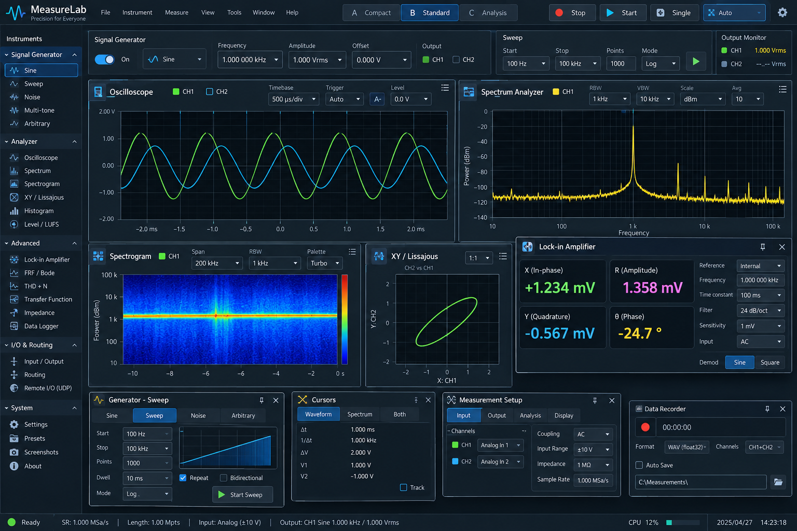

# MeasureLab Rust 開発計画

更新日：2026-10-05。段階1・2a〜2eのプロトタイプを出発点に、同じ入力を複数の測定器で観察・解析できるワークスペースを育てます。操作と実測結果は [README.md](README.md)、段階2の完了判断は [統合検証の記録](README.md#段階2の統合検証2026-10-05) にまとめます。

## 目指すワークスペース

[Dream.png](Dream.png) は視覚的な目標です。画像の配置や数値をそのまま仕様にせず、次の方向性を採用します。



- **測定結果を中心にする**：暗い背景に読みやすい波形・軸・測定値を置き、プロットを広く使う。色はCHや測定器の対応を助け、色だけに状態を依存させない。
- **共通操作を固定する**：取得の開始／停止、入力状態、共通カーソルを常に見つけられる位置へ置く。取得・解析・描画・出力・記録の状態を区別する。
- **測定器を選んで設定する**：左側は測定器一覧と選択した測定器の設定への入口にする。全測定器の詳細を長い一列へ積み重ねず、各パネルにも日常操作とSettingsへの入口を設ける。
- **用途に応じて配置する**：現在の左右／上下配置から、パネルの移動・サイズ変更・表示状態の保存へ進む。Compact / Standard / Analysisのような用途別の配置はプリセットとして検討する。
- **発生器と解析器を同時に使う**：将来は上部に出力の状態と必要な操作をまとめ、下部で複数の解析結果を観察できるようにする。出力の開始は取得開始とは別の明示操作にする。
- **補助機能を必要なときに開く**：カーソル、測定セットアップ、ロックイン、記録などは、主なプロットを邪魔しないパネルとして追加する。

画像中の電圧、dBm、可変RBW／VBW、1 MSa/s、入力インピーダンス、自由配置、出力・記録などは将来の表現例です。現在の音声入力の性能や実装済み機能を示しません。未実装の測定器や操作はメニューへ先に並べません。

## 現在の到達点

段階1と2a〜2eは、4測定器を同時に使うプロトタイプとして完了しました。物理入力はユーザー確認済みとし、今回の統合検証は内部デモと仮想デバイスを対象にしています。性能目標の未達や未計測項目は、機能の完了とは別に追跡します。

| 項目 | 現在できること | 現在の境界 |
| --- | --- | --- |
| 共通入力 | CPALで1〜16chの同期フレームを取得し、f64の固定容量履歴に保持。内部デモへ切り替え可能 | サンプルレートはデバイス既定。16ch超はエラー。外部ADC・ネットワーク入力は未実装 |
| Scope | 最初の2chの波形、トリガー、RMS・Peak・P-P、ピクセルごとの極値集約 | 任意CHの表示ルーティング、入力校正は未実装 |
| Spectrum | 1,024〜32,768点、3窓、全入力CHからの選択、DC除去、指数電力平均、ピーク保持、対数／線形周波数軸 | 最新窓のスナップショット解析。最大30回/秒、N/4以上の新規サンプルが必要。短い過渡の検出は保証しない |
| Spectrogram | 専用ワーカーの連続STFT、N/4 hop、512行の循環履歴・テクスチャ、欠落区間表示、独立したCH・FFT設定 | 時間範囲を広げても保持容量は増えない。平均・ピーク保持は使わない |
| XY / Lissajous | 同じ入力フレームのCH 1×CH 2、独立した観察窓・両軸、FreeとTrace Snap | モノラルでは無効。最大32,768点の連続区間。任意CHルーティング・残像保持は未実装 |
| 停止・カーソル | 全測定器の保持、世代による遅着結果除外、A/Bの共有、停止中の表示変更 | ScopeはX位置、SpectrogramはY位置、Trace Snapはトリガーからのサンプル差を保持。XY Freeは独立したFS座標 |
| 配置・設定 | 測定器の表示選択、アコーディオン、設定パネルの非表示、広い画面で2×2・狭い画面で上下4行 | セッション内のみ保持。起動をまたぐ保存・自由配置・翻訳は未実装 |
| 検証 | 数値テスト、GPU読み戻し、画面確認、CPUベンチマーク、仮想入力切り替え、連続動作の欠落・RSS記録 | GPU実行時間、入力から表示までの遅延、Windows／Linux実機は未確認 |

現在の単位はデジタルFSと片側ビン振幅のdBFSです。1 FS peakのビン中心正弦波を0 dBFSとし、窓のcoherent gainを補正します。DCとNyquistは2倍しません。ΔfはFs/N、RBWは窓の等価雑音帯域です。PSD、dBm、電圧、独立した可変帯域フィルターの測定ではありません。

周波数カーソルは共通のHzを各FFTの最寄りビンへ対応させます。Spectrumは表示中の平均値と最新の寄与窓を示し、時間カーソルでFFTを再実行しません。欠落・範囲外・未保持の値に別のサンプルや窓を代用しません。再開・入力切り替えで古いデータと選択を無効化します。

## 維持する設計原則

以前の覚書を、今後の変更を判断する基準として引き継ぎます。大きな仕組みを先に完成させる必要はありませんが、後続の拡張を妨げる密結合を避けます。

1. **1〜16chを前提にする**：コアを2ch固定にしない。同期したフレームと共通サンプル番号を保持し、解析・描画するCHだけを選択する。全16chのFFTを無条件に実行しない。
2. **f64を測定コアの標準にする**：サンプル・共通履歴・トリガー・測定値・窓係数・電力平均をf64で扱う。FFTなどで有効な場合だけ測定器ごとにf32を明示選択し、解析設定へ保持する。現在の高速FFTと同様に、DC除去と窓適用の後でFFT入力だけを変換する。実デバイスの32bit形式などへの変換は入出力境界で行い、整数PCMへ縮小する場合はディザーを選べる設計にする。
3. **測定とGUIを分離する**：DSP・履歴・校正・解析結果をeguiや特定のプロット方式へ依存させない。将来の描画方式交換、MCP/API、ヘッドレス利用を妨げない。
4. **同じ計算結果を再利用する**：FFT計画・作業メモリ・座標を再利用する。計算グラフ／シグナルフローは必要になった範囲から導入し、入力区間・CH・窓・精度・校正などが一致する処理だけを共有する。異なる測定器の独立した設定を共有のために制限しない。
5. **時間と欠落をデータに持たせる**：入力世代、整数サンプル番号、Fs、CH、解析窓、欠落を測定結果へ対応させる。長時間や履歴の折り返しでも順序を保ち、失った区間を接続しない。校正や複数入力の時計情報は対応機能を追加する段階で拡張する。
6. **処理量とメモリを制限する**：コールバックは変換と固定容量キューへの書き込みに限定する。解析・記録はそれぞれ上限のあるキューと世代管理を使い、取得やUIを待たせない。変更のないプロットのGPU転送と停止中の連続再描画を避ける。
7. **精度と性能を同じ基準で検証する**：GUI非依存の計算モジュールに数値テストとCPUベンチマークを用意する。CPU処理、描画準備、GPU実行、更新頻度、取得から表示までの遅延を混同しない。
8. **4層の検証経路を保つ**：アルゴリズム単体→内部ソフトウェアループバック→外部仮想オーディオデバイス→物理デバイスの順に確認できる構造にする。内部信号は実際のUI・プロットの目視確認にも使う。
9. **表示文字列をロジックから分離する**：将来9言語程度を想定し、測定器・設定・プリセットには安定した内部IDを使う。英語や翻訳後の文字列を分岐条件・保存形式に使わない。

## 共通パイプラインと責務

```text
CPAL入力 → 固定容量SPSC → 共通f64履歴 ← 内部デモ
                              ├→ トリガー・測定・極値集約 → Scope
                              ├→ 最新の完全窓・FFT・平均 → Spectrum
                              ├→ 対象CHの固定容量キュー → STFTワーカー
                              │                            ↓
                              │                     512行履歴 → 循環テクスチャ
                              └→ 同期したサンプル組 → XY
                                       ↓
                              共通サンプル座標・カーソル
                                       ↓
                         各測定器の独立したGPU状態 + egui
```

取得・共通履歴の管理はUI側へデータを渡すまでの経路、解析結果は測定コア、画面寸法・色・表示範囲は表示側が担当します。現在のSpectrum FFTはUI側、連続STFTは専用ワーカーです。今後の解析追加でCPU予算を超える場合は、実測に基づいてUI上の処理をワーカーへ移します。

表示設定の変更は対象パネルへ伝え、解析設定の変更はその解析状態へ伝えます。入力変更は共通基盤へ伝え、世代を更新します。停止中の解析・デモ設定は次回開始時へ保留し、保持した値の由来を変えません。非表示と解析停止は別の状態として扱い、後続の省電力設定でもこの区別を維持します。

## 実装する順序

| 段階 | 目的 | 完了を判断する条件 |
| --- | --- | --- |
| 1・2：完了 | Scope＋Spectrum＋Spectrogram＋XYを同時に使い、停止・カーソルで観察する | 数値・GPU・通常幅／狭幅・切り替え・連続動作を確認し、性能と欠落・RSSを記録 |
| 3：次の作業 | CHルーティング、校正、再現可能な設定、保存できる配置、多言語化の基盤 | 同じ測定条件を再現し、値のCH・単位・校正・解析条件・欠落を追跡できる |
| 4 | 実出力と応答測定。発生器、スイープ、FRF/Bode、THD+N | 出力レベル・入出力の時計差・遅延を扱い、測定定義を固定して既知系で一致を確認 |
| 5 | ロックイン、インピーダンス、記録、UDP／外部ADC | 基準・校正・同期を明示し、ディスクやネットワークの遅延で取得・UIを止めない |

各作業単位は独立して実装・検証・レビューできる大きさにします。新しい機能に必要な設定だけをUIへ追加し、既存測定器への回帰と処理予算を確認してから次へ進みます。

## 段階3：測定器としての基盤

段階3の最初は、表示するCHを選べる共通モデルです。校正・保存・配置はそのモデルを使って積み上げます。

### 3a：データモデルとCHルーティング

- 共通入力と解析結果の入力世代・サンプル区間・Fs・入力CH数・対象CH・欠落を整理し、値の由来をGUI外から参照できる入口を用意する。
- Scopeの各トレース、トリガー、Spectrum、Spectrogram、XYのX/Yに入力CHを割り当てる。XYは同じ時計・フレームの組を使い、未接続・存在しないCHを明示する。
- 選択したCHのコピーと解析に限定し、CH変更で必要な解析状態とカーソル対応だけを更新する。入力変更によるCH数の減少やモノラルへの切り替えを扱う。
- 1ch・2ch・16ch、CHの入れ替え、欠落、入力世代の更新を既知信号で検証する。表示名と内部CH識別を分離し、現状の4画面性能と比較する。

### 3b：入力校正と単位

- CHごとにゲイン・オフセット・単位と校正条件を持たせ、デジタルFSとの関係を明示する。未校正では現在のFS／dBFSを使う。
- 校正の識別・版を保持データや結果へ対応させ、停止後に校正を変更しても過去の測定条件を失わない。
- Peak、RMS、電圧、電力の関係を定義し、既知の振幅・DC・CH差で検証する。dBmは基準と負荷インピーダンスが定義できる場合に追加する。
- 入力レベル・機器レンジなどソフトウェアで取得できない条件は、ユーザー設定と取得事実を区別して表示する。

### 3c：プリセットと設定保存

- 共通入力・ルーティング・校正と、各測定器の解析／表示設定を安定した内部ID・版付きの形式で保存する。保存対象と一時的な取得データを区別する。
- 保存→再起動→復元で測定条件を再現する。未知の設定、古い形式、デバイス不在、不正値を検証し、復元できない項目の理由を表示する。
- 取得・出力・記録を設定復元だけで開始しない。解析設定の復元時も保持中の結果の由来を保つ。
- 保存形式とi18n・配置情報の境界を先に決め、表示文字列の変更でプリセットを壊さない。

### 3d：測定器パネルと配置保存

- 左側を測定器一覧と選択した設定に整理し、各測定器を独立したパネルとして移動・サイズ変更・表示選択できるようにする。
- 自由配置の方法とGUIライブラリは、カーソル操作・狭幅・高DPI・GPUコールバックの動作と性能を確認して選ぶ。配置だけの変更で取得・FFT設定をリセットしない。
- 測定器・パネルに安定したIDを持たせ、GPU状態・寸法・更新番号を配置順や表示名から独立させる。
- パネルの表示状態・位置・寸法を解析設定と区別して保存し、用途別配置をプリセットとして提供する。画面サイズが変わった場合の復元も検証する。
- グラフ見出しは日常操作と主要な値に絞り、詳細は対象設定へ置く。最低高さや狭幅ではラベルを間引き、必要な場合はスクロールで到達できるようにする。

### 3e：i18nの基盤

- 表示文字列と内部IDを分離し、測定器名・設定・状態・エラー・ヘルプを翻訳可能にする。対応言語と追加順序は別途決め、将来9言語程度へ増やせる構造にする。
- 翻訳による文字幅・フォント・単位表示・設定パネルの高さを確認する。言語変更で測定条件や保存形式を変えない。

### 3f：段階3の統合検証

- ルーティング＋校正＋プリセット＋配置を組み合わせ、再起動、停止・再開、入力切り替え、未保持／欠落のカーソルを確認する。
- 言語変更を含め、CH・単位・校正・解析窓などの測定条件が各表示と保存データで一致することを確認する。
- 段階2と同じ計測条件で4画面以上のCPU・UI間隔p95・欠落・RSSを再測定し、性能目標を超える処理と対策を記録する。

## 段階4：出力と応答測定

### 4a：出力基盤と信号発生器

実オーディオ出力を取得とは別の状態機械として追加します。デバイス・CH・サンプルレート・出力レベルを明示し、初期値は停止と低いレベルにします。デバイス変更、切断、エラー、設定復元時の動作を定義し、内部ループバック・仮想デバイスで検証してから実機へ進めます。

内部デモと出力用発生器は信号計算を共有できる範囲で共有します。正弦波・帯域制限矩形波・ノイズを出発点に、スイープ、マルチトーン、任意波形は必要な測定から追加します。出力モニターには設定値と確認できた出力状態を分けて示します。

### 4b：スイープとFRF / Bode

入出力の独立した時計、サンプルレート差、ループバック遅延を扱うモデルを追加します。スイープの範囲・点数・滞在時間・レベル・同期方法を明示し、欠落や同期が不十分な区間を有効な応答として使いません。

振幅比・位相・伝達関数の定義と解析窓を固定し、既知のゲイン・遅延・フィルターを内部／仮想ループバックで検証します。計算結果をBodeなど複数の表示へ再利用し、同じFFTを表示ごとに繰り返さない構造にします。

### 4c：THD+Nと関連する測定

測定帯域、基本波・高調波・DCの除外、ノイズの積分、窓と周波数推定、クリッピング時の扱いを先に定義します。既知の高調波とノイズ、ビン中心／ビン間、校正済みの振幅で数値を検証し、条件と一緒に結果を表示します。Spectrumのピーク読み値からそのまま高精度な歪み値を推定しません。

Histogram、Level / LUFSなど画像にある関連測定器は、用途・定義・検証方法が決まったものから追加します。名称だけで実装順序や対応規格を約束しません。

## 段階5：高度な解析と記録・外部入力

| 作業 | 最初に固定する条件 | 検証すること |
| --- | --- | --- |
| ロックイン | 基準の生成／取得、同期、周波数、位相、時定数、フィルター、校正 | 既知の微小振幅・位相・DC・ノイズ、基準変更、欠落、f64精度と処理時間 |
| インピーダンス | 接続・基準抵抗、入出力の校正、位相、測定帯域 | 既知のR/C/Lと接続条件、低S/N、機器レンジ外、クロック差 |
| 記録 | 保存する生サンプル／解析結果、精度・形式、CH・Fs・世代・校正・欠落のメタデータ | 固定容量キュー、連続時間、ディスク遅延・満杯・中断、失われた区間の明示 |
| UDP／外部ADC | パケット／フレームの順序、時計、Fs、CH、単位、校正、精度 | 順序入れ替え、欠落、再接続、時計差、取得への影響と上限メモリ |
| MCP/API・ヘッドレス | 共通コアの設定・取得状態・結果へのアクセス | GUIなしの再現、APIからの操作とUIとの整合、権限と出力開始の明示 |

記録やネットワーク処理は取得・UIから独立させます。ファイル形式の制約による精度変換は保存境界へ限定し、保存した条件と欠落を後から追跡できるようにします。画像の1 MSa/sや電圧入力を実現するかは、使用する外部機器と転送能力を確認した段階で決めます。

## 性能目標と検証の進め方

| 指標 | 目標・確認方法 |
| --- | --- |
| UI呼び出し間隔 | 60 Hzでp95 16.7 ms程度を目標にする。VSync待ちとOSのスケジューリングを含む値として記録 |
| CPU予算 | 解析・表示準備の合計4 ms程度を目安にする。各処理のベンチマークと、eframe全体の処理時間を併記 |
| 取得・解析の欠落 | 正常な計測区間で取得／ワーカー入力／結果の欠落0を確認。意図した飽和では欠落の位置・数が正しく伝わることを確認 |
| メモリ | 履歴・キュー・テクスチャの固定上限を確認。初期充填と周回後を分けてRSSを記録し、継続的な増加を調べる |
| GPU・表示遅延 | GPU実行時間と入力から表示までの遅延を独立して測る。CPUベンチマークやUI間隔から推定して実測扱いしない |
| 停止中 | 連続再描画と未変更データのGPU転送を省略し、カーソルや表示設定を必要な操作で更新 |

目標値は保証値ではありません。段階2の通常VSyncでは16.7 msの目標を超える条件があり、後続でも同じ条件を使って追跡します。`--low-latency`は表示待ちの影響を切り分ける比較に使い、CPU／GPU負荷との兼ね合いを評価します。FFTの窓時間N/Fsや周波数分解能は、表示更新を速めても短縮しません。

追加する測定器には、次の確認を適用します。

1. 既知信号による数値テストで、振幅・位相・単位・境界・欠落を検証する。
2. 内部ループバックで、同じサンプルに対する複数測定器とカーソルの整合を確認する。
3. GPU読み戻しと通常幅／狭幅の画面確認で、独立した状態・履歴順序・表示操作を確認する。
4. 仮想デバイスで取得・入出力・切り替えを確認し、必要な物理条件は実機で確認する。ユーザーによる確認と今回の自動検証の範囲を記録する。
5. 連続動作のCPU・UI間隔p95・欠落・RSSを保存する。Fs・CH・FFT・精度・画面数・配置・同期・計測時間を揃えた値で比較する。

検証コマンドとローカルQAの手順は [README.mdの検証・計測](README.md#検証計測) と [Tool Usage Guide](../../.agents/workflows/tool_usage.md) に集約します。結果・失敗・未実施を区別し、再現できる条件とともに記録します。

## 作業範囲と公開の境界

現在の作業はRust版のローカル開発です。`docs/`と`download-site/`はPython最終版の公開資料であり、Rustのプロトタイプに合わせて実装済み機能や配布版を書き換えません。`version.json`は公開サイトが配布する版を表します。

開発PRのbaseは`rewrite/rust`です。Rustソースの取り込み、mainへの切り替え・マージ、タグ作成、公開は依頼された段階だけ進めます。段階3以降の計画は実装の依頼範囲を自動的に広げるものではありません。
