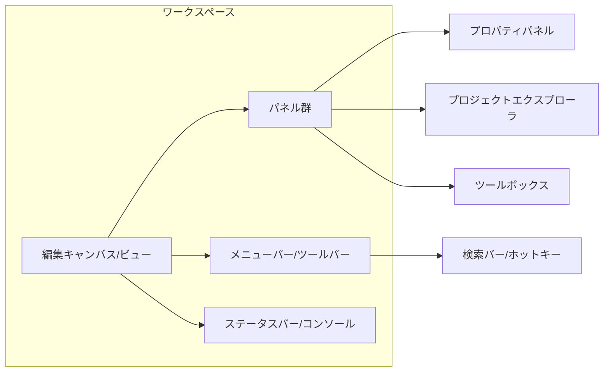

# エグゼクティブサマリー

エキスパート向けの高密度デスクトップアプリでは、**常時表示情報とプログレッシブ・ディスクロージャ**のバランスが重要です。多くのツールでは主要なパネルやツールバーを常に画面に配置しつつ、詳細設定やサブ機能を必要に応じて展開・折りたたむ設計を取っています。ショートカットキーやホットキー検索機能を重視し、ほぼ全操作をキーボードから呼び出せるようにすることで操作効率を高めています。一方で、オンボーディング層にはツールチップやスマートヒント、簡易モードで段階的に機能を学べる仕組みが用意されています。

比較調査の結果、以下の**共通パターンとトレードオフ**が見出されました。

- **パネル／サイドバー**：常に表示するサイドバー（プロジェクトエクスプローラ、ワークスペース、プロパティパネル等）は、重要情報への即時アクセスを提供するが、画面スペースを占有する。パネルは折りたたみ・自動隠蔽やドッキングで必要時に展開する仕組みが多い。
- **ツールバー／メニュー**：カスタマイズ可能なリボンやツールバーが用意され、必要なコマンドを自由に配置可能。コンテキストメニューで操作効率を上げる例が多い。よく使う機能はショートカットキーで呼び出せるようになっており、例としてLTspiceもメニュー操作を全てキーボードから可能としています。
- **ドッキング／ウィンドウ管理**：パネルやドキュメントのドッキング・分離をサポートし、複数ウィンドウ（ドキュメントや波形ビューワ、ノートなど）を開ける設計が多いです。これにより複数モニタ活用や並列作業が可能になります。
- **ワークスペースとプリセット**：ほとんどのツールはユーザーがレイアウトを保存でき、起動時に復元されます。また、分析モードやデバッグモードなどタスク別にワークスペースを切り替える機能がある（例：Blenderのワークスペース、IDEのプロジェクト設定）。
- **操作履歴・復元（Undo/Redo）**：高度なアプリほどUndo/Redoを多数ステップでサポートし、誤操作からの即時復帰を保障します。多くは一括保存・自動復元するヒストリ機能を持ち、実験的操作にも安全性を確保します。
- **オンボーディング支援**：初心者向けにはチュートリアル、スマートヒント（Originなど）、階層的メニュー・簡易モード（Originの「折りたたみメニュー」）などでサポート。上級者はカスタマイズ性・キーボード駆動を重視する設計になっています。

以下で、具体的な各アプリの例と共通原則を詳述します。

## 各アプリケーションのUI事例

### MATLAB

MATLAB のデスクトップは通常、左にファイル・ワークスペースパネル、右にコマンドウィンドウ、上部にツールストリップ（リボン）が配置された2列レイアウトです。追加パネルは左右や下部のサイドバー上のアイコンで展開でき、パネルを折りたたんだり自動隠蔽することで画面を整理します。パネルはドラッグで移動・グループ化でき、コマンドウィンドウやエディタなど主要ツールは別ウィンドウにドック（分離）することも可能。開いたファイルはタブで管理され、タイル表示で並べることができる。デフォルトレイアウトは各自カスタマイズ後もセッション間で保持されるため、熟練ユーザは一度整えた環境を次回以降も利用できます。キーボードショートカット（例：`Alt+M`でホームページ表示）やコマンドヒストリ機能が充実し、繰り返し操作やスクリプト実行を効率化します。

### LabVIEW

LabVIEW は計測器を模した「フロントパネル」を持ち、**ニードルゲージやグラフ、数値表示器**などを組み合わせてUIを構築します。NI社のユーザーマニュアルでは「VIのフロントパネルは計測器のように設計し、ユーザが直感的に操作できるようにする」と明記されています。フロントパネル上では分割バー（Splitter）やペインを活用して配置を調整し、パネル表示を改善します。右クリックのショートカットメニューやコンテキストヘルプを豊富に備え、キーボードショートカットも多用（簡易な設定変更はスペースキー検索など）されます。LabVIEW のIDE環境ではブロックダイアグラムとフロントパネルが分離管理され、複数ウィンドウでプログラム制御とUIが同時に開けます。オンボーディングとして、配布用アプリケーションでは簡易版とフル機能版の区別を設けて解説される場合があります。

### Origin

OriginLab のOriginは**ワークスペース全体に多彩な子ウィンドウ**（ワークシート、グラフ、マトリクス、レイアウトなど）を展開し、左側にプロジェクトエクスプローラ、上部にメニュー／ツールバー、下部にステータスバーを持つ構成です。プロジェクトエクスプローラはデフォルトで左端に自動隠蔽型でドックされ、必要に応じてピンで固定できます。バージョン2023b以降では、子ウィンドウをメイン外にフローティング表示でき、それぞれ独自メニューやツールバーを持たせることでマルチモニタや並行作業に対応します。メインメニューはアクティブウィンドウ（ワークシートかグラフか）に応じて切り替わり、不要なコマンドは「折りたたみメニュー」機能で隠す仕組みがあります。多くの操作はコンテキストメニュー（右クリック）からも呼び出せます。キーボード操作も充実しており、コマンドウィンドウ（Dr. Window）では過去コマンドの履歴やオートコンプリートが利用可能で、`Alt+数字`などで切り替えます。さらに、Originには**Smart Hint**という支援機能があり、操作時に役立つヒントを一時的に表示するとともに、操作のアドバイスをセッション単位でログ参照できます。アクティブウィンドウはマゼンタ色の枠でハイライト表示され、ステータスバーには選択中の統計情報やツールチップがリアルタイムに報告されます。

### Mathematica

Wolfram Mathematica のフロントエンドはノートブック中心で、セルベースの文書・計算インターフェースです。上部にメニューバーとツールバーがあり、標準の計算機能やスタイル選択を提供します。**DocketCells**オプションにより、任意のセルをノートブック上部に固定（ドッキング）表示できるため、常に必要なパネルやツールを上部に留めておくことが可能です。またパレット（文字入力補助やテンプレート）を浮動ウィンドウとして開けます。キーボードショートカットも豊富で、Undo/Redoは複数レベル対応します。オンボーディングにはドキュメントやスニペット集、Dynamic（動的）機能のサポートがあり、初心者向けにはNotebookガイドもあります。内部的にNotebookLayoutやTabViewなどの柔軟なレイアウト機能を使っており、ユーザがカスタムUIを細かく設計できる点が特徴です。

### LTspice

LTspice は回路図エディタと波形ビューアからなるシンプルなGUIを提供します。上部にファイル/編集系のメニューバーやツールバーが並び、左ペインに部品ツールバー、右ペインにプロパティダイアログがある典型的なWindowsアプリレイアウトです。ワークスペースのカスタマイズ性は低く、パネルのドッキングは標準的ですが深い分割はありません。コマンドライン的な操作は少なく、ほぼGUI操作主体です。一方、公式サイトでは「メニューやツールバーでアクセスする機能はキーボードショートカットからも呼び出せる」と言及されており、ショートカットが充実しています。波形ビューアはシミュレーション実行後にグラフが別ウィンドウで開く方式で、複数の波形図をタブ切り替えできます。状態可視化として、マルチプローブ機能やカラー表示で回路網の注目ポイントを示します。Undoは複数ステップ対応していますが、アプリの見た目はやや古典的で、上級者向けキーボード操作が中心です。

### KiCad

KiCadはスキーマティックエディタとPCBエディタから成るE-CADツールで、GUIは**キャンバス中心のエディタ環境**として設計されています。中央に編集キャンバス、上部にファイル・編集・ズームツールなどのツールバー、左に**階層ナビゲータ**や**プロパティ管理パネル**、選択フィルター、下部にメッセージパネル/ステータスバー、右に描画ツールバーと設計ブロックパネルが配置されます。これは多くの機能を常時表示する構成ですが、パネルは必要に応じて閉じたり配置換えが可能です。オブジェクトを選択すると下部に情報が表示され、ダブルクリックで詳細プロパティを編集できます。ホットキー（Ctrl+F1 で一覧表示）が充実し、右クリックでコンテキストメニューを呼び出せます。レイアウトはソフト起動時に保存され、ユーザ設定を持ち越します。複数ウィンドウで異なるシートを扱うマルチシート設計や、PCB設計との連携が特徴です。

### Blender

Blender は3Dモデリング/アニメーションの総合環境で、多くの**エディタ領域**（3Dビューポート、アウトライナー、プロパティエディタ、タイムラインなど）を持つ統合GUIを採用しています。各エディタは好きなように分割・ドッキングでき、個別ウィンドウとして分離表示も可能です。上部にワークスペース（モデリング、スカルプト、アニメーションなど切替タブ）、左にツールシェルフ、右にプロパティシェルフ、下にタイムラインといった配置がデフォルトですが、ユーザは自由にレイアウト変更できます。機能はほぼ全てキーボードショートカットで呼び出せ（F3キーで全機能をサーチできる）、マウス中心のGUIとのハイブリッドです。ワークスペースごとに異なるUIプリセットを持ち、必要なツールのみを表示する仕組みで、初心者向けにはインタラクティブチュートリアルやペイントオーバーレイで支援もあります。

### CAD（AutoCAD など）

汎用CADソフトではリボン・ツールバー・コマンドライン・プロパティパレットなど多様なUI要素があります。通常、画面上部にリボンタブ（Home, Insert, Annotate など）、左または右にツールパレット、中央に図面ビュー、下部にコマンド行を常時表示します。ツールバーやパレットは浮動・ドッキング可能で、カスタムワークスペースとして保存できます。多くの操作はコマンド入力（例：`L`で線描画）とツールバーの組み合わせで行い、コンテキストメニューで修正やスナップ設定ができます。UNDO/REDOを複数レベル保持し、大量のオブジェクト操作に対応します。プリセットとしてツールパレットやスクリプト、テンプレート図面が使われます。

### DAW（Ableton Live など）

DAWではタイムライン/トラックビューが中心で、画面左にクリップブラウザ・エフェクトパネル、右または下にミキサー/エンベロープパラメータが配置されることが多いです。必要に応じてミキサーやプラグインウィンドウを開閉し、高解像度モニタで多数トラックや波形を同時表示します。操作はドラッグ＆ドロップとキーボードショートカットで高速化され、オートメーションやプラグインによる可視化（周波数スペクトラムや波形）が状態表示に使われます。多くのDAWはプリセット（トラック、バンク、エフェクト設定）やワークスペース保存機能を持ち、クリエイティブな繰り返し操作を容易にします。

### IDE（Visual Studio, IntelliJ 等）

IDEはエディタ中心で、左側にプロジェクトツリー・ファイルツリー、右側にデバッグパネルやコンソール、下部にアウトプット/ターミナルが置かれることが一般的です。エディタはタブ型で多重ウィンドウが可能で、ウィンドウ分割やタイル表示もサポートします。ツールバーとメニューはフレームワーク用に最適化されており、実行・デバッグ・バージョン管理操作がワンクリックまたはホットキー（F5でデバッグ開始、Ctrl+Shift+Rでリファクタなど）で可能です。シンタックス・エラーや警告をリアルタイムに行番号横に示し、アウトラインペインでクラスやメソッド構造を把握できます。ワークスペース（パースペクティブ）の切り替え、コードスニペットやテンプレートの利用、バージョン管理の統合があり、ユーザの作業に合わせてUIを変化させる仕組みがあります。

## クロスアプリケーション原則と推奨パターン

- **常時表示 vs プログレッシブ・ディスクロージャ**：重要な情報・ツール（プロジェクトナビゲータ、ステータス、コマンドラインなど）は常時画面上に配置し、付加的な詳細パネルや設定は必要に応じて展開する。パネルは自動隠蔽・折りたたみ・最小化機能を持たせ、ユーザが情報量を動的に調整できるようにします。例：OriginのスマートヒントやMatlabのサイドバーなど。
- **カスタマイズ可能なツールバー/パネル**：ツールバーやパネルにはユーザ定義可能なボタン/コマンドを備え、エクスパートが自身のワークフローに合わせて機能を組み替えられるようにします。ドッキングや浮動表示もサポートし、マルチモニタ活用や作業領域の最大化を図ります。ツールバーごとのオン/オフ機能や、アイコン長押しでカスタム可能なデザインが好まれます。
- **コンテキストメニューとホットキー**：ほぼ全ての操作にショートカットキーを用意し、ユーザがマウス依存を減らせるようにします。またオブジェクト右クリックで操作項目を表示し、タスク完遂までのクリック数を減らすと同時に、初心者はメニューから学び、エクスパートはキーボードで即座に呼び出せるようバランスします。メニューやコマンド一覧にホットキーを併記し、覚えやすい設計とします。
- **ワークスペース/プリセットモデル**：ツール起動時にレイアウトや開いていたドキュメントを復元できるようにし、ユーザが環境を定着させる。異なるタスク（編集・解析・プレゼンなど）ごとにUIレイアウトを切替可能なプリセット（ワークスペース）機能を提供します。例えば、MATLABは起動時に前回レイアウトを再現し、BlenderやIDEではモード切替タブで画面構成全体を変更できます。プリセットにより、**ベギナー用簡易モード**と**エキスパート用フルモード**の棲み分けが可能です。
- **ヒントとガイド機能**：初心者サポートのため、ツールチップ、スマートヒント、インラインヘルプを用意します。Originのようにヒントをセッションログに残す機能や、操作に自動追随するヘルプ表示、チェックボックスで頻出メッセージを非表示化できる仕組みが有用です。初回起動時にはチュートリアル、サンプルプロジェクト、学習センターへのリンクも役立ちます。上級者にはこれらを一括オフにできるオプションを用意します。
- **情報密度の管理**：表示できる情報量が多いほど効率的だが、過剰になると混乱を招くため、**フィルター・選択切替機能**を設けます。例：KiCadの選択フィルター、Originのオブジェクトマネージャで階層/アイコン表示切替、コードIDEのアウトライン表示など。ユーザが見たい情報だけ絞り込める仕組みは必須です。
- **復元/履歴モデル**：Undo/Redoは最少でも数10ステップ以上サポートし、誤操作からの安全性を確保します。コマンドや状態の履歴は、MatlabのCommand HistoryやOriginのAction History（分析履歴）などとして残し、再実行や戻りに役立てます。
- **キーボード＆マウス併用戦略**：極端なマウスオペレーション依存を避け、キーボードショートカットと組み合わせた操作体系を推奨します。定型操作はキーバインディングに割り当て、複雑な操作はマウスジェスチャーやコンテキストクリックで補完します。メニュー検索（BlenderのF3、IDEのSearch Everywhere等）によるコマンド起動機能も積極的に活用します。
- **エキスパートと初心者の共存**：初期状態では画面を整理し、必要最小限のツールを提示。上級者は必要に応じてパネルを追加・展開・カスタマイズできるようにします。初心者には褒める/抑止メッセージより**建設的な指摘**や**段階的な目標提示**を行うUIテキストを用いると良いでしょう（例えば「値が設定範囲外です。安全値にリセットしました」など）。**本当に優れた操作**にはポジティブなフィードバック（アニメーションや音）で即時に反応させると、学習モチベーションが上がります。

## 特徴比較マトリクス

| 機能・要素              | MATLAB                        | LabVIEW                          | Origin                               | Mathematica                    | LTspice                                    | KiCad                                            | Blender                          | CAD (例:AutoCAD)               | IDE (例:IntelliJ)                            |
| ----------------------- | ----------------------------- | -------------------------------- | ------------------------------------ | ------------------------------ | ------------------------------------------ | ------------------------------------------------ | -------------------------------- | ------------------------------ | -------------------------------------------- |
| レイアウト              | 2列固定（サイドバー）         | フロントパネル形式（分割バー）   | ワークスペース＋ドック型             | ノートブック中心（セル型）     | スキーマティック中心                       | キャンバス＋固定パネル                           | ビュー＋アウトライナー           | リボン＋コマンドライン         | エディタ中心＋ツールウィンドウ               |
| 常時表示情報            | ファイル/ワークスペースパネル | 主要コントロール（ダイヤルなど） | ステータスバー、各ウィンドウ種別     | ドッキングセルで固定パネル     | メニューバー、コマンドバー                 | ステータスバー、プロパティパネル                 | タイムライン、アウトライナー     | コマンド行、ステータス         | プロジェクトツリー、デバッグウィンドウ       |
| ツールバー/メニュー     | ツールストリップ（リボン）    | 固定ツールパレット               | カスタムツールバー、多数             | パレット、リボン               | 上部メニュー、ツールバー                   | 上部/側面ツールバー                              | 上部編集モードタブ               | リボン、旧式ツールバー         | メインメニュー、ツールバー                   |
| コンテキストメニュー    | あり（右クリック）            | あり（コントロール右クリック）   | あり（多用途）                       | あり（セル右クリック）         | あり（要素右クリック）                     | あり（オブジェクト右クリック）                   | あり（アウトライナー等）         | あり（部品、モデル右クリック） | あり（コード補完、リファクタ）               |
| ドッキング/浮動化       | パネル/ウィンドウ分離可能     | パレット・ビューの浮動可能性     | 子ウィンドウ浮動可能                 | DockedCellsで上部固定          | 一部ツールバー浮動可                       | パネル固定（設定不可）                           | エディタ分割＆浮動可             | ツールバー/パレットのドック    | エディタ・ツールウィンドウのドック           |
| マルチウィンドウ        | ドキュメント別ウィンドウ可    | フロント/ブロック別ウィンドウ    | シート・グラフ・マトリクス複数可     | ノート複数可                   | 回路図・波形別ウィンドウ                   | スキマティック/PCB別                             | 各ビュー別ウィンドウ             | 1プロジェクトに複数図面        | 複数ファイル/プロジェクト同時開放            |
| キーボード操作          | 多用（ショートカット充実）    | 多用（ショートカット可視化）     | 多用（ALT+数字、Ctrl+キー等）        | 多用（数式入力、コマンド補完） | 豊富（メニュー／ツールバーショートカット） | 豊富（ホットキー(F1)一覧）                       | かなり多用（スペース・F3検索）   | 豊富（コマンドショートカット） | 豊富（コード補完、リファクタリングコマンド） |
| 繰り返し操作            | コマンド履歴、スクリプト      | マクロ・サブVI再利用             | MRUメニュー、マクロ                  | ノート共有、パッケージ         | スクリプト・サブ回路再利用                 | 部分作図/スクリプト（Python）                    | マクロ・スクリプト               | マクロ・LISP（CAD特有）        | マクロ・Live Template                        |
| 初心者対応              | ガイドチュートリアル有        | 設定項目豊富で学習曲線あり       | スマートヒント、学習センター         | ガイドNotebook、パレットUI     | 操作難易度高め                             | ドキュメント充実（オンライン）、プロパティで解説 | インタラクティブチュートリアル   | CUI学習支援ツール              | サンプルプロジェクト、コーダイクラブ         |
| 情報密度                | 高（ビッグデータ分析向け）    | 高（多数のコントロール）         | 非常に高（ワークブックに大量データ） | 高（計算結果、セル）           | 中高（波形や回路数）                       | 高（複雑回路図、3Dビュー）                       | 中（選択データのみ）             | 中（必要に応じてレイヤー表示） | 中高（コード行数・デバッグ情報）             |
| Undo/Redo               | 複数レベル（セッション継続）  | 複数レベル（前のVI状態へ）       | 複数レベル（解析操作）               | 複数レベル（ノート戻す）       | 複数ステップ対応                           | 複数レベル対応                                   | フル対応（ブレークポイントまで） | フル対応                       | フル対応（IDE基盤）                          |
| プリセット/テンプレート | GUIレイアウト保存             | フロントパネルテンプレ           | グラフ/分析テンプレート              | Notebookスタイル               | シミュレーションセットアップ               | カスタムシンボル/パネル配置                      | ワークスペースごと               | 作業空間切替                   | プロジェクトテンプレート                     |

## 推奨UIコンポーネントと振る舞い（例）

| コンポーネント                | 推奨動作                                                                     | 利点                                                         | 欠点                                                 |
| ----------------------------- | ---------------------------------------------------------------------------- | ------------------------------------------------------------ | ---------------------------------------------------- |
| **固定パネル/サイドバー**     | プロジェクト構造・変数一覧・ログ等を常時表示 必要に応じて自動隠蔽・折畳み | 情報への即時アクセス性向上 画面整理が可能                 | 常時表示で画面面積圧迫 複数パネル同時表示で煩雑化 |
| **フローティングウィンドウ**  | グラフやサブエディタなどを別ウィンドウで表示 マルチモニタ対応可能         | 並列作業・参照が容易 ワークスペースの拡張性               | ウィンドウ数増加で管理コスト 集中力低下の可能性   |
| **コンテキストメニュー**      | オブジェクト右クリックで操作項目を表示 対象外のコマンドは隠蔽             | マウスオペレーションの回数減少 初心者はメニュー学習に利用 | メニュー階層が深くなると混乱 隠し機能発見が難しい |
| **ショートカットキー**        | よく使うコマンドに割り当て（カスタム可能） キーバインド一覧を表示         | 操作効率劇的向上 上級者向けに高速化                       | 学習コストが高い 誤入力時の挙動が複雑             |
| **ステータスバー/表示エリア** | 選択情報や進行状況を表示 必要に応じてステータスメッセージを更新           | 現在状態の把握が容易 進捗や警告を常時可視化               | 情報過多になる可能性 画面下部を圧迫               |
| **プリセット/ワークスペース** | タスク別UIレイアウトを保存 ドキュメント位置も復元                         | 作業再開がスムーズ 異なる作業に応じてUI切替可能           | プリセット数増加で選択迷う 初期設定に時間要       |
| **スナップ/グリッド表示**     | オブジェクト整列・編集補助に使用 トグルでON/OFF切替可能                   | 配置・整列操作を精密に行える 不要時は非表示でスッキリ     | 常時ONで煩わしい場合あり 誤スナップのリスク       |

## ワークスペース・コンポーネント関係 (例)

## タスクフロー例（プログレッシブ・ディスクロージャ）

以上の事例と原則から、高度な専門アプリケーションでは「**必要なときに必要な情報を出し分ける**」柔軟性と、「**操作効率をキーボードとカスタマイズ性で補う**」点が共通して重視されていることが分かります。各ツールの公式ドキュメントにもこれらのパターンが反映されており、ユーザビリティ向上のための設計が随所に見られます。

**参考資料:** 各製品公式ドキュメントおよび開発者ガイドなど（例: MATLAB, LabVIEW, Origin, Mathematica, KiCad 公式マニュアルより）。
