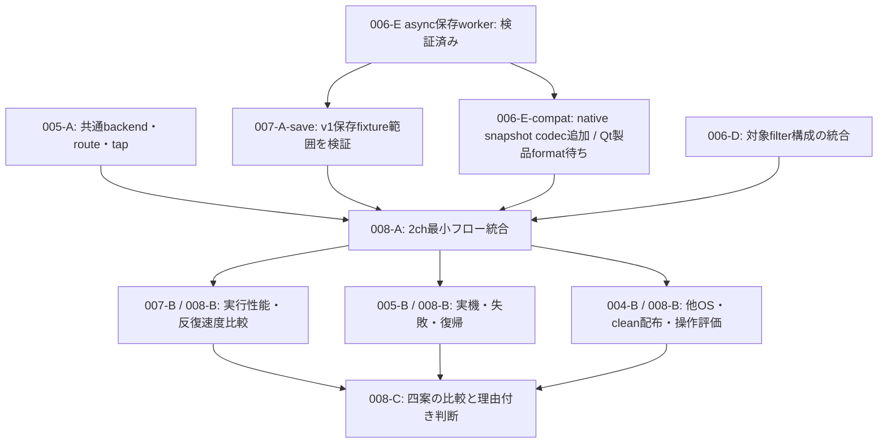

# MIG-008までの残工程

2026-10-02更新。正本は[評価計画](../guide/RUST_QML_MIGRATION_PLAN.md)、
合格の根拠は[進捗](status.md)と各report、判定条件は[AC01〜16](contracts/acceptance.md)と
[比較protocol](benchmarks/protocol.md)。この表は工程整理で、未確認事項を合格に変更しない。

MIG-001/002とMIG-003の参照側は完了。004はIntel範囲、006はpure範囲、
007-Aは保存/BlackHole表示・Trigger・校正編集まで検証した。両Qtのv1非同期保存操作も保存4入力×9言語×両Qtの72実行に合格。
006-Eの非同期保存workerと、製品JSON/CSVの互換adapter評価を追加した。
互換adapterはPythonの独立試作。[native snapshot codec/file worker](../native/product-codec.md)を追加し、Qtへの製品format接続は次の工程である。
MIG-008の統合と採用判断、41機能の移行は未完了。

## 実施順と依存

native製品snapshot codecを基にQt製品formatと音声の共通境界を完成させ、両Qt保存操作と同じ2chフローへ統合する。
保存fixtureでの検査は物理機器や他OSを待たずに実施できる。
性能比較はその統合物を固定してから測り、別環境・物理試験の結果とともに判断表へ集約する。

以下の子IDは再開用の[ローカル作業票](tasks.md)であり、GitHub Issueではない。

| 順序・作業 | 現状と残る実装/検証 | 完了条件・AC | 必要な条件 |
| --- | --- | --- | --- |
| 1. 007-A-save | 通常/Triggerの完成snapshotを両Qtからpinしてv1非同期保存。保存先/format、各状態/取消/保存受付終了とGUI外のjoinを追加。保存4入力×9言語×両Qtの72実行で検証済み。BlackHole保存操作/負荷は残る | 元の全配列/校正/区間を保持、pending/gapから正常値を作らない、I/O failureでも取得継続。hold/分離/停止/再生成、9言語/サイズ/操作到達性。AC07/12/13 | 現在のIntel/Qtと保存fixture、BlackHoleで着手可能。join/DropはGUI外 |
| 2. 006-E-compat | 評価用Python adapterの製品JSON carrier/CSV sidecar、旧JSON/32 CSV条件の読込みを検査。native snapshot codec/共通file workerと実exporterの保存12実行/72双方向完全往復を検査済み。Qt製品format接続/旧トレースのnative import/取得profile再起動維持は残る | 値/軸/単位/校正/metadataの往復。旧fileにないStream/Timebaseはunknown。製品schemaは008で版管理し、失敗/上書き/単一fileとpairの保証を明示。AC12 | 保存fixture/現行exporterの評価範囲を検査済み。製品接続は現在の環境で着手可能 |
| 3. 005-A-common | CPALとPortAudioを共通backend契約へ接続。現在のinput.rawと動的f32 routeを、購読されたtapのgraphへ統合する | 非対称2/4/8ch、ID/port/route ack/世代/gap、input.calibrated、output.mixed/post_dut/device_bufferの位置と処理条件を照合。DUT未実装は同一tap扱いにしない。AC01〜03/09/11 | 保存入力とBlackHoleで着手可能。全tapの常時copyは不要 |
| 4. 006-D-integration | 一段f64 filter/rateのpure契約を取得schedulerへ接続。P2で使うdtype/構成を固定する | AC10のtrigger/遅延/gap/warmupと、AC14のpolyphase/SOS参照比較を統合後も維持。SOS gap拒否をfailureとして扱い、未実装f32/chain/全rateを対象外と明示 | 保存fixtureで着手可能。必要なf32やgap回復をP2に選ぶ場合だけ追加実装 |
| 5. 008-A | 生成→明示route→取得/Timebase→波形/共有FFT→line/heatmap→基本V/FS校正→CSV/JSONを一つの2chフローへ統合 | boxcar/Hann、peak/RMS/PSD、Trigger/保持、購読解除、開始/停止/失敗、同じcoreの仮想4/8ch回帰。AC01〜14の対象結果を対応表へ記録 | 1〜4の対象範囲を統合。独立probeの成功だけで置換しない |
| 6. 007-B / 008-B性能 | 現在のGUI停止試験・renderer spikeは短い診断。統合物で単独/複数表示、保存、遅いGUI、負荷超過を測る | 仮想2/4/8chを条件ごとに30秒warmup＋10分×3回。callback/解析/表示/stop遅延の分布、CPU秒/RSS時系列、queue/gap/FFT共有/表示省略を記録。同条件のPythonと予算比較。AC15/16 | 5を固定し、測定中は他のbuild/GUI試験を終了。GPU取得不可はunknown |
| 7. 005-B / 008-B音声 | UAC-232交互3回の短い2ch比較は成功。時刻写像/絶対遅延、排他、開始失敗、XRUN位置、USB/スリープ復帰、長時間が残る | 許容振幅差/遅延誤差を測定前に固定。実機2chと統合フロー、stop/cancel/失敗/再接続の回収を記録。AC09/11/13/16 | 通常はBlackHole。USB抜き差しと物理clock/電圧/遅延には実機・配線・人の操作が必要 |
| 8. 004-B / 008-B配布・操作 | Intelの模擬probeでbuild/edit/local bundleは成功。実graph統合物、他OS/clean環境、実window managerの確認は残る | 対象OSでclean/no-op/core編集/QML編集/packageをprotocolどおり反復。統合配布物の展開/起動、入力/focus/分離/close/zoom/cursor/画像保存、9言語/サイズ/High DPIを検査。AC07/13/16 | Intelの開発比較は着手可能。ARM/Windows/Linuxとclean起動は各実行環境が必要 |
| 9. CI・証拠整理 | Linux ICU修正後のGitHub CIは未確認。新async比較も定義追加まで。保存reportとsource/binaryのhashを整合させる | 対象commitのCI結果、各試験のcommand/条件/全sample/失敗/未実施を保持。ローカル成功とCI/OS成功を区別 | ローカル検査は可能。GitHub再実行は対象変更の公開時に確認 |
| 10. 008-C判断 | 004〜007と008-A/Bの結果を四案へ集約し、未達と保守費用も評価 | 理由付きの方針、未確認/重大な未解決点、次の範囲と再評価条件を決定記録へ残す。MIG-008完了と41機能移行完了を分ける | 判断材料が揃った時点で実施。結果が不十分なら未完了と記録 |

保存操作/互換形式とbackend共通化は別の変更境界として進められる。
互換adapterの範囲と単一file/pairの保証は[手順](../native/product-exchange.md)に定義する。
007-Cのwgpu候補はIntelで約29〜30 Hz、基準100万点はSIGBUSを再現した。
必要な点数での安定性・転送方式・コピー/負荷を統合性能へ反映し、描画問題が残る場合は方式変更案へ記録する。
native GPU texture共有や個別widgetの本実装を、spikeの成功だけで完了にしない。

## MIG-008の判断に渡すもの

- 同じ統合coreでの2ch最小フローと4/8ch回帰、AC01〜16の証拠と未達の一覧。
- 同条件のPython/Rust比較。数値・時刻・欠落、実行性能、編集→検証時間、配布起動、UI操作、保守負担。
- 実機/OS/device/配線/校正の対象表。未所有環境と未実施をunknownとして残した試験結果。
- 四案それぞれの利点・費用・重大な未解決点と、選んだ理由/次の範囲/再評価条件。

| 比較する方針 | 判断に必要な根拠 |
| --- | --- |
| Rust + Qt Quickを本格展開 | 必須契約、実行性能、開発反復速度、配布、保守負担の総合的な利点 |
| 接続・描画方式を変更 | coreの価値が保たれ、問題がadapter/rendererへ局在すること |
| Rust coreの段階導入 | 限定した処理の利益と、Python/Qtとの混在時の反復速度・保守費用 |
| 現行Pythonを継続 | 移行利益が費用/不確実性を上回らない理由と、取り込む設計改善 |

計画は、重大な問題や十分な比較材料が早く得られた場合の早期判断も許容する。
その場合も理由・未検証点を残す。P3以降の機能展開、安定版置換、全41機能移植、
全校正map/SPL、外部trigger実機adapter、全機器保証はMIG-008完了に含めない。
