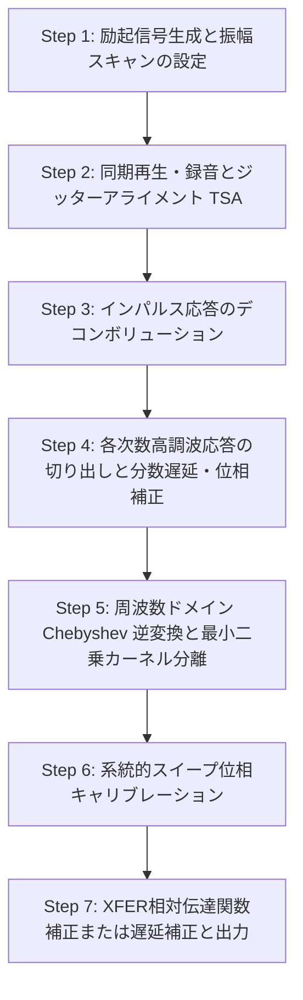

# 同期スイープサイン（SSS）法および平行ハマーシュタインモデル（PHM）測定の技術仕様

本ドキュメントでは、MeasureLab の `Nonlinear System Analyzer` において実装されている、**同期スイープサイン（Synchronized Swept Sine: SSS）法**および**平行ハマーシュタインモデル（Parallel Hammerstein Model: PHM）**を用いた非線形システム測定とカーネル分離のアルゴリズムおよび実装仕様について解説します。

---

## 1. 概要

非線形音響・電気音響システムの伝達特性を同定するため、本システムでは指数スイープ（Logarithmic Swept Sine）を用いた SSS 法と、入力振幅を段階的に走査する PHM を組み合わせています。
これにより、システムが持つ線形応答（基本波応答 $h_1$）だけでなく、2次から5次までの高調波歪み応答（非線形カーネル $h_2$ 〜 $h_5$）を、励起振幅に依存しない純粋な時間領域のインパルス応答（および周波数領域の伝達関数）として個別に分離・抽出します。

---

## 2. 測定・処理の全体フロー

測定処理は大きく分けて、以下の7つのステップで実行されます。

### Step 1: 励起信号生成と振幅スキャンの設定

1. **周波数帯域の設定**:
   測定帯域 $f_{\text{start}}$ から $f_{\text{end}}$ に対し、過渡応答の歪みを避けるため以下のガードバンド（マージン）を設けてスイープパラメータを算出します。
   * 開始マージン: $f_{\text{start\_margin}} = \max(2.0, f_{\text{start}} / 1.3)$
   * 終了マージン: $f_{\text{end\_margin}} = \min(f_{\text{nyquist}} \times 0.95, f_{\text{end}} \times 1.15)$

2. **指数スイープの設計**:
   スイープ時間 $T$ に対し、位相特性 $\theta(t)$ を以下のように設計します。
   $$\theta(t) = \frac{2\pi f_{\text{start\_margin}} T}{L} \left( e^{\frac{t L}{T}} - 1 \right) \quad \text{where} \quad L = \ln\left( \frac{f_{\text{end\_margin}}}{f_{\text{start\_margin}}} \right)$$
   スイープ波形 $s(t) = \sin(\theta(t))$ に対し、両端のクリックノイズを防止するため、立ち上がり・立ち下がりに $2\%$ 幅の Tukey 窓を適用します。

3. **振幅スキャンの設定**:
   ユーザーが設定した最大振幅 $\text{Amp}_{\text{max}}$ (dBFS) から、線形スケールで $0.2 \times \text{Amp}_{\text{max}}$ から $1.0 \times \text{Amp}_{\text{max}}$ までを等間隔に走査する $N_{\text{amps}}$ 段階（デフォルトで5〜10段階）の振幅 $R_j$ を設定します。

### Step 2: 同期再生・録音とジッターアライメント (TSA)

各振幅ステップ $R_j$ について、設定された加算平均回数（TSA Averages）分だけ再生・録音を同期して行います。

1. **サブサンプル精度アライメント（独自実装）**:
   オーディオデバイスのバッファリングに起因するジッターによる高域の減衰を防ぐため、1回目の測定波形を基準に、2回目以降の測定波形とのジッター遅延を算出し、周波数領域で分数サンプルレベルの補正をかけてから加算平均化を行います。

2. **平均化された応答の取得**:
   アライメント済みの信号を加算平均して、S/N 比を高めた録音信号 $y_j(t)$ および参照用ループバック信号 $x_j(t)$ を得ます。

### Step 3: インパルス応答のデコンボリューション

録音信号 $y_j(t)$ と、元のスイープ信号 $s(t)$ （振幅 1.0）を用いて、周波数ドメインで正則化（Regularization）を適用したデコンボリューションを行い、生のインパルス応答 $g_j(t)$ を抽出します。

$$G_j(f) = \frac{Y_j(f) \cdot S^*(f)}{|S(f)|^2 + \epsilon}$$

$$g_j(t) = \text{IFFT}(G_j(f))$$

ここで $\epsilon$ は SSS 信号の自己相関パワースペクトルの最大値に対する正則化係数（デフォルト: $10^{-4}$）です。

### Step 4: 各次数高調波応答の切り出しと補正 (Gating)

指数スイープの性質により、非線形歪み（$k$ 次高調波応答）のインパルス応答は、基本波（1次）のピーク位置 $t_1$ から時間軸の負の方向（過去方向）に向かって、次の予測位置 $t_{k,\text{exact}}$ に分離して現れます。
$$t_{k,\text{exact}} = t_1 - L \ln(k) \cdot f_s \quad (\text{samples})$$

1. **時間ゲートの適用**:
   予測位置を中心にプリ 10 ms、ポスト 20 ms（合計 30 ms）の区間を modular wrap-around（巡回境界）を考慮しつつ切り出し、Tukey 窓（alpha=0.1）を乗算します。

2. **分数遅延・位相補正（独自実装）**:
   予測されたピーク位置 $t_{k,\text{exact}}$ と、実際に切り出した整数インデックス $t_k = \text{round}(t_{k,\text{exact}})$ の間の微小な分数遅延差 $\Delta t_k = t_{k,\text{exact}} - t_k$ を、周波数ドメインで位相シフトすることでキャンセルします。また、SSS 法の理論に基づく各次数固有の位相回転（$k=2$ は $+90^\circ$、$k=3$ は $+180^\circ$、$k=4$ は $-90^\circ$）を補正します。

### Step 5: Chebyshev 逆変換と最小二乗カーネル分離（独自実装）

各振幅ステップ $R_j$ における $k$ 次高調波応答 $g_{j,k}(t)$ は、システムが持つハマーシュタインカーネル $H_p(f)$ の非線形結合によって構成されます。
これを周波数領域において、振幅 $R_j$ に基づく最小二乗推定（Chebyshev 逆展開）を用いて解き、振幅依存性のない純粋なハマーシュタインカーネル $H_1(f) \dots H_5(f)$ に分離します。高次の歪み成分から順に、低次へ与える高次高調波の影響を差し引きながら再帰的に算出されます。

### Step 6: 系統的スイープ位相キャリブレーション（独自実装）

SSS 法および窓関数、FFT 処理に伴って必然的に発生する、系統的な位相特性のズレを完全に相殺するためのキャリブレーションを行います。

1. **シミュレーションによる基準測定**:
   あらかじめ決定された多項式非線形システムモデルに対し、遅延ゼロの理想的なデジタルループバックシミュレーションを実行し、同様のカーネル分離処理から系統的位相誤差 $\theta_{\text{cal}, k}(f)$ を取得します。

2. **測定位相からの減算**:
   実測された各カーネルの位相応答から $\theta_{\text{cal}, k}(f)$ を減算し、平坦な位相を持つ理想的な分離応答を復元します。

### Step 7: XFER 相対伝達関数補正または遅延補正

1. **2チャンネル伝達関数モード (XFER / XFER_REV)**:
   参照チャンネルの 1次カーネル応答 $H_{\text{ref}, 1}(f)$ を基準として、測定チャンネルの各カーネル $H_{\text{meas}, p}(f)$ とのクロススペクトル伝達関数を計算します。これにより、サウンドカード自体の不要な周波数特性やジッターが完全にキャンセルされます。
   $$H_{\text{xfer}, p}(f) = \frac{H_{\text{meas}, p}(f) \cdot H_{\text{ref}, 1}^*(f)}{|H_{\text{ref}, 1}(f)|^2 + \alpha}$$

2. **シングルチャンネルモード**:
   事前に測定したループバックレイテンシ（`calibrate_latency`）を用いて、周波数領域で直線位相を減算することにより、伝達関数の位相を補正します。

---

## 3. 独自実装・重要アルゴリズムの詳細

### 3.1 FFT アップサンプリングによるサブサンプル精度アライメント

`find_subsample_peak(ir)` では、インパルス応答 `ir` のピークインデックスを単なる整数値ではなく、サブサンプル（$1/100$ サンプル）精度で検出します。

1. インパルス応答 `ir` の最大絶対値の整数インデックス $idx_{\text{int}}$ を探索。
2. 境界の回り込みを考慮し、ピークがバッファ中央（$N_{\text{total}} / 2$）に来るようにロールシフト。
3. ピーク周辺 32 サンプルを切り出し、FFT を実行。
4. 周波数領域で 100 倍のゼロパディングを行い、IFFT を実行することで時間領域での 100 倍のアップサンプリング（補間）を実現。
5. アップサンプルされた信号のピーク位置から、元のスケールにおけるサブサンプル精度ピーク位置 $t_{\text{peak}}$ を復元。

この処理により、加算平均の際にジッターによって生じる超高域（10 kHz 以上）での干渉や位相の乱れを極限まで低減しています。

### 3.2 高調波ピークの分数遅延・位相補正

高調波 $k$ のピーク予測時間 $t_{k,\text{exact}}$ は通常小数になります。これを整数サンプル位置 $t_k$ で切り出すと、サンプリング周期の端数分だけ波形がずれます。

`apply_phase_correction_and_frac_delay` では、切り出した信号 $g_k(t)$ の FFT 応答 $G_k(f)$ に対して以下を適用します。

1. **分数サンプル遅延補正**:
   $$G_{k,\text{corr}}(f) = G_k(f) \cdot e^{j 2 \pi f \frac{\Delta t_k}{f_s}}$$
   （$\Delta t_k = t_{k,\text{exact}} - t_k$）

2. **スイープ特有の位相復調**:
   SSS の理論的位相シフトに対抗するため、次数 $k$ に応じて $180^\circ$ や $\pm 90^\circ$ の位相回転を加えます。
   $$k = 2 \implies \times j, \quad k = 3 \implies \times (-1), \quad k = 4 \implies \times (-j)$$

### 3.3 周波数ドメイン最小二乗法による Chebyshev 逆変換

平行ハマーシュタインモデルは、励起振幅 $R_j$ に対する各多項式次数の応答としてモデル化されます。
本実装では、周波数ビンごとに各振幅ステップの応答ベクトルを最小二乗法で解き、Chebyshev カーネル $H_1(f) \dots H_5(f)$ を分離します。

具体的には、最高次の 5次から順に以下のように代数的に推定します。

* **5次カーネル $H_5(f)$**:
  $$H_5(f) = \frac{16 \sum_j G_{j,5}(f) \cdot R_j^5}{\sum_j R_j^{10}}$$

* **4次カーネル $H_4(f)$**:
  $$H_4(f) = \frac{8 \sum_j G_{j,4}(f) \cdot R_j^4}{\sum_j R_j^8}$$

* **3次カーネル $H_3(f)$**:
  $$G'_{j,3}(f) = G_{j,3}(f) - \frac{5}{16} H_5(f) R_j^5$$
  $$H_3(f) = \frac{4 \sum_j G'_{j,3}(f) \cdot R_j^3}{\sum_j R_j^6}$$

* **2次カーネル $H_2(f)$**:
  $$G'_{j,2}(f) = G_{j,2}(f) - \frac{1}{2} H_4(f) R_j^4$$
  $$H_2(f) = \frac{2 \sum_j G'_{j,2}(f) \cdot R_j^2}{\sum_j R_j^4}$$

* **1次（線形）カーネル $H_1(f)$**:
  $$G'_{j,1}(f) = G_{j,1}(f) - \frac{3}{4} H_3(f) R_j^3 - \frac{5}{8} H_5(f) R_j^5$$
  $$H_1(f) = \frac{\sum_j G'_{j,1}(f) \cdot R_j}{\sum_j R_j^2}$$

この再帰的な差引処理と重み付き最小二乗法により、各次数の非線形カーネルが他の次数の漏れ込み（リーケージ）なく、非常にクリーンに分離されます。

---

## 4. 関連ソースファイル

本ドキュメントのアルゴリズムは、以下のファイルで実装されています。

* **UI / 測定シーケンス制御**:
  [nonlinear_system_analyzer.py](file:///Users/vach/MeasureLab/src/gui/widgets/nonlinear_system_analyzer.py)
  （TSAループ、再生録音スレッド制御、測定結果のプロット更新）
* **信号処理コアロジック**:
  [nonlinear_analyzer_core.py](file:///Users/vach/MeasureLab/src/core/nonlinear_analyzer_core.py)
  （アップサンプリングアライメント、ゲート処理、Chebyshev分離、系統的位相補正）
