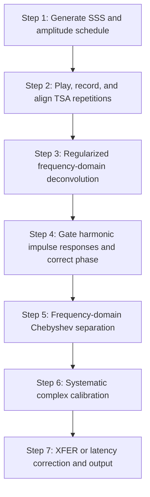

# Synchronized Swept-Sine (SSS) and Parallel Hammerstein Measurement

This document describes the Synchronized Swept-Sine (SSS) measurement and Parallel Hammerstein Model (PHM) kernel-separation pipeline implemented by MeasureLab's `Nonlinear Analyzer`.

## 1. Overview

The analyzer uses a logarithmic SSS together with a stepped excitation-amplitude scan. It extracts a fundamental kernel (`h1`) and nonlinear kernels through the fifth order (`h2` through `h5`). The amplitude scan separates the kernels from the amplitude-dependent harmonic responses; the resulting frequency responses are reported over the requested measurement band.

The implementation is split between the measurement controller and the signal-processing core:

- [`src/gui/widgets/nonlinear_analyzer.py`](../../src/gui/widgets/nonlinear_analyzer.py) builds the playback sequence, records one continuous session, aligns and averages each amplitude step, and invokes the core processor.
- [`src/core/nonlinear_analyzer_core.py`](../../src/core/nonlinear_analyzer_core.py) generates the SSS, deconvolves the responses, gates the harmonic impulse responses, applies phase/fractional-delay correction, separates the kernels, and applies calibration.

## 2. Processing flow

### Step 1: SSS generation and amplitude schedule

#### Frequency margins

For an ascending sweep, the core uses:

$$
f_1 = \max(2.0, f_{\mathrm{start}}/1.3),
\qquad
f_2 = \min(0.95f_{\mathrm{Nyquist}}, 1.15f_{\mathrm{end}}).
$$

For a descending sweep, the margins are reversed:

$$
f_1 = \min(0.95f_{\mathrm{Nyquist}}, 1.15f_{\mathrm{start}}),
\qquad
f_2 = \max(2.0, f_{\mathrm{end}}/1.3).
$$

The margins keep the requested sweep away from the extreme band edges. The code supports both sweep directions.

#### Phase-synchronized logarithmic sweep

Let the requested duration be $\widetilde{T}$ and define:

$$
L = \frac{k}{f_1},
\qquad
k = \operatorname{round}\left(\frac{f_1\widetilde{T}}{\ln(f_2/f_1)}\right),
\qquad
T = L\ln(f_2/f_1).
$$

The integer $k$ is forced away from zero when necessary. The generated phase is:

$$
\theta(t) = 2\pi k\exp(t/L),
\qquad
s(t) = \sin(\theta(t)),
\qquad 0 \leq t < T.
$$

The actual sample count is `round(sample_rate * T)`. A Tukey window with `alpha=0.02` is applied to the SSS and to the analytical inverse filter. The inverse-filter envelope is proportional to $\exp(t/(2L))$, giving the intended +3 dB-per-octave slope, and the inverse filter is time-reversed and normalized using the peak of its direct convolution with the SSS.

#### Amplitude schedule

The GUI treats the maximum amplitude as a peak dBFS value:

$$
A_{\max} = 10^{\mathrm{amplitude\_dBFS}/20},
\qquad
R_j = \operatorname{linspace}(0.2, 1.0, N_{\mathrm{amps}})_j A_{\max}.
$$

The module defaults are a maximum level of -6 dBFS, five amplitude steps, and three time-synchronized averages per step. The GUI permits 5–10 amplitude steps and 1–20 averages.

### Step 2: Playback, recording, and time-synchronized averaging

The controller creates one continuous playback buffer. For each amplitude step, it places `averages` copies of the sweep back-to-back, with 0.5 s of zero padding after each sweep. An optional 1 s silent tail is appended for noise-floor measurement.

For each repetition, the alignment channel is deconvolved with the analytical inverse filter and its sub-sample peak is measured. The first repetition at that amplitude is the reference. Later repetitions are shifted in the frequency domain by the measured fractional delay before all channels are accumulated and divided by the number of averages.

The alignment channel is the reference input in `XFER` and `XFER_REV` modes, and the measurement input in single-channel modes. When input and output devices differ, the controller also estimates clock drift from the first and last sweep blocks. It applies windowed-sinc resampling only when the estimated drift is greater than 1 ppm and less than 1000 ppm in magnitude.

### Step 3: Regularized deconvolution

For each amplitude step, the averaged reference and measurement signals are deconvolved with the unit-amplitude SSS:

$$
G_j(f) = \frac{Y_j(f)S^*(f)}{|S(f)|^2+\epsilon},
\qquad
\epsilon = 10^{-4}\max_f |S(f)|^2 + 10^{-12}.
$$

The FFT length is the next power of two that is at least the recorded length plus the SSS length. The inverse FFT produces the raw impulse response used by the gating stage.

### Step 4: Harmonic gating and phase correction

After deconvolution, the predicted location for order $k$ is based on the fundamental peak $t_1$:

$$
t_{k,\mathrm{exact}} = t_1 - L\ln(k)f_s.
$$

The baseline peak is taken from the maximum-amplitude reference response in XFER modes and from the maximum-amplitude measurement response in single-channel modes. For each order:

1. Round the predicted location to $t_k$ and compute $\Delta t_k=t_{k,\mathrm{exact}}-t_k$.
2. Extract indices from $t_k-0.007f_s$ through $t_k+0.013f_s$, using modular wrap-around. The gate is therefore 7 ms before and 13 ms after the predicted peak, for a total of 20 ms.
3. Apply the order-dependent sweep phase correction in the frequency domain.
4. Apply the fractional-delay correction:

   $$
   G_{k,\mathrm{corr}}(f)
   =G_k(f)\exp\left(j2\pi f\frac{\Delta t_k}{f_s}\right).
   $$
5. Apply a Tukey window with `alpha=0.1` after the fractional-delay correction.

For an ascending sweep, the additional phase factors are $k=2\Rightarrow +j$, $k=3\Rightarrow -1$, and $k=4\Rightarrow -j$. For a descending sweep, the $k=2$ and $k=4$ factors are conjugated: $-j$, $-1$, and $+j$, respectively.

### Step 5: Frequency-domain Chebyshev separation

The gated response for each order and amplitude is transformed to the frequency domain. For each frequency bin, the implementation projects the amplitude-dependent responses onto the corresponding powers of $R_j$ and subtracts higher-order leakage recursively:

$$
H_5(f)=\frac{16\sum_jG_{j,5}(f)R_j^5}{\sum_jR_j^{10}},
$$

$$
H_4(f)=\frac{8\sum_jG_{j,4}(f)R_j^4}{\sum_jR_j^8},
$$

$$
G'_{j,3}(f)=G_{j,3}(f)-\frac{5}{16}H_5(f)R_j^5,
\qquad
H_3(f)=\frac{4\sum_jG'_{j,3}(f)R_j^3}{\sum_jR_j^6},
$$

$$
G'_{j,2}(f)=G_{j,2}(f)-\frac{1}{2}H_4(f)R_j^4,
\qquad
H_2(f)=\frac{2\sum_jG'_{j,2}(f)R_j^2}{\sum_jR_j^4},
$$

$$
G'_{j,1}(f)=G_{j,1}(f)-\frac{3}{4}H_3(f)R_j^3-\frac{5}{8}H_5(f)R_j^5,
\qquad
H_1(f)=\frac{\sum_jG'_{j,1}(f)R_j}{\sum_jR_j^2}.
$$

The same separation is performed independently for the measurement and reference channels. These formulas are designed to remove the modeled cross-order terms; residual leakage still depends on sweep length, gating, noise, and the system response.

### Step 6: Systematic complex calibration

When `calibrate_systematic=True` (the analyzer's default), the core runs the same pipeline recursively on an ideal zero-delay polynomial model with:

$$
a_1=1.0,\quad a_2=0.1,\quad a_3=0.08,\quad a_4=0.04,\quad a_5=0.02.
$$

For each order, it compares the recovered complex response with the ideal coefficient and builds a complex calibration factor:

$$
C_p(f)=\frac{a_p}{H_{p,\mathrm{cal}}(f)+10^{-12}}.
$$

The factor corrects both gain and phase. It is applied to the reported frequency response, while the time-domain kernel used for display is kept separately so that the physical delay is not removed from that representation. The reference fundamental phase is calibrated separately.

### Step 7: XFER or single-channel correction

In `XFER` and `XFER_REV` modes, the measurement response is converted to a relative response against the reference fundamental:

$$
H_{\mathrm{xfer},p}(f)=
\frac{H_{\mathrm{meas},p}(f)H_{\mathrm{ref},1}^*(f)}
{|H_{\mathrm{ref},1}(f)|^2+\alpha},
\qquad
\alpha=10^{-7}\max_f|H_{\mathrm{ref},1}(f)|^2+10^{-12}.
$$

This reduces common-path interface effects; it does not imply that every hardware imperfection is perfectly canceled. The gate offset is restored for time-domain display. For nonlinear orders (`p >= 1`), the top-level result also receives an order-dependent low-pass filter with:

$$
f_{\mathrm{cut}}=\min\left(20\,\mathrm{kHz},\frac{1.15f_s}{2(p+1)}\right).
$$

In single-channel mode, the stored latency is applied as a positive phase advance:

$$
H_{\mathrm{corr}}(f)=H_{\mathrm{meas}}(f)\exp(j2\pi f\,\mathrm{latency\_sec}).
$$

The reported frequency arrays are restricted to the requested frequency band. The time-domain display uses the gate peak as time zero.

## 3. Sub-sample peak detector

`find_subsample_peak(ir)` uses the following implementation:

1. Locate the largest absolute sample.
2. Roll the response so the peak is at the buffer center.
3. Extract 32 samples and apply a Tukey window with `alpha=0.25`.
4. Zero-pad the DFT by a factor of 100 and inverse-transform it.
5. Map the interpolated peak back to the original circular index.

The result is used for both repetition alignment and harmonic peak placement. It provides a 0.01-sample interpolation grid, but the physical accuracy remains dependent on SNR and peak shape.

## 4. Related tests and source files

- [`src/gui/widgets/nonlinear_analyzer.py`](../../src/gui/widgets/nonlinear_analyzer.py): measurement sequence, TSA alignment, clock-drift handling, and model export.
- [`src/core/nonlinear_analyzer_core.py`](../../src/core/nonlinear_analyzer_core.py): SSS generation, deconvolution, gating, separation, calibration, and transfer-function correction.
- [`tests/logic_verification/measurement_modules/test_nonlinear_analyzer.py`](../../tests/logic_verification/measurement_modules/test_nonlinear_analyzer.py): kernel separation, amplitude invariance, phase, delay, and fractional-delay verification.
